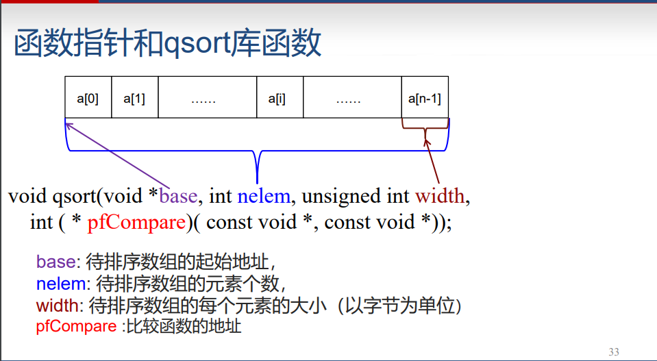
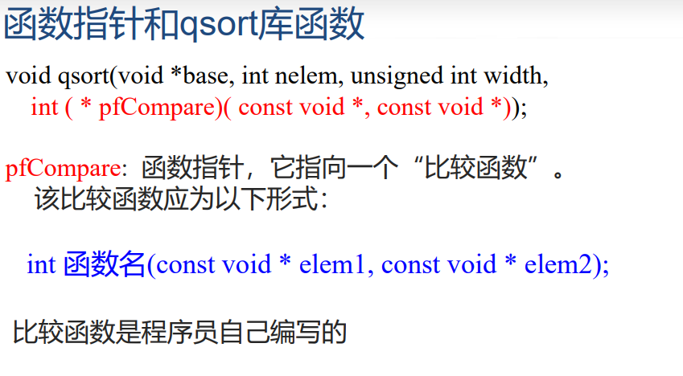
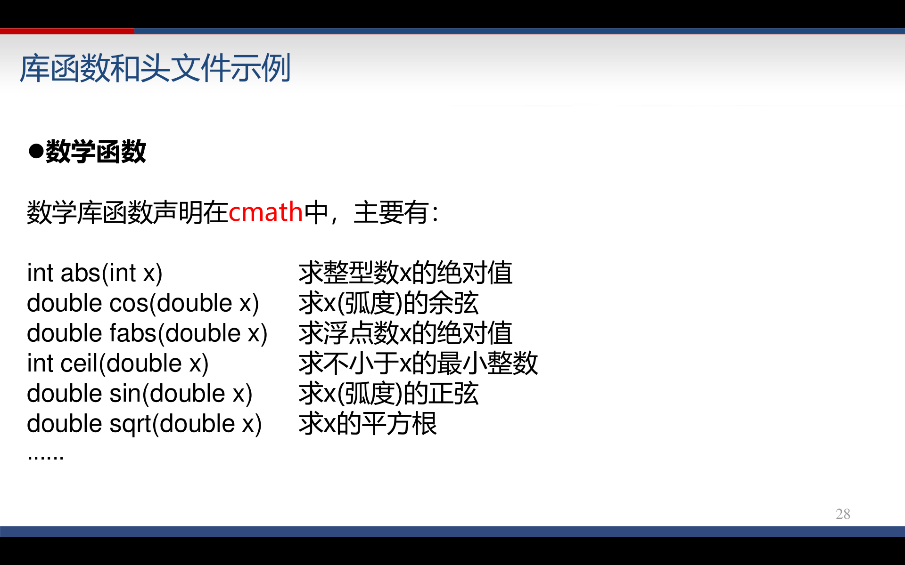
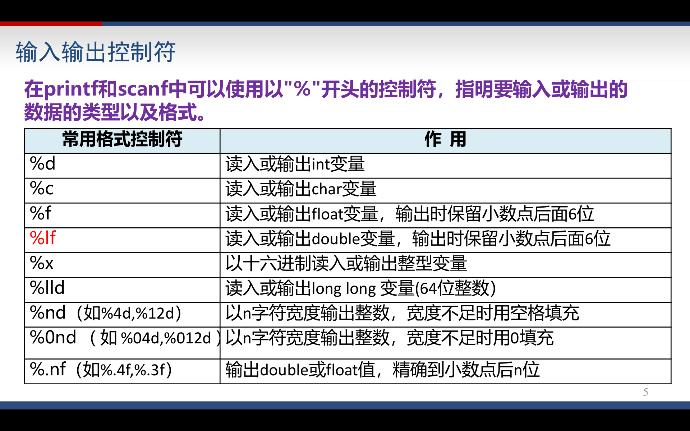
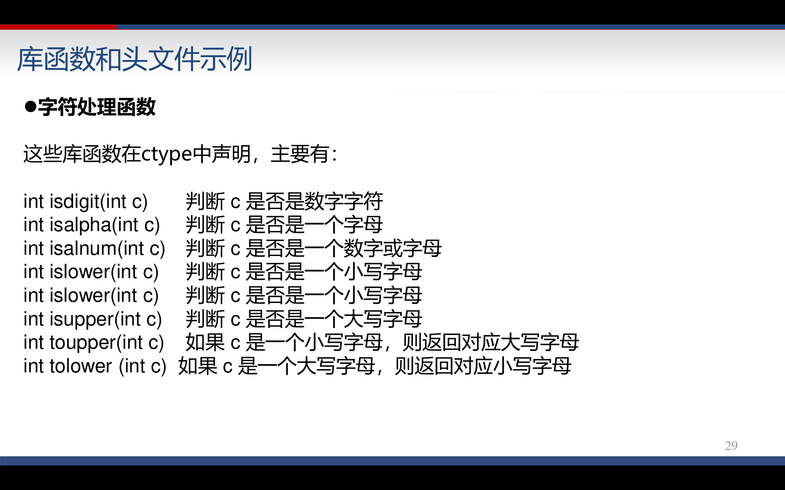
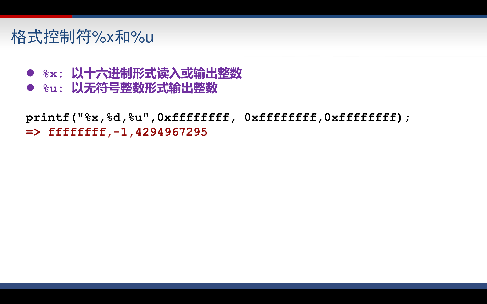
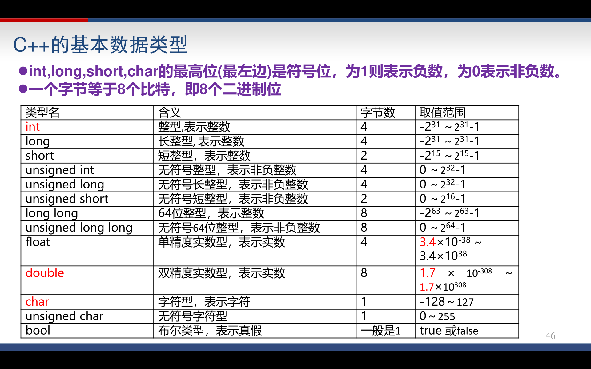

- sizeof(变量名/类型名） 可以得到某个变量或者某一类型所占用的字节

  int a; sizeof(a); //4

- 类型自动转换

  - int a = 11.34; //11.34自动转换成11赋值给a
  - int k = 'a'; //k内容变成‘a’ 的ASCII ，97
  - char a = 97;  // a='a'

- 符号常量

  #define MAX_NUM  1000

- cout << n << endl; cin>> n;

- scanf(..) 表达式的值为int, 表示成功读入变量的个数

  ```c++
  int main(){
  	int n,m;
  	printf("%d", scanf("%d%d",&n,&m)); //输出2
  } 
  ```

- scanf(..) 的值为EOF（即-1）表示输入数据已经结束

  ```C++
  int main(){
  	int n,m;
  	while(scanf("%d%d",&n,&m) != EOF){ //EOF 是直接能拿来用的符号常量 
  		printf("%d", m + n);
  	}
  } //直到输入ctrl + z回车才结束
  ```

- cin >> n >> m... 表达式的值，在成功读入所有变量时为true，否则为false

- 输入若干个数据，输出其中的最大值

  ```c++
  int main(){
  	int a, max = 0;
  //	while(scanf("%d", &a) != EOF){
  	while(cin >> a){
  		if(a > max){
  			max = a;
  		}
  	}
  //	printf("%d",max);
  	cout << max;
  } 
  ```

- int a[100] = {0,2}; 后面的值自动赋值为0

- 用scanf可以将字符串读入字符数组  
  scanf会自动添加结尾的'\0'  
  scanf读入到空格为止

  ```c++
  char line[100];
  scanf("%s",line); //注意，不是 &line
  printf("%s",line);
  ```

- **cin.getline(char buf[], int bufSize);** 读入一行（行长度不超过bufSize-1）或bufSize-1个字符到buf, 自动添加'\0' 回车换行符不会写入buf,但是会从输入流中去掉

  ```c++
  char line[10];
  cin.getline(line, sizeof(line));
  ```

- gets(char buf[]);  读入一行，自动添加'\0'

- 使用字符串函数需要 #include < cstring >

  - 字符串拷贝 **strcpy(char dest [],char src [] );** //拷贝src到dest
  - 字符串比较大小 **int strcmp(char s1 [],char s2 []);** //返回0则相等
  - 求字符串长度 **int strlen(char s[]);**
  - 字符串拼接 **strcat(char s1[],char s2[]);** //s2拼接到s1后面
  - 字符串转成大写 **strupr(char s[]);**
  - 字符串转成小写 **strlwr(char s[]);**

- T * p ; 
  - 通过表达式 * p，可以读写从地址p开始的 sizeof(T)个字节
  - *p 等价于存放在地址p处的一个 T 类型的变量
- 指针运算
  - 两个T * 类型的指针 p1和p2
    p1 – p2 = ( 地址p1 – 地址 p2 ) / sizeof(T)
  - p++, ++p : p指向 n + sizeof(T) p--, --p : p指向 n - sizeof(T)
  - p[n] 等价于 *(p+n)
- 可以用“NULL”关键字对任何类型的指针进行赋值。NULL实际上 就是整数0,值为NULL的指针就是空指针：
  int * pn = NULL; char * pc = NULL; int * p2 = 0;
- 作为函数形参时， T *p 和 T p[ ] 等价

# 字符串操作

- **char * strchr(const char * str,int c);**
  寻找字符c在字符串str中第一次出现的位置。如果找到，就返回指向该位置的char*指 针；如果str中不包含字符c,则返回NULL

- **char * strstr(const char * str, const char * subStr);**

  寻找子串subStr在str中**第一次**出现的位置。如果找到，就返回指向该位置的指针；如 果str不包含字符串subStr，则返回NULL

- **int stricmp(const char * s1,const char * s2)**

  大小写无关的字符串比较。如果s1小于s2则返回负数；如果s1等于s2，返回0；s1大 于s2,返回正数。不同编译器编译出来的程序，执行stricmp的结果就可能不同。

- **int strncmp(const char * s1,const char * s2,int n);**

  比较s1前n个字符组成的子串和s2前n个字符组成的子串的大小。若长度不足n，则取 整个串作为子串。返回值和strcmp类似。

- **char * strncpy(char * dest, const char * src,int n);**

  拷贝src的前n个字符到dest。如果src长度大于或等于n，该函数不会自动往dest中写 入‘\0’；若src长度不足n，则拷贝src的全部内容以及结尾的‘\0’到dest。

- **char * strtok(char * str, const char * delim);**

  连续调用该函数若干次，可以做到：从str中逐个抽取出被字符串delim中的字符分隔 开的若干个子串。

- **int atoi(char *s);**

  将字符串s里的内容转换成一个整型数返回。比如，如果字符串s的内容是“1234”,那 么函数返回值就是1234。如果s格式不是一个整数，比如是"a12"，那么返回0。

- **double atof(char *s);**

  将字符串s中的内容转换成实数返回。比如，"12.34"就会转换成12.34。如果s的格式 不是一个实数 ，则返回0。

- **char *itoa(int value, char *string, int radix);**

  将整型值value以radix进制表示法写入 string：

  itoa( 27,szValue,10); //使得szValue的内容变为 "27" 

  itoa( 27,szValue,16); //使得szValue的内容变为"1b" 

# void指针

可以用任何类型的指针对 void 指针进行赋值或初始化：

```c++
double d = 1.54;
void * p = & d;
void * p1;
p1 = & d;
```

因 sizeof(void) 没有定义，所以对于 void * 类型的指针p, *p 无定义 ++p, --p, p += n, p+n，p-n 等均无定义

## 内存操作库函数memset

**void * memset(void * dest,int ch,int n);**

将从dest开始的n个字节，都设置成ch。返回值是dest。ch只有最低的字节起 作用。

```c++
char szName[200] = "";
memset( szName,'a',10);
cout << szName << endl;
=>aaaaaaaaaa
```

## 内存操作库函数memcpy

void * memcpy(void * dest, void * src, int n);

将地址src开始的n个字节，拷贝到地址dest。返回值是dest。 将数组a1的内容拷贝到数组a2中去，结果是a2[0] = a1[0], a2[1] = a1[1]……a2[9] = a1[9] ：

```c++
int a1[10];
int a2[10];
memcpy( a2, a1, 10*sizeof(int));
```

## 函数指针

​		程序运行期间，每个函数都会占用一段 连续的内存空间。而函数名就是该函数所占 内存区域的起始地址(也称“入口地址”)。我 们可以将函数的入口地址赋给一个指针变量 ，使该指针变量指向该函数。然后通过指针 变量就可以调用这个函数。这种指向函数的 指针变量称为“函数指针”。

**类型名 (* 指针变量名)(参数类型1, 参数类型2,…);**

**int (*pf)(int ,char);**

​		表示pf是一个函数指针，它所指向的函数，返回值类型应是int ，该函数应有两个参数，第一个是int 类型，第二个是char类型。

```c++
void PrintMin(int a,int b) {
    if( a<b )
    printf("%d",a);
    else
    printf("%d",b);
}
int main() {
    void (* pf)(int ,int);
    int x = 4, y = 5;
    pf = PrintMin;
    pf(x,y);
    return 0;
}

```

**C语言快速排序库函数：**

void qsort(void *base, int nelem, unsigned int width, **int ( * pfCompare)( const void *, const void *)**);





```c++
//实例：下面的程序，功能是调用qsort库函数，将一个unsigned int数组按照个位数从小到大进行排序。比如 8，23，15三个数，按个位数从小到大排序，就应该是 23，15，8
int MyCompare( const void * elem1, const void * elem2 )
{
    unsigned int * p1, * p2;
    p1 = (unsigned int *) elem1; // “* elem1” 非法
    p2 = (unsigned int *) elem2; // “* elem2” 非法
    return (* p1 % 10) - (* p2 % 10 );
}
#define NUM 5
int main()
{
    unsigned int an[NUM] = { 8,123,11,10,4 };
    qsort( an,NUM,sizeof(unsigned int),MyCompare);
    for( int i = 0;i < NUM; i ++ )
    printf("%d ",an[i]);
    return 0;
}
```

# 结构体

```c++
struct Employee {
    string name;
    int age;
    int salary;
    Employee * next;
};
//结构变量可以在定义时进行初始化
StudentEx stu = { 1234,"Tom",3.78,{ 1984,12,28 }};

//指针->成员变量名  等价于  (* 指针).成员变量名
StudentEx Stu;
StudentEx * pStu;
pStu = & Stu;
pStu->ID = 12345;
(*pStu).fGPA = 3.48;
```

# some概念

​	全局变量都是静态变量。局部变量定义时如果前面加了“static”关键字，则 该变量也成为静态变量 静态变量的存放地址，在整个程序运行期间，都是固定不变的

# cmath




# 输入输出控制符 d%



# ctype 字符转大小写之类



# 8 10 16进制



# C++基本数据类型



# STL

https://blog.csdn.net/yuleidnf/article/details/81541736