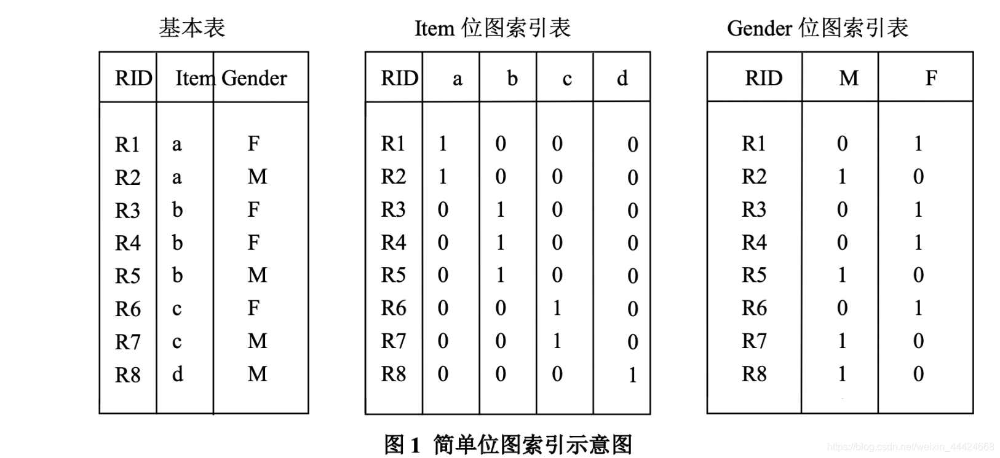
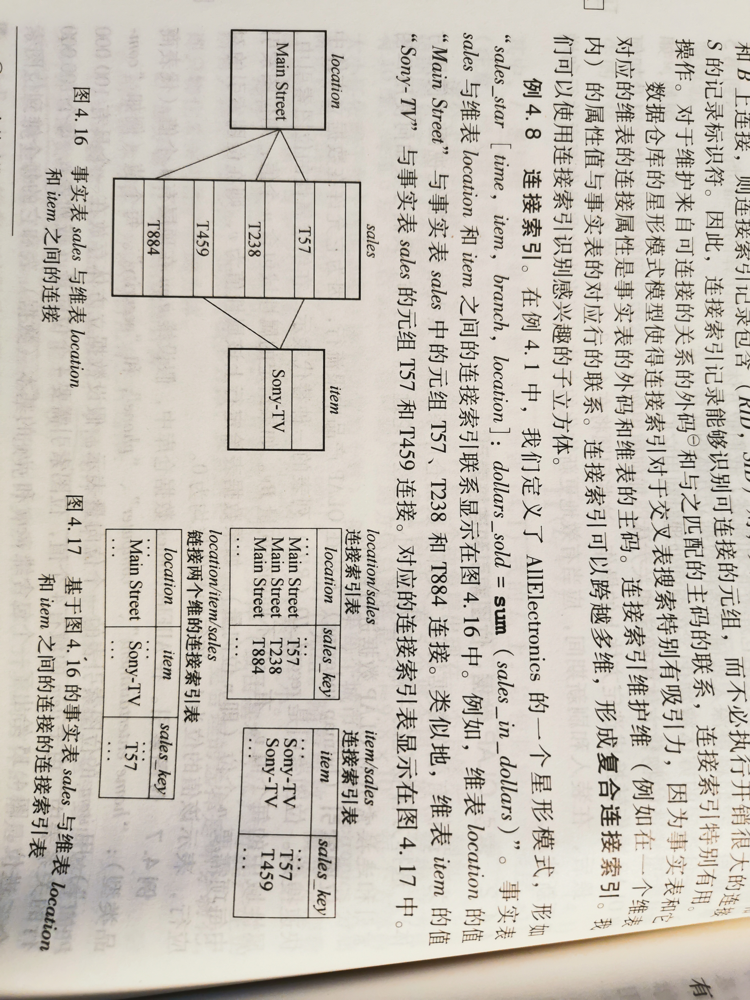

# 1 B树索引

**考题：为什么B树索引在数据库中广泛使用，但是在数据仓库里不用？**

1. B-tree 要求属性必须具有许多不同的值，比如身份证号这种取值字段，取值范围很广，几乎没有重复。 （但是数据仓库里经常有如性别这样的二值字段）
2. B树要求查询应具有更简单的条件和更少的结果（但是数据仓库的查询经常要求返回一个较大的集合）
3. 创建B树的空间复杂度和时间复杂度很大

# 2 位图索引

如果我们要找买了b产品的女性，计算时候首先取出b产品和女性F向量做&操作

> b：0 0 1 1 1 0 0 0
> F：1 0 1 1 0 1 0 0
>
> ​      0 0 1 1 0 0 0 0
>
> 发现第3位和第4位为1，表示第三行、第四行数据是我们要的结果

位图索引适合只有几个固定值的列，如性别、婚姻状况、行政区等等，对于性别，可取值的范围只有’男’,‘女’，并且男和女可能各站该表的50%的数据，这时添加B树索引还是需要取出一半的数据， 因此完全没有必要。如果某个字段的取值范围很广，几乎没有重复，比如身份证号，就不适合用位图索引，适合B树索引。

# 3 连接索引 Join Index

数据仓库的星形模式使得连接索引对于交叉表的搜索特特别有吸引力。

