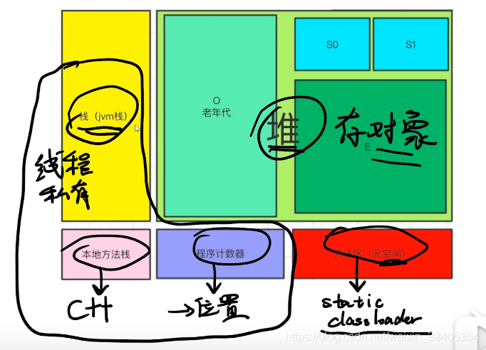

每个方法在执行的时候，都会生成与这个方法相关的**栈帧**；
**本地方法栈**主要用于执行本地方法—native
**堆**是JVM管理的最大一块内存空间，线程共享，与堆相关的一个重要概念就是垃圾收集器，现代几乎所有的垃圾收集器都是采用的分代收集算法，堆空间也基于这一点进行了划分：新生代和老年代。Eben空间、From Survivor空间、To Survivor空间。
**方法区**存储元信息（常量、静态变量、class本身）（永久代 Permanent Generation，从JDK1.8彻底废弃，使用元空间 meta space）
**运行时常量池**是方法区一部分。
**直接内存**不是由JVM管理，是由操作系统进行管理，与java nio密切相关，JVM通过DirectByteBuffer来操作直接内存。

Java对象创建的过程：

- new关键字创建对象的3个过程：
  1.在堆内存中创建出对象的实例，通过字节码中的方法
  2.为对象的实例成员变量赋初值，
  3.将对象的引用返回。

对象在内存中的布局：

1. 对象头
2. 实例数据（类中所声明的各项信息）
3. 对齐填充（可选）

```java
/**
修改文件运行的vm参数：-Xms5m -Xmx5m -XX:+HeapDumpOnOutOfMemoryError
*/
public class Test1{
    public static void main(String[] args){
           List<Test1> list=new ArrayList();
             for(;;) {
                    list.add(new Test1());
                    
                    //System.gc();  //主动建议垃圾回收器进行垃圾回收
             }
    }
}

运行结果：
java.lang.OutOfMemoryError: Java heap space
Dumping heap to java_pid51776.hprof ... 
Heap dump file created [9178675 bytes in 0.152 secs]
Exception in thread "main" java.lang.OutOfMemoryError: Java heap space
       at java.util.Arrays.copyOf(<u>Arrays.java:3210</u>)
       at java.util.Arrays.copyOf(<u>Arrays.java:3181</u>)
       at java.util.ArrayList.grow(<u>ArrayList.java:265</u>)
       at java.util.ArrayList.ensureExplicitCapacity(<u>ArrayList.java:239</u>)
       at java.util.ArrayList.ensureCapacityInternal(<u>ArrayList.java:231</u>)
       at java.util.ArrayList.add(<u>ArrayList.java:462</u>)
       at com.hisense.Test1.main(<u>Test1.java:11</u>)
       
       java_pid51776.hprof是一个转储文件
```

jvisualvm 打开转出的文件

JVM参数

-Xms5m -Xmx5m -XX:+HeapDumpOnOutOfMemoryError
-Xxs160k 设置堆栈的大小