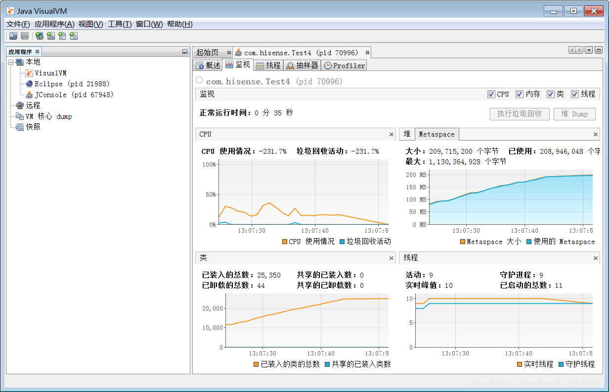
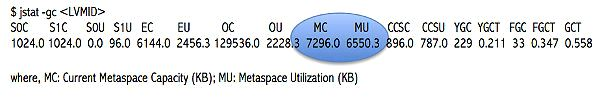

https://blog.csdn.net/weixin_38405354/article/details/104712746

https://www.infoq.cn/article/Java-PERMGEN-Removed/ 永久代去哪了？


每个方法在执行的时候，都会生成与这个方法相关的**栈帧**；
**本地方法栈**主要用于执行本地方法—native
**堆**是JVM管理的最大一块内存空间，线程共享，与堆相关的一个重要概念就是垃圾收集器，现代几乎所有的垃圾收集器都是采用的分代收集算法，堆空间也基于这一点进行了划分：新生代和老年代。Eben空间、From Survivor空间、To Survivor空间。
**方法区**存储元信息（常量、静态变量、class本身）（永久代 Permanent Generation，从JDK1.8彻底废弃，使用元空间 meta space）
**运行时常量池**是方法区一部分。
**直接内存**不是由JVM管理，是由操作系统进行管理，与java nio密切相关，JVM通过DirectByteBuffer来操作直接内存。

Java对象创建的过程：

- new关键字创建对象的3个过程：
  1.在堆内存中创建出对象的实例，通过字节码中的方法
  2.为对象的实例成员变量赋初值，
  3.将对象的引用返回。

对象在内存中的布局：

1. 对象头
2. 实例数据（类中所声明的各项信息）
3. 对齐填充（可选）

```java
/**
修改文件运行的vm参数：-Xms5m -Xmx5m -XX:+HeapDumpOnOutOfMemoryError
*/
public class Test1{
    public static void main(String[] args){
           List<Test1> list=new ArrayList();
             for(;;) {
                    list.add(new Test1());
                    
                    //System.gc();  //主动建议垃圾回收器进行垃圾回收
             }
    }
}

运行结果：
java.lang.OutOfMemoryError: Java heap space
Dumping heap to java_pid51776.hprof ... 
Heap dump file created [9178675 bytes in 0.152 secs]
Exception in thread "main" java.lang.OutOfMemoryError: Java heap space
       at java.util.Arrays.copyOf(<u>Arrays.java:3210</u>)
       at java.util.Arrays.copyOf(<u>Arrays.java:3181</u>)
       at java.util.ArrayList.grow(<u>ArrayList.java:265</u>)
       at java.util.ArrayList.ensureExplicitCapacity(<u>ArrayList.java:239</u>)
       at java.util.ArrayList.ensureCapacityInternal(<u>ArrayList.java:231</u>)
       at java.util.ArrayList.add(<u>ArrayList.java:462</u>)
       at com.hisense.Test1.main(<u>Test1.java:11</u>)
       
       java_pid51776.hprof是一个转储文件
```

jvisualvm 打开转出的文件

JVM参数

-Xms5m -Xmx5m -XX:+HeapDumpOnOutOfMemoryError
-Xxs160k 设置堆栈的大小

### 死锁测试

```java
/**
 * @author TylerChen
 * @date 2020/9/17 - 15:31
 * 死锁测试
 */
public class MyTest3 {
	public static void main(String[] args) {
		Runnable a = () -> A.method();

		Runnable b = () -> B.method();

		new Thread(a, "Thread A").start();
		new Thread(b, "Thread B").start();
	}
}

class A {
	public static synchronized void method() {
		System.out.println("method from A");
		try {
			Thread.sleep(5000);
			B.method();
		} catch (InterruptedException e) {
			e.printStackTrace();
		}

	}
}

class B {
	public static synchronized void method() {
		System.out.println("method from B");
		try {
			Thread.sleep(5000);
			A.method();
		} catch (InterruptedException e) {
			e.printStackTrace();
		}
	}
}
```

**jconsole**


**jvisualvm**


**元空间溢出测试**

```xml
引入jar
<dependency>
      <groupId>cglib</groupId>
       <artifactId>cglib</artifactId>
       <version>3.2.8</version>
</dependency>
```


```java
/**
 * 方法区产生内存溢出错误
 * ：jdk8中引入元空间，默认的初始大小为21m，如果超过21m，元空间虚拟机会进行垃圾回收，如果还不够就进行空间扩容，扩容的上限为物理内存的上限。
 * 本次测试使用cglib进行元空间内存错误演示。
 * 启动时，修改vm参数: -XX:MaxMetaspaceSize=10m。
 */
public class Test4 {
       public static void main(String[] args) {
             //程序在运行过程中，会不断的创建Test.class的子类，并放置到元空间中
             for(;;) {
                    Enhancer enhancer=new Enhancer();
                    enhancer.setSuperclass(Test4.class);
                    enhancer.setUseCache(false);
                    enhancer.setCallback((MethodInterceptor)(obj,method,arg1,proxy)-> 
                                        proxy.invokeSuper(obj, arg1));
                    System.out.println("hello world");
                    enhancer.create();
             }
       }
}

程序运行结果报错：
java.lang.OutOfMemoryError: Metaspace     元空间内存溢出
```

**使用jvisualvm工具观察元空间的变化：**



https://www.infoq.cn/article/Java-PERMGEN-Removed/ 永久代去哪了？

### 命令行测试

#### **jps**

使用jps命令获取java进程

**jps -l**


#### **jmap** 使用

```java

C:\Users\19699>jmap
Usage:
    jmap [option] <pid>
        (to connect to running process)
    jmap [option] <executable <core>
        (to connect to a core file)
    jmap [option] [server_id@]<remote server IP or hostname>
        (to connect to remote debug server)

where <option> is one of:
    <none>               to print same info as Solaris pmap
    -heap                to print java heap summary
    -histo[:live]        to print histogram of java object heap; if the "live"
                         suboption is specified, only count live objects
    -clstats             to print class loader statistics
    -finalizerinfo       to print information on objects awaiting finalization
    -dump:<dump-options> to dump java heap in hprof binary format
                         dump-options:
                           live         dump only live objects; if not specified,
                                        all objects in the heap are dumped.
                           format=b     binary format
                           file=<file>  dump heap to <file>
                         Example: jmap -dump:live,format=b,file=heap.bin <pid>
    -F                   force. Use with -dump:<dump-options> <pid> or -histo
                         to force a heap dump or histogram when <pid> does not
                         respond. The "live" suboption is not supported
                         in this mode.
    -h | -help           to print this help message
    -J<flag>             to pass <flag> directly to the runtime system
```

**jmap -clstats 11684**

#### **jstat -gc LVMID** 用来打印元空间的信息，具体内容如下



#### jcmd

jcmd pid VM.flag 查看对应pid进程的启动参数


**jcmd PID GC.class_stats** 一个新的诊断命令，用来连接到运行的 JVM 并输出详尽的类元数据的柱状图。

- jcmd pid VM.flags 查看虚拟机启动参数
- jcmd pid help 列出当前的java进程可以进行的操作
- jcmd pid help JFR.dump ：查看具体命令的选项
- jcmd pid ProfCounter.print : 查看当前进程性能相关的参数
- jcmd pid VM.uptime : **查看jvm的启动时长**
- jcmd pid GC.class_histogram ：查看系统中类的统计信息
- jcmd pid Thread.print : 查看线程堆栈信息
- jcmd pid GC.heap_dump C:\Users\Administrator\Desktop 导出heap dump文件，可以使用jvisualvm查看
- jcmd pid VM.system_properties ： 查看JVM的属性信息
- jcmd pid VM.version : 查看目标JVM进程的版本信息
- jcmd pid VM.command_line : 查看JVM启动的命令行参数信息

#### jstack 

- jstack pid : 查看或者导出java应用程序中线程的堆栈信息

### **图形化界面工具** jmc :Java Mission Control

