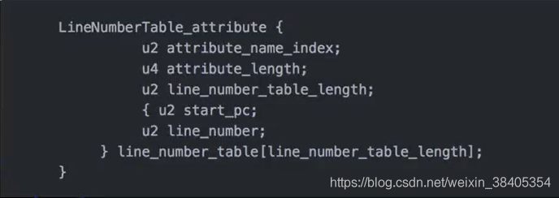

Java虚拟机不和包括java在内的任何语言绑定，它只与“Class”特定的二进制文件格式关联，Class文件中包含Java虚拟机指令集和符号表以及若干其他辅助信息。

------

测试

```java
public class MyTest1 {
	int a = 1;

	public int getA() {
		return a;
	}

	public void setA(int a) {
		this.a = a;
	}
}
```

**执行命令  javap -c MyTest**

```java
Compiled from "MyTest1.java"
public class org.ex2.MyTest1 {
  int a;

  public org.ex2.MyTest1();
    Code:
       0: aload_0
       1: invokespecial #1                  // Method java/lang/Object."<init>":()V
       4: aload_0
       5: iconst_1
       6: putfield      #2                  // Field a:I
       9: return

  public int getA();
    Code:
       0: aload_0
       1: getfield      #2                  // Field a:I
       4: ireturn

  public void setA(int);
    Code:
       0: aload_0
       1: iload_1
       2: putfield      #2                  // Field a:I
       5: return
}

```

**使用反编译命令：javap -verbose MyTest，生成以下数据**

```java
Classfile /D:/日常文件/桌面文件/危险废物管理系统/lyc/study/target/classes/org/ex2/MyTest1.class
  Last modified 2020-9-9; size 461 bytes
  MD5 checksum 5d71b88b5608fce54d3459704080680f
  Compiled from "MyTest1.java"
public class org.ex2.MyTest1
  minor version: 0
  major version: 52
  flags: ACC_PUBLIC, ACC_SUPER
Constant pool: 
//
   #1 = Methodref          #4.#20         // java/lang/Object."<init>":()V
   #2 = Fieldref           #3.#21         // org/ex2/MyTest1.a:I
   #3 = Class              #22            // org/ex2/MyTest1
   #4 = Class              #23            // java/lang/Object
   #5 = Utf8               a
   #6 = Utf8               I
   #7 = Utf8               <init>
   #8 = Utf8               ()V
   #9 = Utf8               Code
  #10 = Utf8               LineNumberTable
  #11 = Utf8               LocalVariableTable
  #12 = Utf8               this
  #13 = Utf8               Lorg/ex2/MyTest1;
  #14 = Utf8               getA
  #15 = Utf8               ()I
  #16 = Utf8               setA
  #17 = Utf8               (I)V
  #18 = Utf8               SourceFile
  #19 = Utf8               MyTest1.java
  #20 = NameAndType        #7:#8          // "<init>":()V
  #21 = NameAndType        #5:#6          // a:I
  #22 = Utf8               org/ex2/MyTest1
  #23 = Utf8               java/lang/Object
{
  int a;
    descriptor: I
    flags:

  public org.ex2.MyTest1();
    descriptor: ()V
    flags: ACC_PUBLIC
    Code:
      stack=2, locals=1, args_size=1
         0: aload_0
         1: invokespecial #1                  // Method java/lang/Object."<init>":()V
         4: aload_0
         5: iconst_1
         6: putfield      #2                  // Field a:I
         9: return
      LineNumberTable:
        line 7: 0
        line 8: 4
      LocalVariableTable:
        Start  Length  Slot  Name   Signature
            0      10     0  this   Lorg/ex2/MyTest1;

  public int getA();
    descriptor: ()I
    flags: ACC_PUBLIC
    Code:
      stack=1, locals=1, args_size=1
         0: aload_0
         1: getfield      #2                  // Field a:I
         4: ireturn
      LineNumberTable:
        line 11: 0
      LocalVariableTable:
        Start  Length  Slot  Name   Signature
            0       5     0  this   Lorg/ex2/MyTest1;

  public void setA(int);
    descriptor: (I)V
    flags: ACC_PUBLIC
    Code:
      stack=2, locals=2, args_size=2
         0: aload_0
         1: iload_1
         2: putfield      #2                  // Field a:I
         5: return
      LineNumberTable:
        line 15: 0
        line 16: 5
      LocalVariableTable:
        Start  Length  Slot  Name   Signature
            0       6     0  this   Lorg/ex2/MyTest1;
            0       6     1     a   I
}
SourceFile: "MyTest1.java"
```


1. 使用javap -p -verbose MyTest 命令分析一个字节码文件时，将会分析该字节码文件的魔数，版本号，常量池，类信息，类的构造方法，类中的方法信息，类变量与成员变量的信息。
2. 魔数：所有的.class文件的前四个字节都是魔数，魔数值为固定值：0xCAFEBABE（咖啡宝贝）
3. 版本号：魔数后面4个字节是版本信息，前两个字节表示minor version（次版本号），后两个字节表示major version（主版本号），十六进制34=十进制52。所以该文件的版本号为1.8.0。低版本的编译器编译的字节码可以在高版本的JVM下运行，反过来则不行。
4. **常量池**（constant pool）：版本号之后的就是常量池入口，一个java类定义的很多信息都是由常量池来维护和描述的，可以将常量池看作是class文件的资源仓库，包括java类定义的方法和变量信息，常量池中主要存储两类常量：字面量和符号引用。字面量如文本字符串、java中生命的final常量值等，符号引用如类和接口的全局限定名，字段的名称和描述符，方法的名称和描述符等。
5. 常量池的整体结构：Java类对应的常量池主要由**常量池数量**和**常量池数组**两部分共同构成，常量池数量紧跟在主版本号后面，占据两个字节，而常量池数组在常量池数量之后。常量池数组与一般数组不同的是，常量池数组中元素的类型、结构都是不同的，长度当然也就不同，但是每一种元素的第一个数据都是一个u1类型标志位，占据一个字节，JVM在解析常量池时，就会根据这个u1类型的来获取对应的元素的具体类型。 **值得注意的是，常量池数组中元素的个数=常量池数-1**,（其中0暂时不使用）。目的是满足某些常量池索引值的数据在特定的情况下需要表达不引用任何常量池的含义。根本原因在于索引为0也是一个常量，它是JVM的保留常量，它不位于常量表中。这个常量就对应null，所以常量池的索引从1而非0开始。
   6. 在JVM规范中，每个变量/字段都有描述信息，主要的作用是描述字段的数据类型，方法的参数列表（包括数量、类型和顺序）与返回值。根据描述符规则，基本数据类型和代表无返回值的void类型都用一个大写字符来表示，而对象类型使用字符L+对象的全限定名称来表示。为了压缩字节码文件的体积，对于基本数据类型，JVM都只使用一个大写字母来表示。如下所示:B-byte，C-char，D-double，F-float，I-int，J-long，S-short，Z-boolean，V-void，L-对象类型，如Ljava/lang/String;  对于数组类型来说，每一个维度使用一个前置的[ 来表示，如int[]表示为[I ，String[]:[] (二维数组)被记录为[[Ljava/lang/String;
7. 用描述符描述方法的时候，用先参数列表后返回值的方式来描述。参数列表按照参数的严格顺序放在一组（）之内，如方法String getNameByID(int id ,String name)
   (I,Ljava/lang/String;)Ljava/lang/String;

### 字节码结构


图二：


- Access Falgs：

- 访问标志信息包括了该class文件是类还是接口，是否被定义成public，是否是abstract，如果是类，是否被定义成final。

  0x0021是0x0020和0x0001的并集，表示ACC_PUBLIC和ACC_SUPER
  **0x0002:private  0x0008:static**

- 字段表（Fields）：
  字段表用于描述类和接口中 声明的变量。这里的字段包含了类级别变量和实例变量，但是不包括方法内部声明的局部变量。

  

- 方法表
  方法的属性结构：
  方法中的每个属性都是一个attribute_info结构:
  （1）JVM预定义了部分attribute，但是编译器自己也可以实现自己的attribute写入class文件里，供运行时使用；
  （2）不同的attribute通过attribute_name_index来区分。

- attribute_info格式:
  attribute_info{
  u2 attribute_name_index;
  u4 attribute_length;
  u1 info[attribute_length]
  }

- attribute_name_index值为code，则为Code结构
  Code的作用是保存该方法的结构，所对应的的字节码

  

- attribute_length：表示attribute所包含的字节数，不包含attribute_name_index和attribute_length
  max_stacks：表示这个方法运行的任何时刻所能达到的操作数栈的最大深度
  max_locals：表示方法执行期间创建的局部变量的数目，包含用来表示传入的参数的局部变量
  code_length：表示该方法所包含的字节码的字节数以及具体的指令码。具体的字节码是指该方法被调用时，虚拟机所执行的字节码
  exception_table：存放处理异常的信息，每个exception_table表，是由start_pc、end_pc、hangder_pc、catch_type组成
  start_pc、end_pc：表示在code数组中从start_pc到end_pc（包含start_pc，不包含end_pc）的指令抛出的异常会由这个表项来处理
  hangder_pc：表示处理异常的代码的开始处。
  catch_type：表示会被处理的异常类型，它指向常量池中的一个异常类。当catch_type=0时，表示处理所有的异常。

- 附加其他属性：

- LineNumbeTable_attribute:

  

  这个属性表示code数组中，字节码与java代码行数之间的关系，可以在调试的时候定位代码执行的行数。

- LocalVariableTable ：结构类似于 LineNumbeTable_attribute
  对于Java中的任何一个非静态方法，至少会有一个局部变量，就是this。

------

对于java类中的每一个实例方法（非static方法），其在编译后所生成的字节码中，党法参数的数量总是会比源代码中的方法参数多一个（this）,它位于方法的第一个参数位置处；这样，我们就可以在java的实例方法中使用this来去访问当前对象的属性以及其他方法。

这个操作实在编译期间完成的，即由javac编译器在编译的时候将对this的访问转化为一个对普通实例方法参数的访问；接下来在运行期间由JVM在调用实例方法时，自动向实例方法传入该this参数。所以在实例方法的局部变量表中，至少会有一个指向当前对象的局部变量。

```java
public void setA(int a) {
		this.a = a;
	}

 public void setA(int);
    descriptor: (I)V
    flags: ACC_PUBLIC
    Code:
//这个地方 参数大小args_size=2，但是我们自己定义的参数只有一个
      stack=2, locals=2, args_size=2
         0: aload_0
         1: iload_1
         2: putfield      #2                  // Field a:I
  ...

```


------

**符号引用**：符号引用以一组符号来描述所引用的目标。符号引用可以是任何形式的字面量，只要使用时能无歧义地定位到目标即可，符号引用和虚拟机的布局无关。（在编译的时候一个每个java类都会被编译成一个class文件，但在编译的时候虚拟机并不知道所引用类的地址，多以就用符号引用来代替，而在这个解析阶段就是为了把这个符号引用转化成为真正的地址的阶段。）
**直接引用**：（1）直接指向目标的指针（指向对象，类变量和类方法的指针）（2）相对偏移量。（指向实例的变量，方法的指针）（3）一个间接定位到对象的句柄。

有些符号引用在加载阶段或者或是第一次使用时，转换为直接引用，这种转换叫做**静态解析**；另外一些符号引用则是在运行期转换为直接引用，这种转换叫做**动态链接**。
助记符：

1.invokeinterface：调用接口的方法，在运行期决定调用该接口的哪个对象的特定方法。
2.invokestatic：调用静态方法
3.invokespecial：调用私有方法， 构造方法（<init>），父类的方法
4.invokevirtual：调用虚方法，运行期动态
5.invokedynamic：动态调用方法

静态解析的四种场：静态方法、父类方法、构造方法、私有方法。以上四种方法称为非虚方法，在类加载阶段将符号引用转换为直接引用


查找的过程
5.invokedynamic：动态调用方法