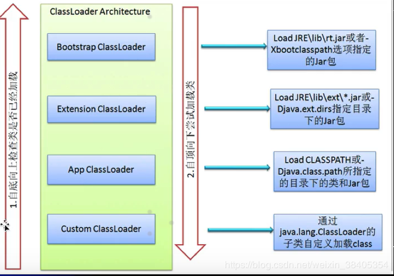

## JVM-类加载机制

### 类加载 class loading 概念

- 在java代码中，**类型**的加载、连接和初始化过程都是在程序运行期间完成的。（类从磁盘加载到内存中经历的三个阶段）
- 提供了更大的灵活性，增加了更多的可能性。

### **类的加载、连接与初始化**

1. 加载：查找并加载类的二进制数据到java虚拟机中
2. 连接：
   - 验证 : 确保被加载的类的正确性
   - 准备：为类的**静态变量**分配内存，并将其初始化为**默认值**，但是到达初始化之前类变量都没有初始化为真正的初始值
   - 解析：**把类中的符号引用转换为直接引用**，就是在类型的常量池中寻找类、接口、字段和方法的符号引用，把这些符号引用替换成直接引用的过程
3. 初始化：为类的静态变量赋予**正确（真实）**的初始值

#### java对类的使用

1. 主动使用

   所有的Java虚拟机实现必须在每个类或接口被Java程序“**首次主动使用**”时才能**初始化**他们

   主动使用（七种情况）

   - 创建类的实例 new Object()
   - 访问某个类或接口的静态变量。 getstatic（助记符），或者对该静态变量赋值 putstatic
   - 调用类的静态方法 invokestatic
   - 反射（Class.forName(“com.test.Test”)）
   - 初始化一个类的**子类** ，**父类也 先 要初始化**
   - Java虚拟机启动时被标明**启动**类的类。包含main()函数的类
   - JDK1.7开始提供的动态语言支持（了解）

   注意：

   ​	1，通过子类引用父类的静态变量其实是对父类的主动使用。（对子类并没有主动使用）

   ​	2，调用ClassLoader 类的loadClass方法加载一个类，并不是对类的主动使用， 不会导致类的初始化

   ```java
   class CL{
   	static {
   		System.out.println("Class CL");
   	}
   }
   
   public class Test1 {
   	public static void main(String[] args) throws ClassNotFoundException {
   		java.lang.ClassLoader classLoader = Test1.class.getClassLoader();
   		Class<?> aClass = classLoader.loadClass("org.example.CL");
   		System.out.println(aClass);
   		System.out.println("-----");
   		Class clazz = Class.forName("org.example.CL");
   		System.out.println(clazz);
   	}
   }
   ```

   

2. 被动使用

   ​	除了上面七种情况外，其他使用java类的方式都被看做是对类的**被动使用**，都不会导致类的**初始化**。但是有可能加载

#### 类的加载

​	类的加载指的是将类的.class文件中的二进制数据读入到内存中，将其放在运行时数据区的方法区内，然后在内存中创建一个java.lang.Class对象（规范并未说明Class对象位于哪里，HotSpot虚拟机将其放在**方法区**中）用来封装内在方法区内的数据结构。

##### 加载.calss文件的方式

- 从本地系统中直接加载
- 通过网络下载.class文件
- 从zip，jar等归档文件中加载.class文件
- 从专用数据库中提取.class文件
- **将java源文件动态编译为.class文件**，(动态代理 例如 jsp)

#### 测试1：初始化一个类的**子类** ，**父类也要初始化**。被动使用。

```java
/**
        对于静态字段来说，只有直接定义了该字段的类才会被初始化
        当一个类在初始化时，要求父类全部都已经初始化完毕
        -XX:+TraceClassLoading，用于追踪类的加载信息并打印出来

        -XX:+<option>，表示开启option选项
        -XX:-<option>，表示关闭option选项
        -XX:<option>=value，表示将option的值设置为value
*/

public class ClassLoader {
	public static void main(String[] args) {
		//输出：MyParent static block 、 hello world   （因为对MyChild不是主动使用）
		System.out.println(MyChild.str);
		//输出：MyParent static block  、MyChild static block、welcome
		// 调用了 MyChild 的getstatic，子类初始化，所以父类也要初始化
		System.out.println(MyChild.str2);
	}
}
class MyParent{
	public static String str="hello world";
	static {
		System.out.println("MyParent static block");
	}
}
class MyChild extends MyParent{
	public static String str2="welcome";
	static {
		System.out.println("MyChild static block");
	}
}
```

#### 测试2。常量 final 会放到常量池，对常量的使用不是主动使用

常量在**编译**阶段会存入到**调用**这个常量的方法所在的**类的常量池**中。本质上，调用类并没有直接调用到定义常量的类，因此并不会触发定义常量的类的初始化

注意：这里指的是将常量存到**ClassLoader**的常量池中，之后**ClassLoader**和MyParent2就没有任何关系了。
甚至我们可以将MyParent2的class文件删除

```java
public class ClassLoader {
	public static void main(String[] args) {
		//输出 hello world
		System.out.println(MyParent2.str);
		// MyParent static block 输出 hello world
		System.out.println(MyParent2.str1);
	}
}
class MyParent2{
	public static final String str="hello world";
	public static String str1="hello world";
	static {
		System.out.println("MyParent static block");
	}
}
```

#### 测试3：常量的值并非编译期间可以确定的。

当一个**常量的值并非编译期间可以确定的**，那么其值就**不会**放到**调用类的常量池**中 ,这时在程序运行时，会导致**主动使用**这个常量所在的类，显然会导致这个类被初始化

```java
public class ClassLoader{
	public static void main(String[] args){
		//输出MyParent static block、kjqhdun-baoje21w-jxqioj1-2jwejc9029
		System.out.println(MyParent3.str);
	}
}
class MyParent3{
	public static final String str= UUID.randomUUID().toString();
	static {
		System.out.println("MyParent static block");
	}
}
```

#### 测试4：创建数组不属于主动使用

- 对于**数组实例**来说，其类型是由JVM在运行期动态生成的，表示为 MyParent4 这种形式。     
-   对于数组来说，JavaDoc经构成数据的元素成为Component，实际上是将数组降低一个维度后的类型。   
-  助记符：anewarray：表示创建一个引用类型（如类、接口）的数组，并将其引用值压入栈顶
-  助记符：newarray：表示创建一个指定原始类型（int boolean float double）的数组，并将其引用值压入栈顶                   

```java
public class ClassLoader{
	public static void main(String[] args){
		//创建类的实例，属于主动使用，会导致类的初始化
//		MyParent4 myParent4=new MyParent4();
		//不是主动使用
		MyParent4[] myParent4s=new MyParent4[1];
		//输出 class [L org.example.MyParent4;
		System.out.println(myParent4s.getClass());
		//输出Object
		System.out.println(myParent4s.getClass().getSuperclass());

		int[] i=new int[1];
		System.out.println(i.getClass());          //输出 [ I
		System.out.println(i.getClass().getSuperclass());    //输出Object
	}
}
class MyParent4{
	static {
		System.out.println("MyParent static block");
	}
}
```

#### 测试5：接口初始化

当一个接口或类在初始化时，并不要求其父接口都完成了初始化   ，只有在真正使用到父接口的时候（如引用接口中定义的常量），才会初始化。

#### 测试6：准备阶段和初始化的顺序问题（初始化时按照静态定义的顺序，从上到下赋值）

```java
public class ClassLoader{
   public static void main(String[] args){
         Singleton Singleton= org.example.Singleton.getInstance();
         System.out.println( org.example.Singleton.counter1);     
         System.out.println( org.example.Singleton.counter2);
   }
}
class Singleton{
// static {
//    counter2 = 1;   // 1, 2
// }
   public static int counter1;
   public static int counter2=0;
   private static Singleton singleton=new Singleton();

   private Singleton(){
      counter1++;
      counter2++;
   }

   // public static int counter2=0;       //   若改变此赋值语句的位置，输出  1，0
   public static Singleton getInstance(){
      return singleton;
   }
}
```

### 类加载器

​	**类加载器并不需要等到某个类被“首次主动使用”时再加载它**

​	JVM规范允许类加载器在预料某个类将要被使用时就预先加载它，如果在预先加载的过程中遇到了.class文件缺失或存在错误，类加载器必须在**程序首次主动**使用该类才报告错误（LinkageError错误），如果这个类没有被程序**主动使用**，那么类加载器就**不会**报告错误。

​	类加载器用来把类加载到java虚拟机中。从JDK1.2版本开始，类的加载过程采用父亲委托机制，这种机制能更好地保证Java平台的安全。在此委托机制中，除了java虚拟机自带的根类加载器以外，其余的类加载器都有且只有一个父加载器。当java程序请求加载器loader1加载Sample类时，loader1首先委托自己的父加载器去加载Sample类，若父加载器能加载，则由父加载器完成加载任务，否则才由加载器loader1本身加载Sample类。

1. Java虚拟机自带的加载器
   - **根类加载器**（Bootstrap）：该加载器没有父加载器，它负责加载虚拟机中的核心类库，如java.lang.* 。根类加载器从系统属性sun.boot.class.path所指定的目录中加载类库。类加载器的实现依赖于底层操作系统，属于虚拟机的实现的一部分，它并没有继承java.lang.ClassLoader类。
   - **扩展类加载器**（Extension）：它的父加载器为根类加载器。它从java.ext.dirs系统属性所指定的目录中加载类库，或者从JDK的安装目录的jre\lib\ext子目录（扩展目录）下加载类库，如果把用户创建的jar文件放在这个目录下，也会自动由扩展类加载器加载，扩展类加载器是纯java类，是java.lang.ClassLoader的子类。
   - **系统应用类加载器**（System）：也称为应用类加载器，它的父加载器为扩展类加载器，它从环境变量classpath或者系统属性java.class.path所指定的目录中加载类，他是用户自定义的类加载器的默认父加载器。系统类加载器时纯java类，是java.lang.ClassLoader的子类。
2. 用户自定义的类加载器
   - java.lang.ClassLoader的子类 
   - 用户可以定制类的加载方式

#### 类加载器的父亲委托机制

在父亲委托机制中，各个加载器按照父子关系形成了树形结构，除了根加载器之外，其余的类加载器都有一个父加载器

若有一个类能够成功加载Test类，那么这个类加载器被称为**定义类加载器**，所有能成功返回Class对象引用的类加载器（包括定义类加载器）称为**初始类加载器**。

**The ClassLoader class uses a delegation model to search for classes and resources. Each instance of ClassLoader has an associated parent class loader. When requested to find a class or resource, a ClassLoader instance will delegate the search for the class or resource to its parent class loader before attempting to find the class or resource itself. The virtual machine's built-in class loader, called the "bootstrap class loader", does not itself have a parent but may serve as the parent of a ClassLoader instance.**

并行加载：

**Class loaders that support concurrent loading of classes are known as parallel capable class loaders and are required to register themselves at their class initialization time by invoking the ClassLoader.register As ParallelCapable method. Note that the ClassLoader class is registered as parallel capable by default. However, its subclasses still need to register themselves if they are parallel capable.** 




#### 测试1

```eng
Class::getClassLoader()
Returns the class loader for the class.  Some implementations may use
null to represent the bootstrap class loader. This method will return
null in such implementations if this class was loaded by the bootstrap
class loader.
```

```java
/**
 java.lang.String是由根加载器加载，在rt.jar包下。
 */
public class ClassLoader{
      public static void main(String[] args) throws ClassNotFoundException {
         Class<?> clazz=Class.forName("java.lang.String");
         System.out.println(clazz.getClassLoader());  //返回null，根类加载器没有继承java.lang.ClassLoader类。

         Class<?> clazz2=Class.forName("org.example.C");
         System.out.println(clazz2.getClassLoader());  //输出sun.misc.Launcher$AppClassLoader@18b4aac2  其中AppClassLoader:系统应用类加载器
   }
}
class C{
}
```

获取类加载器的途径：
（1）clazz.getClassLoader(); --获取当前类的加载器
（2）Thread.currentThread().getContextClassLoader(); --获取当前线程上下文的加载器
（3）ClassLoader.getSystemClassLoader(); --获取系统的加载器
（4）DriverManager.getCallerClassLoader(); --获取调用者的加载器

#### 自定义类加载器

```java
package org.example;

import java.io.*;

/**
 * @author TylerChen
 * @date 2020/9/3 - 22:37
 */
public class MyClassLoader extends ClassLoader {
	private  String classLoaderName;

	private final String fileExt = ".class";

	public MyClassLoader(String classLoaderName){
		super();
		this.classLoaderName = classLoaderName;
	}

	public MyClassLoader(ClassLoader parent, String classLoaderName){
		super(parent);
		this.classLoaderName = classLoaderName;
	}


	private byte[] loadClassData(String name)  {
		InputStream is = null;
		byte[] data = null;
		name = name.replace(".", "/");
		ByteArrayOutputStream bos;
		try {
			is = new FileInputStream("D:/Files/aaaa/"+name + fileExt);
			bos = new ByteArrayOutputStream();
			int ch = 0;
			while((ch = is.read()) != -1){
				bos.write(ch);
			}
			data = bos.toByteArray();
		} catch (IOException e) {
			e.printStackTrace();
		}
		return data;
	}

	@Override
	protected Class<?> findClass(String className){
		System.out.println("loaderName="+this.classLoaderName);
		byte[] data=loadClassData(className);
		return defineClass(className,data,0,data.length); //define方法为父类方法
	}


	@Override
	public String toString() {
		return "MyClassLoader{" +
				"classLoaderName='" + classLoaderName + '\'' +
				'}';
	}

	public static void main(String[] args) throws IllegalAccessException, InstantiationException, ClassNotFoundException {
		MyClassLoader loader1=new MyClassLoader(null,"loader1");
		System.out.println("===loader1===");
		test(loader1);

		test(loader1); //在 loader1中，同一个binary name只被加载了一次

		System.out.println("===loader2===");
		MyClassLoader loader2=new MyClassLoader(null,"loader2");
		test(loader2);
		//loader1和loader2是两个不同对象，也就是不同的命名空间


		MyClassLoader loader3=new MyClassLoader("loader3");
		MyClassLoader loader4=new MyClassLoader("loader4");

		System.out.println("===loader3===");
		test(loader3);

		System.out.println("===loader4===");
		test(loader4);
		//loader3,和loader4都委托了应用类加载器，是同一个对象，也就是同一个命名空间，所以只被加载一次

		System.out.println("===loader5===");
		//loader5 的父亲加载器是loader1可以加载，loader1已经将对应的类加载过了
		MyClassLoader loader5=new MyClassLoader(loader1,"loader5");
		test(loader5);


	}

	public static void test(ClassLoader classLoader) throws ClassNotFoundException, IllegalAccessException, InstantiationException {
		Class<?> clazz=classLoader.loadClass("org.example.Test1");
		System.out.println("class hash " + clazz.hashCode());
		//loadClass是父类方法，在方法内部调用findClass
		Object  object=clazz.newInstance();
//		System.out.println(object);
	}
}


```

#### 命名空间

- 每个类加载器都有自己的命名空间，**命名空间由该加载器及所有父加载器所加载的类构成**；
- 在同一个命名空间中，不会出现类的完整名字（包括类的包名）相同的两个类；
- 在不同的命名空间中，有可能会出现类的完整名字（包括类的包名）相同的两个类；
- 同一命名空间内的类是互相可见的，**非同一命名空间内的类是不可见的**；
- 子加载器可以见到父加载器加载的类，**但是父加载器不能见到子加载器加载的类**。

#### 类的卸载

- 当一个类被加载、连接和初始化之后，它的生命周期就开始了。当此类的Class对象不再被引用，即不可触及时，Class对象就会结束生命周期，类在方法区内的数据也会被卸载。

- 一个类何时结束生命周期，取决于代表它的Class对象何时结束生命周期。

- **由Java虚拟机自带的类加载器所加载的类，在虚拟机的生命周期中，始终不会被卸载。**Java虚拟机本身会始终引用这些加载器，而这些类加载器则会始终引用他们所加载的类的Class对象，因此这些Class对象是可触及的。

- 由用户**自定义**的类加载器所加载的类是可以被卸载的。

  ##### 卸载测试

```java
	public static void main(String[] args) throws IllegalAccessException, InstantiationException, ClassNotFoundException {
		MyClassLoader loader1=new MyClassLoader(null,"loader1");
		System.out.println("===loader1===");
		test(loader1);
		loader1 = null;
		System.gc();
		System.out.println("===loader2===");
		loader1=new MyClassLoader(null,"loader1_2");
		test(loader1);
	}
```

#### 打印类加载器加载路径

```java
public class Test2 {
	public static void main(String[] args) {
		//启动类加载器的加载路径
		System.out.println(System.getProperty("sun.boot.class.path"));
		// 扩展类加载器加载路径
		System.out.println(System.getProperty("java.ext.dirs"));
		//应用类加载器加载路径
		System.out.println(System.getProperty("java.class.path"));
	}
}
```

