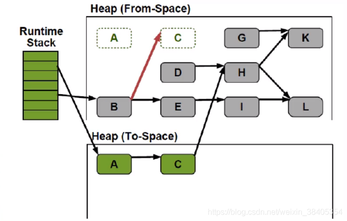
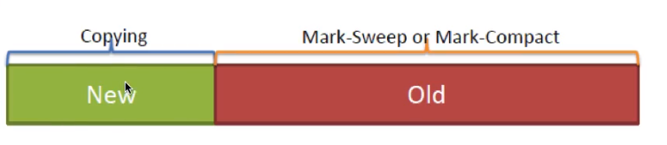
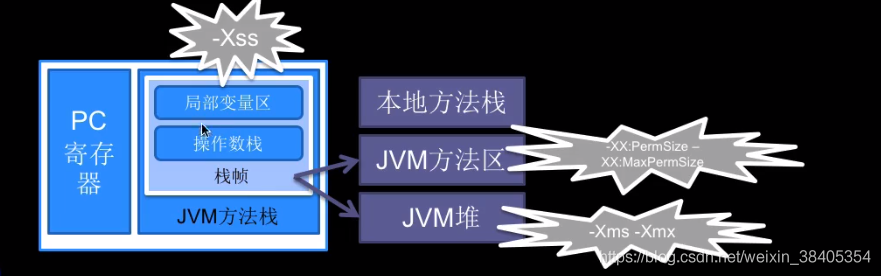
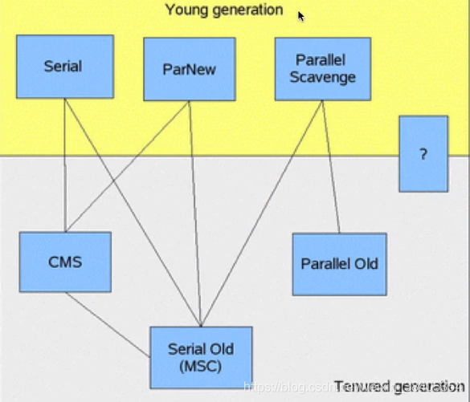

# 1 垃圾判断的算法

- 引用计数算法（Reference Counting）
- 根搜索算法（Root Tracing）

## 1.1 引用计数算法（Reference Counting）

**定义：**给**对象**添加一个引用计算器，当有一个地方引用它，计算器就加1，当引用失效，计数器减1，任何时刻计数器为0的对象就是不可能再被使用的；

注： 引用计数算法无法解决对象循环引用的问题。当出现，A对象引用B对象，B对象引用A对象，当外界对A和B的引用消失时，A和B的对象是无法通过引用计数算法实现回收的。

## 1.2 根搜索算法（Root Tracing）

- 在实际的生产语言中（Java、C++等），都是使用根搜索算法判定对象是否存活；
- 算法基本思路就是通过一系列的成为“GC Roots”的点作为起始进行向下搜索，当一个对象到GC Roots没有任何引用链（Reference Chain）相连，则证明此对象是不可用的。
- 在Java语言中，GC Roots包括：
  - 在VM栈（帧中的本地变量）中的引用；
  - 方法区中的静态引用
  - JNI（即一般说的Native方法）中的引用

# 2 方法区的垃圾回收

- Java虚拟机规范表示不要求虚拟机在方法区实现GC，这区GC的“性价比”一般比较低；
- 在堆中，尤其是新生代，常规应用进行一次GC一般可以回收70%-95%的空间，而方法区的GC效率远小于此；
- 当前的商业JVM都有实现方法区的GC，主要回收两部分内容：**废弃常量与无用类。**
- 类回收需要满足3个条件：
  1. 该类所有的实例都已经被GC，也就是JVM中不存在该Class的任何实例；
  2. 加载该类的ClassLoader（类加载器是实例对象，存在于堆空间中）已经被GC；
  3. 该类对应的java.lang.Class对象没有在任何地方被应用，如不能再任何地方通过反射访问该类的方法。
- 在大量使用反射、动态代理、CGLIB等字节码框架、动态生成JSP以及OSGI这类频繁自定义ClassLoader的场景都需要JVM具备类卸载的支持以保证方法区不会溢出。

# 3 JVM常见GC算法

1. 标记-清除算法（Mark-Sweep）
2. 标记-整理算法（Mark-Compact）
3. 复制算法（Copying）
4. 分代算法（Generational）

## 3.1 标记-清除算法（Mark-Sweep）

- 算法分为**“标记”**和**“清除”**两个阶段，首先标记出所有需要回收的对象，然后回收所有需要回收的对象。
- 缺点：
  - 效率问题：标记和清理两个过程效率都不高，需要**扫描所有对象**
  - 空间问题：标记清理之后会产生大量不连续的内存碎片，空间碎片太多可能会导致后续使用中无法找到足够的内存而提前出发另一次垃圾搜集动作。


根据根搜索算法，不能搜索到的对象实例打上**标记**（红色），然后要被回收、

## 3.2 复制算法（Copying）

- 将可用内存划分为**两块**，每次只使用其中的一块，当半区内存用完了，仅将还**存活**的对象复制到另外一块上面，然后就把原来整块内存空间一次性清理掉。
- 这样使得每次内存回收都是对整个半区的回收，内存分配时也就不用考虑内存碎片等复杂情况，只要移动堆顶指针，按顺序分配内存就可以了，实现简单，运行高效。
- 只是这种算法的代价是将内存缩小为原来的一半，**代价高昂**。
- 现在的商业虚拟机中都是用了这一种收集算法来回收**新生代**。
- 将内存分为一块较大的eden空间和2块较少的survivor空间，每次使用eden和其中一块survivor，当回收时将eden和survivor还存活的对象一次性拷贝到另外一块survivor空间上，然后清理掉eden和用过的survivor。
- Oracle Hotspot虚拟机默认eden和survivor的大小比例是8：1，也就是每次只有10%的内存是浪费的。
- 复制收集算法在对象存活率高的时候，效率有所下降。
- 如果不想浪费50%的空间，就需要有额外的空间进行分配担保用于应付半区内存中所有对象都100%存活的极端情况，所以在老年代一般不能选用这种算法。



​		首先堆栈中引用了A,B。（以A举例，仍然用的是根搜索算法），将A复制到ToSpace, A引用了C， 所以将C复制到To-Space，以此类推。

**特点：**

1. 只需要扫描存活的对象，效率更高；
2. 不会产生碎片；
3. 需要浪费额外的内存作为复制区；
4. 复制算法非常适合生命周期比较短的对象，因为每次GC总能回收大部分的对象，复制的开销比较小；
5. 根据IBM的专门研究，98%的Java对象只会存活1个GC周期，对这些对象很适合用复制算法。而且不用1:1的划分工作区和复制区的空间。

## 3.3 标记-整理算法（Mark-Compact）

- 标记过程仍然一样，但后续步骤不是进行直接清理，而是令所有存活的对象向一端移动，**然后直接清理掉边界以外的内存。**

- 特点：
  - 没有内存碎片；
  - 比Mark-Sweep标记清除算法耗费更多的时间进行compact（压缩）

## 3.4  分代收集算法（Generational Collecting）

- 当前商业虚拟机的垃圾收集都是采用“分代收集”算法，根据对象不同的存活周期将内存划分为几块；
- 一般是把Java堆分作**新生代**和**老年代**，**这样就可以根据各个年代的特点采用最适合的收集算法**，比如新生代每次GC都有大批对象死去，只有少量存活，那就选用复制算法只需要付出少量存活对象的复制成本就可以完成收集。
- 
- Hotspot JVM6中共划分为三个代：年轻代（Young Generation
  ）、老年代（Old Generation）和永久代（Permanent Generation）( 现在版本已经没有老年代了) 

### 3.4.1 **年轻代（Young Generation）**

- 新生成的对象都放在新生代。年轻代用复制算法进行GC（理论上，年轻代对象的生命周期非常短，所以适合**复制算法**）；
- 年轻代分三个区。一个Eden区，两个Survivor区（可以通过参数设置Survivor个数）。对象在Eden区中生成。当Eden区满时，还存活的对象将复制到一个Survivor区，当这个Survivor区满时，此区的存活对象将被复制到另外一个Survivor区，当第二个Survivor区也满的时候，**从第一个Survivor区复制过来的并且此时还存活的对象，将被复制到老年代**。2个Survivor时完全对称，轮流替换。
- Eden和2个Survivor的缺省比例是8:1:1，也就是10%的空间会被浪费。可以根据GC log的信息调整大小的比例。

### 3.4.2 **老年代 （Old Generation）**

- 存放了经过一次或多次GC还存活的对象；
- 一般采用Mark-Sweep或Mark-Compact算法进行GC
- 有多种垃圾收集器可以选择。每种垃圾收集器可以看作一个GC算法的具体实现。可以根据具体应用的需求选用合适的垃圾收集器（追求吞吐量？追求最短的响应时间）

### 3.4.3  ~~永久代 **（Permanent Generation）**~~

- 并不属于堆，但是GC也会涉及到这个区域
- 存放了每个Class的结构信息，包括常量池、字段描述、方法描述。与垃圾收集要收集的Java对象关系不大。

# 4 内存结构



注意：在Hotspot 中，本地方法栈和JVM方法栈是同一个，因此也可以用-**Xss**控制

## 4.1 内存分配

1、堆上分配

- 大多数情况在Eden上分配，偶尔会直接在old上分配，细节决定于GC的实现

2、栈上分配

- 原子类型的局部变量

## 4.2 内存回收

1、 GC要做的是将那些dead的对象所占用的内存回收掉

- Hotspot认为没有引用的对象是dead的；

- Hotspot将引用分为四种：Strong（强引用）、Soft（软引用）、Weak（弱引用）、Phantom（虚引用）

  - -Strong即默认通过Object o=new Object()这种方法赋值的引用

  - -Soft、Weak、Phantom这三种则都是继承Reference

- 在Full GC时会对Reference类型的引用进行特殊处理

  - -Soft：内存不够时一定会被GC、长期不用也会被GC

  - -Weak：一定会被GC，当被mark为dead，会在ReferenceQueue中通知

  - -Phantom：本来就没引用，当从jvm heap中释放时会通知
    [详情点击](https://my.oschina.net/u/946498/blog/2963053)

## 4.3 GC的时机

- 在分代模型的基础上，GC从时机上分为两种：Scavenge GC和Full GC

### 4.3.1 Scavenge GC (Minor GC)

- 触发时机：新对象生成时，Eden空间满了
- 理论上Eden区大多数对象会在Scavenge GC回收，复制算法的执行效率会很高，Scavenge GC时间比较短。

### 4.3.2 Full GC

- 对整个JVM进行整理，包括Young、Old和Perm
- 主要的出发时机：1） Old满了；2）Perm满了；3）system.gc()
- 效率很低，尽量减少Full GC。

### 4.3.3 垃圾回收器（Garbage Collector）

- 分代模型：GC的宏观愿景；
- 垃圾收集器：GC的具体实现；
- Hotspot JVM提供多种垃圾回收器，我们需要根据具体应用的需要采用不同的回收器；
- 没有万能的垃圾回收器，每种垃圾回收器都有自己的适用场景。



### 4.3.4 垃圾收集器的“并行”和“并发”

- 并行（Parallel）：指多个收集器的线程同时工作，但是**用户线程处于等待状态；**
- 并发（Concurrent）：指收集器在工作的同时，可以允许用户线程工作。
  并发不代表解决了GC停顿的问题，在部分步骤还是要停顿。比如在**收集器标记垃圾的时候**。但在清除垃圾的时候，用户线程可以和GC线程并发执行。

### 4.3.5 Serial收集器

单线程收集器，收集时会暂停所有工作线程（Stop The World， STW），使用复制收集算法，虚拟机运行在Client模式时的默认新生代收集器。

- 最早的收集器，单线程进行GC；
- New和Old Generation都可以使用；
- 在新生代，采用复制算法；在老年代，采用Mark-Compact算法；
- 因为是单线程GC，没有多线程切换的额外开销，简单使用；
- Hotspot Client模型缺省的收集器

### 4.3.6 ParNew收集器

​		ParNew收集器就是Serial的多线程版本，除了使用多个收集线程外，其余行为包括算法、STW、对象分配规则、回收策略等都与Serial收集器一模一样。对应的这种收集器是虚拟机运行在Server模型的默认新生代收集器，在单CPU的环境中，ParNew收集器并不会比Serial收集器有更好的效果。

- Serial收集器在新生代的多线程版本；
- 使用复制算法（因为针对新生代）；
- 只有在多CPU的环境下，效率才会比Serial收集器高；
- 可以通过-XX:ParallelGCThreads来控制GC线程数的多少。需要结合具体的CPU个数；
- Server模式下新生代的缺省收集器。

### 4.3.7 Parallel Scavenge收集器

​		Parallel Scavenge收集器也是一个多线程收集器，也是使用复制算法，但它的对象分配规则和回收策略都与ParNew收集器有所不同，它是以吞吐量最大化（即GC时间占总运行时间最小）为目标的收集器实现，它允许较长时间的STW换取总吞吐量最大化。

### 4.3.8 Serial Old收集器

​		Serial Old收集器是单线程收集器，使用标记-整理算法，是老年代的收集器。

### 4.3.9 Parallel Old收集器

​		Serial Old收集器是老年代版本的吞吐量优先收集器，使用多线程和标记-整理算法，JVM1.6提供，再此之前，新生代使用PS收集器的话，老年代除Serial Old外别无选择，因为PS无法与CMS收集器配合工作。

- Parallel Scavenge在老年代的实现；
- 在JVM 1.6才出现Parallel Old；
- 采用多线程，Mark-Compact算法；
- 更注重吞吐量；
- Parallel Scabenge + Parallel Old = 高吞吐量，但GC停顿可能不理想。

### 4.3.10 CMS(Concurrent Mark Sweep)收集器

​		CMS收集器是一种以**最短停顿时间**为目标的收集器，使用CMS并不能达到GC效率最高（总体GC时间最小），但它能尽可能降低GC时服务的停顿时间，CMS收集器使用的是标记-清除算法。

- 追求最短停顿时间，非常适合WEB应用；
- 只针对老年区，一般结合ParNew使用；
- Concurrent，GC线程和用户线程并发工作（尽量并发）；
- Mark-Sweep
- 只有在多CPU环境下才有意义；
- 使用-XX:+UseConcMarkSweepGC打开。

# 5 内存泄漏的经典原因

- 对象定义在错误的范围（Wrong Scope）
- 异常（Exception）处理不当
- 集合数据管理不当

## 5.1 对象定义在错误的范围（Wrong Scope）

如果Foo实例对象的声明较长，会导致临时性内存泄漏。（这里的names变量其实只有临时作用）

```java
class Foo{
    private String[] names;
    public void doIt(int length){
        if(names==null||names.length<length)
            names=new Sting[length];
        populate(names);
        print(names);
    }
}
```

JVM喜欢声明周期短的对象，这样做已经足够高效

```java
class Fol{
    public void doIt(int length){
        private String[] names=new Sting[length];
        populate(names);
        print(names);
    }
}
```

## 5.2 异常（Exception）处理不当

```java
Connection conn=DriverManager.getConnection(url,name,password);

try{
    String sql="do a query sql";
    PreparedStatement stmt=conn.prepareStatement(sql);
    ResultSet rs=stmt.executeQuery();
    while(rs.next()){
        doSomeStuff();
    }
    rs.close();
    conn.close();
}catch(Exception e){
    //如果doSomeStuff()抛出异常，rs.close();和conn.close();不会被调用，会导致内存泄漏和db连接泄漏。
    //正确的做法应该是把关闭操作放到finally块中。
}
```

## 5.3 集合数据管理不当

- 当使用Array-based的数据结构时（ArrayList、HashMap等）时，尽量减少resize比如new ArrayList时，尽量估算size，在创建的时候把size确定；减少resize可以避免没有必要的array copying，gc碎片等问题
- 如果一个List只需要顺序访问，不需要随机访问（Random Access），用LinkedList代替ArrayList
  LinkedList本质是链表，不需要resize，但只适用于顺序访问。

# 6 垃圾回收日志与算法

```java
/*
 * JVM参数：
 * -verbose:gc 输出垃圾回收详情
 * -Xms20M jvm启动时堆容量的大小，初始大小
 * -Xmx20M jvm堆最大值
 * -Xmn10M 堆空间中新生代的大小
 * -XX:+PrintGCDetails 打印垃圾回收的日志
 * -XX:SurvivorRatio=8 Eden空间和Survivor空间比例是81，即Eden:From:To=8:1:1
 *
 * PSYoungGen: Parallel Scavenge （新生代垃圾收集器）
 * ParOldGen: Parallel Old （老年代垃圾收集器）
 */
public class MyTest5 {
	public static void main(String[] args) {
		int size=1024*1024;
		byte[] myAllocl1=new byte[2*size];
		byte[] myAllocl2=new byte[2*size];
		byte[] myAllocl3=new byte[3*size];
		byte[] myAllocl4=new byte[3*size];
		System.out.println("hello world");
	}
}


[GC (Allocation Failure) [PSYoungGen: 6275K->728K(9216K)] 6275K->4832K(19456K), 0.0040179 secs] [Times: user=0.00 sys=0.00, real=0.00 secs] 
// 6275-728=5547K //执行完GC,新生代释放的空间容量
// 6275-4832=1143K// 执行完GV，总的堆空间释放的容量
// 5547-1143=4104 //新生代晋升到老年代对象所占的空间
hello world
Heap
    // 虽然设置的新生代的容量为10m，但是，eden与suvior比例为8：1：1 有一个 suvior区中是不会使用的，所以，实际新生代的空间为 10m * (8 + 1)/(8 + 1 +1) = 9m
 PSYoungGen      total 9216K, used 5145K [0x00000000ff600000, 0x0000000100000000, 0x0000000100000000)
  eden space 8192K, 53% used [0x00000000ff600000,0x00000000ffa50660,0x00000000ffe00000)
  from space 1024K, 71% used [0x00000000ffe00000,0x00000000ffeb6030,0x00000000fff00000)
  to   space 1024K, 0% used [0x00000000fff00000,0x00000000fff00000,0x0000000100000000)
 
 ParOldGen       total 10240K, used 4104K [0x00000000fec00000, 0x00000000ff600000, 0x00000000ff600000)
  object space 10240K, 40% used [0x00000000fec00000,0x00000000ff002020,0x00000000ff600000)
 Metaspace       used 3238K, capacity 4496K, committed 4864K, reserved 1056768K
  class space    used 350K, capacity 388K, committed 512K, reserved 1048576K
```

当把2 * 2 * 2 * 2 ，改成2 * 2 * 3 * 3，Full GC 没了！
原因是：当新生代已经无法容纳下新创建的对象的话，新对象将直接在老年代创建。当创建第一个3M的时候，新生代无法容纳，直接在老年代创建，而第二个3M创建的时候，程序已经发生了GC，容量又足够使用。

# 7 阈值和垃圾回收器类型对对象分配的影响

```java
/*
 * JVM参数：
 * -verbose:gc 输出垃圾回收详情
 * -Xms20M <u>jvm</u>启时堆容量的大小，初始大小
 * -Xmx20M <u>jvm</u>堆最大值
 * -Xmn10m 堆空间中新生代的大小
 * -XX:+PrintGCDetails 打印垃圾回收的日志
 * -XX:SurvivorRatio=8 Eden空间和Survivor空间比例是8:1，即Eden:From:To=8:1:1
 * -XX:PretenureSizeThreshold=4194304    设置对象超过多大时，则直接在老年代创建
 * -XX:+UseSerialGC   使用串行收集器 （PretenureSizeThreshold必须结合这个参数一起使用）
 */

public class Test2 {
       public static void main(String[] args) {
             int size=1024*1024;
             byte[] myAlloc=new byte[5*size];
       }
}

运行结果：
Heap
 def new generation   total 9216K, used 1311K 。。。
  eden space 8192K,  16% used [。。。
  from space 1024K,   0% used [。。。
  to   space 1024K,   0% used [。。。
 tenured generation   total 10240K, used 5120K [。。。  //此处可以发现，5M的对象直接进入老年代
   the space 10240K,  50% used [。。。
 Metaspace       used 2779K, capacity 4486K, committed 4864K, reserved 1056768K
  class space    used 293K, capacity 386K, committed 512K, reserved 1048576K
```

**经过多轮Minor GC无法进行回收的对象，就会晋升到老年代。**

```java
/*
* * -verbose:gc -Xms20M -Xmx20M -Xmn10m -XX:+PrintGCDetails -XX:SurvivorRatio=8 
* -XX:+PrintCommandLineFlags ： 打印命令行的标志，打印JVM的启动参数
* -XX:MaxTenuringThreshold =5： 可以自动调节对象晋升（Promote）到老年代的阈值，设置该阈值的最大值。（理论上的最大值，默认值为15，CMS的默认值是6，G1默认值为15，在JVM中，该数值是由4bit来表示的，所以最大值为1111）
* -XX:+PrintTenuringDistribution ： 打印出GC过程中对象信息。

经历过多次GC以后，存活的对象会在From Survivor和To Survivor之间来回存放，而这里面的前提是这两个空间有足够的大小来存放这些数据。在GC算法中，会计算每个对象年龄的大小，如果达到某个年龄后发现总大小已经大于了Survivor总空间的50%，那么这时候就需要调整阈值，让存活的对象尽快完成晋升。不能再继续等到默认的15此GC后才完成晋升，因为这样会导致Survivor空间不足。
*/
public class Test3 {
       public static void main(String[] args) {
              int size=1024*1024;
             byte[] myAllocl1=new byte[2*size];
             byte[] myAllocl2=new byte[2*size];
             byte[] myAllocl3=new byte[2*size];
             byte[] myAllocl4=new byte[2*size];
             System.out.println("hello world");
       }
}


运行结果：
-XX:InitialHeapSize=20971520 -XX:InitialTenuringThreshold=5 
-XX:MaxHeapSize=20971520 -XX:MaxNewSize=10485760 -XX:MaxTenuringThreshold=5 
-XX:NewSize=10485760 -XX:+PrintCommandLineFlags -XX:+PrintGC -XX:+PrintGCDetails 
-XX:+PrintTenuringDistribution -XX:SurvivorRatio=8 
-XX:+UseCompressedClassPointers -XX:+UseCompressedOops 
-XX:-UseLargePagesIndividualAllocation -XX:+UseParallelGC 

[GC (Allocation Failure) 
Desired survivor size 1048576 bytes, new threshold 5 (max 5)
[PSYoungGen: 7291K->776K(9216K)] 7291K->6928K(19456K), 0.0028395 secs] [Times: 
[Full GC (Ergonomics) [PSYoungGen: 776K->0K(9216K)] [ParOldGen: 
6152K->6682K(10240K)] 6928K->6682K(19456K), [Metaspace: 2773K->2773K(1056768K)], 

hello world

Heap
 PSYoungGen      total 9216K, used 2288K 。。。
  eden space 8192K, 27% used 。。。
  from space 1024K, 0% used 。。。
  to   space 1024K, 0% used 。。。
 ParOldGen       total 10240K, used 6682K [
  object space 10240K, 65% used 。。。
 Metaspace       used 2781K, capacity 4486K, committed 4864K, reserved 1056768K
  class space    used 293K, capacity 386K, committed 512K, reserved 1048576K
```

