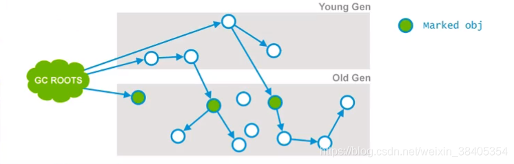
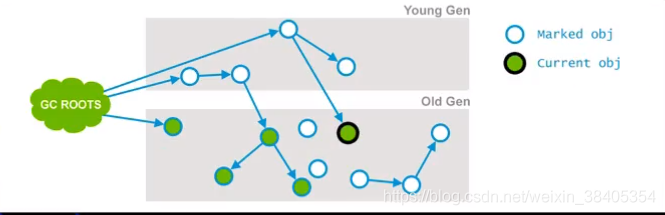
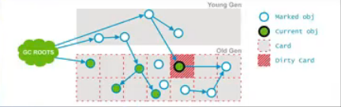
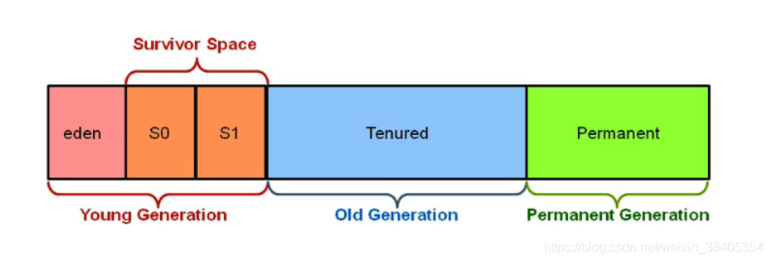
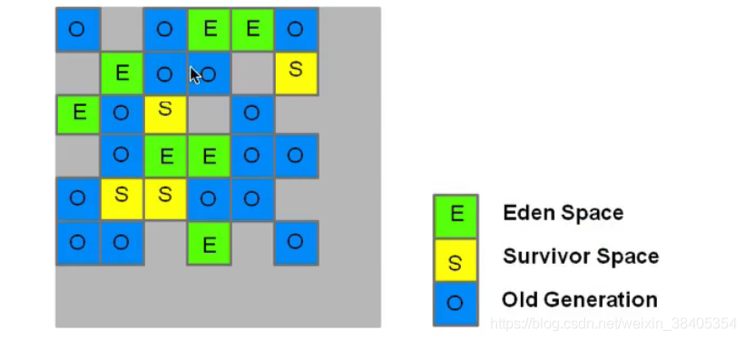
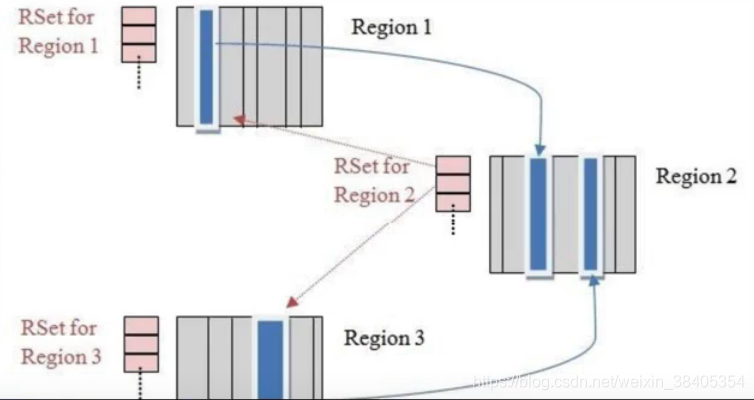
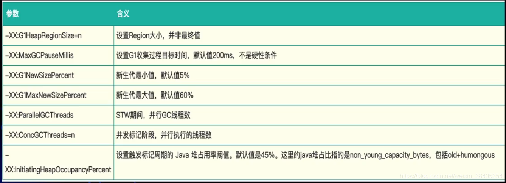

# 1 垃圾判断的算法

- 引用计数算法（Reference Counting）
- 根搜索算法（Root Tracing）

## 1.1 引用计数算法（Reference Counting）

**定义：**给**对象**添加一个引用计算器，当有一个地方引用它，计算器就加1，当引用失效，计数器减1，任何时刻计数器为0的对象就是不可能再被使用的；

注： 引用计数算法无法解决对象循环引用的问题。当出现，A对象引用B对象，B对象引用A对象，当外界对A和B的引用消失时，A和B的对象是无法通过引用计数算法实现回收的。

## 1.2 根搜索算法（Root Tracing）

- 在实际的生产语言中（Java、C++等），都是使用根搜索算法判定对象是否存活；
- 算法基本思路就是通过一系列的成为“GC Roots”的点作为起始进行向下搜索，当一个对象到GC Roots没有任何引用链（Reference Chain）相连，则证明此对象是不可用的。
- 在Java语言中，GC Roots包括：
  - 在VM栈（帧中的本地变量）中的引用；
  - 方法区中的静态引用
  - JNI（即一般说的Native方法）中的引用

# 2 方法区的垃圾回收

- Java虚拟机规范表示不要求虚拟机在方法区实现GC，这区GC的“性价比”一般比较低；
- 在堆中，尤其是新生代，常规应用进行一次GC一般可以回收70%-95%的空间，而方法区的GC效率远小于此；
- 当前的商业JVM都有实现方法区的GC，主要回收两部分内容：**废弃常量与无用类。**
- 类回收需要满足3个条件：
  1. 该类所有的实例都已经被GC，也就是JVM中不存在该Class的任何实例；
  2. 加载该类的ClassLoader（类加载器是实例对象，存在于堆空间中）已经被GC；
  3. 该类对应的java.lang.Class对象没有在任何地方被应用，如不能再任何地方通过反射访问该类的方法。
- 在大量使用反射、动态代理、CGLIB等字节码框架、动态生成JSP以及OSGI这类频繁自定义ClassLoader的场景都需要JVM具备类卸载的支持以保证方法区不会溢出。

# 3 JVM常见GC算法

1. 标记-清除算法（Mark-Sweep）
2. 标记-整理算法（Mark-Compact）
3. 复制算法（Copying）
4. 分代算法（Generational）

## 3.1 标记-清除算法（Mark-Sweep）

- 算法分为**“标记”**和**“清除”**两个阶段，首先标记出所有需要回收的对象，然后回收所有需要回收的对象。
- 缺点：
  - 效率问题：标记和清理两个过程效率都不高，需要**扫描所有对象**
  - 空间问题：标记清理之后会产生大量不连续的内存碎片，空间碎片太多可能会导致后续使用中无法找到足够的内存而提前出发另一次垃圾搜集动作。


根据根搜索算法，不能搜索到的对象实例打上**标记**（红色），然后要被回收、

## 3.2 复制算法（Copying）

- 将可用内存划分为**两块**，每次只使用其中的一块，当半区内存用完了，仅将还**存活**的对象复制到另外一块上面，然后就把原来整块内存空间一次性清理掉。
- 这样使得每次内存回收都是对整个半区的回收，内存分配时也就不用考虑内存碎片等复杂情况，只要移动堆顶指针，按顺序分配内存就可以了，实现简单，运行高效。
- 只是这种算法的代价是将内存缩小为原来的一半，**代价高昂**。
- 现在的商业虚拟机中都是用了这一种收集算法来回收**新生代**。
- 将内存分为一块较大的eden空间和2块较少的survivor空间，每次使用eden和其中一块survivor，当回收时将eden和survivor还存活的对象一次性拷贝到另外一块survivor空间上，然后清理掉eden和用过的survivor。
- Oracle Hotspot虚拟机默认eden和survivor的大小比例是8：1，也就是每次只有10%的内存是浪费的。
- 复制收集算法在对象存活率高的时候，效率有所下降。
- 如果不想浪费50%的空间，就需要有额外的空间进行分配担保用于应付半区内存中所有对象都100%存活的极端情况，所以在老年代一般不能选用这种算法。


​		首先堆栈中引用了A,B。（以A举例，仍然用的是根搜索算法），将A复制到ToSpace, A引用了C， 所以将C复制到To-Space，以此类推。

**特点：**

1. 只需要扫描存活的对象，效率更高；
2. 不会产生碎片；
3. 需要浪费额外的内存作为复制区；
4. 复制算法非常适合生命周期比较短的对象，因为每次GC总能回收大部分的对象，复制的开销比较小；
5. 根据IBM的专门研究，98%的Java对象只会存活1个GC周期，对这些对象很适合用复制算法。而且不用1:1的划分工作区和复制区的空间。

## 3.3 标记-整理算法（Mark-Compact）

- 标记过程仍然一样，但后续步骤不是进行直接清理，而是令所有存活的对象向一端移动，**然后直接清理掉边界以外的内存。**

- 特点：
  - 没有内存碎片；
  - 比Mark-Sweep标记清除算法耗费更多的时间进行compact（压缩）

## 3.4  分代收集算法（Generational Collecting）

- 当前商业虚拟机的垃圾收集都是采用“分代收集”算法，根据对象不同的存活周期将内存划分为几块；
- 一般是把Java堆分作**新生代**和**老年代**，**这样就可以根据各个年代的特点采用最适合的收集算法**，比如新生代每次GC都有大批对象死去，只有少量存活，那就选用复制算法只需要付出少量存活对象的复制成本就可以完成收集。
- 
- Hotspot JVM6中共划分为三个代：年轻代（Young Generation
  ）、老年代（Old Generation）和永久代（Permanent Generation）( 现在版本已经没有老年代了) 

### 3.4.1 **年轻代（Young Generation）**

- 新生成的对象都放在新生代。年轻代用复制算法进行GC（理论上，年轻代对象的生命周期非常短，所以适合**复制算法**）；
- 年轻代分三个区。一个Eden区，两个Survivor区（可以通过参数设置Survivor个数）。对象在Eden区中生成。当Eden区满时，还存活的对象将复制到一个Survivor区，当这个Survivor区满时，此区的存活对象将被复制到另外一个Survivor区，当第二个Survivor区也满的时候，**从第一个Survivor区复制过来的并且此时还存活的对象，将被复制到老年代**。2个Survivor时完全对称，轮流替换。
- Eden和2个Survivor的缺省比例是8:1:1，也就是10%的空间会被浪费。可以根据GC log的信息调整大小的比例。

### 3.4.2 **老年代 （Old Generation）**

- 存放了经过一次或多次GC还存活的对象；
- 一般采用Mark-Sweep或Mark-Compact算法进行GC
- 有多种垃圾收集器可以选择。每种垃圾收集器可以看作一个GC算法的具体实现。可以根据具体应用的需求选用合适的垃圾收集器（追求吞吐量？追求最短的响应时间）

### 3.4.3  ~~永久代 **（Permanent Generation）**~~

- 并不属于堆，但是GC也会涉及到这个区域
- 存放了每个Class的结构信息，包括常量池、字段描述、方法描述。与垃圾收集要收集的Java对象关系不大。

# 4 内存结构


注意：在Hotspot 中，本地方法栈和JVM方法栈是同一个，因此也可以用-**Xss**控制

## 4.1 内存分配

1、堆上分配

- 大多数情况在Eden上分配，偶尔会直接在old上分配，细节决定于GC的实现

2、栈上分配

- 原子类型的局部变量

## 4.2 内存回收

1、 GC要做的是将那些dead的对象所占用的内存回收掉

- Hotspot认为没有引用的对象是dead的；

- Hotspot将引用分为四种：Strong（强引用）、Soft（软引用）、Weak（弱引用）、Phantom（虚引用）

  - -Strong即默认通过Object o=new Object()这种方法赋值的引用

  - -Soft、Weak、Phantom这三种则都是继承Reference

- 在Full GC时会对Reference类型的引用进行特殊处理

  - -Soft：内存不够时一定会被GC、长期不用也会被GC

  - -Weak：一定会被GC，当被mark为dead，会在ReferenceQueue中通知

  - -Phantom：本来就没引用，当从jvm heap中释放时会通知
    [详情点击](https://my.oschina.net/u/946498/blog/2963053)

## 4.3 GC的时机

- 在分代模型的基础上，GC从时机上分为两种：Scavenge GC和Full GC

### 4.3.1 Scavenge GC (Minor GC)

- 触发时机：新对象生成时，Eden空间满了
- 理论上Eden区大多数对象会在Scavenge GC回收，复制算法的执行效率会很高，Scavenge GC时间比较短。

### 4.3.2 Full GC

- 对整个JVM进行整理，包括Young、Old和Perm
- 主要的出发时机：1） Old满了；2）Perm满了；3）system.gc()
- 效率很低，尽量减少Full GC。

### 4.3.3 垃圾回收器（Garbage Collector）

- 分代模型：GC的宏观愿景；
- 垃圾收集器：GC的具体实现；
- Hotspot JVM提供多种垃圾回收器，我们需要根据具体应用的需要采用不同的回收器；
- 没有万能的垃圾回收器，每种垃圾回收器都有自己的适用场景。


### 4.3.4 垃圾收集器的“并行”和“并发”

- 并行（Parallel）：指多个收集器的线程同时工作，但是**用户线程处于等待状态；**
- 并发（Concurrent）：指收集器在工作的同时，可以允许用户线程工作。
  并发不代表解决了GC停顿的问题，在部分步骤还是要停顿。比如在**收集器标记垃圾的时候**。但在清除垃圾的时候，用户线程可以和GC线程并发执行。

### 4.3.5 Serial收集器

单线程收集器，收集时会暂停所有工作线程（Stop The World， STW），使用复制收集算法，虚拟机运行在Client模式时的默认新生代收集器。

- 最早的收集器，单线程进行GC；
- New和Old Generation都可以使用；
- 在新生代，采用复制算法；在老年代，采用Mark-Compact算法；
- 因为是单线程GC，没有多线程切换的额外开销，简单使用；
- Hotspot Client模型缺省的收集器

### 4.3.6 ParNew收集器

​		ParNew收集器就是Serial的多线程版本，除了使用多个收集线程外，其余行为包括算法、STW、对象分配规则、回收策略等都与Serial收集器一模一样。对应的这种收集器是虚拟机运行在Server模型的默认新生代收集器，在单CPU的环境中，ParNew收集器并不会比Serial收集器有更好的效果。

- Serial收集器在新生代的多线程版本；
- 使用复制算法（因为针对新生代）；
- 只有在多CPU的环境下，效率才会比Serial收集器高；
- 可以通过-XX:ParallelGCThreads来控制GC线程数的多少。需要结合具体的CPU个数；
- Server模式下新生代的缺省收集器。

### 4.3.7 Parallel Scavenge收集器

​		Parallel Scavenge收集器也是一个多线程收集器，也是使用复制算法，但它的对象分配规则和回收策略都与ParNew收集器有所不同，它是以吞吐量最大化（即GC时间占总运行时间最小）为目标的收集器实现，它允许较长时间的STW换取总吞吐量最大化。

### 4.3.8 Serial Old收集器

​		Serial Old收集器是单线程收集器，使用标记-整理算法，是老年代的收集器。

### 4.3.9 Parallel Old收集器

​		Serial Old收集器是老年代版本的吞吐量优先收集器，使用多线程和标记-整理算法，JVM1.6提供，再此之前，新生代使用PS收集器的话，老年代除Serial Old外别无选择，因为PS无法与CMS收集器配合工作。

- Parallel Scavenge在老年代的实现；
- 在JVM 1.6才出现Parallel Old；
- 采用多线程，Mark-Compact算法；
- 更注重吞吐量；
- Parallel Scabenge + Parallel Old = 高吞吐量，但GC停顿可能不理想。

### 4.3.10 CMS(Concurrent Mark Sweep)收集器

​		CMS收集器是一种以**最短停顿时间**为目标的收集器，使用CMS并不能达到GC效率最高（总体GC时间最小），但它能尽可能降低GC时服务的停顿时间，CMS收集器使用的是标记-清除算法。

- 追求最短停顿时间，非常适合WEB应用；
- 只针对老年区，一般结合ParNew使用；
- Concurrent，GC线程和用户线程并发工作（尽量并发）；
- Mark-Sweep
- 只有在多CPU环境下才有意义；
- 使用-XX:+UseConcMarkSweepGC打开。

# 5 内存泄漏的经典原因

- 对象定义在错误的范围（Wrong Scope）
- 异常（Exception）处理不当
- 集合数据管理不当

## 5.1 对象定义在错误的范围（Wrong Scope）

如果Foo实例对象的声明较长，会导致临时性内存泄漏。（这里的names变量其实只有临时作用）

```java
class Foo{
    private String[] names;
    public void doIt(int length){
        if(names==null||names.length<length)
            names=new Sting[length];
        populate(names);
        print(names);
    }
}
```

JVM喜欢声明周期短的对象，这样做已经足够高效

```java
class Fol{
    public void doIt(int length){
        private String[] names=new Sting[length];
        populate(names);
        print(names);
    }
}
```

## 5.2 异常（Exception）处理不当

```java
Connection conn=DriverManager.getConnection(url,name,password);

try{
    String sql="do a query sql";
    PreparedStatement stmt=conn.prepareStatement(sql);
    ResultSet rs=stmt.executeQuery();
    while(rs.next()){
        doSomeStuff();
    }
    rs.close();
    conn.close();
}catch(Exception e){
    //如果doSomeStuff()抛出异常，rs.close();和conn.close();不会被调用，会导致内存泄漏和db连接泄漏。
    //正确的做法应该是把关闭操作放到finally块中。
}
```

## 5.3 集合数据管理不当

- 当使用Array-based的数据结构时（ArrayList、HashMap等）时，尽量减少resize比如new ArrayList时，尽量估算size，在创建的时候把size确定；减少resize可以避免没有必要的array copying，gc碎片等问题
- 如果一个List只需要顺序访问，不需要随机访问（Random Access），用LinkedList代替ArrayList
  LinkedList本质是链表，不需要resize，但只适用于顺序访问。

# 6 垃圾回收日志与算法

```java
/*
 * JVM参数：
 * -verbose:gc 输出垃圾回收详情
 * -Xms20M jvm启动时堆容量的大小，初始大小
 * -Xmx20M jvm堆最大值
 * -Xmn10M 堆空间中新生代的大小
 * -XX:+PrintGCDetails 打印垃圾回收的日志
 * -XX:SurvivorRatio=8 Eden空间和Survivor空间比例是81，即Eden:From:To=8:1:1
 *
 * PSYoungGen: Parallel Scavenge （新生代垃圾收集器）
 * ParOldGen: Parallel Old （老年代垃圾收集器）
 */
public class MyTest5 {
	public static void main(String[] args) {
		int size=1024*1024;
		byte[] myAllocl1=new byte[2*size];
		byte[] myAllocl2=new byte[2*size];
		byte[] myAllocl3=new byte[3*size];
		byte[] myAllocl4=new byte[3*size];
		System.out.println("hello world");
	}
}


[GC (Allocation Failure) [PSYoungGen: 6275K->728K(9216K)] 6275K->4832K(19456K), 0.0040179 secs] [Times: user=0.00 sys=0.00, real=0.00 secs] 
// 6275-728=5547K //执行完GC,新生代释放的空间容量
// 6275-4832=1143K// 执行完GV，总的堆空间释放的容量
// 5547-1143=4104 //新生代晋升到老年代对象所占的空间
hello world
Heap
    // 虽然设置的新生代的容量为10m，但是，eden与suvior比例为8：1：1 有一个 suvior区中是不会使用的，所以，实际新生代的空间为 10m * (8 + 1)/(8 + 1 +1) = 9m
 PSYoungGen      total 9216K, used 5145K [0x00000000ff600000, 0x0000000100000000, 0x0000000100000000)
  eden space 8192K, 53% used [0x00000000ff600000,0x00000000ffa50660,0x00000000ffe00000)
  from space 1024K, 71% used [0x00000000ffe00000,0x00000000ffeb6030,0x00000000fff00000)
  to   space 1024K, 0% used [0x00000000fff00000,0x00000000fff00000,0x0000000100000000)
 
 ParOldGen       total 10240K, used 4104K [0x00000000fec00000, 0x00000000ff600000, 0x00000000ff600000)
  object space 10240K, 40% used [0x00000000fec00000,0x00000000ff002020,0x00000000ff600000)
 Metaspace       used 3238K, capacity 4496K, committed 4864K, reserved 1056768K
  class space    used 350K, capacity 388K, committed 512K, reserved 1048576K
```

当把2 * 2 * 2 * 2 ，改成2 * 2 * 3 * 3，Full GC 没了！
原因是：当新生代已经无法容纳下新创建的对象的话，新对象将直接在老年代创建。当创建第一个3M的时候，新生代无法容纳，直接在老年代创建，而第二个3M创建的时候，程序已经发生了GC，容量又足够使用。

# 7 阈值和垃圾回收器类型对对象分配的影响

```java
/*
 * JVM参数：
 * -verbose:gc 输出垃圾回收详情
 * -Xms20M <u>jvm</u>启时堆容量的大小，初始大小
 * -Xmx20M <u>jvm</u>堆最大值
 * -Xmn10m 堆空间中新生代的大小
 * -XX:+PrintGCDetails 打印垃圾回收的日志
 * -XX:SurvivorRatio=8 Eden空间和Survivor空间比例是8:1，即Eden:From:To=8:1:1
 * -XX:PretenureSizeThreshold=4194304    设置对象超过多大时，则直接在老年代创建
 * -XX:+UseSerialGC   使用串行收集器 （PretenureSizeThreshold必须结合这个参数一起使用）
 */

public class Test2 {
       public static void main(String[] args) {
             int size=1024*1024;
             byte[] myAlloc=new byte[5*size];
       }
}

运行结果：
Heap
 def new generation   total 9216K, used 1311K 。。。
  eden space 8192K,  16% used [。。。
  from space 1024K,   0% used [。。。
  to   space 1024K,   0% used [。。。
 tenured generation   total 10240K, used 5120K [。。。  //此处可以发现，5M的对象直接进入老年代
   the space 10240K,  50% used [。。。
 Metaspace       used 2779K, capacity 4486K, committed 4864K, reserved 1056768K
  class space    used 293K, capacity 386K, committed 512K, reserved 1048576K
```

**经过多轮Minor GC无法进行回收的对象，就会晋升到老年代。**

```java
/*
* * -verbose:gc -Xms20M -Xmx20M -Xmn10m -XX:+PrintGCDetails -XX:+SurvivorRatio=8 
* -XX:+PrintCommandLineFlags ： 打印命令行的标志，打印JVM的启动参数
* -XX:MaxTenuringThreshold =5： 可以自动调节对象晋升（Promote）到老年代的阈值，设置该阈值的最大值。（理论上的最大值，默认值为15，CMS的默认值是6，G1默认值为15，在JVM中，该数值是由4bit来表示的，所以最大值为1111）
* -XX:+PrintTenuringDistribution ： 打印出GC过程中对象信息。

经历过多次GC以后，存活的对象会在From Survivor和To Survivor之间来回存放，而这里面的前提是这两个空间有足够的大小来存放这些数据。在GC算法中，会计算每个对象年龄的大小，如果达到某个年龄后发现总大小已经大于了Survivor总空间的50%，那么这时候就需要调整阈值，让存活的对象尽快完成晋升。不能再继续等到默认的15此GC后才完成晋升，因为这样会导致Survivor空间不足。
*/
public class Test3 {
       public static void main(String[] args) {
              int size=1024*1024;
             byte[] myAllocl1=new byte[2*size];
             byte[] myAllocl2=new byte[2*size];
             byte[] myAllocl3=new byte[2*size];
             byte[] myAllocl4=new byte[2*size];
             System.out.println("hello world");
       }
}


运行结果：
-XX:InitialHeapSize=20971520 -XX:InitialTenuringThreshold=5 
-XX:MaxHeapSize=20971520 -XX:MaxNewSize=10485760 -XX:MaxTenuringThreshold=5 
-XX:NewSize=10485760 -XX:+PrintCommandLineFlags -XX:+PrintGC -XX:+PrintGCDetails 
-XX:+PrintTenuringDistribution -XX:SurvivorRatio=8 
-XX:+UseCompressedClassPointers -XX:+UseCompressedOops 
-XX:-UseLargePagesIndividualAllocation -XX:+UseParallelGC 

[GC (Allocation Failure) 
Desired survivor size 1048576 bytes, new threshold 5 (max 5)
[PSYoungGen: 7291K->776K(9216K)] 7291K->6928K(19456K), 0.0028395 secs] [Times: 
[Full GC (Ergonomics) [PSYoungGen: 776K->0K(9216K)] [ParOldGen: 
6152K->6682K(10240K)] 6928K->6682K(19456K), [Metaspace: 2773K->2773K(1056768K)], 

hello world

Heap
 PSYoungGen      total 9216K, used 2288K 。。。
  eden space 8192K, 27% used 。。。
  from space 1024K, 0% used 。。。
  to   space 1024K, 0% used 。。。
 ParOldGen       total 10240K, used 6682K [
  object space 10240K, 65% used 。。。
 Metaspace       used 2781K, capacity 4486K, committed 4864K, reserved 1056768K
  class space    used 293K, capacity 386K, committed 512K, reserved 1048576K
```

```java
  /*   -verbose:gc
       -Xmx200M
       -Xmn50m
       -XX:+PrintGCDetails
       -XX:+PrintCommandLineFlags
       -XX:MaxTenuringThreshold=3
       -XX:+PrintTenuringDistribution
       -XX:TargetSurvivorRatio=60   : 当某个Survivor的空间已经被占用60%，则重新计算对象晋升的阈值TenuringThreshold
       -XX:+PrintGCDateStamps           ：以时间戳的格式打印GC信息
       -XX:+UseConcMarkSweepGC    :使用并发的标记清除CMS，进行老年代的垃圾回收
       -XX:+UseParNewGC    ：使用ParNew进行新生代的垃圾回收*/
```

# 8 CMS Concurrent Mark Sweep）并发标记清除

## 8.1 概念

- 枚举根节点
  - 当执行系统停顿下来后，并不需要一个不漏地检查完所有执行上下文和全局的引用位置，虚拟机应当是有办法直接得知哪些地方存放着对象引用。在HotSpot的实现中，是使用一组称为OopMap的数据结构来达到这个目的。
- 安全点
  - 在OopMap的协助下，HotSpot可以快速且准确地完成GC Roots枚举，但一个很现实的问题随之而来：可能导致引用关系变化，或者说OopMap内容变化的指令非常多，如果为每一条指令都生成对应的OopMap，那将会需要大量的额外空间，这样GC的空间成本将会变得更高。
  - 实际上，HotSpot并没有为每条指令都生成OopMap，而只是在“特定的位置”记录了这些信息，这些位置称为**安全点**（Safepoint），**即程序执行时并非在所有地方都能停顿下来开始GC，只有在达到安全点才能暂停。**
  - Safepoint的选定既不能太少以至于让GC等待时间太长，也不能过于频繁以至于过分增大运行时的负载。所以，安全点的选定基本上是“是否具有让程序长时间执行的特征”为标准进行选定的----因为每条指令执行的时间非常短暂，程序不太可能因为指令流长度太长这个原因而过长时间运行，“长时间执行”的最明显的特征就是指令序列服用，例如方法调用、循环跳转、异常跳转等，所以具有这些功能的指令才会产生Safepoint。
  - 对于Safepoint，另一个需要考虑的问题是如何在GC发生时让所有线程（这里不包括执行JNI调用的线程）都“跑”到最近的安全点上再停顿下来：**抢占式中断**（Preemptive Suspension）和**主动式中断（Voluntary Suspension）**抢占式中断：它不需要线程的执行代码主动去配合，在GC发生时，首先把所有线程全部中断，如果有线程中断的地方不在安全点，就恢复线程，让它“跑”到安全点上。
    主动式中断：当GC需要中断线程时，不直接对线程操作，仅仅简单地设置一个标志，各个线程执行时主动去轮询这个标志，发生中断标志位真时就自己中断挂起。轮询标志的地方和安全点时重合的，另外再加上创建对象需要分配内存的地方。
  - 现在几乎没有虚拟机采用抢占式中断来暂停线程从而相应GC事件。
- 安全区
  - 使用Safepoint似乎已经完美地解决了如何进入GC的问题，但实际上情况却并不一定。Safepoint机制保证了程序执行时，在不太长的时间内就会遇到可进入GC的Safepoint。但如果程序在“不执行”的时候呢？所谓的程序不执行就是没有分配CPU时间，典型的例子就是出于Sleep状态或者Blocked状态，这时候线程无法响应JVM的中断请求，JVM也显然不太可能等待线程重新分配CPU时间。对于这种情况，就需要安全区域（Safe Regin）来解决了。
  - 在线程执行到Safe Region中的代码时，首先标识自己已经进入了Safe Region。那样，在这段时间里JVM要发起GC时，就不用管标识自己为Safe Region状态的线程了。在线程要离开Safe Region时，它要检查系统是否完成了根节点枚举（或者是整个GC过程），如果完成了，那线程就继续执行，否则它就必须等待直到收到可以离开Safe Region的信号为止。

## 8.2 CMS

- CMS（Concurrent Mark Sweep）收集器，以获取最短回收停顿时间为目标，多数应用于互联网站或者B/S系统的服务器端上。

- MS是基于“标记-清除”算法实现的，整个过程大致分为4个步骤：
  · 初始标记 （CMS initial mark）
  · 并发标记 （CMS concurrent mark）
  · 重新标记 （CMS remark）
  · 并发清除 （CMS concurrent sweep）
  并发指的是GC线程和用户线程可以同时运行。
  - 其中，**初始标记和重新标**记这两个步骤仍然需要**“Stop The World”**；
  - 初始标记只是标记一下GC Roots能直接关联的对象，速度很快；
  - 并发标记阶段就是进行GC Roots Tracing的过程；
  - 重新标记阶段则是为了修正并发标记期间因用户程序继续运作而导致标记产生变动的那一部分对象的标记记录，这个阶段的停顿时间一般会比初始标记阶段稍长一些，但远比并发标记的时间短。
- 优点
  并发收集、低停顿，Oracle公司的一些官方文档中也称之为并发低停顿收集器（Concurrent Low Pause Collector）
- 缺点 CMS收集器堆CPU的资源非常敏感；
  · CMS收集器无法处理**浮动垃圾**（Floating Garbage），可能出现“Concurrent Mode Failure”失败而导致另一次Full GC的产生。如果在应用中老年代增长不是太快，可以适当调高参数-XX:CMSInitiatingOccupancyFraction的值来提高触发百分比，以便降低内存回收次数从而获取更好的性能。要是CMS运行期间预留的内存无法满足程序需要时，虚拟机将启动后备预案：临时启用**Serial Old**收集器来重新进行老年代的垃圾收集，这样停顿时间就长了。所以说参数-XX:CMSInitiatingOccupancyFraction设置太高很容易导致大量“Concurrent Mode Failure”失败，性能反而降低。
  · 收集结束时会有大量空间碎片产生，空间碎片过多时，将会给大对象分配带来很大麻烦，往往出现老年代还有很大的空间剩余，但是无法找到足够大的连续空间来分配当前对象，不得不提前进行一次Full GC。CMS收集器提供了一个-XX:UseCMSCompactAtFullCollection开关参数（默认就是开启的），用于在CMS收集器顶不住要进行Full GC时开启内存碎片的合并整理过程，内存整理过程是无法并发的，空间碎片问题没有了，但是停顿时间不得不变长。
  **浮动垃圾**：由于垃圾回收和用户线程是同时进行的，在进行标记或者清除的同时，用户的线程还会去改变对象的引用，使得原来某些对象不是垃圾，但是当CMS进行清理的时候变成了垃圾，CMS收集器无法收集，只能等到下一次GC。
- **空间分配担保**
  在发生Minitor GC之前，虚拟机会先检查老年代最大可用的连续空间是否大于新生代所有对象总空间，如果这个条件成立，那么Minitor GC可以确保是安全的。当大量对象在Minitor GC后仍然存活，就需要老年代进行空间分配担保，把Survivor无法容纳的对象直接进入老年代。如果老年代判断到剩余空间不足（根据以往每一次回收晋升到老年代对象容量的平均值为经验值），则进行一次Full GC。

## 8.3 **CMS收集器收集完整详细步骤：**

1. Initial Mark
2. Concurrent Mark
3. Concurrent Preclean —并发预先清理
4. Concurrent Abortable Preclean —并发可失败的预先清理
5. Final Remark --最终重新标记
6. Concurrent Sweep —并发清理
7. Concurrent Reset —并发重置

### 8.3.1 **Initial Mark**

这个是CMS两次stop-the-world事件的其中一次，这个阶段的目标是：标记那些**直接被GC root引用**或者被**年轻代存活对象所引用的所有对象**。（标记的是老年代的对象，CMS是老年代的垃圾收集器）



### **8.3.2. Concurrent Mark**

这个阶段Garbage Collector会遍历老年代，然后标记所有存活的对象，它会根据上个阶段找到的GC Roots遍历查找。并发标记阶段，它会与用户的应用程序并发运行。并不是所有的老年代存活对象都会被标记，因为在标记期间用户的程序可能会改变一些引用；




### 8.3.3 **Concurrent Preclean**

这也是一个并发阶段，与应用的线程并发运行，并不会stop应用的线程。在并发运行的过程中，**一些对象的引用可能会发生变化**，但是这种情况发生时，JVM会将包含这个对象的区域（Card）标记为Dirty，这也就是Card Marking。

在pre-clean阶段，那些能够从Dirty对象到达的对象也会被标记，这个标记做完以后，**dirty card**标记就会被清除了。




### 8.3.4 **Concurrent Abortable Preclean**

​		并发阶段，这个阶段是为了承担STW（stop-the-world）中最终标记阶段的工作。这个阶段持续时间依赖于很多的因素，由于这个阶段在重复做很多相同的工作，直接满足一些条件（比如：重复迭代的次数、完成的工作量或者时钟时间等）

### 8.3.5 **Final Remark**

​		这是第二个STW阶段，也是CMS中的最后一个，这个阶段的目标是标记老年代所有的存活对象，由于之前的阶段是并发执行的，gc线程可能跟不上应用程序的变化，为了完成标记老年代所有存活对象的目标，STW就非常有必要的了。

​		通常CMS的Final Remark阶段会在年轻代干净的时候运行，目的就是为了减少连续STW发生的可能性（年轻代存活对象过多的话，也会导致老年代涉及的存活对象会很多）。这个阶段会比前面的几个阶段更复杂一些。

### 8.3.6 Concurrent Sweep

​		经历过前5个阶段之后，老年代所有存活对象都被标记过了，现在可以通过清除算法去清理那些老年代不再使用的对象。这里不需要STW，它是与用户的程序并发运行，清除那些不再使用的对象，回收它们的占用空间为将来使用。

### 8.3.7 **Concurrent Reset**

这个阶段也是并发的，它会重设CMS内部的数据结构，为下次的GC做准备。

### 8.3.8 测试总结

​	CMS通过将大量的工作分散到并发处理阶段来减少STW时间，在这块做得非常优秀，但是CMS也有一些其他的问题。

# 9 G1垃圾收集器 （Garbage First Collector）

**吞吐量**

- 吞吐量关注的是，在一个指定的时间内，最大化一个应用的工作量。

- 如下方式来衡量一个系统吞吐量的好坏：
  · 在一个小时内同一个事务（或者任务、请求）完成的次数（tps）
  · 数据库一个小时可以完成多少次查询

- 对于关注吞吐量的系统，卡顿是可以接受的，因为这个系统关注长时间的大量任务的执行能力，单次快速的响应并不值得考虑。

**响应能力**

- 响应能力指一个程序或者系统对请求是否能够及时响应，比如：
  · 一个桌面UI能多快地响应一个事件
  · 一个网站能够多快返回一个页面请求
  · 数据库能够多快返回查询的数据
- 对于这类对响应能力敏感的场景，长时间的停顿是无法接受的。

## 9.1 G1思想

- G1收集器是一个面向服务端的垃圾收集器，适用于多核处理器、大内存容量的服务端系统。
- 它满足短时间gc停顿的同时达到一个较高的吞吐量。（满足了吞吐量和响应能力的要求）
- JDK1.7以上版本适用

## 9.2 **G1收集器的设计目标**

- 与应用线程同时工作，几乎不需要stop the world（与CMS类似）；
- 整理剩余空间，不产生内存碎片（CMS只能在Full GC时，用stop the world整理内存碎片）；
- GC停顿更加可控；
- 不牺牲系统的吞吐量；
- GC不要求额外的内存空间（CMS需要预留空间存储浮动垃圾）；

## 9.3 **G1的设计规划是要替换掉CMS**

- G1在某些方面弥补了CMS的不足，比如：CMS使用的是**mark-sweep**算法，自然会产生内存碎片；然而G1基于copying算法，高效的整理剩余内存，而不需要管理内存碎片。
- 另外，G1提供了更多手段，以达到对gc停顿时间的可控。

## 9.4 **传统垃圾收集器堆机构**



## 9.5 **G1收集器堆结构**



- heap被划分为一个个相等的不连续的内存区域（regions），每个region都有一个分代的角色：eden、survivor、old；
- 对每个角色的数量并没有强制的限定，也就是说对每种分代内存的大小，可以动态变化；
- G1最大的特点就是高效的执行回收，优先去执行那些大量对象可回收的区域（region）；
- G1使用了gc停顿可预测的模型，来满足用户设定的gc停顿时间，根据用户设定的目标时间，G1会自动地选择哪些region要清除，一次清除多少个region；
- G1从多个region中复制存活的对象，然后集中放入一个region种，同时整理、清除内存（copying收集算法）

## 9.6 **G1 vs 其他收集器**

- 对比使用mark-sweep的CMS，G1使用的copying算法不会造成内存碎片；
- 对比Parallel Scavenge（基于copying）、Parallel Old收集器（给予mark-compact-sweep），Parallel会对整个区域做整理导致gc停顿时间会比较长，而G1只是特定地整理几个region；
- G1并非一个实时的收集器，与Parallel Scavenge一样，对gc停顿时间的设置并不会绝对生效，只是G1有较高的几率保证不超过设定的gc停顿时间。与之前的gc收集器对比，G1会根据用户设定的gc停顿时间，智能评估哪几个region需要被回收可以满足用户的设定。

## 9.7 G1重要概念

**分区**： G1采取了不同的策略来解决并行、串行和CMS收集器的碎片、暂停时间不可控等问题----G1将整个堆分成相同大小的分区（Region）

- 每个分区都可能是年轻代也可能是老年代，但是在同一时刻只能属于某个代。年轻代、幸存区、老年代这些概念还存在，成为逻辑上的概念，这样方便复用之前分代框架的逻辑；
- 在物理上不需要联系，则带来额外的好处—有的分区内垃圾对象特别多，有的分区内垃圾对象很少，G1会优先回收垃圾对象特别多的分区，这样可以花费较少的时间来回收这些分区的垃圾，这也就是G1名字的由来，即首先收集垃圾最多的分区。
- 依然是在新生代满了的时候，对整个新生代进行回收—整个新生代中的对象，要么被回收、要么晋升，至于新生代也采取分区机制的原因，则是因为这样跟老年代的策略统一，方便调整代的大小；
- G1还是一种带压缩的收集器，在回收老年代的分区时，是将存活的对象从一个分区拷贝到另外一个可用分区，这个拷贝的过程就实现了局部的压缩。

**收集集合（CSet）**： 一组可被回收的分区的集合。在CSet中存活的数据会在GC过程中被移动到另一个可用分区，CSet中的分区可以来自eden空间、Survivor空间、或者老年代。

**已记忆集合（RSet）**： RSet记录了其他Region中对象引用本Region中对象的关系，属于points-into结构（谁引用了我的对象）。RSet的价值在于使得垃圾收集器不需要扫描整个堆找到谁引用了当前分区中的对象，只扫描RSet即可。
Region1和Region3中的对象都引用了Region2中的对象，因此在Region2的RSet中记录了两个引用。



- G1 GC是在points-out的card table之上再加了一层结构来构成points-into RSet：每个region会记录下到底哪些别的region有指向自己的指针，而这些指针分别在哪些card的范围内。

- 这个RSet其实是一个hash table，key是别的region的起始地址，value是一个集合，里面的元素是card table的index。举例来说，如果region A的RSet里有一项的key是region B，value里有index为1234的card，它的意思就是region B的一个card里有引用指向region A。所以对region A来说，该RSet记录的是points-into的关系；而card table仍然记录了points-out的关系。

- **Snapshot-At-Beginning（STAB）**： STAB是G1 GC在并发标记阶段使用的增量式的标记算法。

  - 并发标记是并发多线程的，但并发线程在同一时刻只扫描一个分区。

- ##### G1官方文档

  - 地址：https://www.oracle.com/technetwork/tutorials/tutorials-1876574.html

## 9.8 **G1 GC模式**

- G1提供了两种GC模式，Young GC和Mixed GC，两种都是完全Stop The World的；
  **Young GC：** 选定所有年轻代里的Region。通过控制年轻代的Region个数，即年轻代内存大小，来控制Young GC的时间开销。
  **Mixed GC：** 选定所有年轻代里的Region，外加根据global concurrent marking统计得出收集效益高的若干老年代Region。在用户指定的开销目标范围内尽可能选择**收益高(垃圾对象较多的)**的老年代Region。
- Mixed GC不是Full GC，它只能回收部分老年代的Region，如果Mixed GC实在无法跟上程序分配内存的速度，导致老年代填满无法继续进行Mixed GC，就会使用Serial Old GC（Full GC）来收集整个GC Heap。所以，本质上G1是不提供Full GC的。当Mixed GC赶不上对象产生的速度的时候就退化成Gull GC，这一点需要重点调优。

### 9.8.1 **global concurrent marking 全局并发标记**

glbbal concurrent marking的执行过程类似于CMS，但是不同的是，在G1 GC中，它主要是为Mixed GC提供标记服务的，并不是一次GC过程的必须环节， global concurrent marking的执行过程分为四个步骤：
**1. 初始标记（initial mark，STW）**：它标记了从GC Root开始直接可达的对象。
**2.并发标记（Concurrent Marking）：** 这个阶段从GC Root开始对heap中的对象进行标记，标记线程与应用程序线程并发执行，并且收集各个Region的存活对象信息。
**3.重新标记（Remark， STW）：** 标记那些在并发标记阶段发生变化的对象，将被回收。
**4.清理（Cleanup）：** 清除空Region（没有存活对象的），加入free list。


- 第一阶段initial mark是共用了Young GC的暂停，这是因为他们可以复用root scan操作，所以可以说global concurrent marking是伴随Young GC而发生的。
- 第四阶段Cleanup只是回收了没有存活对象的Region，所以它并不需要STW。
- 初始标记是在Young上执行的，在进行全局并发标记的时候不会做Mixed GC，在做Mixed GC的时候也不会启动初始标记阶段。

### 9.8.2 **G1在运行过程中的主要模式**

**Young GC** （不同于CMS）、 **并发阶段**、**混合模式**、**Full GC**（一般是G1出现问题时才发生）

- G1 Young GC在Eden充满时触发，在回收之后所有之前属于Eden的区块全部变成空白，**即不属于任何一个分区（Eden、Survivor、Old）；**

- 什么时候触发全局并发标记呢？

- 什么时候触发Mixed GC？

  由一些参数控制，另外也控制着哪些老年代Region会被选入CSet（收集集合）：
  · **G1HeapWastePercent** ：在global concurrent marking结束之后，我们可以知道old gen regions中有多少空间要被回收，在每次Young GC之后和再次发生Mixed GC之前，会检查垃圾占比是否达到此参数，只有达到了，下次才会发生Mixed GC。
  · **G1MixedGCLiveThresholdPercent**：old generation region的存活对象的占比，**只有在此参数之下**，才会被选入CSet。
  · **G1MixedGCCountTarget**：一次global concurrent marking之后，最多执行Mixed GC的次数。
  · **G1OldCSetRegionThresholdPercent**：一次Mixed GC中能被选入CSet的最多old generation region数量。

  