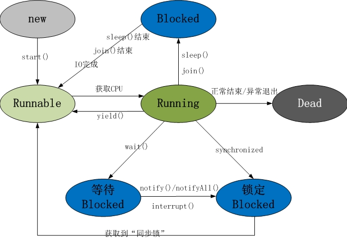
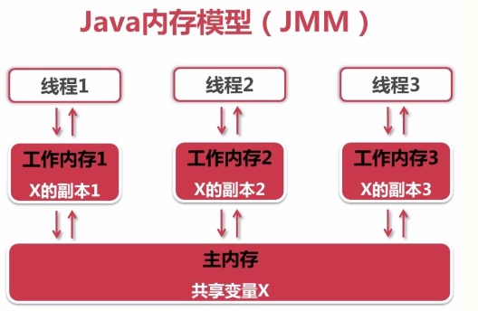
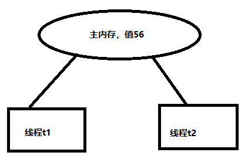
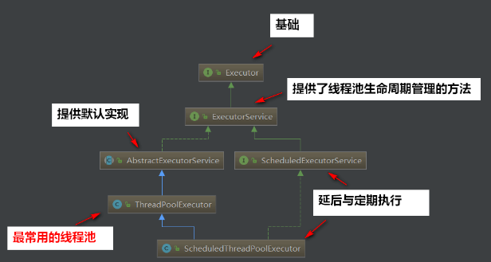
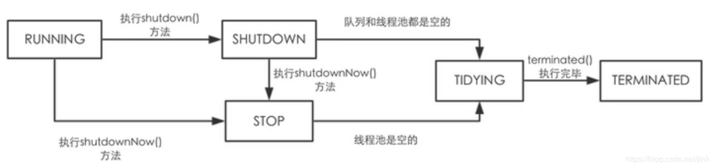

# 1，线程的创建与启动

## 1.1 继承Thread类创建线程类

- 1.定义Thread类的子类，并重写该类的run()方法，该run()方法的方法体就代表了线程需要完成的任务，  因此经常把run（）方法称为线程执行体。

- 2.创建Thread子类的实例，即创建了线程对象

- 3.调用线程对象的start()方法就可以启动该线程

## 1.2 实现Runnable接口创建线程类

- 定义Runnable接口的实现类，并重写该接口的run（）方法，该run（）方法的方法体也称之为线程方法执行体。
- 创建Runnable实现类的实例，并将此实例作为形参传入new Thread（）的构造函数中，就可创建Thread线程对象

## 1.3 使用Callable和Future创建线程

- 创建Callable接口的实现类，重写call()方法，该方法就是线程方法执行体，call()方法有返回值，再创建Callable实现类的实例。

- 使用FutureTask类的实例，来包装Callable对象，即把callable的实例以形参的方式传入new FutureTask()的构造函数中

- 使用FutureTask对象作为Thread对象的target创建启动线程。

- 通过FutureTask实例对象调用get()方法得到子线程的返回值。

```java
public class Demo {
    public static void main(String[] args) {
        //创建Callable对象
        ThirdThreadCallable callable = new  ThirdThreadCallable();
        //创建FutureTask对象，并把callable以形参的方式传入FutureTask的构造方法内
        FutureTask<Integer> futureTask = new FutureTask<>(callable);
        for (int i = 0; i < 30; i++) {
            // 通过Thread类的currentThread方法可以得到当前的线程名
            System.out.println(Thread.currentThread().getName()+" "+i);
            if (i==20) {
                //创建线程并启动
                new Thread(futureTask, "有返回值的线程").start();
            }
        }
        //获取子线程的返回值
        try {
            System.out.println("子线程的返回值： "+futureTask.get());
        } catch (InterruptedException e) {
            // TODO Auto-generated catch block
            e.printStackTrace();
        } catch (ExecutionException e) {
            e.printStackTrace();
        }
    }
}

class ThirdThreadCallable implements Callable<Integer> {
    int i ;
    //call（）方法称之为线程方法执行体，且该方法有返回值，可通过FutureTask实例对象调用get（）方法得到子线程的返回值
    @Override
    public Integer call() throws Exception {
        for (; i <30; i++) {
            System.out.println(Thread.currentThread().getName()+" "+i);
        }
        return i;
    }

}
```

## 1.4 创建线程的三种方式对比

**使用实现Runnable 、Callable接口的方式创建多线程**

优点

- 线程类只是实现了Runnable接口或Callable接口，同时还可以继承其他类。

- 多个线程可以共享一个target对象，非常适合多个相同线程来处理同一份资源的情况，从而可以将CPU、代码、数据分开，形成清晰的模型，较好的体现了面向对象的思想

缺点

- 编程稍微复杂，如果需要访问当前线程，必须使用Thread.currentThread()方法。


**使用继承Thread类的方式创建多线程**

优点：

- 编写简单，如果要访问当前线程，无需使用Thread.currentThread（）方法，可以直接使用this的方式获取当前线程

缺点：

- 因为线程类已经继承了Thread类，所以不能再继承其他的父类。

# 2 线程的生命周期图




**新建状态（New）**

当程序使用new关键字创建了一个线程之后，该线程就处于新建状态。例：

Thread t = new MyThread();

**就绪状态（Runnable）**

调用start()方法后，线程就会处于就绪状态；此时只能说明此线程已经做好了执行的就绪准备，表示可以运行了，但还不是正在运行的线程。

**运行状态（Running）**

当线程获得到JVM中线程调度器的调度时，线程就会处于运行状态，开始执行run()方法的线程执行体。

**阻塞状态（Blocked）**

这是线程仍处于活动状态但当前没有资格运行（因为一些原因，暂时放弃对CPU的使用权，停止执行）时的状态。

**线程进入阻塞的三种状态：**

**1、等待阻塞：**

1）线程调用wait()方法，使本线程进入到等待状态；

2）调用join()方法，使本线程进入到另一种等待状态：等待别线程终止或者超时后才执行自己这个线程。

**2、同步阻塞**

线程在获取synchronized同步锁失败(因为锁被其它线程所占用)，它会进入同步阻塞状态；

**3、其他阻塞**

通过调用线程的sleep()或join()或发出了I/O请求时，线程会进入到阻塞状态。当sleep()状态超时、join()等待线程终止或者超时、或者I/O处理完毕时，线程重新转入就绪状态。

**死亡状态（Dead）**

当退出run（）方法时，线程就会自然死亡，处于终止或死亡状态，也就结束了生命周期。

# 3, 控制线程

## 3.1 join

- 在A线程中调用了B线程的join()方法时，表示只有当B线程执行完毕时，A线程才能继续执行。
- join方法可以传递参数，join(10)表示A线程会等待B线程10毫秒，10毫秒过去后。
- 需要注意的是，jdk规定，join(0)的意思不是A线程等待B线程0秒，而是A线程等待B线程无限时间，直到B线程执行完毕，即join(0)等价于join()。
- join方法必须在线程start方法调用之后调用才有意义。这个也很容易理解：如果一个线程都没有start，那它也就无法同步了。

```java
public class JoinTest {
	public static void main(String[] args) throws InterruptedException {
		ThreadJoinTest t1 = new ThreadJoinTest("小明");
		ThreadJoinTest t2 = new ThreadJoinTest("小东");
		t1.start();
		/**join的意思是使得放弃当前线程的执行，并返回对应的线程，例如下面代码的意思就是：
		 程序在main线程中调用t1线程的join方法，则main线程放弃cpu控制权，并返回t1线程继续执行直到线程t1执行完毕
		 所以结果是t1线程执行完后，才到主线程执行，相当于在main线程中同步t1线程，t1执行完了，main线程才有执行的机会
		 join方法可以传递参数，join(10)表示main线程会等待t1线程10毫秒，10毫秒过去后，
         * main线程和t1线程之间执行顺序由串行执行变为普通的并行执行
		 */
		t1.join();
        //t1.join(10)
		t2.start();
	}
}
class ThreadJoinTest extends Thread {
	public ThreadJoinTest(String name) {
		super(name);
	}

	@Override
	public void run() {
		for (int i = 0; i < 10; i++) {
			System.out.println(this.getName() + ":" + i);
		}
	}
}

```

## 3.2 守护线程setDaemon(true)

​		后台线程，它是在后台运行的，它的任务是为其他线程提供服务，这种线程被称为“后台线程（Daemon Thread）”,又称为“守护线程”或“精灵线程”。JVM的垃圾回收线程就是典型的后台线程。

**后台线程的特征：**如果**所有的前台线程都死亡了，后台线程也会自动死亡。**

调用Thread对象的**setDaemon(true)**可将制定线程设置为后台线程。所有的前台线程都死亡时，后天线程也死亡，程序就退出了。

注意：**设置为后台线程setDaemon(true)，注意必须在start前掉用，否则会报错！**

## 3.3 控制线程睡眠。sleep

注意：**sleep方法只能让当前线程睡眠**。调用某一个线程类的对象t.sleep()，睡眠的不是t，而是当前线程。

1, Thread.sleep();

sleep(long millis) 线程睡眠 millis 毫秒

sleep(long millis, int nanos) 线程睡眠 millis 毫秒 + nanos 纳秒

2, TimeUnit.单位.sleep()

**TimeUnit.SECONDS.sleep(1);**

**TimeUnit.MINUTES.sleep(1);**

**TimeUnit.HOURS.sleep(1);**

**TimeUnit.DAYS.sleep(1);**

## 3.4 改变线程优先级 setPriority()

- 每个线程在执行时都具有一定的优先级，优先级高的线程获得较多的执行机会，而优先级低的线程则获得较少的执行机会。
- 每个线程默认的优先级都与创建它的父线程的优先级相同，在默认情况下，main线程具有普通优先级，由main线程创建的子线程也具有普通优先级。
- **java 中的线程优先级的范围是1～10，1的优先级最低，10的优先级最高。**通过setPriority()方法，可以改变线程的优先级。

## 3.5 线程让步 yield()

Thread中有一个线程让步方法（静态方法）yield()，作用就是让步。它能让当前线程由“运行状态”进入到“就绪状态”，从而让其它具有相同优先级的等待线程获取执行权；但是，并不能保证在当前线程调用yield()之后，其它具有相同优先级的线程就一定能获得执行权；也有可能是当前线程又进入到“运行状态”继续运行！

**在多CPU并行的环境下，yield方法的功能有时候不明显，可能看不到效果。**

# 4， 线程同步

**一、什么情况下会产生线程安全问题？**

同时满足以下两个条件时：

1，多个线程在操作共享的数据。

2，操作共享数据的线程代码有多条。

当一个线程在执行操作共享数据的多条代码过程中，其他线程参与了运算，就会导致线程安全问题的产生。

**线程不安全的例子**

```java
public class TicketDemo implements Runnable {
	private  int tickets = 100; //定义在这个地方的变量是所有线程共享的变量
	@Override
	public void run() {
		while (tickets > 0) {
			try {
				Thread.sleep(10);
			} catch (InterruptedException e) {
			}
			System.out.println(Thread.currentThread().getName() + "....卖出的票号:...." + tickets);
			tickets--;
		}
	}
	public static void main(String[] args) {
		TicketDemo ticketDemo = new TicketDemo();
		Thread t1 = new Thread(ticketDemo);
		Thread t2 = new Thread(ticketDemo);
		Thread t3 = new Thread(ticketDemo);
		Thread t4 = new Thread(ticketDemo);
		t1.start();
		t2.start();
		t3.start();
		t4.start();
	}
}

```

**我们发现可能会有多个线程卖同一张票的情况发生，这就是线程安全问题。**

## 4.1 线程同步概念

**什么是线程同步：**

- 同步就是协同步调，按预定的先后次序进行运行。如：你说完，我再说。这里的同步千万不要理解成那个同时进行，应是指协同、协助、互相配合。
- 线程同步是指多线程通过特定的设置来控制线程之间的执行顺序（即所谓的同步）也可以说是在线程之间通过同步建立起执行顺序的关系，如果没有同步，那线程之间是各自运行各自的！

## 4.2 线程同步的方式

### 4.2.1 **同步代码块** 

即有**synchronized**关键字修饰的语句块。 

被该关键字修饰的语句块会自动被加上内置锁，被保护的语句代码所在的线程要执行，需要获得内置锁，否则就处于阻塞状态。

代码如： 

  synchronized(object){  **同步代码块中的锁对象可以是任意对象**

  }

括号里的这个对象可以是任意对象，这个对象一般称为**同步锁**。

**同步的前提**：同步中必须有多个线程并使用同一个锁。

**同步的好处**：解决了线程的安全问题。

**注：**同步是一种高开销的操作，因此应该尽量减少同步的内容。 

  通常没有必要同步整个方法，使用synchronized代码块同步关键代码即可。

```java
public void run() {
		while (true) {
			synchronized (this){
				if (tickets > 0) {
					try {
						Thread.sleep(10);
					} catch (InterruptedException e) {
					}
					System.out.println(Thread.currentThread().getName() + "....卖出的票号:...." + tickets);
					tickets--;
				}else {
					break;
				}
			}
		}
	}
```

### 4.2.2 synchronized关键字修饰的方法

即有synchronized关键字修饰的方法。

由于java的每个对象都有一个内置锁，当用此关键字修饰方法时，

内置锁会保护整个方法。在调用该方法前，需要获得内置锁，否则就处于阻塞状态。

代码如： 

  public synchronized void save(){}

**注：**

  **对于普通同步方法，锁是当前实例对象。**

  **对于静态同步方法，锁是当前类的Class对象。**

  **对于同步方法块，锁是Synchonized括号里配置的对象。**

### 4.2.3 **使用重入锁实现线程同步**

在JDK1.5中新增了一个java.util.concurrent包来支持同步。 

使用JUC里的Lock与使用synchronized方法和块具有相同的基本行为和语义，并且扩展了其能力

**前面讲了关键字synchronized实现的同步的锁，是隐藏的，所以我们并不明确是在哪里加上了锁，在哪里释放了锁。**

为了更明确的控制从哪里开始锁，在哪里释放锁，JDK1.5提供了Lock。

Lock是一个接口，我们真正用的是它的实现类ReentrantLock。

ReenreantLock类的常用方法有：

ReentrantLock() : 创建一个ReentrantLock实例 

lock() : 获得锁 

unlock() : 释放锁 

**注：**ReentrantLock()还有一个可以创建公平锁的构造方法，但由于能大幅度降低程序运行效率，不推荐使用 

**注：关于Lock对象和synchronized关键字的选择：** 

在性能上来说，如果竞争资源不激烈，两者的性能是差不多的，**而当竞争资源非常激烈时（即有大量线程同时竞争），此时Lock的性能要远远优于synchronized**。所以说，在具体使用时要根据适当情况选择。

```java
public class TicketDemo implements Runnable {
	private int tickets = 100;
	private Lock lock = new ReentrantLock();

	@Override
	public void run() {
		while (true) {
			// 在对共享数据tickets操作之前加锁
			lock.lock();
			try {
				if (tickets > 0) {
					System.out.println(Thread.currentThread().getName() + "正在出票...   " + tickets--);
					try {
						Thread.sleep(10);
					} catch (InterruptedException e) {
						throw new RuntimeException(e);
					}
				} else {
					break;
				}
			} finally {
				// 在finally确保锁得到了释放。
				lock.unlock();
			}
		}
	}
	public static void main(String[] args) {
		TicketDemo ticketDemo = new TicketDemo();
		Thread t1 = new Thread(ticketDemo);
		Thread t2 = new Thread(ticketDemo);
		Thread t3 = new Thread(ticketDemo);
		Thread t4 = new Thread(ticketDemo);
		t1.start();
		t2.start();
		t3.start();
		t4.start();
	}
}

```

### 4.2.4  **使用局部变量实现线程同步** 

如果使用ThreadLocal管理变量，则每一个使用该变量的线程都获得该变量的副本， 

副本之间相互独立，这样每一个线程都可以随意修改自己的变量副本，而不会对其他线程产生影响。

**ThreadLocal 类的常用方法**

  ThreadLocal() : 创建一个线程本地变量 

  get() : 返回此线程局部变量的当前线程副本中的值 

  initialValue() : 返回此线程局部变量的当前线程的"初始值" 

  set(T value) : 将此线程局部变量的当前线程副本中的值设置为value

```java
package org.example;

import java.util.concurrent.locks.Lock;
import java.util.concurrent.locks.ReentrantLock;

/**
 * @author TylerChen
 * @date 2020/9/28 - 23:12
 */
public class TicketDemo  {
	public static void main(String[] args) {
		SychronizedThread5 st = new SychronizedThread5();
		//创建并开启4个线程来卖100张票
		new Thread(st, "线程1").start();
		new Thread(st, "线程2").start();
		new Thread(st, "线程3").start();
		new Thread(st, "线程4").start();
	}
}

class SychronizedThread5 implements Runnable {
	//定义在这里的属性是所有线程共享的变量数据
	private  ThreadLocal<Integer>  ticketNumber = new ThreadLocal<Integer>(){
		@Override
		protected Integer initialValue() {
			return 10;
		}
	};

	@Override
	public void run() {
		//子线程做的任务的卖票
		while (true) {
			if (ticketNumber.get() > 0) {
				try {
					Thread.sleep(100); //起到放大线程安全问题的作用
				} catch (InterruptedException e) {
					e.printStackTrace();
				}
				System.out.println("线程" + Thread.currentThread().getName() + "卖掉第" + ticketNumber.get() + "号票");
				ticketNumber.set(ticketNumber.get()-1);
			} else {
				break;
			}
		}
	}
}

```

 **注：ThreadLocal与其他同步机制** 

1. ThreadLocal与同步机制都是为了解决多线程中相同变量的访问冲突问题。 
2. ThreadLocal并不能代替同步机制，两者面向的问题领域不同。**同步机制是为了同步多个线程对相同资源的并发访问，是多个线程之间进行通信，并且协同的有效方式**；而ThreadLocal是为了隔离多个线程的数据共享，从而避免多个线程之间对共享资源的竞争，也就不需要对多个线程进行同步了。ThreadLocal采用以"空间换时间"的方法，其他同步机制采用以"时间换空间"的方式。
3. **ThreadLocal适用的场景是，多个线程都需要使用一个变量，但这个变量的值不需要在各个线程间共享，各个线程都只使用自己的这个变量的值。这样的场景下，可以使用ThreadLocal。**

### 4.2.5**同步锁的释放问题**

​		前面我们用关键字synchronized构成同步代码块和同步方法，来实现多线程的同步，本质上我们可以理解为底层的程序给线程加了一把我们**看不见的隐藏的锁**，只有获取到这把锁的线程才能被执行，没拿到的线程你就给我等着，从而控制线程的执行顺序，达到同步效果，所以，任何线程进入同步代码块、同步方法之前，必须先获得对于同步监测器的锁定，

​		那么谁释放对同步监测器的锁定呢？
**在Java中，程序无法显式的释放对同步监测器的锁定，释放权在底层的JVM上，JVM会从释放机制中自动的释放，**

**下面看看都是在什么情况下会进行同步监测器锁定的释放呢，如下所示：**

1.  当前线程的同步方法、同步代码块执行结束，当前线程即释放随同步监测器的锁定；
2.  当前线程的同步方法、同步代码块中遇到break、return终止了该代码块、方法的继续执行，当前线程会释放同步监测器的锁定；
3. 当前线程在同步方法、同步代码块中出现了未处理的error或者exception，导致了该代码块、该方法异常结束时，当前线程会释放同步监测器的锁定；
4. 当前线程执行同步代码块或同步方法时，程序调用了同步监测器的wait()方法，当前线程暂停，则当前线程会释放同步监测器的锁定。

**但是在如下情况下，当前线程不会释放对同步监测器的锁定：**

1.  线程执行同步代码块或者同步方法时，程序调用了Thread.sleep()、Thread.yield()方法来暂停当前线程执行，当前线程不会释放对同步监测器的锁定；
2. 线程执行同步代码块时，其他线程调用了该线程的suspend()方法（suspend会阻塞线程直到另一个线程调用resume，这个方法容易死锁，已经不推荐使用了，了解一下就ok）将该线程挂起，也不会释放同步监测器的锁定。

## 4.3 死锁

### 4.3.1 产生死锁的四个必要条件

- 互斥条件（mutual exclusion）：系统中存在临界资源，进程应互斥地使用这些资源；
- 占有和等待条件（hold and wait）：进程请求资源等不到满足而等待时，不释放已占有的资源；
- 不剥夺条件（no preemption）：已被占有的资源只能由属主释放，不允许被其它进程剥夺；
- 循环等待条件（circular wait）：存在循环等待链，其中，每个进程都在链中等待下一个进程所持有的资源，造成这组进程永远等待。

### 4.3.2 **决进程死锁问题**

i.死锁预防

①破坏互斥条件,使资源同时访问,而非互斥访问；

②破坏资源剥夺条件,采用静态分配策略；

③破坏占有和等待条件,采用刹车式调度方法；

④破坏循环等待条件,采用层次分配策略。

ii.死锁避免

  Dijkstra银行家算法,不对进程随意强加规则,而是动态地确定是否分配资源给提出请求的进程。

iii.死锁检测和恢复

  ①进程回退法;②进程撤销法;③资源剥夺法;④系统重启法。


### 4.3.3 案例

**锁顺序死锁**

```java
public class ThreadTest6 {
    public static void main(String[] args) {
        Demo demo = new Demo();
        new Thread(demo,"1").start();
        new Thread(demo,"2").start();
        new Thread(demo,"3").start();
        new Thread(demo,"4").start();
    }
}
class Demo implements Runnable{
    Account a = new Account("A",1000);
    Account b = new Account("B",1000);

    @Override
    public void run() {
        transferMoney(a,b,100);
        transferMoney(b,a,100);
    }

    public void  transferMoney(Account fromAccount, Account toAccount,double money) {
        synchronized (fromAccount) {
            System.out.println("线程" + Thread.currentThread().getName() + "得到锁" + fromAccount.getName());
            synchronized (toAccount) {
                System.out.println("线程" + Thread.currentThread().getName() + "得到锁" + toAccount.getName());
                if(fromAccount.getMoney() < money) {
                    System.out.println("余额不足");
                } else {
                    fromAccount.setMoney(fromAccount.getMoney()-money);
                    toAccount.setMoney(toAccount.getMoney() + money);
                    System.out.println("转账后：" + fromAccount.getName() + "有：" + fromAccount.getMoney());
                    System.out.println("转账后：" + toAccount.getName() + "有：" + toAccount.getMoney());
                }
            }
        }
    }
}
class Account{
    public Account(String name, double money) {
        this.name = name;
        this.money = money;
    }
    private String name;
    private double money;

}
```

### 4.3.4 **避免死锁的方法**

避免死锁可以概括成三种方法：

- **固定加锁的顺序**(针对锁顺序死锁)
- **开放调用**(针对对象之间协作造成的死锁)
- **使用定时锁**-->tryLock()

- - 如果等待获取锁时间超时，则**抛出异常而不是一直等待**


#### **4.3.4.1固定锁顺序避免死锁**

上面transferMoney()发生死锁的原因是因为**加锁顺序**不一致而出现的~

如果所有线程**以固定的顺序来获得锁**，那么程序中就不会出现锁顺序死锁问题！

那么上面的例子我们就可以**改造**成这样子：

```java
public class InduceLockOrder {

    // 额外的锁、避免两个对象hash值相等的情况(即使很少)
    private static final Object tieLock = new Object();

    public void transferMoney(final Account fromAcct,  final Account toAcct, final DollarAmount amount)  throws InsufficientFundsException {
        class Helper {
            public void transfer()  throws InsufficientFundsException {
                if (fromAcct.getBalance().compareTo(amount) < 0)
                    throw new InsufficientFundsException();
                else {
                    fromAcct.debit(amount);
                    toAcct.credit(amount);
                }
            }
        }
        // 得到锁的hash值
        int fromHash = System.identityHashCode(fromAcct);
        int toHash = System.identityHashCode(toAcct);

        // 根据hash值来上锁
        if (fromHash < toHash) {
            synchronized (fromAcct) {
                synchronized (toAcct) {
                    new Helper().transfer();
                }
            }

        } else if (fromHash > toHash) {// 根据hash值来上锁
            synchronized (toAcct) {
                synchronized (fromAcct) {
                    new Helper().transfer();
                }
            }
        } else {// 额外的锁、避免两个对象hash值相等的情况(即使很少)
            synchronized (tieLock) {
                synchronized (fromAcct) {
                    synchronized (toAcct) {
                        new Helper().transfer();
                    }
                }
            }
        }
    }
}
```

#### 4.3.4.2**开放调用避免死锁**

在协作对象之间发生死锁的例子中，主要是因为在**调用某个方法时就需要持有锁**，并且在方法内部也调用了其他带锁的方法！

- **如果在调用某个方法时不需要持有锁，那么这种调用被称为开放调用**！

我们可以这样来改造：

- **同步代码块**最好**仅被用于保护那些涉及共享状态的操作**！

#### 4.3.4.3**使用定时锁**

使用显式Lock锁，在获取锁时使用tryLock()方法。当等待**超过时限**的时候，tryLock()不会一直等待，而是返回错误信息。

使用tryLock()能够有效避免死锁问题~~

tryLock 是防止自锁的一个重要方式。

tryLock()方法是有返回值的，它表示用来尝试获取锁，如果获取成功，则返回true，如果获取失败（即锁已被其他线程获取），则返回false，这个方法无论如何都会立即返回。在拿不到锁时不会一直在那等待。

```java
public class tryLock {
    public static void main(String[] args) {

        System.out.println("开始");
        final Lock lock = new ReentrantLock();
        new Thread() {
            @Override
            public void run() {
                String tName = Thread.currentThread().getName();
                if (lock.tryLock()) {
                    System.out.println(tName + "获取到锁！");
                } else {
                    System.out.println(tName + "获取不到锁！");
                    return;
                }
                try {
                    for (int i = 0; i < 5; i++) {
                        System.out.println(tName + ":" + i);
                    }
                    Thread.sleep(5000);
                } catch (Exception e) {
                    System.out.println(tName + "出错了！！！");
                } finally {
                    System.out.println(tName + "释放锁！！");
                    lock.unlock();
                }

            }
        }.start();

        new Thread() {
            @Override
            public void run() {
                String tName = Thread.currentThread().getName();

                if (lock.tryLock()) {
                    System.out.println(tName + "获取到锁！");
                } else {
                    System.out.println(tName + "获取不到锁！");
                    return;
                }

                try {
                    for (int i = 0; i < 5; i++) {
                        System.out.println(tName + ":" + i);
                    }

                } catch (Exception e) {
                    System.out.println(tName + "出错了！！！");
                } finally {
                    System.out.println(tName + "释放锁！！");
                    lock.unlock();
                }
            }
        }.start();
        System.out.println("结束");
    }
}
```

### 4.3.5 总结

发生死锁的原因主要由于：

- 线程之间交错执行

- - 解决：**以固定的顺序加锁**

- 执行某方法时就需要持有锁，且不释放

- - 解决：**缩减同步代码块范围，最好仅操作共享变量时才加锁**

- 永久等待

- - 解决：使用**tryLock()**定时锁，超过时限则返回错误信息

# 5 volatile关键字与内存可见性

问题例子：**先来一段程序，对比，有volatile和没有volatile的区别：**

```java
public class TestVolatile {
    public static void main(String[] args) {
        ThreadDemo td = new ThreadDemo();
        new Thread(td).start();
        while(true){
            if(td.isFlag()){
                System.out.println("--------主线中的程序读到flag为true了----------");
                break;
            }
//这里不能有语句，有语句循环之间就有间隙
        }
    }
}

class ThreadDemo implements Runnable {
    private boolean flag = false;
    //private volatile boolean flag = false; 加上volatile之后，程序可以正常终止
    @Override
    public void run() {
        try {
            Thread.sleep(200);
        } catch (InterruptedException e) {
        }
        flag = true;
        System.out.println("flag=" + isFlag());
    }
    public boolean isFlag() {
        return flag;
    }
    public void setFlag(boolean flag) {
        this.flag = flag;
    }
}
```

**运行发现程序不会停止：**

即使我们在子线程中将线程的共享变量flag的值修改成了false，

但是主线程在while条件判断的时候读到的flag一直是false，这是什么原因导致的呢？

## 5.1 内存可见性

**内存可见性其实就是共享变量在线程间的可见性**

- **共享变量**：如果一个变量在多个线程的工作内存中都存在**副本**，那么这个变量就是这几个线程的共享变量

- **可见性**：一个线程对共享变量值的修改，能够及时的被其他线程看到

**Java内存模型**

- 所有的变量都存储在主内存中（**操作系统给进程分配的内存空间**）

- **每个线程都有自己独立的工作内存，里面保存该线程使用到的变量的副本**



出问题的程序分析：主内存中存在flag = false，线程td启动后，将flag = false，放到自己的工作内存中，然后睡眠1秒，这期间，（因为要使用）主线程也把flag = false放到自己的工作内存放到自己的工作空间。td线程把flag = true由刷新到主内存中，但是主线程工作空间内的flag还是false。也就是说，td对共享变量的修改对主线程“不可见了”

**特别注意**：

- 线程对共享变量的所有操作都必须在自己的工作内存（working memory,是cache和寄存器的一个抽象，而并不是内存中的某个部分）**不同线程之间，当前线程无法直接访问其他线程的工作内存中的变量，线程间变量值得传递需要通过主内存来完成**

**共享变量可见性的实现原理**

- **把工作内存1中更新过的共享变量刷新到主内存中**

- **将主内存中最新的共享变量的值更新到工作内存2中**

## 5.2 解决内存可见性的方法

### 5.2.1**volatile**

**volatile关键字实现可见性，尤其是在嵌入式开发中，这个关键字在多线程开发不可或缺**

上面代码改写：给flag加上volatile关键字

```java
class ThreadDemo implements Runnable {
 private volatile boolean flag = false;

}
```

使用volatile之后，td将更改刷到主存中后，会告知main线程

### 5.2.2 **synchronized**

**前面学习的synchronized实现可见性**

JMM关于synchronized的两条规定：

- **线程解锁前，必须把共享变量的最新值刷新到主内存中**

- **线程加锁时，将清空工作内存中共享变量的值，从而使用共享变量时需要从主内存中重新读取最新的值** 

```java
  synchronized (td){
                if(td.isFlag()){
                   break;
               }
            }
```

**缺点：程序效率低，对计算机硬件资源是高开销动作。**

### 5.2.3 **synchronized和volatile比较**

- volatile不需要加锁，比synchronized更轻量级，不会阻塞线程，效率更高

- volatile不具备“互斥性”，synchronized就具备“互斥性”

  - 何为互斥性？

    比方说当我们用synchronize修饰方法，

    当一个线程抢到锁执行该方法后另一个线程无法再抢到锁执行该方法

- synchronized既能保证可见性，又能保证原子性，而volatile只能保证可见性，不能保证原子性。

- 如果能用volatile解决问题，还是应尽量使用volatile，因为它的效率更高 

# 6  原子性

## 6.1 提出问题原子性问题及解决

例子：

```java
public class TestAtomicDemo {
    public static void main(String[] args) {
        AtomicDemo ad = new AtomicDemo();
        for (int i = 0; i < 10; i++) {
            new Thread(ad).start();
        }
    }
}
class AtomicDemo implements Runnable{
   private volatile int serialNumber = 0; //线程共享变量
    @Override
    public void run() {
        try {
            Thread.sleep(200);
        } catch (InterruptedException e) {
        }
        System.out.println(getSerialNumber());
    }
    public int getSerialNumber(){
        return serialNumber++;
    }
}
```

- volatile关键字能保证内存可见性没有错，但是上面的程序**错在没能保证原子性**。

- 可见性只能保证每次读取的是最新的值，但是volatile没办法保证**对变量的操作**的**原子性**。

- **自增操作是不具备原子性的，它包括读取变量的原始值、进行加1操作、写入工作内存。**

问题解决：

**JUC这个工具包里，有一个包含原子变量子包，**java.util.concurrent.atomic，

里边封装了一系列常用的数据类型对应的封装类，

Java.util.concurrent.atomic中实现的原子操作类包括：

AtomicBoolean、AtomicInteger、AtomicLong、AtomicReference。

**这些类都保证了两点：**

- **类里的变量都用了volatile保证内存是可见的**
- 使用了一个算法**CAS**，保证对这些数据的操作具有原子性

代码修改：

```java
public class AtomicDemo implements Runnable{
	//private volatile int serialNumber = 0; //线程共享变量
	private AtomicInteger serialNumber  =  new AtomicInteger (0);
	@Override
	public void run() {
		try {
			Thread.sleep(200);
		} catch (InterruptedException e) {
		}
		System.out.println(serialNumber.getAndIncrement());
	}
}
```

**上面的代码就效率上讲，比synchronized和Lock实现的线程同步都高，**

**同时既保证了内存可见性，有保证了操作原子性，也解决了线程安全问题，是一种无锁的线程同步。**

## 6.2 CAS （Compare and Swap）算法逻辑的理解 ※

### 6.2.1 **乐观锁和悲观锁**

- **悲观锁：传统的锁机制**，例如 java 的 synchronized 关键字，他代表了 java 中悲观锁技术，保证了某一时刻仅有一个线程能访问同步代码/方法。synchronized 能够很好地工作，却有着 (相对) 比较大的性能开销。

- **乐观锁** (相对悲观锁) 对性能会有很大的帮助。他的核心思想是：你寄希望于在没有冲突的情况下完成一次更新操作，使用乐观锁技术更新时会进行 “冲突检测” 来判断是否有其他的线程干扰，若是 (有其他线程干扰) 则视本次更新操作失败，一般会进行重试。

- Compare and Swap 就是典型的乐观锁技术

### 6.2.2 CAS

CAS指令在Intel CPU上称为CMPXCHG指令，**它的作用是将指定内存地址的内容与所给的某个值相比，如果相等，则将其内容替换为指令中提供的新值，如果不相等，则更新失败。**这一比较并交换的操作是原子的，不可以被中断。初一看，CAS也包含了读取、比较 (这也是种操作)和写入这三个操作，和之前的i++并没有太大区别，的确在操作上没有区别，但**CAS是通过硬件命令保证了原子性**，而i++没有，且硬件级别的原子性比i++这样高级语言的软件级别的运行速度要快地多。虽然CAS也包含了多个操作，但其的运算是固定的(就是个比较)，这样的锁定性能开销很小。

简单的来说，**CAS有3个操作数，内存值V，旧的预期值A，要修改的新值B。当且仅当预期值A和内存值V相同时，将内存值V修改为B，否则返回V。**

例子：



1. t1，t2线程是同时更新同一变量56的值。因为t1和t2线程都同时去访问同一变量值56，所以他们会把主内存的值完全拷贝一份到自己的工作内存空间，所以t1和t2线程的预期值都为56。
2. 假设t1在与t2线程竞争中，线程t1竞争到了，能去更新变量的值，t2线程没争到。
3. 失败的线程并不会被挂起，而是被告知这次竞争中失败，并可以再次发起尝试
4. t1线程去更新变量值改为57，然后写到内存中。
5. 此时对于t2来讲它会检测到，内存值变为了57，与预期值56不一致，就不能把它修改的值写回主内存
6. 就会判定就操作失败了（想改的值不再是原来的值，因为很明显，有其它操作先改变了这个值）

总结：**就是指当V和A两者进行比较时，如果相等，则证明共享数据没有被修改，替换成新值，然后继续往下运行；如果不相等，说明共享数据已经被修改，放弃已经所做的操作，然后重新执行刚才的操作。这样子，就能保证操作的原子性了。**

## 6.3 JUC里面的同步容器类

**线程安全(Thread-safe)的集合对象：**

- Vector 线程安全：
- HashTable 线程安全：
- StringBuffer 线程安全：

**非线程安全的集合对象：**

- ArrayList ：
- LinkedList：
- HashMap：
- HashSet：
- TreeMap：
- TreeSet：
- StringBulider：

**在不使用JUC的情况下，怎么解决这些非线程安全的集合的线程安全问题呢？**

以前都是使用的Collections.synchronizedXXX()方法来转换！

List li = Collections.*synchronizedList*(**new** ArrayList<>());

Map map = Collections.*synchronizedMap*(**new** HashMap<>());

当转换HashMap的时候Collections.*synchronizedMap*(**new** HashMap<>())，还可以

直接使用HashTable

**但是注意上面的解决方法，有两个问题，**

- **一是程序效率低，这是主要问题；**

- **二是在复合操作的时候会报并发修改异常；**


**JUC里给我们提供了一系列同步容器类**

- JUC里的ConcurrentHashMap优于同步的HashMap
- JUC里的ConcurrentSkipListMap优于同步的TreeMap
- JUC里的CopyOnWriteArrayList优于同步的ArrayList
- JUC里的CopyOnWriteArraySet优于同步的ArraySet

**但是最后还是要注意：使用CopyOnWriteArrayList的场景最好在使用Iterator，且写操作少的环境中，**

**因为写的多了，会降低程序的效率，因为他CopyOnWrite每次写的时候都会复制一个备份，增大开销。**

# 7 CountDownLatch、Semaphore和CyclicBarrier

JAVA并发包中有三个类用于同步一批线程的行为，分别是CountDownLatch、Semaphore和CyclicBarrier。

## 7.1 **CountDownLatch**

CountDownLatch是一个计数器闭锁，通过它可以完成类似于阻塞当前线程的功能，即：一个线程或多个线程一直等待，直到其他线程执行的操作完成。

CountDownLatch用一个给定的计数器来初始化，该计数器的操作是原子操作，即同时只能有一个线程去操作该计数器。调用该类await方法的线程会一直处于阻塞状态，直到其他线程调用countDown方法，每次调用countDown方法，计数器的值减1。当计数器值减至零时，所有因调用await()方法而处于等待状态的线程就会继续往下执行。

```java
public class TestCountDownLatch {
    public static void main(String[] args) {
        final CountDownLatch latch = new CountDownLatch(50);
        LatchDemo ld = new LatchDemo(latch);

        long start = System.currentTimeMillis();
        for (int i = 0; i < 50; i++) {
            new Thread(ld).start();
        }

        try {
            latch.await();
        } catch (InterruptedException e) {
        }

        long end = System.currentTimeMillis();

        System.out.println("耗费时间为：" + (end - start));
    }

}

class LatchDemo implements Runnable {
    private CountDownLatch latch;
    public LatchDemo(CountDownLatch latch) {
        this.latch = latch;
    }

    @Override
    public void run() {
        try {
            for (int i = 0; i < 50000; i++) {
                if (i % 2 == 0) {
                    System.out.println(i);
                }
            }
        } finally {
            latch.countDown();
        }
    }
}
```

## 7.2 Semaphore 信号量

Semaphore翻译成字面意思为 信号量，Semaphore可以控同时访问的线程个数，通过 acquire() 获取一个许可，如果没有就等待，而 release() 释放一个许可。

**Semaphore使用例子**

假若一个工厂有5台机器，但是有8个工人，一台机器同时只能被一个工人使用，只有使用完了，其他工人才能继续使用。那么我们就可以通过Semaphore来实现：

```java
public class Test {
    public static void main(String[] args) {
        int N = 8;            //工人数
        Semaphore semaphore = new Semaphore(5); //机器数目
        for(int i=0;i<N;i++)
            new Worker(i,semaphore).start();
    }

    static class Worker extends Thread{
        private int num;
        private Semaphore semaphore;
        public Worker(int num,Semaphore semaphore){
            this.num = num;
            this.semaphore = semaphore;
        }

        @Override
        public void run() {
            try {
                semaphore.acquire();
                System.out.println("工人"+this.num+"占用一个机器在生产...");
                Thread.sleep(2000);
                System.out.println("工人"+this.num+"释放出机器");
                semaphore.release();
            } catch (InterruptedException e) {
                e.printStackTrace();
            }
        }
    }
}
```

## 7.3  CyclicBarrier

字面意思回环栅栏，通过它可以实现让一组线程等待至某个状态之后再全部同时执行。

CyclicBarrier 的字面意思是可循环使用（Cyclic）的屏障（Barrier）。它要做的事情是，让一组线程到达一个屏障（也可以叫同步点）时被阻塞，直到最后一个线程到达屏障时，屏障才会开门，所有被屏障拦截的线程都到齐了才会继续干活。

**CyclicBarrier使用例子**

周末公司组织大巴去旅游，总共有三个景点，每个景点约定好游玩时间，一个景点结束后需要集中一起出发到下一个景点。例子中getNumberWaiting方法可以获得CyclicBarrier阻塞的线程数量

```java
public class TestCyclicBarrier {
    public static void main(String[] args) {
        final CyclicBarrier cb = new CyclicBarrier(3); //可以代表有3个线程，cb.await();表示3个线程到齐了之后，才能继续推进
        MyThead mt = new MyThead(cb);
        for(int i=0;i<3;i++){
            new Thread(mt).start();
        }
    }
}
class MyThead implements Runnable{
    private CyclicBarrier cb;
    public MyThead(CyclicBarrier cb){
        this.cb = cb;
    }

    @Override
    public void run() {
        try {
            Thread.sleep((long)(Math.random()*10000));
            System.out.println("线程" + Thread.currentThread().getName() + "即将到达集合地点1，当前已有" + 
		(cb.getNumberWaiting()+1) + "个已经到达，" 
+ (cb.getNumberWaiting()==2?"都到齐了，继续走啊":"正在等候"));
            cb.await();
            Thread.sleep((long)(Math.random()*10000));
            System.out.println("线程" + Thread.currentThread().getName() 
+ "即将到达集合地点2，当前已有" + (cb.getNumberWaiting()+1) 
+ "个已经到达，" + (cb.getNumberWaiting()==2?"都到齐了，继续走啊":"正在等候"));
            cb.await();
            Thread.sleep((long)(Math.random()*10000));
            System.out.println("线程" + Thread.currentThread().getName() 
+ "即将到达集合地点3，当前已有" + (cb.getNumberWaiting() + 1)
 + "个已经到达，" + (cb.getNumberWaiting()==2?"都到齐了，继续走啊":"正在等候"));
            cb.await();
        } catch (Exception e) {
            e.printStackTrace();
        }
    }
} 

```

# 8 JUC的线程交换器

**Exchanger** 用于线程之间数据交换，通过**Exchanger**.exchange(obj) 这个方法交换 如果第一个线程执行到exchange方法，它会等待第二个线程也执行到exchange， 当两个线程都执行到同步点时，这两个线程就可以交换数据。 

```java
public class ExchangerTest {
    private static  String steve=null;
    private static String tao=null;

    public void  a(Exchanger<String> exchanger){
        steve="steve";
        try {
            //把交换来的数据替换本身的数据
            System.out.println("steve ="+steve);
            steve= exchanger.exchange(steve);
            System.out.println("a 交换数据完成！时间："+System.currentTimeMillis());
            //等待模拟延迟和处理耗费的时间
            TimeUnit.SECONDS.sleep(1);
        } catch ( Exception e) {
            e.printStackTrace();
        }
    }
    public void  b(Exchanger<String> exchanger){
        tao="tao";
        try {
            //把交换来的数据替换本身的数据
            System.out.println("tao ="+tao);
            tao=exchanger.exchange(tao);
            System.out.println("b 交换数据完成！时间："+System.currentTimeMillis());
            TimeUnit.SECONDS.sleep(4);
        } catch (Exception e) {
            e.printStackTrace();
        }
    }
    public static void main(String[] args) {
        final Exchanger<String> exchanger=new Exchanger<>();
        final ExchangerTest test=new ExchangerTest();
        Thread t1= new Thread(new Runnable() {
            @Override
            public void run() {
                test.a(exchanger);
            }
        });
        Thread t2= new Thread(new Runnable() {
            @Override
            public void run() {
                test.b(exchanger);
            }
        });
        t1.start();
        t2.start();
        //等t1 t2线程执行结束，不然数据没有交换完毕
        t1.join();
        t2.join();

        System.out.println("steve :"+steve);
        System.out.println("tao :"+tao);
    }
}
```

# 9 线程安全的单例模式

## 9.1 饿汉

```java
class Singleton{
    private static Singleton singleton=new Singleton();
    private Singleton(){}
    public static Singleton getInstrance(){
        return singleton;
    }
}
```

**饿汉式是在类加载的时候创建实例，故不存在线程安全问题。**

虚拟机会保证一个类的()方法在多线程环境中被正确地加锁、同步，如果多个线程同时去初始化一个类，那么只会有一个线程去执行这个类的()方法，其他线程都需要阻塞等待，直到活动线程执行()方法完毕。

**优点:**

类加载时完成初始化,获取对象的速度较快.

**缺点:**

类加载较慢.

## 9.2 懒汉

```java
class Singleton{
    private static Singleton singleton = null;
    private Singleton(){}
    public static Singleton getInstrance(){
        if(singleton==null){
            singleton=new Singleton;
        }
        return singleton;
    }
}
```

存在线程安全问题

### 9.2.1解决

```java
class Singleton{
     private static volatile Singleton singleton = null;//第二层锁，volatile关键字让内存是否可见有关
     private Singleton(){
    }

    public static Singleton getInstance(){
        if(singleton==null){//第一层检查，检查是否有引用指向对象，高并发情况下会有多个线程同时进入
            synchronized (Singleton.class){//第一层锁，保证只有一个线程进入
                //第二层检查，那么第一个线程创建完对象释放锁后，volatile保证了singleton 可见，第二个线程就进不去了
                if(singleton==null){
                    singleton=new Singleton();
                }
            }
        }
        return singleton;
    }
}
```

## 9.3 静态内部类单例模式

```java
public class SingleTon {
    private SingleTon() {
    }

    private static class SingleTonHoler {
        private static SingleTon INSTANCE = new SingleTon();
    }

    public static SingleTon getInstance() {
        return SingleTonHoler.INSTANCE;
    }
}
```

- 静态内部类的优点是：外部类加载时并不需要立即加载内部类，内部类不被加载则不去初始化INSTANCE，故而不占内存。只有当getInstance()方法第一次被调用时，才会去初始化INSTANCE,第一次调用getInstance()方法会导致虚拟机加载SingleTonHoler类，这种方法不仅能确保线程安全，也能保证单例的唯一性，同时也延迟了单例的实例化。

- 虚拟机会保证一个类的()方法在多线程环境中被正确地加锁、同步，如果多个线程同时去初始化一个类，那么只会有一个线程去执行这个类的()方法，其他线程都需要阻塞等待，直到活动线程执行()方法完毕。
- 那么，是不是可以说静态内部类单例就是最完美的单例模式了呢？其实不然，**静态内部类也有着一个致命的缺点，就是传参的问题**，由于是静态内部类的形式去创建单例的，故外部无法传递参数进去，所以，我们创建单例时，可以在静态内部类与**懒汉式**模式里自己斟酌。

## 9.4 枚举单例模式

```java
public enum Singleton  {
    INSTANCE

    //可以省略此方法，通过Singleton.INSTANCE进行操作
    public static Singleton getInstance() {
        return Singleton.INSTANCE;
    }
}
```

默认枚举实例的创建是线程安全的，并且在任何情况下都是单例。实际上

- 枚举类隐藏了私有的构造器。
- 枚举类的域是相应类型的一个实例对象

那么枚举类型日常用例是这样子的

# 10 线程通讯

**在生产者-消费者模型中，**当队列满时，生产者需要等待队列有空间才能继续往里面放入商品，而**在等待的期间内，生产者必须释放对队列的占用权**。

因为生产者如果不释放对**队列**的占用权，那么**消费者就无法消费队列中的商品**，就不会让队列有空间，那么生产者就会一直无限等待下去。

## 10.1 配合synchronized加锁的线程实现通信，可以借助Object类的三个方法

**wait()/notify()/notifyAll()**

- 1）wait()、notify()和notifyAll()方法是本地方法，并且为final方法，无法被重写。

- 2）调用某个对象的wait()方法能让当前线程阻塞，相当于让当前线程交出（释放）此同步锁，然后进入等待状态，等待后续再次获得此同步锁。

- 3）调用某个对象的notify()方法能够唤醒一个正在等待这个同步锁对象的线程，如果有多个线程都在等待这个同步锁对象，则只能唤醒其中一个线程；

- 4）调用notifyAll()方法能够唤醒所有正在等待这个同步锁对象的线程；

这里要注意一点：notify()和notifyAll()方法只是唤醒等待该同步锁的线程，并不决定哪个线程能够获取到锁。

```java
//定义一个类，模拟队列
public class ValueObject {
    public static String value = "";
}

//生产者线程
public class P extends Thread{
    private Object lock;
    public P(Object lock) {
        super();
        this.lock = lock;
    }

    @Override
    public void run() {
        while (true) {
            try {
                synchronized (lock) { //当前线程必须获得锁才可以进行下面的操作
                    if (!ValueObject.value.equals("")) {//如果Value不为空，说明字符串还没被消费，所以调用wait方法，把当前线程（生成线程）阻塞
                        lock.wait();
                    }
                    String value = System.currentTimeMillis() + "_" + System.nanoTime();
                    System.out.println("set的值是" + value);
                    ValueObject.value = value;//为空的话，生产数据放到队列
                    lock.notify();//生产完就唤醒等待该对象锁的线程，（这里只有一个消费者等这个锁，所以就是唤醒的它）
                }
            } catch (InterruptedException e) {
                e.printStackTrace();
            }
        }
    }
}

//消费者线程
public class C extends Thread {
    private Object lock;
    public C(Object lock) {
        super();
        this.lock = lock;
    }
    @Override
    public void run() {
        while (true) {
            try {
                synchronized (lock) {
                    if (ValueObject.value.equals("")) {//如果字符串为空，即被消费完了，所以wait等待。
                        lock.wait();
                    }
                    System.out.println("get的值是" + ValueObject.value);
                    ValueObject.value = "";  //把队列里的数据消费掉了
                    lock.notify();
                }
            } catch (InterruptedException e) {
                e.printStackTrace();
            }
        }
    }
}
//测试
public class Run {
    public static void main(String[] args) {
        Object lock = new Object();
        P p = new P(lock);
        C r = new C(lock);
        p.start();
        r.start();
    }
}
```

**多个生产者多个消费者**

实现和上面1对1基本一样，只是在测试代码中，多new几个生产者，几个消费者。

只需注意一个问题：假死

问题描述：所有线程都被wait，这个项目就停止运行了。

问题原因：代码中使用wait/notify进行通信，不能保证notify唤醒的是异类，

 比如生产者唤醒生产者，消费者唤醒消费者，就可能导致都在等待的状态。

问题解决：其实很简单，就是唤醒的时候同类异类都唤醒，**把notify()改为natifyAll()就解决了。**

## 10.2 ReentrantLock类加锁的Condition类的await()/signal()/signalAll()来实现通信

Condition是在java 1.5中才出现的，它用来替代传统的Object的wait()、notify()实现线程间的协作，

相比使用Object的wait()、notify()，使用Condition的await()、signal()这种方式实现线程间协作更加安全和高效。

因此通常来说，线程通信的实现比较推荐使用Condition

- Condition是个接口，基本的方法就是await()和signal()方法；
- Condition依赖于Lock接口，生成一个Condition的基本代码是**lock.newCondition()** 
-  调用Condition的await()和signal()方法，都必须在lock保护之内，就是说必须在lock.lock()和lock.unlock之间才可以使用

**Conditon中的await()对应Object的wait()；**

**Condition中的signal()对应Object的notify()；**

**Condition中的signalAll()对应Object的notifyAll()。**


```java
//定义一个类，模拟队列
public class ValueObject {
    public static String value = "";
}

//生产者线程
public class P extends Thread{
    private ReentrantLock lock;
    private Condition condition;
    public P(ReentrantLock lock, Condition condition) {
        this.lock = lock;
        this.condition = condition;
    }

    @Override
    public void run() {
        while (true) {
            try {
                lock.lock();//获得锁
                if (!ValueObject.value.equals("")) {//如果Value不为空，说明字符串还没被消费，所以调用wait方法，把当前线程（生成线程）阻塞
                    condition.await(); //没被消费则阻塞该生产线程，当然也释放了锁，进入等锁的队列
                }
                String value = System.currentTimeMillis() + "_" + System.nanoTime();
                System.out.println("set的值是" + value);
                ValueObject.value = value;//为空的话，生产数据放到队列
                co1);//生产完就唤醒等待该对象锁的线程，（这里只有一个消费者等这个锁，所以就是唤醒的它）

            } catch (InterruptedException e) {
                e.printStackTrace();
            }finally {
                lock.unlock();
            }
        }
    }
    
 //消费者线程
public class C extends Thread {
    private ReentrantLock lock;
    private Condition condition;
    public C(ReentrantLock lock, Condition condition) {
        this.lock = lock;
        this.condition = condition;
    }

    @Override
    public void run() {
        while (true) {
            try {
                lock.lock();//获得锁
                if (ValueObject.value.equals("")) {//如果字符串为空，即被消费完了，所以wait等待。
                    condition.await();
                }
                System.out.println("get的值是" + ValueObject.value);
                ValueObject.value = "";  //把队列里的数据消费掉了
                condition.signal();
            } catch (InterruptedException e) {
                e.printStackTrace();
            }finally {
                lock.unlock();
            }
        }
    }
}
//测试
public class Run {
    public static void main(String[] args) {
        Lock lock = new ReentrantLock();
        Condition condition = lock.newCondition();
        P p = new P(lock,condition);
        C r = new C(lock,condition);
        p.start();
        r.start();
    }
}
```

## 10.3  Thread类中interrupt()、interrupted()和isInterrupted()方法

- **interrupt()方法：**其作用是中断**此线程**（此线程不一定是当前线程，而是指调用该方法的Thread实例所代表的线程），但实际上只是给线程设置一个中断标志，线程仍会继续运行。
- **interrupted()方法：**作用是测试**当前线程**是否被中断（检查中断标志），有标记的话，返回一个ture并清除中断状态，第二次再调用时中断状态已经被清除，将返回一个false。
- **sInterrupted()方法：**作用是只测试**此线程(调用者代表的线程)**是否被中断 ，不清除中断状态。

# 11 线程按序交替ABC

编写一个程序，开启三个线程，这三个线程的ID分别为A、B、C，每个线程将自己的ID在屏幕上打印10遍，要求输出的结果必须按顺序显示，如:ABCABCABC……依次递归。

方法1：

```java
public class ABCThread {
	public static void main(String[] args) {
		Semaphore printA = new Semaphore(1);
		Semaphore printB = new Semaphore(0);
		Semaphore printC = new Semaphore(0);
		new Thread(()->{
			for(int i = 0; i < 10; i ++){
				try {
					printA.acquire();
					System.out.println("A");
					printB.release();
				} catch (InterruptedException e) {
					e.printStackTrace();
				}
			}
		}).start();
		new Thread(()->{
			for(int i = 0; i < 10; i ++){
				try {
					printB.acquire();
					System.out.println("B");
					printC.release();
				} catch (InterruptedException e) {
					e.printStackTrace();
				}
			}
		}).start();
		new Thread(()->{
			for(int i = 0; i < 10; i ++){
				try {
					printC.acquire();
					System.out.println("C");
					printA.release();
				} catch (InterruptedException e) {
					e.printStackTrace();
				}
			}
		}).start();
	}
}
```

方法2：

```java
public class ABCABCThread {
    private int number = 1;//程序启动起来默认执行的线程标记
    private Lock lock = new ReentrantLock();
    private Condition condition1 = lock.newCondition();
    private Condition condition2 = lock.newCondition();
    private Condition condition3 = lock.newCondition();

    public void loopA(int totalLoop){
        lock.lock();
        try {
            //判断number
            if(number != 1){
                condition1.await();
            }
            System.out.println(Thread.currentThread().getName()  + "\t" + totalLoop);
            number = 2;
            condition2.signal();
        }catch (Exception e){
            e.printStackTrace();
        }finally {
            lock.unlock();
        }
    }

    public void loopB(int totalLoop){
        lock.lock();
        try {
            //判断number
            if(number != 2){
                condition2.await();
            }
            System.out.println(Thread.currentThread().getName()  + "\t" + totalLoop);
            number = 3;
            condition3.signal();
        }catch (Exception e){
            e.printStackTrace();
        }finally {
            lock.unlock();
        }
    }

    public void loopC(int totalLoop){
        lock.lock();
        try {
            //判断number
            if(number != 3){
                condition3.await();
            }
            System.out.println(Thread.currentThread().getName()  + "\t" + totalLoop);
            number = 1;
            condition1.signal();
        }catch (Exception e){
            e.printStackTrace();
        }finally {
            lock.unlock();
        }
    }


    public static void main(String[] args) {
        ABCABCThread at = new ABCABCThread();
        new Thread(new Runnable() {
            @Override
            public void run() {
                for (int i = 1;i <= 10;i++){
                    at.loopA(i);
                }
            }
        },"A").start();

        new Thread(new Runnable() {
            @Override
            public void run() {
                for (int i = 1;i <= 10;i++){
                    at.loopB(i);
                }
            }
        },"B").start();

        new Thread(new Runnable() {
            @Override
            public void run() {
                for (int i = 1;i <= 10;i++){
                    at.loopC(i);
                }
            }
        },"C").start();
    }
}
```

# 12 线程池

**java线程的创建、销毁和线程间切换是一件比较耗费计算机资源的事。如果我们需要用多线程处理任务，并频繁的创建、销毁线程会造成计算机资源的无端浪费，因此我们在真正的项目中，使用的是线程池技术。**

**实现线程池的好处，总结以下几点：**

- 1.降低资源消耗。通过重复利用已创建的线程降低线程创建和销毁造成的消耗。

- 2.提高响应速度。当任务到达时，任务可以不需要的等到线程创建就能立即执行。

- 3.提高线程的可管理性。线程是稀缺资源，如果无限制的创建，不仅会消耗系统资源，还会降低系统的稳定性，使用线程池可以进行统一的分配，调优和监控。





- 1、线程池在构造前（new操作）是初始状态，一旦构造完成线程池就进入了执行状态RUNNING。严格意义上讲线程池构造完成后并没有线程被立即启动，只有进行“预启动”或者接收到任务的时候才会启动线程。但是线程池是出于运行状态，随时准备接受任务来执行。

- 2、线程池运行中可以通过shutdown()和shutdownNow()来改变运行状态。线程池Executor是异步的执行任务，因此任何时刻不能够直接获取提交的任务的状态。这些任务有可能已经完成，也有可能正在执行或者还在排队等待执行。
  shutdown()是一个平缓的关闭过程，线程池停止接受新的任务，同时等待已经提交的任务执行完毕，包括那些进入队列还没有开始的任务，这时候线程池处于SHUTDOWN状态；
  shutdownNow()是一个立即关闭过程，线程池停止接受新的任务，同时线程池取消所有执行的任务和已经进入队列但是还没有执行的任务，这时候线程池处于STOP状态。

- 3、一般情况下我们认为shutdown()或者shutdownNow()执行完毕，线程池就进入TERMINATED状态，此时线程池就结束了。当然，在shutdown/stop到TERMINATED状态之间还存在一个TIDYING状态。

**总结以上：**

这几个状态的转化关系为：

1、调用shundown()方法线程池的状态由RUNNING——>SHUTDOWN

2、调用shutdowNow()方法线程池的状态由RUNNING——>STOP

3、当任务队列和线程池均为空的时候 线程池的状态由STOP/SHUTDOWN——–>TIDYING

4、当terminated()方法被调用完成之后，线程池的状态由TIDYING———->TERMINATED状态

## 12.1 线程池的创建

**线程池的创建**

线程池的创建可以通过创建 ThreadPoolExecutor 对象或者调用 Executors 的工厂方法来创建线程池。

但是在阿里巴巴的java开发手册中提到：

【强制】**线程池不允许使用 Executors 去创建**，而是通过 ThreadPoolExecutor 的方式，

这样的处理方式让写的同学更加明确线程池的运行规则，规避资源耗尽的风险。 

说明： Executors 返回的线程池对象的弊端如下： 

1） FixedThreadPool 和 SingleThreadPool: 

允许的请求队列长度为 Integer.MAX_VALUE，可能会堆积大量的请求，从而导致 OOM。 

2） CachedThreadPool 和 ScheduledThreadPool: 

允许的创建线程数量为 Integer.MAX_VALUE， 可能会创建大量的线程，从而导致 OOM。


### 12.1.1 ThreadPoolExecutor

```java
public ThreadPoolExecutor(int corePoolSize,
                          int maximumPoolSize,
                          long keepAliveTime,
                          TimeUnit unit,
                          BlockingQueue workQueue,
                          ThreadFactory threadFactory,
                          RejectedExecutionHandler handler) 
```

1. corePoolSize：核心线程池大小， 新的任务到线程池后，线程池会创建新的线程（即使有空闲线程），直到核心线程池已满。
2. maximumPoolSize：最大线程池大小，顾名思义，线程池能创建的线程的最大数目
3. keepAliveTime：线程池的工作线程空闲后，保持存活的时间
4. TimeUnit： 时间单位
5. BlockingQueue：用来储存等待执行任务的队列
6. threadFactory：线程工厂
7. RejectedExecutionHandler： 当队列和线程池都满了时拒绝任务的策略

**重要参数的说明：**

- corePoolSize 和 maximumPoolSize 
  默认情况下线程池中的线程初始时为 0， 当有新的任务到来时才会创建新线程，当线程数目到达 corePoolSize 的数量时，新的任务会被缓存到 workQueue 队列中。如果不断有新的任务到来，队列也满了的话，线程池会再新建线程直到总的线程数目达到 maximumPoolSize。如果还有新的任务到来，则要根据 RejectedExecutionHandler对新的任务进行相应拒绝处理。

- BlockingQueue 
  一个阻塞队列，用来存储等待执行的任务，常用的有如下几种：
  **ArrayBlockingQueue**：是一个基于数组结构的有界阻塞队列，此队列按 FIFO（先进先出）原则对元素进行排序。
  **LinkedBlockingQueue**：一个基于链表结构的阻塞队列，此队列按FIFO （先进先出） 排序元素，吞吐量通常要高于	
  **ArrayBlockingQueue**。静态工厂方法Executors.newFixedThreadPool()使用了这个队列。
  **SynchronousQueue**：一个不存储元素的阻塞队列。每个插入操作必须等到另一个线程调用移除操作，否则插入操作一直处于阻塞状态，吞吐量通常要高于LinkedBlockingQueue，静态工厂方法Executors.newCachedThreadPool使用了这个队列。
  **PriorityBlockingQueue**：一个具有优先级得无限阻塞队列。

- RejectedExecutionHandler : 当队列和线程池都满了，说明线程池处于饱和状态，那么必须采取一种策略处理提交的新任务。有下面四种JDK提供的策略：
  **AbortPolicy**，表示无法处理新任务时抛出异常, 默认策略
  **CallerRunsPolicy**：用调用者所在线程来运行任务。
  **DiscardOldestPolicy**： 该策略将丢弃最老的一个请求，也就是丢弃即将被执行的任务，并尝试再次提交当前任务。
  **DiscardPolicy**：不处理，丢弃掉 
  除了这些JDK提供的策略外，还可以自己实现 RejectedExecutionHandler 接口定义策略。

```java
public class ThreadPoolExecutorTest {
    public static void main(String[] args) {
        //设置核心池大小
        int corePoolSize = 5;
        //设置线程池最大能接受多少线程
        int maximumPoolSize = 10;
        //当前线程数大于corePoolSize、小于maximumPoolSize时，超出corePoolSize的线程数的生命周期
        long keepActiveTime = 200;
        //设置时间单位，秒
        TimeUnit timeUnit = TimeUnit.SECONDS;
        //设置线程池缓存队列的排队策略为FIFO，并且指定缓存队列大小为5
        BlockingQueue<Runnable> workQueue = new ArrayBlockingQueue<Runnable>(5);
        //创建ThreadPoolExecutor线程池对象，并初始化该对象的各种参数
        ThreadPoolExecutor executor = new ThreadPoolExecutor(corePoolSize, maximumPoolSize, keepActiveTime, timeUnit,workQueue);
        //往线程池中循环提交线程
        for (int i = 0; i < 15; i++) {
            //创建线程类对象
            MyTask myTask = new MyTask(i);
            //开启线程
            executor.execute(myTask);
            //获取线程池中线程的相应参数
            System.out.println("线程池中线程数目：" +executor.getPoolSize() + "，队列中等待执行的任务数目："+executor.getQueue().size() + "，已执行完的任务数目："+executor.getCompletedTaskCount());
        }
        //待线程池以及缓存队列中所有的线程任务完成后关闭线程池。
        executor.shutdown();
    }
}
/**
 *线程类
 */
class MyTask implements Runnable {
    private int num;

    public MyTask(int num) {
        this.num = num;
    }

    @Override
    public void run() {
        System.out.println("正在执行task " + num );
        try {
            Thread.currentThread().sleep(5000);
        } catch (InterruptedException e) {
            e.printStackTrace();
        }
        System.out.println("task " + num + "执行完毕");
    }
}
```

### 12.1.2 ScheduledThreadPoolExecutor

```java
//达到给定的延时时间后，执行任务。这里传入的是实现Runnable接口的任务，
//因此通过ScheduledFuture.get()获取结果为null
public ScheduledFuture<?>  schedule(Runnable command,
                                   long delay, TimeUnit unit);


//达到给定的延时时间后，执行任务。这里传入的是实现Callable接口的任务，
//因此，返回的是任务的最终计算结果
public <V> ScheduledFuture<V> schedule(Callable<V> callable,
                                       long delay, TimeUnit unit);


//是以上一个任务开始的时间计时，period时间过去后，
//检测上一个任务是否执行完毕，如果上一个任务执行完毕，
//则当前任务立即执行，如果上一个任务没有执行完毕，则需要等上一个任务执行完毕后立即执行，周期性执行任务。
public ScheduledFuture<?> scheduleAtFixedRate(Runnable command,
                                              long initialDelay,
                                              long period,
                                              TimeUnit unit);


//当达到延时时间initialDelay后，任务开始执行。上一个任务执行结束后到下一次
//任务执行，中间延时时间间隔为delay。以这种方式，周期性执行任务。
public ScheduledFuture<?> scheduleWithFixedDelay(Runnable command,
                                                 long initialDelay,
                                                 long delay,
                                                 TimeUnit unit);
```

### 12.1.3 使用 Executors 的工厂方法创建线程

- newCachedThreadPool：

  创建一个可缓存线程池

  优点：很灵活，弹性的线程池线程管理，用多少线程给多大的线程池，不用后及时回收，用则新建

  缺点：一旦线程无限增长，会导致内存溢出。

- newFixedThreadPool ：

  优点：创建一个固定大小线程池，超出的线程会在队列中等待。

  缺点：不支持自定义拒绝策略，大小固定，难以扩展

- newScheduledThreadPool ：

  优点：创建一个固定大小线程池，可以定时或周期性的执行任务。

  缺点：任务是单线程方式执行，一旦一个任务失败其他任务也受影响

- newSingleThreadExecutor ：

  优点：创建一个单线程的线程池，保证线程的顺序执行

  缺点：不适合并发。。

- **统一缺点：**不支持自定义拒绝策略


# 13 读写锁ReadWriteLock

- **获取顺序(公平和非公平)** ReentrantReadWriteLock不会为锁定访问强加读或者写偏向顺序，但是它确实是支持可选的公平策略。
  非公平模式(默认)
  比公平锁更高的吞吐量。
- **可重入**
  写锁(写线程)可以在不释放已经拥有的写锁的情况下，重新获取读锁，但是不允许读锁(读线程)获取写锁
- **锁降级**
  可重入特性还允许从写锁降级到读锁—通过获取写锁，然后获取读锁，然后释放写锁。但是，从读锁到写锁的升级是不可能的。
  **当前线程拥有写锁，然后将其释放，最后再获取读锁，这种并不能称之为锁降级，锁降级指的是把持住(当前拥有的)写锁，再获取到读锁，随后释放(先前有用的)写锁的过程。**
  通过这种重入，可以减少一步流程——释放写锁后 再次 获取读锁。
  使用了锁降级，就可以减去**释放写锁**的步骤。直接获取读锁。效率更高。
- **支持Condition**
  写锁提供了Condition实现，ReentrantLock.newCondition;读锁不支持Condition。

**锁降级**

```java
class CachedData {
    //模拟共享数据
    String data = "原来的数据";
    //volatile修饰，保持内存可见性,数据是不是最新的
    volatile boolean isUpdate;
    //可重入读写锁
    final ReentrantReadWriteLock rwl = new ReentrantReadWriteLock();

    public void processCachedData(String d) {
        //首先获取读锁
        rwl.readLock().lock();
        //发现数据不是最新的则放弃读锁，获取写锁
        if (!isUpdate) {
            rwl.readLock().unlock();
            rwl.writeLock().lock();
            try {
                if (!isUpdate) {
                    data = d;  //拿到写锁后，把新的数据写入
                    isUpdate = true;
                }
                rwl.readLock().lock(); //没释放写锁直接获取读锁
            } finally {
                //进行锁降级
                rwl.writeLock().unlock();
            }
        }

        try {
            // 使用最新的数据，这个打印一下
            System.out.println(data);
        } finally {
            rwl.readLock().unlock();
        }
    }
}
```

**集合使用场景**

```java
class RWDictionary {
    //集合对象TreeMap中的元素默认按照keys的自然排序排列。
    //（对Integer来说，其自然排序就是数字的升序；对String来说，其自然排序就是按照字母表排序）
    private final Map<String, Object> m = new TreeMap<String, Object>();
    //读写锁
    private final ReentrantReadWriteLock rwl = new ReentrantReadWriteLock();
    //获取读锁
    private final Lock r = rwl.readLock();
    //获取写锁
    private final Lock w = rwl.writeLock();

    public Object get(String key) {
        r.lock();
        try {
            return m.get(key);
        } finally {
            r.unlock();
        }
    }

    public String[] allKeys() {
        r.lock();
        try {
            Set<String> rsSet = m.keySet();
            return rsSet.toArray(new String[rsSet.size()]);
        } finally {
            r.unlock();
        }
    }

    public Object put(String key, Object value) {
        w.lock();
        try {
            return m.put(key, value);
        } finally {
            w.unlock();
        }
    }

    public void clear() {
        w.lock();
        try {
            m.clear();
        } finally {
            w.unlock();
        }
    }
}
```

# 14 ForkJoinPool 分支合并框架

- ForkJoinPool这个工具从Java7 才开始提供的，优势在于，可以充分利用多cpu，多核cpu的优势，把一个任务拆分成多个“小任务”，把多个“小任务”放到多个处理器核心上并行执行；
  当多个“小任务”执行完成之后，再将这些执行结果合并起来即可。
  最终，实现用少量的线程，完成大数量的任务。
  ForkJoinPool是ExecutorService的实现类，因此是一种特殊的线程池。

使用：

- 创建了ForkJoinPool实例之后，就可以调用ForkJoinPool的submit(ForkJoinTask task) 或invoke(ForkJoinTask task)方法来执行指定任务了。

- 其中ForkJoinTask代表一个可以并行、合并的任务。ForkJoinTask是一个抽象类，它还有两个抽象子类：RecusiveAction和RecusiveTask。其中RecusiveTask代表有返回值的任务，而RecusiveAction代表没有返回值的任务。

例子：

```java
//以没有返回值的“大任务”(打印1-300之间的整数）为例，
//程序将一个“大任务”拆分成多个“小任务”，并将任务交给ForkJoinPool来执行
public class ForkJoinPoolAction {
    public static void main(String[] args) throws Exception{
        PrintTask task = new PrintTask(1, 300);
        //创建实例，并执行分割任务
        ForkJoinPool pool = new ForkJoinPool();
        pool.submit(task);
        //线程阻塞，等待所有任务完成
        pool.awaitTermination(2, TimeUnit.SECONDS);
        pool.shutdown();
    }
}

class PrintTask extends RecursiveAction{
    private static final int THRESHOLD = 50; //一次最多只能打印50个数
    private int start;
    private int end;
    public PrintTask(int start, int end) {
        super();
        this.start = start;
        this.end = end;
    }

    @Override
    protected void compute() {

        if(end - start < THRESHOLD){
            for(int i=start;i<end;i++){
                System.out.println(Thread.currentThread().getName()+"的i值："+i);
            }
        }else {
            int middle =(start+end)/2;
            PrintTask left = new PrintTask(start, middle);
            PrintTask right = new PrintTask(middle, end);
            //并行执行两个“小任务”
            left.fork();
            right.fork();
        }
    }
}
```

```java
//通过RecursiveTask的返回值，来对一个长度为300的数组元素进行累加。
public class ForJoinPollTask {
    public static void main(String[] args) throws Exception {
        int[] arr = new int[300];
        Random random = new Random();
        int total =0;
        //初始化100个数组元素
        for(int i=0,len = arr.length;i<len;i++){
            int temp = random.nextInt(20);
            //对数组元素赋值，并将数组元素的值添加到sum总和中
            total += (arr[i]=temp);
        }
        System.out.println("初始化数组总和："+total);

        SumTask task = new SumTask(arr, 0, arr.length);
//        创建一个通用池，这个是jdk1.8提供的功能
        ForkJoinPool pool = ForkJoinPool.commonPool();
        Future<Integer> future = pool.submit(task); //提交分解的SumTask 任务
        System.out.println("多线程执行结果："+future.get());
        pool.shutdown(); //关闭线程池
    }
}

class SumTask extends RecursiveTask<Integer>{
    private static final int THRESHOLD = 20; //每个小任务 最多只累加20个数
    private int arry[];
    private int start;
    private int end;

    public SumTask(int[] arry, int start, int end) {
        super();
        this.arry = arry;
        this.start = start;
        this.end = end;
    }

    @Override
    protected Integer compute() {
        int sum =0;
        //当end与start之间的差小于threshold时，开始进行实际的累加
        if(end - start <THRESHOLD){
            for(int i= start;i<end;i++){
                sum += arry[i];
            }
            return sum;
        }else {//当end与start之间的差大于threshold，即要累加的数超过20个时候，将大任务分解成小任务
            int middle = (start+ end)/2;
            SumTask left = new SumTask(arry, start, middle);
            SumTask right = new SumTask(arry, middle, end);
            //并行执行两个 小任务
            left.fork();
            right.fork();
            //把两个小任务累加的结果合并起来
            return left.join()+right.join();
        }
    }
}
```

总结：

- 在Java 7中引入了一种新的线程池：ForkJoinPool。
  它同ThreadPoolExecutor一样，也实现了Executor和ExecutorService接口。
  它使用了一个无限队列来保存需要执行的任务，而线程的数量则是通过构造函数传入，
  如果没有向构造函数中传入希望的线程数量，那么当前计算机可用的CPU数量会被设置为线程数量作为默认值。

- 那么使用ThreadPoolExecutor或者ForkJoinPool，会有什么性能的差异呢？
  首先，使用ForkJoinPool能够使用数量有限的线程来完成非常多的具有父子关系的任务，
  比如使用4个线程来完成超过200万个任务。
  但是，使用ThreadPoolExecutor时，是不可能完成的，因为ThreadPoolExecutor中的Thread无法选择优先执行子任务，
  需要完成200万个具有父子关系的任务时，也需要200万个线程，显然这是不可行的。

