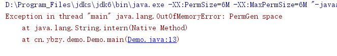
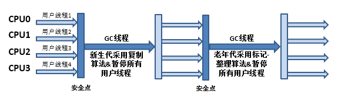

## ※ Some Url

**权威文档：**

https://www.oracle.com/technetwork/tutorials

/tutorials-1876574.html

https://docs.oracle.com/en/java/javase/

https://docs.oracle.com/javase/specs/index.html

# 1，JVM 内存区域的划分

​		Java虚拟机在执行Java程序的过程中会把它所管理的内存划分为若干个不同的数据区域。这些区域有各自的用途和各自的生命周期，有的区域随着虚拟机进程的启动而一直存在，有些区域则是依赖用户线程的启动和结束而建立和销毁。


## 1.1 **程序计数器**

程序计数器(Program Counter Register)是一块较小的内存空间，它可以看作是当前线程所执行的字节码的行号指示器。字节码解释器工作时就是通过改变这个计数器的值来选取下一条需要执行的字节码指令。它是程序控制流的指示器，分支、循环、跳转、异常处理、**线程恢复**等基础功能都需要依赖这个计数器来完成。**程序计数器在JVM中占用的空间很少，但作用很大。也是JVM规范里唯一规定没有任何OutOfMemoryError情况的区域。**

## 1.2 Java虚拟机栈

​    与程序计数器一样，Java虚拟机栈(Java Virtual Machine Stack)也是线程隔离的，它的生命周期与线程相同。虚拟机栈描述的是**Java方法执行的线程内存模型**。

### 1.2.1 栈帧

​    **每个方法被执行的时候，Java虚拟机都会同步创建一个栈帧(Stack Frame)。栈帧**是一个用于存储**局部变量表、操作数栈、动态连接、方法出口**等信息是一个数据结构。**每一个方法被调用直至执行完毕的过程，就对应着一个栈帧在虚拟机栈中从入栈到出栈的过程**。

一般情况下，我们笼统地认为我们定义的局部变量，如String s = new String("内容在堆里，s变量在栈里");实质上，更具体讲，**s是存放在执行s所在的方法的某条具体的线程对应的JVM栈里的某个栈帧里的局部变量表里！**

### 1.2.2 局部变量

**局部变量表存放了：**

- 编译期可知的各种Java虚拟机基本数据类型(boolean、byte、 char、 short、 int、 float、 long、 double) 。

- 对象引用：它并不等同于对象本身，可能是一个指向对象起始地址的引用指针，也可能是指向一个代表对象的句柄或者其他与此对象相关的位置。也可以理解为是一个地址。

- returnAddress类型 (指向了一条字节码指令的地址)。

**局部变量表空间是用一个叫做局部变量槽（slot）来表示的。**

​		其中64位长度的long和double类型的数据会占用两个变量槽，其余的数据类型只占用一个。**局部变量表所需的内存空间在编译期间完成分配，当进入一个方法时，这个方法需要在栈帧中分配多大的局部变量空间是完全确定的，在方法运行期间不会改变局部变量表的大小。**

**【注意】**，这里说的”大小” 是指变量槽的数量，虚拟机真正使用多大的内存空间，譬如按照1个变量槽占用32个比特、64个比特，或者更多，是完全由具体的虚拟机实现自行决定的事情。

**在《Java虚拟机规范》中，对这个内存区域规定了两类异常状况:**

1、如果线程请求的栈深度大于虚拟机所允许的深度，将抛出StackOverflowError异常;

2、如果Java虚拟机栈容量可以动态扩展,当栈扩展时无法申请到足够的内存会抛出OutOfMemoryError异常。

**【注意】**HotSpot虚拟机的栈容量是不可以动态扩展的，以前的Classic虚拟机倒是可以。所以在HotSpot虚拟机上是不会由于虚拟机栈无法扩展而导致OutOfMemoryError异常，只要线程申请栈空间成功了就不会有OOM,但是如果申请时就失败，才会出现OOM异常。

## 1.3 本地方法栈

​		本地方法栈(Native Method Stacks)与虚拟机栈所发挥的作用是非常相似的，其区别只是虚拟机栈为虚拟机执行Java方法(也就是字节码)服务，而本地方法栈则是为虚拟机使用到的本地(Native)方法服务。

​		**【注意】**有的Java虚拟机(譬如HotSpot虚拟机) 直接就把本地方法栈和虚拟机栈合二为一。**HotSpot虚拟机是没本地方法栈，**对应的以后学习配置的时候：虽然-Xoss参数是设置本地方法栈大小存在，但是是没用的，栈的容量大小只有-Xss 参数设置。与虚拟机栈一样，本地方法栈也会在栈深度溢出或者栈扩展失败时分别抛出StackOverflowError和OutOfMemoryError异常。

## 1.4 Java堆

​		对于Java应用程序来说，Java堆(Java Heap)是虛拟机所管理的内存中最大的一块。Java堆是被所有线程共享的一块内存区域，在虚拟机启动时创建。此内存区域的唯一目的就是存放**对象实例**， Java世界里**“几乎”** 所有的对象实例都在这里分配内存。

​		在《Java虚拟机规范》中对Java堆的描述是:”所有的对象实例以及数组都应当在堆上分配”。**Java堆是垃圾收集器管理的内存区域，因此一些资料中它也被称作“GC堆”**。从回收内存的角度看，由于现代垃圾收集器大部分都是基于分代收集理论设计的

​		**【注意】：”新生代””老年代””永久代”“Eden空间””From Survivor空间”"To Survivor空间”**，这些堆区域的进一步划分的叫法，仅仅是**一部分垃圾收集器**的共同特性或者说设计风格而已，而非某个Java虚拟机具体实现的**固有内存布局**，更不是《Java虚拟机规范》里对Java堆的进一步细致划分。

​		Java堆既可以被实现成固定大小的，也可以是可扩展的，不过当前主流的Java虚拟机都是**按照可扩展来实现**的(通过参数-Xmx和-Xms设定其空间的大小)。如果在Java堆中没有内存去给对象实例分配，并且堆也无法再扩展时，Java虚拟机将会抛出OutOfMemoryError！

## 1.5 方法区(Method Area)

​		方法区(Method Area)与Java堆一样，是各个线程共享的内存区域，虽然《Java虚拟机规范》中把方法区描述为堆的一个逻辑部分，但是它却有一个别名叫作**“非堆”(Non-Heap)**，目的是与Java堆区分开来。它用于存储已**被虚拟机加载的类型信息、常量、静态变量、即时编译器编译后的代码缓存**等数据。

### 1.5.1 **永久代**

​		在JDK 8以前，许多Java程序员都习惯在HotSpot虚拟机上开发、部署程序，很多人都更愿意把**方法区称呼为”永久代”(PermanentGeneration)**，或将两者混为一谈。原因是当时的HotSpot虚拟机设计团队选择把**垃圾收集器的分代设计扩展至方法区**，或者说**使用永久代来实现方法区**，这样使得HotSpot的垃圾收集器能够像管理Java堆一样管理这部分内存，省去专门为方法区编写内存管理代码的工作。**但是对于其他虚拟机实现，譬如JRockit、J9来说，是不存在永久代的概念的。**

​		JDK1.7中，符号引用(Symbols)转移到了native heap；字符串常量池(interned strings)转移到了java heap；类的静态变量(class statics)转移到了java heap。

​		但现在回头来看，当年使用永久代来实现方法区的决定并不是一个好主意,
​		1、这种设计导致了Java应用更容易遇到内存溢出的问题和性能问题。
​		2、类及方法的信息等比较难预估其大小，永久代要求配置参数-XX: MaxPermSize，即使不设置也有默认大小。因此对于永久代的大小指定比较困难，太小容易出现永久代溢出，太大则容易导致老年代溢出。
​		3、永久代会为 GC 带来不必要的复杂度，并且回收效率偏低。	

​		到了JDK8,完全废弃了永久代的概念，改用与JRockit、J9一样在**本地内存**中实现的元空间(Meta-space) 来代替了。这样就没有参数-XX: MaxPermSize的大小限制，减少了OOM的机会。当然也不是无限大哈，受到本机总内存(包括物理内存、SWAP分区或者分页文件)大小以及处理器寻址空间的限制，**当方法区满足不了程序的空间需求，OOM仍然会出现的。**

## 1.6 **运行时常量池**

### 1.6.1 静态常量池

​		静态常量池：即*.class文件中的常量池，class文件中的常量池不仅仅包含字符串/数字这些**字面量**，还包含类、方法的信息，占用class文件绝大部分空间。这种常量池主要用于存放两大类常量：字面量和符号引用量。

- 字面量相当于Java语言层面常量的概念，如文本字符串，声明为final的常量值等
- 符号引用则属于编译原理方面的概念，包括了如下三种类型的常量：类和接口的全限定名、字段名称描述符、方法名称描述符

### 1.6.2 运行时常量池

​		运行时常量池：**虚拟机会将在类加载后把各个class文件中的常量池载入到运行时常量池中，**前面的静态常量池只是一个**静态文件结构**，运行时常量池是**方法区的一部分**，是**一块内存区域**。运行时常量池可以在运行期间将符号引用解析为直接引用，即把那些描述符（名字）替换为能直接定位到字段、方法的引用或句柄（地址）。

### 1.6.3 字符串常量池

​		字符串常量池 ：字符串常量池可以理解为运行时常量池分出来的部分。加载时，对于Class的静态常量池，如果字符串会被装到字符串常量池中。字符串池是 JVM 层面的技术。

​		在 JDK 1.6 以及以前的版本中，字符串池是放在 Perm 区(Permanent Generation，永久代)。

​		在 JDK 1.7 的版本中，**字符串常量池**移到Java Heap。

​		在 JDK 1.8 的版本中在永久代移除后，**字符串常量池和**运行时常量池也**没有**放到新的方法区---元空间里，而是留在了Java堆里。元空间里只存储**类和类加载器的元数据信息**了！

​	运行期间也可以将新的常量放入池中，这种特性被开发人员利用得比较多的便是**String类的intern()方法**。
这个方法将对应的String引用的字符串放入字符串常量池，并返回常量池中对应的地址。

​	测试代码：

```java
String str1 = new String("1")+ new String("1");      
System.out.println(str1.intern() == str1);   
System.out.println(str1 ==  "11");  
//再jdk1.7及以后输出结果为 true, true
//1.6输出结果为false,fasle
```

```java
String str2 = "11";//新加的一行代码，其余不变  
String str1 = new String("1")+ new String("1");      
System.out.println(str1.intern() == str1);   
System.out.println(str1 ==  "11");  
//运行结果为false, false
```

第一种情况： String str1 = **new** String("1")+ **new** String("1"); 
	这行代码在字符串常量池中生成“1”，并在堆空间中生成str1 引用指向的对象（内容为"11"）。注意此时常量池中是没有 “11”对象的。
	str1.intern()。这一行代码，是将 str1中的“11”字符串放入 String 常量池中，此时常量池中不存在“11”字符串。JDK8的常量池中不会再重复新创建一份对象了（因为jdk8中的字符串常量池也在堆中），**直接存储堆中的引用就是str1，常量池中放的是引用。**
	System.out.println(str1.intern() == str1);  返回true。 
	str1 == "11" 这一行代码会直接去常量池中创建 "11" ，但是发现已经有这个对象了，还是维持原来的引用。     	System.out.println(str1 == "11"); 返回true。 

**第二种情况：** str2先在常量池中创建了“11”，**常量池中放的是“11”这个字符串对象本身。**

​	那么str1.intern()，想将 str1中的“11”字符串放入 String 常量池中，但是发现已经有这个对象了，常量池中不需要再重复创建一份对象了，当然就直接指向了str2。
​	System.out.println(str1.intern() == str1);  返回false。
​	str1 == "11" 
​    这一行代码会直接去常量池中创建 "11" ，但是发现已经有这个对象了，还是维持原来的引用str2。

## 1.7 直接内存

​		直接内存(Direct Memory)并不是虚拟机运行时数据区的一部分，也不是《Java虚拟机规范》中定义的内存区域。但是这部分内存也被频繁地使用，而且也可能导致OutOfMemoryError异常出现。在JDK 1.4中新加入了NIO类，引入了一种基于通道(Channel) 与缓冲区(Buffer) 的I/0方式，它可以使用Native函数库直**接分配堆外内存**。

​		本机**直接内存**的分配不会受到Java堆大小的限制。

# 2 创建对象

## 2.1 分配内存空间

- 当Java虚拟机遇到一条字节码new指令时，首先将去检查这个指令的参数是否能在常量池中定位到一个类的符号引用，并且检查这个符号引用代表的类是否已被加载、解析和初始化过。如果没有，那必须先执行相应的类**加载过程**
- 在类加载检查通过后，接下来虚拟机将为新生对象分配内存。**对象所需内存的大小在类加载完成后便可完全确定**，为对象分配空间的任务实际上便等同于把一块确定大小的内存块从Java堆中划分出来。
  - **指针碰撞**：假设Java堆中内存是绝对规整的,所有被使用过的内存都被放在一边，空闲的内存被放在另一边，中间放着一个指针作为分界点的指示器，那所分配内存就仅仅是把那个指针向空闲空间方向挪动一段与对象大小相等的距离，这种分配方式称为**”指针碰撞”**(Bump The Pointer) 。
  - **空闲列表：**但如果Java堆中的内存并不是规整的，已被使用的内存和空闲的内存相互交错在一起，那就没有办法简单地进行指针碰撞了，虚拟机就必须维护一个列表，记录上哪些内存块是可用的，在分配的时候从列表中找到一块足够大的空间划分给对象实例，并更新列表上的记录，这种分配方式称为**"空闲列表”**(Free List)。
  - **Java堆是否规整又由所采用的垃圾收集器是否带有空间压缩整理(Compact)的能力决定。**因此，当使用Serial、 ParNew等带压缩整理过程的收集器时，系统采用的分配算法是指针碰撞，既简单又高效; 而当使用CMS这种基于清除(Sweep) 算法的收集器时，**理论上**就只能采用较为复杂的空闲列表来分配内存。
- **分可用空间的时候，要考虑线程安全问题:**对象创建在虚拟机中是非常频繁的行为，即使仅仅修改一个指针所指向的位置，**在并发情况下也并不是线程安全的**，可能出现正在给对象A分配内存，指针还没来得及修改，对象B又同时使用了原来的指针来分配内存的情况。
  - 一种是对分配内存空间的动作进行同步处理一实际上虚拟机是采用CAS配上失败重试的方式保证更新操作的原子性;
  - 另外一种是把内存分配的动作按照线程划分在不同的空间之中进行，即每个线程在Java堆中预先分配一小块内存，称为**本地线程分配缓冲**(Thread Local Allocation Buffer,TLAB)，哪个线程要分配内存，就在哪个线程的本地缓冲区中分配，只有本地缓冲区用完了，分配新的缓存区时才需要同步锁定。虚拟机是否使用TLAB，**可以通过-XX: +/-UseTLAB参数来设定。**

## 2.2 对象初始化

- 内存分配完成之后，虚拟机必须将分配到的内存空间(但不包括对象头)都初始化为零值，如果使用了TLAB的话，这一项工作也可以提前至TLAB分配时顺便进行。这步操作保证了对象的实例字段在Java代码中可以不赋初始值就直接使用，**使程序能访问到这些字段的数据类型所对应的零值。**

- 接下来，初始化对象的对象头(Object Header)把对象是哪个类的实例、如何才能找到类的元数据信息、对象的哈希码、对象的GC分代年龄等信息放到对象头里。根据虚拟机当前运行状态的不同，对象头的设置方式也会不同。

- 在上面工作都完成之后，从虚拟机的视角来看，一个新的对象已经产生了。但是从Java程序的视角看来，对象的始构造函数，即Class文件中的()方法还没有执行，

- **执行构造函数。**一般来说，new指令之后会接着执行()方法，按照程序员的意愿对对象进行初始化，

  这样一个真正可用的对象才算完全被构造出来。

## 2.3 **对象的内存布局**

在HotSpot虚拟机里，对象在堆内存中的存储可以划分为三个部分:

- 对象头(Header) 
- 实例数据(Instance Data)
- 对齐填充(Padding)

**HotSpot虚拟机对象的对象头部分包括两部分信息。**

- **是用于存储对象自身的运行时数据：**如哈希码(HashCode) 、GC分代年龄、锁状态标志、线程持有的锁、偏向线程ID、偏向时间戳等,这部分数据的长度在32位和64位的虚拟机中分别为32个比特和64个比特，官方称它为"Mark Word"。Mark Word被设计成一个有着动态定义的数据结构，以便在极小的空间内存储尽量多的数据，
- **类型指针**即对象指向它的类型元数据的指针，Java虚拟机通过这个指针来确定该对象是哪个类的实例。并不是所有的虚拟机实现都必须在对象数据上保留类型指针。此外，如果对象是一个Java数组，那在对象头中还必须有一块用于记录数组长度的数据，因为虚拟机可以通过普通Java对象的元数据信息确定Java对象的大小，但是如果数组的长度是不确定的，将无法通过元数据中的信息推断出数组的大小。

**HotSpot虚拟机对象的实例数据部分**

​		接下来实例数据部分是对象真正存储的有效信息，即我们在程序代码里面所定义的各种类型的字段内容，无论是从父类继承下来的，还是在子类中定义的字段都必须记录起来。

​			这部分的存储顺序会受到虚拟机**分配策略参数(-XX: FieldsAllocationStyle)** 和**字段在Java源码中定义顺序**的影响。

**HotSpot虚拟机默认的分配顺序为:**

longs/doubles、 ints、 shorts/chars. bytes/booleans、oops (OrdinaryObject Pointers, OOPs) ，

​		从以上默认的分配策略中可以看到，相同宽度的字段总是被分配到一起存放，在满足这个前提条件的情况下，在父类中定义的变量会出现在子类之前。如果HotSpot虛拟机的+XX: CompactFields参数值为true (默认就为true)，那子类之中较窄的变量也允许插入父类变量的空隙之中，以节省出一点点空间。

**HotSpot虚拟机对象的对齐填充部分**

​		对象的第三部分是对齐填充，**这并不是必然存在的，也没有特别的含义**，它仅仅起着占位符的作用。由于HotSpot虛拟机的自动内存管理系统要求对象**起始地址必须是8字节的整数倍**，换句话说就是任何对象的大小都必须是8字节的整数倍。对象头部分已经被精心设计成正好是8字节的倍数(1倍或者2倍)，因此，如果对象实例数据部分没有对齐的话，就需要通过对齐填充来补全。

## 2.4 **对象的访问定位**

​		对象访问方式也是由虚拟机实现而定的，主流的访问方式主要有**使用句柄**和**直接指针**两种:

1. 、如果使用句柄访问的话，Java堆中将可能会**划分出一块内存来作为句柄池**，reference中存储的就是对象的句柄地址， 而包柄中包含了对象实例数据与类型数据各自具体的地址信息。

   

2. 如果使用直接指针访问的话，Java堆中对象的内存布局就必须考虑如何放置访问类型数据的相关信息，reference中存储的直接就是对象地址，如果只是访问对象本身的话，就不需要多一次间接访问的开销，

   

**总结:**

- 使用直接指针来访问最大的好处就是速度更快，它节省了一次指针定位的时间开销，

- 由于对象访问在Java中非常频繁，因此这类开销积少成多也是一项极为可观的执行成本，

- **主流虚拟机HotSpot主要使用第二种方式进行对象访问(有例外情况，后面章节有介绍到)，**

- 但从整个软件开发的范围来看，在各种语言、框架中使用句柄来访问的情况也十分常见。

# 3 OOM实战

## 3.1  堆溢出

**配置参数**：

-Xms参数 ：设置堆的最小值

-Xmx参数：设置对的最大值

-XX: +HeapDumpOnOutOfMemoryError：可以让虚拟机在出现内存溢出异常的时候Dump出当前的内存堆转储快照以便进行事后分析

-XX:HeapDumpPath=${目录}参数:表示生成DUMP文件的路径，也可以指定文件名称，
例如：-XX:HeapDumpPath=${目录}/java_heapdump.hprof。

```java
//-Xms20m -Xmx20m -XX:+HeapDumpOnOutOfMemoryError -XX:HeapDumpPath=D:\heap_dump.hprof
public class EX1 {
	static class Test{
	}
	public static void main(String[] args) {
		//集合里面的对象不会被认为是垃圾，
		Set<Test> set = new HashSet<>();
		while (true){
			set.add(new Test());
		}
	}
}
```


官方对此的定义：超过98%的时间用来做GC并且回收了不到2%的堆内存时会抛出此异常。
JVM加一个参数：-XX:-UseGCOverheadLimit 禁用这个检查，进一步就是 java.lang.OutOfMemoryError: Java heap space。

## 3.2 **栈溢出**

​		由于HotSpot虚拟机中并不区分虚拟机栈和本地方法栈，因此对于HotSpot来说，-Xoss参数(设置本地方法栈大小)虽然存在，但实际上是没有任何效果的，栈容量只能由**-Xss**参数来设定。

关于虚拟机栈和本地方法栈，在《Java虚拟机规范》中描述了两种异常: 
   1) 如果线程请求的栈深度大于虚拟机所允许的最大深度,将抛出StackOverflowError异常。
   2) 如果虚拟机的栈内存允许动态扩展，当扩展栈容量无法申请到足够的内存时，将抛出OutOfMemoryError异常。

​		**而HotSpot虚 拟机的选择是不支持扩展，**所以除非在**创建线程申请内存时**就因无法获得足够内存而出现OutOfMemoryError异常，否则在线程运行时是不会因为扩展而导致内存溢出的，只会因为**栈容量无法容纳新的栈帧**而导致StackOverflowError异常。

```java
//-Xss128k
public class JVMDemo2 {
    private int stackLength = 1;

    public void stackLeak() {
        stackLength++;
        stackLeak();
    }
    public static void main(String[] args) {
        JVMDemo2 oom = new JVMDemo2();
        try {
            oom.stackLeak();
        } catch (Throwable e) {
            System.out.println("stack length:" + oom.stackLength);
            throw e;
        }
    }
}
```

## 3.3**方法区和运行时常量池溢出**

​	在JDK 6或更早之前的HotSpot虚拟机中，String常量池都是分配在永久代中，我们可以通过**-XX:PermSize和-XX: MaxPermSize**限制永久代的大小，即可间接限制其中String常量池的容量。

```java
//-XX:PermSize=6M -XX:MaxPermSize=6M
public class Demo {
    public static void main(String[] args) {
        // 使用Set保持着常量池引用，避免Full GC回收常量池行为
        Set<String> set = new HashSet<String>();
        // 在short范围内足以让3MB的PermSize产生OOM了
        int i = 0;
        while (true) {
            System.out.println(i);
            set.add(String.valueOf(i++).intern());
        }
    }
}
```



而使用JDK 7或更高版本的JDK来运行这段程序并不会得到相同的结果。

​		无论是在JDK 7中继续使用-XX: MaxPermSize参数，或者在JDK 8及以上版本使用**-XX:MetaspaceSize=N -XX:MaxMetaspaceSize=N**参数把方法区容量限制在3MB，也都不会重现JDK 6中的溢出异常，一般情况下，循环将一直进行下去，不停歇。出现这种变化，是因为自JDK 7起，原本存放在永久代的字符串常量池被移至Java堆之中,所以在JDK 7及以上版本，这时候使用**-Xms -Xmx参数**限制最大堆到3MB就能够看到以下两种运行结果之一，具体取决于哪里的对象分配时产生了溢出。

​		方法区的主要职责是用于存放类型的相关信息，如类名、访问修饰符、常量池、字段描述、方法描述等。这里我们借助个一个第三方框架工具CGLib直接操作字节码运行时生成大量的动态类。

cglib介绍：

- CGLIB（Code Generator Library）是一个强大的、高性能的代码生成库。其被广泛应用于AOP框架（如Spring）中，用以提供方法拦截操作。Hibernate作为一个比较受欢迎的ORM框架，同样使用CGLIB来代理多对一和一对一关联的一这端。

- **实质上CGLIB底层使用了ASM**（一个短小精悍的字节码操作框架）来操作字节码生成新的类。除了CGLIB库外，脚本语言（如Groovy何BeanShell）也使用ASM生成字节码。直接用ASM也可以，但不鼓励直接使用ASM，因为它需要对Java字节码的格式足够的了解。

- 

- **Enhancer**

  Enhancer可能是CGLIB中最常用的一个类，

  Enhancer创建一个被代理对象的子类并且拦截所有的方法调用（包括从Object中继承的toString和hashCode方法）。

  但是，Enhancer不能够拦截final修饰的方法，这是由于Java final方法语义决定的。

  基于同样的道理，Enhancer也不能对fianl类进行代理操作。 

```xml
<!-- https://mvnrepository.com/artifact/cglib/cglib-nodep -->
        <dependency>
            <groupId>cglib</groupId>
            <artifactId>cglib-nodep</artifactId>
            <version>3.3.0</version>
            <scope>test</scope>
        </dependency>
```

```java
public class SampleClass {
    public String test(String input) {
        return "hello world";
    }
}

public class Demo {
    public static void main(String[] args) {
        Enhancer enhancer = new Enhancer();
        enhancer.setSuperclass(SampleClass.class);
        //不改变SampleClass源码的基础上，改变里面的test方法的返回值
        enhancer.setCallback(new FixedValue() {
            @Override
            public Object loadObject() throws Exception {
                return "hell cglib";
            }
        });
        //动态创建代理类，可以看做是sampleClass的子类
        SampleClass sampleClass = (SampleClass) enhancer.create();
        System.out.println(sampleClass.test(null));
    }
}
```

```java
//也可以用MethodInterceptor来实现对方法的拦截
public class SampleClass {
    public void test() {
        System.out.println("hello world");
    }
}

public class Demo {
    public static void main(final String[] args) {
        Enhancer enhancer = new Enhancer();
        enhancer.setSuperclass(SampleClass.class);
        //不改变SampleClass源码的基础上，在test方法前后添加一些代码
        enhancer.setCallback(new MethodInterceptor() {
            @Override
            public Object intercept(Object o, Method method, Object[] objects, MethodProxy methodProxy) throws Throwable {
                System.out.println("test方法执行前。。。。。");
                Object rs = methodProxy.invokeSuper(o,args); //执行test方法
                System.out.println("test方法执行后.....");
                return rs;
            };
        });
        //动态创建代理类，可以看做是sampleClass的子类
        SampleClass sampleClass = (SampleClass) enhancer.create();
        sampleClass.test();
    }
}
```

**方法区内存溢出异常测试元空间**

```java
// -XX:MetaspaceSize=10m -XX:MaxMetaspaceSize=10m
public class Demo {
    public static void main(String[] args) {
        while (true) {
            Enhancer enhancer = new Enhancer();
            enhancer.setSuperclass(OOMObject.class);
            enhancer.setUseCache(false);
            enhancer.setCallback(new MethodInterceptor() {
                public Object intercept(Object obj, Method method, Object[] args, MethodProxy proxy) throws Throwable {
                    return proxy.invokeSuper(obj, args);
                }
            });
            enhancer.create();
        }
    }
    static class OOMObject {
    }
}
```

- -XX: MaxMetaspaceSize: 设置元空间最大值，默认是-1,即不限制，或者说只受限于本地内存大小。
- -XX: MetaspaceSize: 指定元空间的初始空间大小，以字节为单位，达到该值就会触发垃圾收集进行类型卸载，同时收集器会对该值进行调整:如果释放了大量的空间，就适当降低该值;如果释放了很少的空间，那么在不超过-XX: MaxMetaspaceSize (如果设置了的话)的情况下，适当提高该值。
- -XX: MinMetaspaceFreeRatio: 作用是在垃圾收集之后控制最小的元空间剩余容量的百分比，可减少因为元空间不足导致的垃圾收集的频率。

## 3.4 直接内存溢出

​		直接内存(Direct Memory)的容量大小可通过-XX:MaxDirectMemorySize参数来指定，如果不去指定，则默认与Java堆最大值(由-Xmx指定)一致，越过了DirectByteBuffer类直接通过**反射**获取Unsafe实例进行内存分配。

​		Java和C++语言的一个重要区别就是Java中我们无法直接操作一块内存区域，不能像C++中那样可以自己申请内存和释放内存。Java中的Unsafe类为我们提供了类似C++手动管理内存的能力。Unsafe类，全限定名是sun.misc.Unsafe，从名字中我们可以看出来这个类对普通程序员来说是“危险”的，一般应用开发者不会用到这个类。

​		因为虽然使用DirectByteBuffer分配内存也会抛出内存溢出异常，但它抛出异常时并没有真正向操作系统申请分配内存，而是通过计算得知内存无法分配就会在代码里手动抛出溢出异常，真正申请分配内存的方法是Unsafe:allocateMemory()。

```java
//-Xmx20M -XX:MaxDirectMemorySize=10M
public class Demo {
    private static final int _1MB = 1024 * 1024;
    public static void main(String[] args) throws Exception {
        //获得某个类的所有声明的字段，即包括public、private和proteced，但是不包括父类的申明字段。
        Field unsafeField = Unsafe.class.getDeclaredFields()[0];
        unsafeField.setAccessible(true);//设置可以获取此类的私有成员变量的value
        Unsafe unsafe = (Unsafe) unsafeField.get(null);
        while (true) {
            unsafe.allocateMemory(_1MB);
        }
    }
}
```

# 4 垃圾收集与内存回收

## 4.1 **判断一个对象是存活还是死亡**

### 4.1.1 **引用计数算法**

​		在对象中添加一个引用计数器，每当有一个地方引用它时，计数器值就加一;当引用失效时，计数器值就减一 ;任何时刻计数器为零的对象就是不可能再被使用的对象，就是死掉的对象。它的原理简单，判定效率也很高 ,在大多数情况下它都是一个不错的算法。**但是，在Java领域，至少主流的Java虚拟机里面都没有选用引用计数算法来管理内存，**主要原因是，这个看似简单的算法有很多例外情况要考虑，比如单纯的引用计数就很难解决对象之间**相互循环引用**的问题。

### 4.1.2 看懂日志

**先基本认识打印GC日志信息的配置参数：**

1)查看GC基本信息，在JDK 9之前使用-XX: +PrintGC， JDK 9后使用-Xlog: gc

2)查看GC详细信息，在JDK 9之前使用**-XX: +PrintGCDetails** 在JDK 9之后使用-Xlog: gc, 用通配符将GC标签下所有细分过程都打印出来

3)查看GC前后的堆、方法区可用容量变化，在JDK 9之前使用-XX: +PrintHeapAtGC， JDK 9之后使用
	-Xlog: gc+heap=debug

4)查看GC过程中用户线程并发时间以及停顿的时间，在JDK 9之前使用-Xx: +PrintGCApplicationConcurrentTime

以及-XX:+PrintGCApplicationStoppedTime, JDK 9之后使用-Xlog: safepoint

5)把gc日志输出到文件-Xloggc:d:\gc.log

```java
public class Demo {
    public Object instance = null;
    private static final int _1MB = 1024 * 1024;
    /**
     * 这个成员属性的唯一意义就是占点内存，以便在能在GC日志中看清楚是否有回收过
     */
    private byte[] bigSize = new byte[2 * _1MB];
    public static void main(String[] args) {
        Demo A = new Demo();
        Demo B = new Demo();
        A.instance = B;
        B.instance = A;
        A = null;
        B = null;
        System.gc();  //通知GC，可以回收了，GC会记录下来，满足了一定的机制就会执行GC，也就是说不一定马上就会执行GC！
    }
}
```


PSYoungGen：表示新生代，这个名称由收集器决定。

如果是收集器Parallel Scavenge收集器，新生代名称为PSYoungGen

ParOldGen：Parallel Scavenge收集器配套的老年代

Metaspace： Parallel Scavenge收集器配套的元空间

total & used：总的空间和用掉的空间

PSYoungGen新生代又分化eden space、from space和to space这三部分！

**GC操作有两种类型：**

**新生代GC（Minor GC）：**

​		指发生在新生代的垃圾收集动作，因为Java对象大多都具备朝生夕灭的特性，所以Minor GC非常频繁，一般回收速度非常快。

**老年代GC（Major GC/Full GC）：**

​		指发生在老年代的GC，出现了Major GC，经常会伴随至少一次的Minor GC，Major GC的速度一般会比Minor GC慢10倍以上。


**Minor GC的日志信息格式：**

[PSYoungGen: 2673K->496K(38400K)] 2673K->504K(125952K), 0.0010649 secs]
[[Times: user=0.00 sys=0.00, real=0.00 secs] 

1、方括号内部的[PSYoungGen: 2673K->496K(38400K)]分别表示**GC前该内存区域已使用容量->GC后该内存区域已使用容量**，**后面圆括号里面的38400K为该内存区域的总容量。**

2、方括号外面的2673K->504K(125952K), 0.0010649 secs]，表示**GC前Java堆已使用容量->GC后Java堆已使用容量，后面圆括号里面的125952K为Java堆总容量。**

3、[Times: user=0.00 sys=0.00, real=0.00 secs]分别表示

- user time是进程执行用户态代码（内核外）耗费的CPU时间，仅统计该进程执行时实际使用的CPU时间，而不计入其他进程使用的时间片和本进程阻塞的时间

- sys time 是该进程在内核态运行所耗费的CPU时间，即内核执行系统调用所使用的CPU时间
- real time是从进程开始执行到执行完毕所经历的实际时间，包括其他进程使用的时间片（time slice）和本进程耗费在阻塞（如等待I/O操作完成）上的时间。

**user+sys是CPU时间，每个CPU 内核单独计算，所以这个时间可能会是real的好几倍。**

**Full GC日志信息：**

[Full GC (System.gc()) [PSYoungGen: 792K->0K(95744K)] [ParOldGen: 8K->713K(218624K)] 800K->713K(314368K), [Metaspace: 3234K->3234K(1056768K)], 0.0058108 secs] [Times: user=0.00 sys=0.00, real=0.01 secs] 

**[GC类型 (System.gc()) [Young区: GC前Young的内存占用->GC后Young的内存占用(Young区域总大小)]** 

**[old老年代: GC前Old的内存占用->GC后Old的内存占用(Old区域总大小)]**

**GC前堆内存占用->GC后堆内存占用(JVM堆总大小),**

**[方法区: GC前占用大小->C后占用大小(方法区总大小)], GC用户耗时]**

**[Times:用户耗时 sys=系统时间, real=实际时间]** 


**Metaspace used 3354K, capacity 4496K, committed 4864K, reserved 1056768K**

​		这些used,capacity,committed和reserved并不纯粹是JVM的概念，它和操作系统相关。先来看committed和reserved。reserved是指，操作系统已经为该进程“保留”的。所谓的保留，更加接近一种记账的概念，就是操作系统承诺说一大块连续的内存已经是你这个进程的了。注意的是，这里强调的是连续的内存，并且强调的是一种名义归属。那么实际上这一大块内存有没有真实对应的物理内存呢？答案是不知道。那么什么时候才知道呢？等进程committed的时候。当进程真的要用这个连续地址空间的时候，操作系统才会分配真正的内存。所以，这也就是意味着，这个过程有可能会失败。

**[0x000000071f300000,0x000000071f300000,0x0000000720800000)**

显然这种格式就是三个内存地址，在HotSpot里分别称为low_boundary、high、high_boundary。 

low_boundary: reserved space的最低地址边界；也是commited space的最低地址边界 

high: commited space的最高地址边界 

high_boundary: reserved space的最高地址边界。 

[low_boundary, high_boundary)范围内的就是reserved space，这个space的大小就是max capacity。 

[low, high)范围内的就是commited space，而这个space的大小就是current capacity（当前容量），简称capacity。 

capacity有可能在一对最小值和最大值之间浮动。最大值就是上面说的max capacity。

### 4.1.3 **可达性分析算法**

​		通过一系列称为**"GC Roots"**的根对象作为起始节点集合，从这些节点开始，根据引用关系向下搜索，搜索过程所走过的路径称为“引用链”(Reference Chain)，如果某个对象到GC Roots间没有任何引用链相连，或者用图论的话来说就是从GC Roots到这个对象不可达时，则证明此对象是不可能再被使用的。


可作为GC Roots的对象:

1. 在虚拟机栈(栈帧中的本地变量表)中引用的对象。
2. 在方法区中类静态属性引用的对象。
3. 在方法区中常量引用的对象，如字符串常量池(String Table)里的引用指向的对象。
4. 在本地方法栈中JNI (即通常所说的Native方法)引用的对象。
5. Java虚拟机内部的引用，如基本数据类型对应的Class对象，一些常驻的异常对象比如NullPointExcepiton、 OutOfMemoryError等，还有系统类加载器。
6. 所有被同步锁(synchronized关键字) 持有的对象。
7. 反映Java虚拟机内部情况的JMXBean，用于监管 JVM 和 JRE 的其他组件的 MBean、JVMTI，是Java虚拟机提供的一整套后门。通过这套后门可以对虚拟机方方面面进行监控，分析，在JVMTI中注册的回调、本地代码缓存等。
8. 除了这些固定的GC Roots集合以外，根据用户所选用的垃圾收集器以及当前回收的内存区域不同，还可以有其他对象"临时性”地加入，共同构成完整GC Roots集合。

**在JDK 1.2版之后，Java对引用的概念进行了扩充，将引用分为**

- **强引用**是最传统的”引用”的定义，是指在程序代码之中普遍存在的引用赋值，即类似"Object obj=new Object()"这种引用关系。无论任何情况下，只要强引用关系还存在，垃圾收集器就永远不会回收掉被引用的对象。
- **软引用**是用来描述一些还有用，但非必须的对象。软引用关联着的对象，在系统将要发生内存溢出异常前，会把这些对象列进回收范围之中进行第二次回收，如果这次回收还没有足够的内存，才会抛出内存溢出异常。SoftReference类来实现软引用。SoftReference ss = new SoftReference<>("hello world");String rs = ss.get();
- **弱引用**也是用来描述那些非必须对象，但是它的强度比软引用更弱一些，被弱引用关联的对象只能生存到下一次垃圾收集发生为止。当垃圾收集器开始工作，无论当前内存是否足够，都会回收掉只被弱引用关联的对象。WeakReference类来实现弱引用。
- **虚引用**也称为“幽灵引用”或者"幻影引用”，它是最弱的一种引用关系。一个对象是否有虚引用的存在，完全不会对其生存时间构成影响，也无法通过虚引用来取得一个对象实例。为一个对象设置虚引用关联的唯一目的只是为了能在这个对象被收集器回收时收到一个系统通知。PhantomReference类来实现虚引用。


## 4.2 **方法区中的垃圾收集**

​	《Java虚拟机规范》中提到过可以不要求虚拟机在方法区中实现垃圾收集,方法区垃圾收集的”性价比”通常也是比较低的，在Java堆中，尤其是在新生代中，对常规应用进行一次垃圾收集通常可以回收70%至99%的内存空间，相比之下，方法区回收因为有苛刻的判定条件，垃圾收集的回收成果往往远低于此。

​	**方法区的垃圾收集主要回收两部分内容:废弃的常量和不再使用的类型。**

**要判定一个类型是否属于"不再被使用的类”的条件就比较苛刻了。**

1. 该类所有的实例都已经被回收，也就是Java堆中不存在该类及其任何派生子类的实例。
2. 加载该类的类加载器已经被回收，这个条件只有经过精心设计的可替换类加载器的场景，如OSGi、 JSP的重加载等。
3. 该类对应的java.lang. Class对象没有在任何地方被引用，无法在任何地方通过反射访问该类的方法。

## 4.3 什么时候进行垃圾回收

​		那么对于 Minor GC 的触发条件：大多数情况下，新对象直接在 Eden 区中进行分配。如果 Eden区域没有足够的空间，那么就会发起一次 Minor GC；

​		对于 Full GC（Major GC）的触发条件：也是如果老年代没有足够空间的话，那么就会进行一次 Full GC。

上面所说的只是一般情况下，实际上，需要考虑一个**空间分配担保**的问题：在发生Minor GC之前，**虚拟机会先检查老年代最大可用的连续空间是否大于新生代所有对象的总空间。**如果大于则进行Minor GC，如果小于则看-XX:+HandlePromotionFailure设置是否允许担保失败（不允许则直接Full GC）。如果允许，那么会继续检查老年代最大可用的连续空间是否大于历次晋升到老年代对象的平均大小，如果大于则尝试Minor GC（如果尝试失败也会触发Full GC），如果小于则进行Full GC。

## 4.4 垃圾收集算法

​		当前商业虚拟机的垃圾收集器，大多数都遵循了"分代收集”(Generational Collection)的理论进行设计，分代收集名为理论，实质是一套符合大多数程序运行实际情况的经验法则，它建立在两个分代假说之上:

   1)弱分代假说(Weak Generational Hypothesis):绝大多数对象都是朝生夕灭的。

   2)强分代假说(Strong Generational Hypothesis):熬过越多次垃圾收集过程的对象就越难以消亡。

**设计原则:**

​		收集器应该将Java堆划分出不同的区域，然后将回收对象依据其年龄(年龄即对象熬过垃圾收集过程的次数)分配到不同的区域之中存储。难以消亡的对象，那把它们集中放在一块，虚拟机便可以使用较低的频率来回收这个区域，这就同时兼顾了垃圾收集的时间开销和内存的空间有效利用。


**新生代收集(Minor GC/Young GC) :**指目标只是新生代的垃圾收集。

**老年代收集(Major GC/Old GC):**指目标只是老年代的垃圾收集。目前只有CMS收集器会有单独收集老年代的行为。另外请注意"Major GC”这个说法现在有点混淆，需按上下文区分到底是**指老年代的收集还是整堆收集**。

**混合收集(Mixed GC):**指目标是收集整个新生代以及部分老年代的垃圾。

**整堆收集(Full GC):**收集整个Java堆和方法区的垃圾。

### 4.4.1 **标记-清除算法(Mark-Sweep)**

**算法分为”标记”和“清除”两个阶段:**

​		首先标记出所有需要回收的对象，在标记完成后，统一回收掉所有被标记的对象，也可以反过来，标记存活的对象，统一回收所有未被标记的对象。

**主要缺点有两个:**

- 执行效率不稳定,如果Java堆中包含大量对象，而且其中大部分是需要被回收的，这时必须进行大量标记和清除的动作，导致标记和清除两个过程的执行效率都随对象数量增长而降低;
- 内存空间的碎片化问题，标记、清除之后会产生大量不连续的内存碎片，空间碎片太多可能会导致当以后在程序运行过程中需要分配较大对象时无法找到足够的连续内存，而不得不提前触发另一次垃圾收集动作。

### 4.4.2 **标记-复制算法**

​		1969年提出了一种称为“半区复制”(Semispace Copying)的垃圾收集算法，它将可用内存按容量划分为大小相等的两块，每次只使用其中的一块。当这一块的内存用完了，将还存活着的对象复制到另外一块上面，然后再把已使用过的内存空间一次清理掉。

​		如果内存中多数对象都是存活的，这种算法将会产生大量的内存间复制的开销，但对于多数对象都是可回收的情况，算法需要复制的就是少数的存活对象，而且每次都是针对整个半区进行内存回收，分配内存时也就不用考虑有空间碎片的复杂情况，只要移动堆顶指针。这种复制回收算法的代价是将可用内存缩小为了原来的一半，空间浪费未免太多了一点。

### 4.4.3标记整理(Mark-Compact)

​		标记复制算法在对象存活率较高时就要进行较多的复制操作，效率将会降低。所以在老年代一般不能直接选用这种算法。针对老年代对象的存亡特征。

​		其中的标记过程仍然与”标记清除”算法一样，但后续步骤不是直接对可回收对象进行清理，而是让所有存活的对象都向内存空间一端移动，然后直接清理掉边界以外的内存。标记清除算法与标记整理算法的本质差异在于前者是一种非移动式的回收算法，而后者是移动式的。

​		**是否移动存活对象是一项优缺点并存的风险决策:**

- 如果移动存活对象，尤其是在老年代这种每次回收都有大量对象存活区域，移动存活对象并更新所有引用这些对象的地方将会是一种极为负重的操作，而且这种对象移动操作必须全程暂停用户应用程序才能进行,像这样的停顿被最初的虚拟机设计者形象地描述为**”Stop The World"**。
- 但如果跟标记清除算法那样完全不考虑移动和整理存活对象的话，分散于堆中的存活对象导致的空间碎片化问题就只能依赖更为复杂的内存分配器和内存访问器来解决。如通过"**分区空闲分配链表**”来解决内存分配问题。但是，内存的访问是用户程序最频繁的操作，甚至都没有之一，假如在这个环节上增加了额外的负担，**势必会直接影响应用程序的吞吐量。**

**所以具体来说两种算法用哪个，应该根据具体应用特点来选择：**

​		HotSpot虚拟机里面关注吞吐量的Parallel Scavenge收集器是基于标记整理算法的，而关注延迟的CMS收集器则是基于标记清除算法的

# 5 垃圾收集器

## 5.1 一些名词概念

### 5.1.1 **根节点枚举和OopMap**

​		**一个不漏地从方法区、栈区等GC Roots中的引用开始查找这将是一个非常耗时的过程，**所以，解决方案是从外部记录下类型信息，生成映射表，在HotSpot中把这种映射表称之为OopMap，

### 5.1.2 **安全点**

​		为了快点进行可达性的分析，使用了一个引用类型的映射表，可以快速的知道那些对象是可达的，那些是不可达的。但是随着而来的又有一个问题，就是在方法执行的过程中， 可能会导致引用关系发生变化，那么保存的OopMap就要随着变化。如果每次引用关系发生了变化都要去修改OopMap的话，这又是一件成本很高的事情。所以这里就引入了**安全点的概念**。

​		OopMap的作用是为了在GC的时候，快速进行可达性分析，所以OopMap并不需要一发生改变就去更新这个映射表。只要这个更新在GC发生之前就可以了。所以OopMap只需要在预先选定的一些位置上记录变化的OopMap就行了。**这些特定的点就是SafePoint（安全点）**。由此也可以知道，程序并不是在所有的位置上都可以进行GC的，只有在达到这样的安全点才能暂停下来进行GC。既然安全点决定了GC的时机，那么安全点的选择就至为重要了。安全点太少，会让GC等待的时间太长，太多会浪费性能。一般会在如下几个位置选择安全点：1，循环的末尾 ，2，方法临返回前 / 调用方法的call指令后 ，3，可能抛异常的位置

### 5.1.3 **增量更新和原始快照**

​		当垃圾回收的线程和用户的线程并发执行的时候，垃圾线程从GC Roots开始扫描，扫描过的对象，又被用户线程改变了引用关系，会造成本应该标记存活的对象，被错误标记为垃圾对象的问题！由此分别产生了两种解决这个问题的方案:**增量更新(Incremental Update)和原始快照(Snapshot At The Beginning,SATB)**

​		**增量更新：** 当从存活对象插入新的指向原垃圾对象的引用的时候，就将这个新插入的引用记录下来，等并发扫描结之后，再将这些记录过的引用关系中的存活对象为根，重新扫描一次。

​		**原始快照：**当删除从一个存活对象指向原本存活对象的引用的时候，就将这个要删除的引用记录下来，在并发扫描结束之后，再将这些记录过的引用关系中的第一个存活对象为根，重新扫描一次。

## 5.2 新生代收集器

### 5.2.1 **Serial收集器**

收集器是一个**单线程工作的收集器**，但它的”单线程”的意义并不仅仅是说明它只会使用**一个处理器或一条收集线程**去完成垃圾收集工作，更重要的是强调**在它进行垃圾收集时，须暂停其他所有工作线程，直到它收集结束。Serial收集器虽然老，但是在客户端仍然推荐使用的，因为它高效，简单，额外内存消耗最小的收集器。**



**对应的参数：**

- -XX:+UseSerialGC

​		使用串行回收器进行回收，**这个参数会使新生代和老年代都使用串行回收器**，新生代使用复制算法，老年代使用标记-整理算法。Serial收集器是最基本、历史最悠久的收集器，它是一个单线程收集器。一旦回收器开始运行时，整个系统都要停止。Client模式下默认开启，其他模式默认关闭。

- -XX: SurvivorRatio

​	-XX:SurvivorRatio=6 ，设置的是Eden区与**一个**Survivor区的比值是6:1，Eden为6, 两个Survivor为2, Eden占新生代的6/8,也就是3/4, 每个Survivor占1/8，两个占1/4

- -XX:PretenureSizeThreshold

​		-XX:PretenureSizeThreshold=1024 * 1024 * 10超过这个值的时候，对象直接在老年代里分配内存默认值是0，意思是不管多大都是先在eden中分配内存

- -XX: HandlePromotionFailure

  -XX: HandlePromotionFailure=true/false，**空间分配担保**的开关：在发生Minor GC之前，虚拟机会先检查老年代最大可用的连续空间是否大于新生代所有对象的总空间。**如果大于则进行Minor GC**，**如果小于则看-XX:+HandlePromotionFailure设置是否允许担保失败（不允许则直接Full GC）**。如果允许，那么会继续检查老年代最大可用的连续空间是否大于历次晋升到老年代对象的平均大小，如果大于则尝试Minor GC（如果尝试失败也会触发Full GC），如果小于则进行Full GC。

  **注意：**在JDK 6 Update 24之后，-XX:HandlePromotionFailure参数不会再影响到虚拟机的空间分配担保策略。

### 5.2.2  **ParNew收集器**

​		ParNew收集器实质上是Serial收集器的多线程并行版本，除了同时使用多条线程进行垃圾收集之外，其余的行为包括Serial收集器可用的所有控制参数、收集算法、Stop The World、对象分配规则、回收策略等都与Serial收集器完全一致。


**说到ParNew，不得不提前说一下CMS：**

​		在JDK 5发布时，HotSpot推出了一款具有划时代意义的垃圾收集器一CMS收集器。 首次实现了让垃圾收集线程与用户线程(基本上)同时工作。激活CMS的参数：**-XX:+UseConcMarkSweepGC**。**激活CMS后，默认使用CMS+ParNew的组合做垃圾收集工作的。JDK9后，ParNew收集器的开关配置：-XX:+UseParNewGC也被取消了！**可以说ParNewGC是第一款从HotSpot中退出舞台的垃圾收集器。操作系统是多核CPU上效果明显，单核CPU建议使用串行回收器。

**对应的参数：**

- **-XX:+UseParNewGC**


### 5.2.3  **Parallel Scavenge收集器**

​		Parallel Scavenge收集器也是一款新生代收集器，它同样是基于**标记复制算法**实现的收集器，也是能够并行收集的多线程收集器....Parallel Scavenge的诸多特性从表面上看和ParNew非常相似，

​		**Parallel Scavenge收集器的特点是**它的关注点与其他收集器不同，CMS等收集器的关注点是尽可能地缩短垃圾收集时**用户线程的停顿时间**，**停顿时间越短**就越适合需要与用户交互或需要保证服务响应质量的程序，良好的响应速度能提升用户体验;而Parallel Scavenge收集器的目标则是**达到一个可控制的吞吐量**(Throughput) 。这里的吞吐量就是处理器用于运行用户代码的时间与处理器总消耗时间的比值，**高吞吐量**则可以最高效率地利用处理器资源，尽快完成程序的运算任务，主要适合在后台运算而不需要太多交互的分析任务。

**相关参数：**

- -XX:+UseParallelGC

  代表新生代使用Parallel收集器，老年代使用串行收集器。

- -XX: MaxGCPauseMillis

  此参数允许的值是一个大于0的毫秒数，收集器将尽力保证内存回收花费的时间不超过用户设定值。垃圾收集停顿时间缩短是**以牺牲吞吐量和新生代空间为代价换取的**:系统把新生代调得小一些，收集300MB新生代肯定比收集500MB快，但这也直接导致垃圾收集发生得更频繁。

- -XX: +UseAdaptiveSizePolicy

  这是一个开关参数，当这个参数被激活之后，就不需要人工指定新生代的大小(-Xmn) 、Eden与Surivor区的比例 (-XX: SurvivorRatio) 、升级到老年代对象大小(-XX: PretenureSizeThreshold) 等细节参数了，虚拟机会根据当前系统的运行情况收集性能监控信息，动态调整这些参数以提供最合适的停顿时间或者最大的吞吐量。

## 5.3 老年代收集器

### 5.3.1 **Serial Old**

​	Serial Old是Serial收集器的老年代版本，它同样是一个单线程收集器，使用标记整理算法。有的时候你会看到这个名字PS MarkSweep默认的实现实际上是一层皮，它底下真正做mark-sweep-compact工作的代码和serial old是共用同一份代码的。


在Server模式有两大用途：

   （A）、在JDK1.5及之前，与Parallel Scavenge收集器搭配使用（JDK1.6有Parallel Old收集器可搭配）；

   （B）、作为CMS收集器的后备预案，在并发收集发生Concurrent Mode Failure时使用

### 5.3.2 **Parallel Old**

Parallel Old是Parallel Scavenge收集器的老年代版本，支持多线程并发收集，基于标记整理算法实现。这个收集器是直到JDK 6时才开始提供的，在此之前，新生代的Parallel Scavenge收集器一直处于相当尴尬的状态，原因是如果新生代选择了Parallel Scavenge收集器，老年代除了Serial Old 收集器以外别无选择，其他表现良好的老年代收集器，如CMS无法与它配合工作。Serial Old 收集器的单线程就是整个收集系统的瓶颈。直到Parallel Old收集器出现后，"吞吐量优先”收集器终于有了比较名副其实的搭配组合，在注重吞吐量或者处理器资源较为稀缺的场合，**都可以优先考虑Parallel Scavenge加Parallel Old收集器这个组合。**

 **-XX:+UseParallelOldGC：指定使用Parallel Old收集器；**

### 5.3.3 CMS (Concurrent Mark Sweep)

CMS (Concurrent Mark Sweep)收集器是一种以**获取最短回收停顿时间为目标**的收集器。目前很大一部分的Java应用集中在互联网网站或者基于浏览器的B/S系统的服务端上，这类应用通常都会较为关注服务的响应速度，希望系统停顿时间尽可能短，以给用户带来良好的交互体验。CMS收集器就非常符合这类应用的需求。从名字(包含"Mark Sweep")上就可以看出CMS收集器是基于标记清除算法实现的，它的运作过程相对于前面几种收集器来说要复杂一些，**整个过程分为四个步骤，包括:**

- **1)初始标记(CMS initial mark)**(需要STW)

  初始标记仅仅只是标记一下GC Roots能直接关联到的对象，速度很快;

- **2)并发标记(CMS concurrent mark)**

  并发标记阶段就是从GC Roots的直接关联对象开始遍历整个对象图的过程，这个过程耗时较长但是不需要停顿用户线程，可以与垃圾收集线程一起并发运行; 

- **3)重新标记(CMS remark)**(需要STW)

  重新标记阶段则是为了修正并发标记期间，因用户程序继续运作而导致标记产生变动的那一部分对象的标记记录，这个阶段的停顿时间通常会比初始标记阶段稍长一些，但也远比并发标记阶段的时间短;

- **4)并发清除(CMS concurrent sweep)**

  清理删除掉标记阶段判断的已经死亡的对象，由于不需要移动存活对象，所以这个阶段也是可以与用户线程同时并发的。由于在整个过程中耗时最长的并发标记和并发清除阶段中，垃圾收集器线程都可以与用户线程一起工作，所以从总体上来说，CMS收集器的内存回收过程是与用户线程可以看做是同时执行的。 

  

CMS是一款优秀的收集器， 它最主要的优点在名字上已经体现出来:**并发收集、低停顿 。**CMS收集器是HotSpot虚拟机追求低停顿的第一次成功尝试， 但是它还远达不到完美的程度，**至少有以下三个明显的缺点:**

1. **对计算机运算资源非常敏感**

   在并发阶段，它虽然不会导致用户线程停顿，但却会因为占用了一部分处理器的计算能力而导致应用程序变慢，降低总吞吐量。CMS默认启动的回收线程数是**(处理器核心数量+3)/4**， 也就是说，如果处理器核心数在四个或以上，并发回收时垃圾收集线程只占用不超过25%的处理器运算资源，并且会随着处理器核心数量的增加而下降。**但是当处理器核心数量不足四个时，CMS对用户程序的影响就可能变得很大。**

2. **CMS无法处理“浮动垃圾”，有可能出现“Concurrent Mode Failure”，导致“Stop The World”**

   在CMS的并发标记和并发清理阶段，用户线程是还在继续运行的，程序在运行，自然就还会伴随有新的垃圾对象不断产生，但这一部分垃圾对象是出现在标记过程结束以后，CMS无法在当次收集中处理掉它们，只好留待下一次垃圾收集时再清理掉。这一部分垃圾就称为“浮动垃圾”。

   同样也是由于在垃圾收集阶段用户线程还需要持续运行，那就还需要预留足够内存空间提供给用户线程使用，因此CMS收集器不能像其他收集器那样等待到老年代几乎完全被填满了再进行收集，必须预留一部分空间供并发收集时的程序运作使用。

   在JDK 5的默认设置下，CMS收集器当老年代使用了68%的空间后就会被激活，这是一个偏保守的设置，**到了JDK 6时，CMS收集器的启动阈值就已经默认提升至92%。**但这又会更容易面临另一种风险:**要是CMS运行期间预留的内存无法满足程序分配新对象的需要**，就会出现一次“并发失败”(Concurrent Mode Failure) ，这时候虚拟机将不得不启动后备预案:冻结用户线程的执行此时就**“Stop The World”**，临时启用Serial Old收集器来重新进行老年代的垃圾收集，但这样停顿时间就很长了。

3. **CMS使用“标记-清理”算法，不会移动存活对象，会产生过多的内存空间碎片**

   空间碎片过多时，将会给大对象分配带来很大麻烦，往往会出现老年代还有很多剩余空间，但就是无法找到足够大的连续空间来分配当前对象，而不得不提前触发一次Full GC的情况。在CMS收集器不得不进行Full GC时默认会进行**内存碎片的合并整理**。

**对应配置参数：**

- **-XX:+UseConcMarkSweepGC**

  启用CMS

- **-XX:ParallelCMSThreads=20**

  CMS默认启动的回收线程数目是 (ParallelGCThreads + 3)/4) ，如果你需要明确设定，可以通过**-XX:ParallelCMSThreads=20**来设定,其中ParallelGCThreads是年轻代的并行收集线程数

- **-XX:+UseCMSCompactAtFullCollection  -XX:CMSFullGCsBeforeCompaction=10**

  CMS是不会整理堆碎片的，因此为了防止堆碎片引起full gc，通过会开启CMS阶段进行合并碎片选项：
  **-XX:+UseCMSCompactAtFullCollection**(默认开启，JDK 9废弃)，开启这个选项一定程度上会影响性能，也许可以通过配置适当的

  **-XX:CMSFullGCsBeforeCompaction=10**(JDK 9废弃)，来调整性能。在上一次CMS并发GC执行过后，到底还要再执行多少次full GC才会做合并碎片。默认是0，也就是在默认配置下每次CMS GC顶不住了而要转入full GC的时候都会做合并碎片。 把CMSFullGCsBeforeCompaction配置为10，就会变成每隔10次真正的full GC才做一次合并碎片。

- **-XX:+CMSParallelRemarkEnabled  -XX:+CMSScavengeBeforeRemark**

  为了减少第二次暂停的时间，开启并行remark: **-XX:+CMSParallelRemarkEnabled**如果remark还是过长的话，可以开启**-XX:+CMSScavengeBeforeRemark**选项，强制remark之前开始一次minor gc，减少remark的暂停时间，但是在remark之后也将立即开始又一次minor gc。

- **-XX:+CMSPermGenSweepingEnabled   -XX:+CMSClassUnloadingEnabled**

  为了避免方法区满引起的full gc，建议开启CMS回收方法区选项

- **-XX:CMSInitiatingOccupancyFraction=80**

  JDK5默认CMS是在tenured generation沾满68%的时候开始进行CMS收集，JDK 6时，CMS收集器的启动阈值就已经默认提升至92%。如果需要，可以适当调整此值：**-XX:CMSInitiatingOccupancyFraction=80**这里修改成80%沾满的时候才开始CMS回收。

- **-XX:ParallelGCThreads=N**

  年轻代的并行收集线程数默认是(cpu <= 8) ? cpu : 3 + ((cpu * 5) / 8)，如果你希望降低这个线程数，可以通过**-XX:ParallelGCThreads=N** 来调整。

## 5.4  实际配置例子

**java启动参数共分为三类：**

其一是标准参数（-），所有的JVM实现都必须实现这些参数的功能，而且向后兼容；

其二是非标准参数（-X），默认jvm实现这些参数的功能，但是并不保证所有jvm实现都满足，且不保证向后兼容；

其三是非Stable参数（-XX），此类参数各个jvm实现会有所不同，将来可能会随时取消，需要慎重使用；

**//JDK 版本 "1.8.0_45"**

```java
-Xms5324m -Xmx5324m -Xss512k
// 设置堆内存为5G, 栈内存为0.5M    
-XX:MetaspaceSize=256m -XX:MaxMetaspaceSize=256m 
//设置元空间为256M
-XX:NewSize=2048m -XX:MaxNewSize=2048m  
//设置Yong Generation的大小，相当于 -Xmn2048m
-XX:SurvivorRatio=8 
//设置Survivor区的比率 一个survivor区的空间为 5G*1/(8+2) = 0.5G
-XX:MaxTenuringThreshold=9   
//该参数主要是控制新生代需要经历多少次GC晋升到老年代中的最大阈值。
-XX:+UseConcMarkSweepGC 
//使用CMS收集器，同时新生代使用parNew收集器
-XX:CMSInitiatingOccupancyFraction=80
// 设置CMS回收垃圾的阈值80%，老年代占用率超过80%开始回收
-XX:+UseCMSInitiatingOccupancyOnly 
 //只是用设定的回收阈值( -XX:CMSInitiatingOccupancyFraction),如果不指定,JVM仅在第一次使用设定值,后续则自动调整.
-XX:+ScavengeBeforeFullGC   
//在Full GC前触发一次Minor GC
-XX:+UseCMSCompactAtFullCollection -XX:CMSFullGCsBeforeCompaction=9 
//发生第9次Full GC时CMS开启整理碎片。
-XX:+CMSParallelRemarkEnabled
//CMS开启并行标记，如果多核CPU的话
-XX:+CMSPermGenSweepingEnabled  -XX:+CMSClassUnloadingEnabled 
// 为了避免方法区满引起的full gc，建议开启CMS回收方法区选项
-XX:SoftRefLRUPolicyMSPerMB=0   //软引用的容忍度
/*
    我们知道软引用，是在空间不足的情况下才会被回收，当然这个只是一个比较简单的解释。
实际上软引用的回收机制复杂得多，要理解SoftRefLRUPolicyMSPerMB的意思，
就先明白soft-reference在代码逻辑上需要满足的条件是什么，如下：
clock - timestamp <= freespace * SoftRefLRUPolicyMSPerMB （当条件满足则不会被回收）
clock记录是上一次GC的时间戳，timestamp则是最近一次读取soft-reference所引用的对象（即最近调用get()）的时间戳。
他们的差【clock - timestamp】表示了soft-reference有多久没用了，越大表示越久没用。如果他们的差为负数，表示刚刚用过。
而【freespace * SoftRefLRUPolicyMSPerMB】表示能够VM的忍耐度，VM能够忍耐软引用对象多久没有被回收，
而VM的忍耐度从公式可以知道是由VM计算得出的空闲空间大小和用户指定的忍耐度SoftRefLRUPolicyMSPerMB来决定的。
也就是说，如果软引用上次被get()的时间离最近一次GC的时间不会太久远的话就可以不被当前GC回收。
*/
-XX:-ReduceInitialCardMarks  
//防止大对象导致JVM崩溃的bug解决参数 - JDK 1.6u18发现的已知bug
-XX:CMSInitiatingPermOccupancyFraction=80  
//设置Perm Gen使用到达多少比率时触发GC
-XX:+ExplicitGCInvokesConcurrent  
// 即并行FULL GC，可提高FULL GC效率
-XX:+PrintGCDetails 
-XX:+PrintGCDateStamps 
-XX:+PrintGCApplicationConcurrentTime 
-XX:+PrintGCApplicationStoppedTime 
-XX:+PrintHeapAtGC
-Xloggc:/data/applogs/heap_trace.txt 
-XX:-HeapDumpOnOutOfMemoryError 
-XX:HeapDumpPath=/data/applogs/HeapDumpOnOutOfMemoryError
-XX:+IgnoreUnrecognizedVMOptions  
//忽略不正确的VM选项
```

## 5.5 G1收集器

### 5.5.1 概念

​		Garbage First (简称G1)收集器是**垃圾收集器技术发展历史上的里程碑式的成果，**它开创了收集器面向局部收集的设计思路和基于Region的内存布局形式。G1是一款主要面向服务端应用的垃圾收集器。JDK9发布之日，G1宣告取代Parallel Scavenge加Parallel Old组合，成为服务端模式下的默认垃圾收集器。

​		G1收集器出现之前的所有其他收集器，包括CMS在内，垃圾收集的目标范围要么是整个新生代(MinorGC)， 要么就是整个老年代(MajorGC)， 再要么就是整个Java堆(Full GC)。而G1跳出了这个樊笼，它可以面向堆内存任何部分来组成回收集(Collection Set,一般简称CSet)进行回收，衡量标准不再是它属于哪个分代，而是哪块内存中存放的垃圾数量最多，回收收益最大，这就是G1收集器的Mixed GC模式。

​		G1开创的基于Region的堆内存布局是它能够实现这个目标的关键。虽然G1也仍是遵循分代收集理论设计的，**但其堆内存的布局与其他收集器有非常明显的差异:** 传统的GC收集器将连续的内存空间划分为新生代、老年代和永久代。


而G1的各代存储地址是不连续的，每一代都使用了n个不连续的大小相同的Region，每个Region占有一块连续的虚拟内存地址。


每一个Region都可以根据需要，扮演新生代的Eden空间、Survivor空间， 或者老年代空间。收集器能够对扮演不同角色的Region采用不同的策略去处理，这样无论是新创建的对象还是已经存活了一段时间、熬过多次收集的旧对象都能获取很好的收集效果。**Region中还有一类特殊的Humongous区域，专门用来存储大对象**。G1认为只要大小超过了一个Region容量一半的对象即可判定为大对象。每个Region的大小可以通过参数
**-XX: G1HeapRegionSize**设定，取值范围为1MB ~ 32MB，且应为2的N次幂。而对于那些超过了整个Region容量的超级大对象，将会被存放在N个连续的Humongous Region之中，G1的大多数行为都把Humongous Region作为老年代的一部分来进行看待。

​		G1收集器去跟踪各个Region里面的垃圾堆积的**“价值”**大小，**价值**即回收所获得的空间大小以及回收所需时间的经验值，然后在后台维护一个优先级列表，每次根据用户设定允许的收集停顿时间(**使用参数**
**-XX: MaxGCPauseMilis指定， 默认值是200毫秒**)，优先处理回收价值最大的那些Region,这也就是"Garbage First"名字的由来。这种使用Region划分内存空间，以及具有优先级的区域回收方式，**保证了G1收集器在有限的时间内获取尽可能高的收集效率。**

### 5.5.2 G1的GC模式 --   G1 Young GC  & G1 Mix GC

**G1 Young GC**
		它在Eden空间耗尽时会被触发，开始对Eden区进行GC，在这种情况下，Eden空间的数据移动到Survivor空间中，如果Survivor空间不够，Eden空间的部分数据会直接晋升到年老代空间。Survivor区的数据移动到新的Survivor区中，也有部分数据晋升到老年代空间中。最终Eden空间的数据为空，GC停止工作，应用线程继续执行。

​		这时，我们需要考虑一个问题，如果**仅仅**GC新生代对象，Young区的对象可能还存在Old区的引用， 这就是跨代引用的问题。为了避免对整个堆扫描下来会耗费大量的时间。于是，G1引进了RSet（Remembered Set）和卡表（card table）的概念。基本思想就是用空间换时间。

**Remembered Set**

​		新生代 GC（发生得非常频繁）。一般来说， GC过程是这样的：首先枚举根节点。根节点有可能在新生代中，也有可能在老年代中。这里由于我们只想收集新生代（换句话说，不想收集老年代），所以没有必要对位于老年代的 GC Roots 做全面的可达性分析。但问题是，确实可能存在位于老年代的某个 GC Root，它引用了新生代的某个对象，这个对象是不能清除的，G1模式是活对象。


​		事实上，对于位于不同年代对象之间的引用关系，虚拟机会在程序运行过程中给记录下来。对应上面所举的例子，“老年代对象引用新生代对象”这种关系，会在引用关系发生时，在新生代边上专门开辟一块空间记录下来，这就是Remembered Set，Remembered Set记录的是新生代的对象被老年代引用的关系。所以“新生代的 GC Roots ” + “ Remembered Set 存储的内容”，才是新生代收集时真正的 GC Roots 。

​		G1中每个Region都有一个与之对应的Remembered Set ，在各个 Region 上记录自家的对象被外面对象引用的情况。当进行内存回收时，在GC根节点的枚举范围中加入Remembered Set 即可保证不对全堆扫描也不会有遗漏。

 G1 GC只在两个场景中依赖RSet：

- 老年代到年轻代的引用：G1 GC维护了从老年代区间到年轻代区间的指针，这个指针保存在年轻代的RSet里面。
- 老年代到老年代的引用：从老年代到老年代的指针保存在老年代的RSet里面。

**卡表（Card Table）**

​		如果老年代和新生代之间的引用关系很多，要对每个引用都记录在Rset里，Rset会占很大空间，这样得不偿失，为了解决这个问题，在G1 中又引入了另外一个概念，卡表（Card Table）。卡表作为一个比特位的集合，每一个比特位可以用来标识老年代某一子区域（这个区域称之为卡。G1是512字节）。以此判断其中的所有的对象是否持有新生代对象的引用，这样新生代GC可以不用花大量的时间扫描老年代对象。确定每一个对象的引用，而可以先扫描卡表，只有卡表标识为1，才需要扫描该区域的老年代对象，为0则一定不包含新生代的引用。


​		一般情况下，这个RSet其实是一个Hash Table，Key是别的Region的起始地址，Value是一个集合，里面的元素是Card Table的Index。


**G1 Mix GC**

Mix GC不仅进行正常的新生代垃圾收集，同时也回收部分后台扫描线程标记的老年代分区。它的GC步骤分4步：

1、初始标记（initial mark，STW）

在此阶段，G1 GC 对根进行标记。

**2、并发标记（Concurrent Marking）**

G1 GC 在整个堆中查找可访问的（存活的）对象。

3、最终标记（Remark，STW）

帮助完成标记周期。

**4、清除垃圾（Evacuation，STW）**

识别所有空闲分区；整理堆分区，为混合垃圾回收识别出有高回收价值的老年代分区；RSet梳理。


**原始快照(Snapshot At The Beginning,SATB)**

提到并发标记，就离不开SATB，说清楚STAB，就要说**三色标记算法**

**三色标记算法**是描述追踪式回收器的一种有用的方法，利用它可以推演收集器并发标记的正确性。

首先，我们将对象分成三种类型的。

- 黑色:根对象，或者该对象与它的子对象都被扫描了，确定是活的
- 灰色:对象本身已被扫描,但还没扫描完该对象中的子对象，也就是对象里的字段属性引用的关系还没扫描完
- 白色:未被扫描对象，扫描完成所有对象之后，最终为白色的为不可达对象，即垃圾对象

当GC开始扫描对象时，按照如下图步骤进行对象的扫描：

根对象被置为黑色，子对象被置为灰色。


在GC并发扫描后的结果如下：


在并发标记阶段，应用线程改变了这种引用关系**A.c=C**


在重新标记阶段扫描结果如下


​		这种情况下C会被当做垃圾进行回收。Snapshot的存活对象原来是A、B，实际存活对象变成现在A、B、C了，Snapshot的完整遭到破坏了，显然这个做法是不合理。

​		G1采用的是pre-write barrier解决这个问题。简单说就是在并发标记阶段，当引用关系发生变化的时候，通过pre-write barrier函数会把这种这种变化记录并保存在一个队列里，在JVM源码中这个队列叫satb_mark_queue。在remark阶段会扫描这个队列，通过这种方式，旧的引用所指向的对象就会被标记上，其子孙也会被递归标记上，**这样就不会漏标记任何对象，snapshot的完整性也就得到了保证。**

​		CMS的incremental update设计使得它在remark阶段必须重新扫描所有线程栈和整个young gen作为root；G1的SATB设计在remark阶段则只需要扫描剩下的satb_mark_queue ，解决了CMS垃圾收集器重新标记阶段长时间STW的潜在风险。

​		SATB的方式记录活对象，也就是那一时刻对象snapshot, 但是在之后这里面的对象可能会变成垃圾, 叫做浮动垃圾，这种对象只能等到下一次收集回收掉。在GC过程中新分配的对象都当做是活的，其他不可达的对象就是死的。

**如何知道哪些对象是GC开始之后新分配的呢？**

​		在Region中通过top-at-mark-start（TAMS）指针，分别为prevTAMS和nextTAMS来记录新配的对象。示意图如下：


其中top是该region的当前分配指针，[bottom, top)是当前该region已用（used）的部分，[top, end)是尚未使用的可分配空间（unused）。

(1): [bottom, prevTAMS): 这部分里的对象第n-1轮concurrent marking已经标记过的对象

(2): [prevTAMS, nextTAMS): 这部分里的对象在第n-1轮concurrent marking是隐式存活的

(3): **[nextTAMS, top):** 这部分里的对象在第n轮concurrent marking是隐式存活的

**清除垃圾（Evacuation）**

​		Evacuation阶段是全暂停的。它负责把一部分region里的活对象拷贝到空region里去（并行拷贝），然后回收原本的region的空间。Evacuation阶段可以自由选择任意多个region来独立收集，这些被选中的region构成收集集合（collection set，简称CSet），CSet集合中Region的选定依赖于用户设定允许的收集停顿时间(**使用参数-XX: MaxGCPauseMilis指定， 默认值是200毫秒**)，该阶段并不是选择evacuate所有有活对象的region，只选择回收价值高的少量region来evacuate，这种暂停的开销就可以（在一定范围内）可控。

**Full GC**

G1的垃圾回收过程是和应用程序并发执行的，当Mixed GC的速度赶不上应用程序申请内存的速度的时候，Mixed G1就会降级到Full GC，使用的是Serial GC。Full GC会导致长时间的STW，应该要尽量避免。

导致G1 Full GC的原因可能有两个：

1. Evacuation的时候没有足够的to-space来存放晋升的对象；
2. 并发处理过程完成之前空间耗尽

**相关核心配置参数用JDK8做环境：**

G1 GC给我们提供了很多的命令行选项，也就是参数，这些参数一类以布尔类型打头，“+”表示启用该选项，“-”表示关闭该选项。另一类采用数字赋值，不需要布尔类型打头。

- **-XX:+UseG1GC**

  启用G1垃圾收集器

- **-XX:G1HeapRegionSize=nM（要带单位）**

  这是G1GC独有的选项，Region的大小默认为堆大小的1/200，也可以设置为1MB、2MB、4MB、8MB、16MB，以及32MB，这六个划分档次。增大Region块的大小有利于处理大对象。前面介绍过，大对象没有按照普通对象方式进行管理和分配空间，如果增大Region块的大小，则一些原本走特殊处理通道的大对象就可以被纳入普通处理通道了。反之，如果Region大小设置过小，则会降低G1的灵活性，对于各个年龄代的大小都会造成分配问题。

- **-XX:MaxGCPauseMillis=200**

  最长暂停时间设置目标值。默认值是200 毫秒。(尽可能达到这个目标)

- **-XX:G1NewSizePercent=5**

  将要使用的堆百分比设置为年轻代大小的最小值。默认值是Java堆的5%这是一个实验性的标志。有关示例，请参见如何解锁实验性VM标志。要求先配置：-XX:+UnlockExperimentalVMOptions

- **-XX:G1MaxNewSizePercent=60**

  将要使用的堆大小百分比设置为年轻代大小的最大值。默认值是Java堆的60%这是一个实验性的标志。要求前面先配置：-XX:+UnlockExperimentalVMOptions

- **-XX:ParallelGCThreads=n**

  设置STW工作线程的值。将n的值设置为逻辑处理器的数量。n的值与逻辑处理器的数量相同，最多为8。如果有超过8个逻辑处理器，则将n的值设置为大约5/8个逻辑处理器。这在大多数情况下都是可行的，除了较大的SPARC系统，其中n的值大约是逻辑处理器的5/16。

- **-XX:ConcGCThreads=n**

  设置并行标记线程的数目。将n设置为并行垃圾收集线程(ParallelGCThreads)数量的大约1/4。

- **-XX:InitiatingHeapOccupancyPercent=45**

  这个选项决定了是否开始一次老年代回收动作，即年轻代GC结束之后，G1会评估剩余的对象是否达到了整个Java堆的45%这个阈值。

- **-XX:G1MixedGCLiveThresholdPercent=85**

  在并发标记阶段识别需要被回收的old region，标记成candidate old region，以便在Mixed GC阶段进入CSet而被回收。是通过G1MixedGCLiveThresholdPercent来控制的，当region中的存活数据占比率不超过该阈值时，则表示要被回收，默认占用率为85%。

  在并发标记阶段每个region中的存活数据占比率会被重新计算，那些存活数据占比较多的region，回收时的代价相对较昂贵，它们还会被标记为expensive region。如果在MixedGC阶段这种region大量进入CSet中可能会导致MixedGC的停顿时间过长。G1为了区分开这些region而做了分开标记，在MixedGC阶段优先回收candidate old region，如果代价许可，会尝试回收expensive region。

- **-XX:G1HeapWastePercent=5**

  可容忍的浪费堆空间百分比。如果可回收百分比小于该设置的百分比，JVM不会启动混合垃圾回收周期。

- **-XX:G1MixedGCCountTarget=8**

  老年代Region的回收时间通常来说比年轻代Region稍长一些，这个选项可以设置一个并发标记之后启动多少个混合GC，默认值是8个。设置一个比较大的值可以让G1 GC在老年代Region回收时多花一些时间，如果一个混合GC的停顿时间很长，说明它要做的事情很多，所以可以增大这个值的设置，缩短停顿时间，但是如果这个值过大，也会造成并行循环等待混合GC完成的时间相应的增加。

- **-XX:G1OldCSetRegionThresholdPercent=10**

  混合垃圾收集期间，**每次能进入CSet的old region的最大阈值**（进入CSet表示要垃圾收集）。实验室性标记默认值是Java堆的 10%。**如果该值设置过大**，则每次Mixed GC需要收集的old region数量会变多，导致停顿时间拉长。该值可以限制每次Mixed GC**最多**能回收的old region数量。

- **-XX:G1ReservePercent=10** 

  选项的值（并相应增加总的堆大小），为**“目标空间”**（to-suvivor）增加预留内存量;  相对保证晋升对象不会分配失败！

- **-XX:+UnlockExperimentalVMOptions**

  要更改实验性标志的值，必须先对其解锁。显式地设置该参数。

## 5.6 新一代收集器

### 5.6.1 **Shenandoah**

​		最初Shenandoah是由RedHat公司独立发展的新型收集器项目,在2014年RedHat把Shenandoah贡献给了OpenJDK，并推动它成为OpenJDK 12的正式特性之一，但是OracleJDK不支持。

​		Shenandoah也是使用基于Region的堆内存布局，同样有保存大对象的Humongous Region,默认的回收策略也同样是优先处理回收价值最大的Region。但在管理堆内存方面，它与G1至少有三个明显的不同之处：

- 最重要的当然是支持并发的整理算法，G1的回收阶段是可以多线程并行的，但却不能与用户线程并发，但是Shenandoah最核心的功能就是回收清理的线程不仅是多线程还可以和用户线程并发。

- Shenandoah (目前)是默不使用分代收集，不会有专门的新生代Region和老年代Region。

- Shenandoah和G1有不同的数据结构记录夸Region的引用关系，使用的是“链接矩阵”，

  

Shenandoah 具体的工作过程，可以参见2016年RedHat发表的Shenandoah垃圾收集器的论文。

https://www.researchgate.net/publication/306112816_Shenandoah_An_open-source_concurrent_compacting_garbage_collector_for_OpenJDK

这里说一下2016年RedHat公司发表的实际应用性能对比：


### 5.6.2 **ZGC**

​		ZGC ("Z"” 并非什么专业名词的缩写，这款收集器的名字就叫作Z Garbage Collector) 是一款在JDK 11中新加入的具有实验性质的低延迟垃圾收集器，是由Oracle公司研发的。2018年将ZGC提交给OpenJDK，推动其进入OpenJDK 11的发布清单之中。

​		ZGC和Shenandoah的目标是高度相似，但实现技术上区别很大，简单了解一下ZGC的技术特点：

​		**1）首先从ZGC的内存布局说起。**与Shenandoah和G1一样，ZGC也采用基于Region的堆内存布局，但与它们不同的是，ZGC 的Region (在一些官方资料中将它称为Page或者ZPage)具有动态性，能动态创建和销毁， 以及动态的区域容量大小。在x64硬件平台下，ZGC的Region可以具有大、中、小三类容量:

**小型Region (Small Region):**容量固定为2MB，用于放置小于256KB的小对象。

**中型Region (Medium Region):** 容量固定为32MB，用于放置大于等于256KB但小于4MB的对象。

**大型Region (Large Region):**容量不固定，可以动态变化，但必须为2MB的整数倍，用于放置4MB或以上的大对象。每个大型Region中只会存放一个大对象，这也预示着虽然名字叫作"大型Region"，但它的实际容量完全有可能小于中型Region,最小容量可低至4MB

​		**2）ZGC的核心功能，和Shenandoah一样实现了并发整理功能，**

​		但实现方式和Shenandoah不太一样，它用了一种关键技术，染色指针技术

​		而在ZGC的强项停顿时间测试上，它就毫不留情地与Parallel Scavenge、G1拉开了两个数量级的差距。不论是平均停顿，还是95%停顿、99%停顿、99.9%停顿， 抑或是最大停顿时间，ZGC均能不费劲地控制在十毫秒之内，以至于把它和另外两款停顿数百近千毫秒的收集器放到一起对比，就几乎显示不了ZGC的柱状条：


**相关参数：**

1、激活ZGC：**-XX:+UnlockExperimentalVMOptions**   -XX:UseZGC

### 5.6.3 **Epsilon（ε）**

​		在G1、Shenandoah或者ZGC这些越来越复杂、越来越先进的垃圾收集器相继出现的同时，也有一个“反其道而行”的新垃圾收集器出现在JDK 11的特征清单中一Epsilon, 这是一款以不能够进行垃圾收集为"卖点”的垃圾收集器，"不干活”的收集器。

​		Epsilon收集器由RedHat公司在JEP 318中提出，在此提案里Epsilon被形容成一个无操作的收集器，而事实上只要Java虚拟机能够工作，垃圾收集器便不可能是真正“无操作”的。原因是“垃圾收集器”这个名字并不能形容它全部的职责，更贴切的名字应该是“自动内存管理子系统”。一个垃圾收集器除了垃圾收集这个本职工作之外，它还要负责堆的管理与布局、对象的分配、与解释器的协作、与编译器的协作、与监控子系统协作等职责，其中至少堆的管理和对象的分配这部分功能是Java虚拟机能够正常运作的必要支持，是一个最小化功能的垃圾收集器也必须实现的内容。从JDK 10开始，为了隔离垃圾收集器与Java虚拟机解释、编译、监控等子系统的关系，RedHat提出**了垃圾收集器的统一接口**，即JEP 304提案，

​		Epsilon是这个接口的有效性验证和参考实现，同时也用于需要剥离垃圾收集器影响的性能测试和压力测试。在实际生产环境中，不能进行垃圾收集的Epsilon也仍有用武之地。很长一段时间以来，Java技 术体系的发展重心都在面向长时间、大规模的企业级应用和服务端应用，可是近年来大型系统从传统单体应用向微服务化、无服务化向发展的趋势已越发明显，Java在这方面比起Golang等后起之秀来确实有一些先天不足， 使用率正渐渐下降。传统Java有着内存占用较大，在容器中启动时间长，即时编译需要缓慢优化等特点，这对大型应用来说并不是什么太大的问题，但对短时间、小规模的服务形式就有诸多不适。为了应对新的技术潮流，最近几个版本的JDK逐渐加入了提前编译、面向应用的类数据共享等支持。Epsilon也是有着类似的目标，如果应用只要运行数分钟甚至数秒，只要Java虚拟机能正确分配内存，在堆耗尽之前就会退出，那显然运行负载极小、没有任何回收行为的Epsilon便是很恰当的选择。

**相关参数：**

**-XX:+UnlockExperimentalVMOptions** 

**-XX:+UseEpsilonGC**

## 5.7 **选择合适的垃圾收集器**

​		HotSpot虚拟机提供了种类繁多的垃圾收集器，选择太多反而令人踌躇难决，若只挑最先进的显然不可能满足全部应用场景，下面来探讨一下如何选择合适的垃圾收集器。

这个问题的答案主要受以下三个因素影响:

**1）应用程序的主要关注点是什么?**

​		如果是数据分析、科学计算类的任务，目标是能尽快算出结果，那吞吐量就是主要关注点;

​		如果是客户端/服务器模式的应用，那停顿时间直接影响服务质量，严重的甚至会导致事务超时，这样延迟就是主要关注点;

​		而如果是客户端应用或者嵌入式应用，那垃圾收集的内存占用则是不可忽视的。

**2）运行应用的基础设施如何?**

​		譬如硬件规格，要涉及的系统架构是X86-32/64、SPARC还是ARM/Aarch64;

​		处理器的数量多少，分配内存的大小;

​		选择的操作系统是Linux、Solaris还是Windows等。

**3）使用JDK的发行商是什么?版本号是多少?**

​		是ZingJDK/Azul、OracleJDK、Open-JDK、 OpenJ9抑或是其他公司的发行版?

​		该JDK对应了《Java虚拟机规范》的哪个版本?

​		一般来说，收集器的选择就从以上这几点出发来考虑。

​		假设某个直接面向用户提供服务的B/S系统准备选择垃圾收集器，一般来说延迟时间是这类应用的主要关注点，那么:

​		如果你有充足的预算但没有太多调优经验，那么一套带商业技术支持的专有硬件或者软件解决方案是不错的选择,Azul公司以前主推的Vega系统和现在主推的Zing VM是这方面的代表，这样你就可以使用传说中的C4收集器了。如果你虽然没有足够预算去使用商业解决方案，但能够掌控软硬件型号，使用较新的版本，同时又特别注重延迟，那ZGC很值得尝试。如果你对还处于实验状态的收集器的稳定性有所顾虑，或者应用必须运行在Windows操作系统下，那ZGC就无缘了，试试Shenandoah吧。如果你接手的是遗留系统，软硬件基础设施和JDK版本都比较落后，那就根据内存规模衡量一下， 对于大概4GB到6GB以下的堆内存，CMS一般能处理得比较好，而对于更大的堆内存，可重点考察一下G1。

