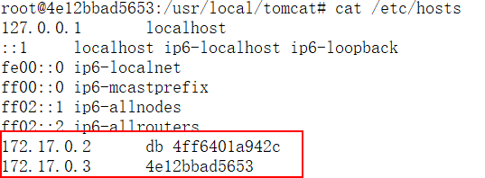
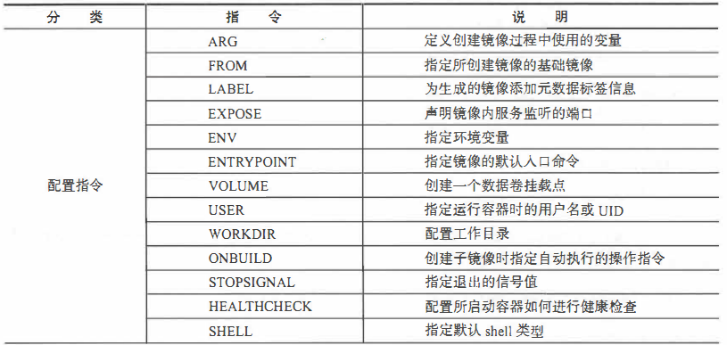
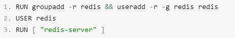
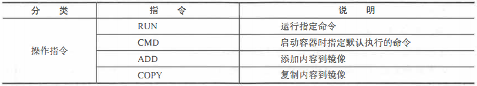
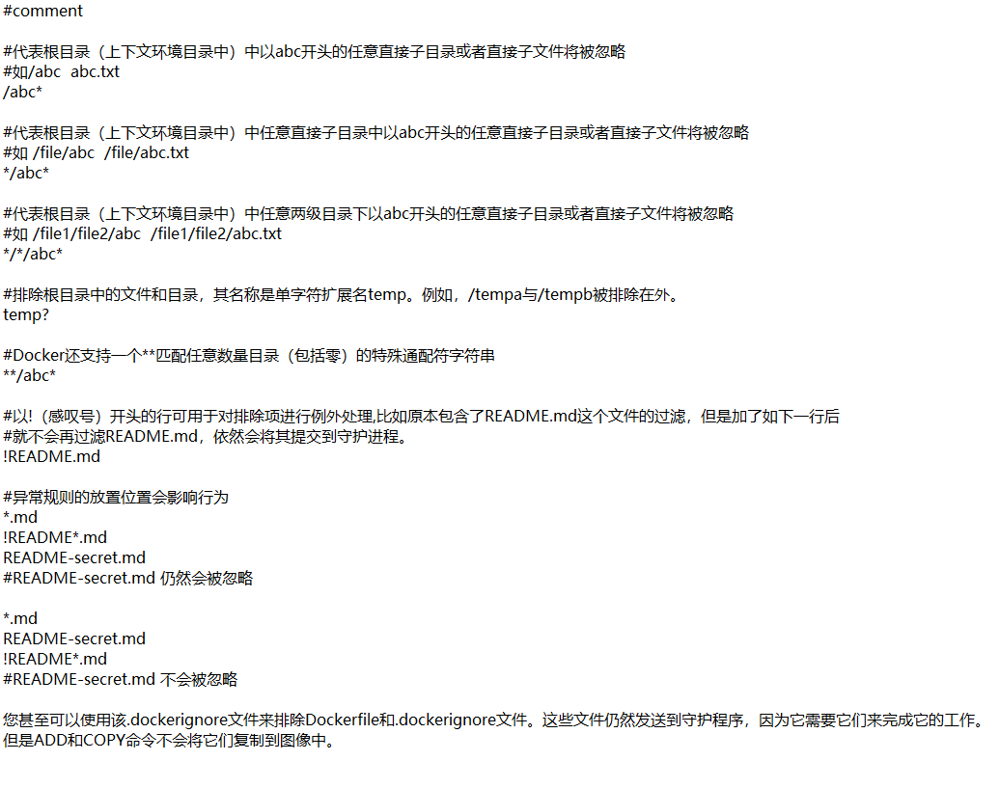

# 1， 安装

1、确保CentOS上安装好gcc：yum -y install gcc

2、确保CentOS上安装好gcc-c++：yum -y install gcc-c++

3、查看gcc的版本：gcc -v  有版本信息，安装对了

4、卸载老版本，卸载命令从官网上拷贝：

yum remove docker   docker-client  docker-client-latest  docker-common  docker-latest  docker-latest-logrotate  docker-logrotate  docker-engine

5、安装下面yum-config-manager命令的支持工具

yum install -y yum-utils

6、设置Docker的yum源，注意这里不要用官网上的仓库，服务器在国外，很慢，要用国内镜像，如阿里云：

yum-config-manager --add-repo http://mirrors.aliyun.com/docker-ce/linux/centos/docker-ce.repo

7、更新yum连接索引

yum makecache fast

8、安装Docker CE

yum -y install docker-ce docker-ce-cli containerd.io

9、启动Docker

systemctl start docker

systemctl status docker

10、测试安装好没的

docker version

# 2，docker 容器的使用

## 2.1 镜像加速器

进入阿里云->控制台->容器镜像服务->镜像中心->镜像加速器

```json
sudo mkdir -p /etc/docker
sudo tee /etc/docker/daemon.json <<-'EOF'
{
  "registry-mirrors": ["https://mwv1zevv.mirror.aliyuncs.com"]
}
EOF
sudo systemctl daemon-reload
sudo systemctl restart docker
```

## 2.2 拉取镜像

**docker pull [可选的选项参数] 镜像仓库名称:tag标记   ，  tag标记不写，默认latest**

docker image pull redis:6.0.5

docker pull hub.c.163.com/public/redis:2.8.4

## 2.3 查看镜像

docker  images 或 docker image ls

**images子命令主要支持如下选项:**

-a,  --all=“true | false”: 列出所有(包括临时文件)镜像文件，默认为否;

-f,   --filter : 过滤列出的镜像，如dangling=true只显示没有被使用的镜像;

找出tag为的

docker images -f  "dangling=true"

根据repository名称和tag模糊过滤

docker images --filter reference='busy*:*libc'

## 2.4 **使用tag命令添加镜像标签**

**docker tag ubuntu:latest myubuntu:latest** 

​		使用docker  tag命令来为本地镜像任意添加新的标签。再次使用docker images 列出本地主机上镜像信息，可以看到多了一个myubuntu:latest标签的镜像。

## 2.5 **搜索镜像**

docker search 命令可以搜索Docker Hub官方仓库中的镜像。

语法为：docker search  [option]  keyword

**搜索官方提供的带redis关键字的镜像，如下所示:**

```shell
docker search --filter=is-official=true redis
```

**搜收藏数量大于等于90的redis的镜像**

```shell
docker search --filter=stars=90 redis
```


## 2.6 **删除和清理镜像**

使用docker  rmi或docker  image  rm命令可以删除镜像，

命令格式为docker rmi IMAGE  [IMAGE...]， 其中IMAGE可以为**标签或ID**。-f，-force: 强制删除镜像，即使有容器依赖它;


使用Docker一段时间后，系统中可能会遗留一些临时的镜像文件，以及一些没有被使用的镜像，

可以通过docker  image prune 命令来进行清理。

**支持选项包括:**

-a, -all:删除所有无用镜像，不光是临时镜像;

-filter filter: 只清理符合给定过滤器的镜像;

-f，-force:强制删除镜像，而不进行提示确认。


## 2.7 创建镜像

docker [container] commit [OPTIONS]  CONTAINERID  [REPOSITORY[:TAG]]，

-a，--author="":作者信息;

-C，--change=[] :提交的时候执行**Dockerfile**指令

包括CMD | ENTRYPOINT |ENV | EXPOSE |LABEL | ONBUILD |USER | VOLUME WORKDIR 等;

-m，--message="":提交消息;

-p，--pause=true:提交时暂停容器运行。

```shell
docker container commit -a "zhonghao" -m "创建新镜像测试" 98da88460690 contest:1
```

## 2.8 **导出和载入镜像**

**导出本地的hello-world:latest镜像为文件hhh.tar**

```shell
docker save -o hhh.tar hello-world:latest
```

生成的hhh.tar可以分享给他人，这个文件就是导出的镜像文件了。

**从文件hhh.tar导人镜像到本地镜像列表**

```shell
docker load -i hhh.tar
//或者
docker load < hhh.tar
```

这将导入镜像及其相关的元数据信息(包括标签等)。导人成功后，可以使用docker  images命令进行查看。

## 2.9 上传镜像到阿里云

在容器镜像服务中，创建镜像，然后点击管理，里面有详细步骤。

## 2.10 **创建本地私有仓库和上传镜像**

```shell
docker run -d -p 5000:5000 --restart=always --name registry2 registry:2
```

这样一个docker私服就已经创建并启动好了。

**将镜像上传到docker私服**

```shell
docker tag centos:7 localhost:5000/centos:7
docker push localhost:5000/centos
```

**获取私有仓库镜像**

```shell
docker pull 127.0.0.1:5000/centos:7
docker pull localhost:5000/centos:7
docker pull 192.168.17.128:5000/centos:7
```

**用ip地址，报错的话尝试：**

**在/etc/docker下的daemon.json**

```json
{
	"insecure-registries":["192.168.17.128:5000"]
}
```

```shell
systemctl daemon-reload
systemctl restart docker
```

**修改了配置文件要重启docker**

**查看私服镜像所有仓库**

```shell
curl http://localhost:5000/v2/_catalog
```

**查看仓库中镜像的所有标签列表**

```shell
curl http://localhost:5000/v2/centos/tags/list
```

# 3 docker 容器的使用

## 3.1 创建和运行

docker [container] create 命令新建一个容器。docker  [container]  start 命令来启动它。y

```shell
docker create -it centos:7
docker run -dit --name centos1  centos:7  /bin/bash   //将create 和 start并起来
```

其中，-t选项让Doker分配一个伪终端并绑定到容器的标准输入上, -i主则让容器的标准输人保持打开。需要让Docker容器在后台以守护态(Daemonized)形式运行,此时，可以通过**添加-d参数**来实现。

**bugs:**

**1、创建运行容器的时候，报警告信息：WARNING: IPv4 forwarding is disabled. Networking will not work.**

​		出于安全考虑，Linux系统默认是禁止数据包转发的。所谓转发即当主机拥有多于一块的网卡时，其中一块收到数据包，根据数据包的目的ip地址将包发往本机另一网卡，该网卡根据路由表继续发送数据包。这通常就是路由器所要实现的功能。配置Linux系统的ip转发功能，首先保证硬件连通，然后打开系统的转发功能/proc/sys/net/ipv4/ip_forward，该文件内容为0，表示禁止数据包转发，1表示允许，将其修改为1。

vim  /usr/lib/sysctl.d/00-system.conf

加入  net.ipv4.ip_forward=1

systemctl restart network，最好也重启docker服务：systemctl restart docker


## 3.2 容器退出

- exit：停止运行中的容器，再退出伪终端
- 快捷键：ctrl+p+q，不停止容器实例的运行，退出伪终端，这种方法退出后怎么再进去

## 3.3 **终止容器**

​		可以使用**docker  [container]  stop** 来终止一个运行中的容器。该命令会首先向容器发送SIGTERM信号，等待一段超时时间后(默认为10秒)，再发送SIGKILL信号来终止容器:

​		此外，还可以通过**docker [container] kill**直接发送 SIGKILL信号来强行终止容器。

## 3.4 **进入容器**

​	在**使用-d参数**让容器启动后会进入后台，**或者使用ctrl+q+p暂时退出容器，**用户都将无法看到容器中的信息，也无法进行操作。这个时候如果需要进入或重新进入容器进行操作，应该使用**attach或exec**命令。

```shell
docker attach 213wqeq213ddsadasdsaas
```

​		使用attach命令有时候并不方便。当多个窗口同时attach到同一个容器的时候，所有窗口都会同步显示;当某个窗口因命令阻塞时，其他窗口也无法执行操作了。

```
docker exec -it  243c32535da7  /bin/bash
```

## 3.5 删除容器

```shell
docker ps -a
docker rm xxxxxx
```

两条命令实现停用并删除容器：

```shell
docker kill $(docker ps -q) 
docker rm $(docker ps -aq)
```

## 3.6 **导入导出容器**

​		导出容器是指，导出一个已经创建的容器到一个文件，**不管此时这个容器是否处于运行状态。**可以使用docker [container] export 命令，该命令格式为: docker [container] export [-o|--output [=""]]  CONTAINER
其中，可以通过-o选项来指定导出的tar文件名。

```shell
$ docker ps -a
$ docker export  -o test.tar  xxxxxx
```

**docker  commit和docker export命令的主要区别总结：**

1）docker export不管容器运行否都可以导出，docker  commit只有运行中的容器才可以使用。

2）docker export生成的容器快照文件将丟弃所有的历史记录和元数据信息(即仅保存容器当时的快照状态),docker  commit生成的镜像存储文件将保存完整记录，体积更大。

​		导出的文件又可以使用docker [container] import 命令导入变成镜像，该命令简单用法为:docker import  xxx.tar

```shell
$ docker import  test.tar  
$ docker tag xxxxx   ctos:7  /bin/bash
```

注意：导出的容器快照文件，会丢失元数据信息，所以，我们在基于导入的镜像创建新容器的时候，docker run命令，不能省略后面的子命令。对于centos镜像来讲子命令:/bin/bash

## 3.7 **查看容器信息**

```shell
$ docker  inspect  test/123dsa123rasd4
```

查看某容器的具体信息，会以json格式返回包括容器Id、创建时间、路径、状态、镜像、配置等在内的各项信息

```shell
$ docker top test
```

这个子命令类似于Linux系统中的top命令，会打印出容器内的进程信息，包括PID、用户、时间、命令等。


docker  [container]  stats   [OPTIONS] [CONTAINER...]子命令，会显示CPU、内存、存储、网络等使用情况的统计信息。支持选项包括:

-a, -all:输出所有容器统计信息，默认仅在运行中;

-no-stream:不持续输出，默认会自动更新持续实时结果;

-no- trunc:不截断输出信息。

## 3.8 **复制文件到容器和复制文件到宿主机**

```shell
docker   cp [OPTIONS] CONTAINER:SRC_PATH   DEST_ PATH
```

-a, -archive: 打包模式，复制文件会带有原始的uid/gid信息;

-L，-follow-link :跟随软连接。当原路径为软连接时，默认只复制链接信息，使用该选项会复制链接的目标内容。

# 4 数据卷、数据容器

## 4.1 数据卷

​		数据卷(Data Volumes)是一个在容器内的特殊目录，  这个目录和宿主机里的某个目录有特殊的映射关系，类似于Linux中的**mount**行为。

**数据卷可以提供很多有用的特性:**

- 数据卷可以在容器之间共享和重用，容器间传递数据将变得高效与方便;
- 对数据卷内数据的修改会立马生效，无论是容器内操作还是宿主机本地操作;
- 对数据卷的更新不会影响镜像，解耦开应用和数据;
- 数据卷会一直存在，直到没有容器使用，可以安全地卸载它。

### 4.1.1 **创建数据卷**

```shell
docker volume create   test 
docker volume ls
docker volume inspect //命令查看详情。
```

### 4.1.2 删除数据卷

docker volume prune 会删除未装入到某个容器或者服务的所有卷，所以谨慎使用！

docker volume rm 允许删除指定卷。

### 4.1.3 使用数据卷

用docker [container] run 命令的时候，可以使用**--mount**选项来使用数据卷。

**--mount选项支持三种类型的数据卷，包括:**

- volume:普通数据卷，映射到主机/var/lib/docker/volumes路径下; 
- bind:绑定数据卷，映射到主机指定路径下;
- tmpfs:临时数据卷，只存在于内存中。

```shell
docker container run -dit --name centos  --mount  type=volume, source=testvolume, destination=/test  centos:7
```

```shell
docker container run -dit --name centos1  --mount  type=bind,source=/root/abc,destination=/test centos:7
```

**上述type=bind的命令等同于下面的写法 :**

```shell
docker container run -dit --name centos2  -v  /root/abc:/test/  centos:7
```

```shell
docker run -it -v /dbdata --name dbdata centos:7 
```

**这里没明确指定宿主机中的目录，会在/var/lib/docker/volumes下自动生成，名字随机**

**注意，地目录的路径必须是绝对路径，容器内路径可以为相对路径。果目录不存在，Docker会自动创建。**

## 4.2 **数据卷容器**

​		如果用户需要在多个容器之间共享一些持续更新的数据，最简单的方式是使用数据卷容器。数据卷容器也是一个容器，**但是它的目的是专门提供数据卷给其他容器挂载。**

首先，创建一个数据卷容器dbdata,并让宿主机创建一个数据卷挂载到centos容器里的目录/dbdata:

```shell
$ docker run -it -v /dbdata --name dbdata centos:7   
```

然后，可以在其他容器中使用--volumes-from来挂载dbdata容器中的数据卷，

```shell
$ docker run -it --volumes-from dbdata --name db1 centos:7   
$ docker run -it --volumes-from dbdata --name db2 centos:7   
```

​		此时，容器db1和db2都挂载同一个数据卷到相同的/dbdata目录，三个容器任何一方在该目录下的写人，其他容器都可以看到。如果删除了挂载的容器(包括dbdata、db1和db2 ),数据卷并不会被自动删除。

### 4.2.1 **利用数据卷容器来迁移数据**

**可以利用数据卷容器对其中的数据卷进行备份、恢复，以实现数据的迁移。**

**1、备份**

使用下面的命令来备份dbdata数据卷容器内的数据卷:

```shell
$ docker  run --volumes-from dbdata -v  $(pwd):/backup --name worker centos:7  tar  cvf  /backup/backup.tar  /dbdata
```

首先利用 centos:7镜像创建了一个容器worker。

使用--volumes-from dbdata 参数来让worker容器挂载dbdata容器的数据卷(即dbdata 数据卷);

使用-v $(pwd):/backup参数来挂载本地的当前目录到worker容器的/backup目录。

worker容器启动后，使用tar cvf /backup/backup.tar  /dbdata 命令将/bdata下内容备份为容器内的/backup/backup.tar,

即宿主主机当前目录下的backup.tar

**2、恢复**

如果要恢复数据到一个容器，可以按照下面的操作。

然后创建另一个新的容器，并使用untar解压备份文件到所挂载的容器卷中:

```shell
$ docker run --volumes-from dbdata -v $(pwd):/backup  centos:7  tar xvf  /backup/backup.tar -C /
```

# 5 端口映射与容器互联

Docker提供的**两个很方便的功能，能满足服务访问的基本需求:**

- 一个是允许映射容器内应用的服务端口到本地宿主主机;
- 另一个是互联机制实现多个容器间便捷互访，多个容器中应用进行快速交互。

## 5.1 **从外部访问容器**

```shell
docker run -d -p 8081:8080 tomcat:8.0.52
```

**小p后面跟着： 宿主机端口号：容器里的应用使用的端口号**

```shell
docker run -d -P tomcat:8.0.52
```

​     **//大P表示： 宿主机端口号取随机：容器里的应用使用的端口号**

```shell
docker run -d -p 8084:8080 -p 8082:8080  tomcat:8.0.52
```

**可以设置多组小p，映射多对端口号**

```shell
docker port 346cf7a666b5
//或者
docker ps
```

**查看端口配置**

```shell
docker inspect 346cf7a666b5
```

**创建出来的容器是有自己的内部网络和IP地址，使用docker [container] inspect + 容器ID可以获取容器的具体信息。**

## 5.2 **容器互联**

​		容器的互联(linking)是一种让**多个容器中的应用进行快速交互的方式。**它会在两个互联的容器之间创建连接关系，不用通过把端口映射到宿主机，通过宿主机作为桥梁来进行交互。

**使用--link参数可以让容器之间安全地进行交互。**

```shell
docker run --name db  -e MYSQL_ROOT_PASSWORD=admin  -d mysql:5.7 
docker run -d -p 80:8080 --name web --link db:dbbm  tomcat:8.0.52
```

**此时，db容器和web容器建立互联关系。  --link 参数的格式为--link name:alias，其中name是要链接的容器的名称，alias是别名。**

**cat /etc/hosts** //查看是否建立成功




# 6 Dockerfile

## 6.1 基础知识

**我们可以使用Dockerfile来快速创建自定义的镜像。**

**命指令句有分为:**

- 配置指令
- 操作指令

**指令语句的基础知识：**

1：每条保留字指令都必须为大写字母且后面要跟随至少一个参数

2：指令按照从上到下，顺序执行

3：#表示注释

4：每条指令的执行都会创建一个新的镜像层

**Dockerfile来创建镜像的过程：**

- **新建一个目录/root/dockertest，作为我的上下文目录，一般情况下我们会默认放Dockerfile文件放这个目录**

- **新建和编写Dockerfile文件**

  FROM centos:7     //我们自己新建的镜像，一般都是在一个基础镜像上面，加工改进而来的。

  VOLUME ["/votest1","/votest2"]     //创建数据卷。

  CMD ["/bin/bash"]    //镜像被docker run命令创建并启动起来后，默认执行的第一条命令。

- **用docker build命令创建新镜像放到本地镜像仓库**

  ```shell
  docker build  -t  builder/firstimage:1.0 .
  ```

  -t  builder/firstimage:1.0：指定了最终生成的镜像的名称

  该命令将读取宿主机上指定的上下文路径下(包括子目录)的Dockerfile，默认情况下， Dockerfile放在上下文目录里，

  **注意后面还有个点儿，表示将当前目录作为Dcoker构建镜像的上下文的目录，**

- **刚刚通过Dockerfile新建的新的镜像，就可以run起来**

  docker run -it  builder/firstimage:1.0

## 6.2 配置指令



### 6.2.1 **ARG和FROM**

**ARG**定义创建镜像过程中使用的变量。

格式为ARG < name> [ =default value]。

在执行docker build命令时， 可以通过**--build-arg <参数名>=<值>**来**覆盖**Dockerfile 中定义的变量值，${变量名}来取值。当镜像编译成功后，ARG指定的变量将不再存在。

**FROM**指定所创建镜像的基础镜像。

```
FROM <image> [AS <name>] 或 FROM < image>:<tag> [AS <name>] 
```

例子：

```dockerfile
ARG VERSION=6
FROM centos:${VERSION}
```

```shell
docker build --build-arg VERSION=7  -t  builder/firstimage:1.0 .
```

### 6.2.2 **LABEL**

LABEL指令可以为生成的镜像添加元数据标签信息。

```dockerfile
LABEL <key>=<value> <key>=<value> <key>=<value>

#such as:
LABEL version="1.0.0"
LABEL author="发发编程"  date="2020-06-22"
LABEL description="Message ..... "
```

这些信息可以用来辅助过滤出特定镜像

```shell
docker images --filter "label=author=发发编程"
```

**注意：**

**1、等式中等号两边不能有空格**

**2、每一个LABEL指令都会生成一个镜像层，在实践中，最好把多个标签合并成一个LABEL指令。**

### 6.2.3 **EXPOSE** 

功能为暴漏容器运行时的监听端口给外部。

```dockerfile
EXPOSE  <port>  [<port>/<protocol>...]

# 例如
EXPOSE 22 80 8443
```

### 6.2.4 **ENV**

指定环境变量，在镜像生成过程中会被后续RUN指令使用，并且通过镜像启动的容器中也会存在。

```dockerfile
ENV <key> <value> 或ENV <key>=<value> 

##例如
ENV APP_VERSION=1.0.0
ENV APP_HOME=/usr/local/app
ENV PATH $PATH:/usr/local/bin11    
```

指令指定的环境变量在**运行时**可以被覆盖掉，如**docker run --env  =  built_image**，和前面的ARG相似。

**注意：**当一条ENV指令中同时为多个环境变量赋值并且值也是从环境变量读取时，**会为变量都赋值后再更新**。

如下面的指令:

ENV key1=value2

ENV key1=value1  key2=${key1}

**最终结果为key1=value1  key2=value2**

### 6.2.5 **ENTRYPOINT** 

Dockerfile中有ENTRYPOINT ["tail","-f","/usr/local/aaa"]这句，那么你启动的时候镜像就执行了这个里面的内容。在启动容器的时候提供 **--entrypoint** 选项，会覆盖**Dockerfile中有ENTRYPOINT**。

**ENTRYPOINT和CMD一般情况下是结合起来用：**

```dockerfile
FROM  centos
ENTRYPOINT ["/bin/ls"]
CMD ["-l", "/tmp"]  
```

相当于：

```shell
docker run --entrypoint=/bin/ls centos:7 -l /tmp       
```

当指定了 ENTRYPOINT 后，CMD 的含义就发生了改变，不再是直接的运行其命令，而是将 CMD 的内容作为参数传给 ENTRYPOINT 指令，换句话说实际执行时，将变为：< ENTRYPOINT> "< CMD>"

**和CMD一样，每个Dockerfile中只能有一个ENTRYPOINT，当指定多个时，只有最后一个起效。**

### 6.2.6 **VOLUME**

创建一个数据卷挂载点。

格式为VOLUME ["/data"] 。

运行容器时可以从本地主机或其他容器**挂载数据卷**，一般用来存放数据库和需要持久保持的数据等。

### 6.2.7 **WORKDIR**

指定工作目录

格式为 WORKDIR < 工作目录路径>

使用 WORKDIR 指令可以来指定工作目录（或者称为当前目录），后面的指令工作的当前目录就是这个指定的目录，如该目录不存在，WORKDIR 会帮你建立目录。

**还有一个作用，我们docker run 启动容器后，默认所在的目录，也会是这个指定的目录。**

### 6.2.8 **USER**

指定当前用户

USER 指令是改变环境状态并影响以后的层。USER 改变之后层的执行 RUN, CMD 以及 ENTRYPOINT 这类命令的身份。USER 只是帮助你切换到指定用户而已，这个用户必须是事先建立好的，否则无法切换



实战中，建立 redis 用户后，我们推荐使用 gosu 来切换另一个用户

```dockerfile
RUN groupadd -r redis && useradd -r -g redis redis \
	wget -O /usr/local/bin/gosu \ "https://github.com/tianon/gosu/releases/download/1.7/gosu-amd64" \
	 && chmod +x /usr/local/bin/gosu \
	 && gosu nobody true
CMD [ "exec", "gosu", "redis", "redis-server" ]
```

### 6.2.9 **ONBUILD**

​		ONBUILD 是一个特殊的指令，它后面跟的是其它指令，比如 RUN, COPY 等，而这些指令，在当前镜像构建时并不会被执行。只有当以当前镜像为基础镜像，去构建下一级镜像的时候才会被执行。Dockerfile 中的其它指令都是为了定制当前镜像而准备的，唯有 ONBUILD 是为了帮助别人定制镜像而准备的。

**1、先编写一个Dockerfile文件，内容如下：**

```dockerfile
FROM centos:7
LABEL author="发发编程"
ONBUILD RUN mkdir /mydir
```

利用上面的dockerfile文件构建镜像： docker build -t imagea .

利用imagea镜像创建容器： docker run --name test1 -it imagea /bin/bash

我们发现test1容器的根目录下并没有mydir目录。说明ONBUILD指令指定的指令并不会在自己的构建中执行。

**2, 再编写一个新的Dockerfile文件，内容如下**

```dockerfile
FROM imagea
LABEL author="发发编程111"
```

注意，该构建准备使用的基础镜像是上面构造出的镜像imagea

利用上面的dockerfile文件构建镜像： docker build -t imageb

利用imagea镜像创建容器： docker run --name test2 -it imageb /bin/bash

我们发现test2容器的根目录下有mydir目录，说明**ONBUILD**触发器执行了。 

**注意：**什么时候执行的ONBUILD指令指定的指令，**FROM指令执行之后。**

### 6.2.10 **STOPSIGNAL**

​		这个指令和执行docker stop有相关性，执行docker stop时，docker会首先向容器内的当前主程序发送一个SIGTERM信号，用于容器内程序的退出。容器在收到SIGTERM后不会马上退出， 那么stop命令会在等待一段时间（默认是10s）后，再向容器发送SIGKILL信号，将容器杀死，变为退出状态。

​	STOPSIGNAL允许我们覆盖发送到容器的默认信号值是SIGTERM，语法：STOPSIGNAL signals

### 6.2.11 **HEALTHCHECK 健康检查**

HEALTHCHECK 指令是告诉 Docker 应该如何进行判断容器的状态是否正常。

通过HEALTHCHECK 指令，用来判断容器主进程的服务状态是否还正常，从而比较真实的反应容器实际状态。

当在一个镜像指定了 HEALTHCHECK 指令后，用其启动容器，初始状态会为 starting，

在 HEALTHCHECK 指令检查成功后变为 healthy，如果连续一定次数失败，则会变为 unhealthy。

格式：

- HEALTHCHECK  [选项]  CMD <命令>：设置检查容器健康状况的命令
- HEALTHCHECK NONE：如果基础镜像有健康检查指令，使用这行可以屏蔽掉其健康检查指令

HEALTHCHECK 支持下列选项：

- --interval=<间隔>：两次健康检查的间隔，默认为 30 秒；
- --timeout=<时长>：健康检查命令运行超时时间，如果超过这个时间，本次健康检查就被视为失败，默认 30 秒；
- --retries=<次数>：当连续失败指定次数后，则将容器状态视为 unhealthy，默认 3 次。

**注意：**

和 CMD, ENTRYPOINT 一样，HEALTHCHECK 只可以出现一次，如果写了多个，只有最后一个生效。

**命令的返回值决定了该次健康检查的成功与否：**0：成功；1：失败；2：保留，不要使用这个值。

举例：

```dockerfile
FROM nginx:1.19.0
RUN apt-get install -y curl && rm -rf /var/lib/apt/lists/*
HEALTHCHECK --interval=5s --timeout=3s CMD curl -fs http://localhost/ || exit 1
```

这里我们设置了每 5 秒检查一次（这里为了试验所以间隔非常短，实际应该相对较长），如果健康检查命令超过 3 秒没响应就视为失败，并且使用 curl -fs http://localhost/ || exit 1 作为健康检查命令。

**curl 是常用的命令行工具，用来请求 Web 服务器。它的名字就是客户端（client）的 URL 工具的意思。**

**-f参数将不输出错误信息。-s不输出内容。&&:用来执行条件成立后执行的命令 ||:用来执行条件不成立后的执行命令**

```shell
docker build -t myweb:v1 .
docker run -d --name web -p 80:80 myweb:v1
```

## 6.3 操作指令	



### 6.3.1 RUN

格式为RUN 或RUN["executable", "param1", "param2"]。 

使用RUN 格式，默认使用的终端是/bin/sh -c;

指定使用其他终端类型可以通过第二种方式实现，

**例如：**

```dockerfile
RUN ["/bin/bash"，"-c","echo hello"] 
```

每条RUN指令将在当前镜像基础上执行指定命令，并提交为新的镜像层。

当命令较长时可以使用**\**来换行。

**例如:**

```dockerfile
RUN  apt-get install -y libsnappy-dev zliblg-dev libbz2-dev \
&& rm -rf /var/cache/apt \
&& rm -rf /var/lib/apt/lists/*
```

### 6.3.2 **CMD 容器启动命令**

简单来理解CMD 相当于启动docker时候后面添加的参数。

```shell
docker run -it centos:7 /bin/bash
docker run -it centos:7 cat /etc/os-release 
```

CMD 指令的格式：

- shell 格式：CMD <命令>

CMD echo "docker so easy"

- exec 格式：CMD ["可执行文件", "参数1", "参数2"...]

CMD ["echo","docker so easy"]

- 参数列表格式：CMD ["参数1", "参数2"...]。在指定了 ENTRYPOINT 指令后，用 CMD 指定具体的参数。

**shell格式和Exec格式区别：**

- **Exec格式**指令会被解析为JSON数组，因此必须用双引号。

- **Exec格式**使用exec执行，不会启动shell环境。

如果使用 **shell 格式**的话，默认将在shell 终端中运行命令，实际的命令会被包装为 sh -c 的参数的形式进行执行。

**比如：**

CMD echo $HOME

**在实际执行中，会将其变更为：**

CMD [ "sh", "-c", "echo $HOME" ]

这就是为什么我们可以使用环境变量的原因，因为这些环境变量会被 shell 进行解析处理。


**进一步理解：**前面我们说了，可以把Docker当成极度精简后的虚拟机，

**但是本质上Docker 不是虚拟机**，运行起来的容器本身就是一个进程。

既然是进程，那么在启动容器的时候，需要指定所运行的程序及参数。

CMD 指令就是用于指定默认的容器主进程的启动命令的。这也是为什么前面讲容器和容器里的应用是同生共死的关系。

### 6.3.3 **COPY 复制文件**

格式：

- COPY <源路径>... <目标路径>
- COPY ["<源路径1>",... "<目标路径>"]

<源路径> （就是本地宿主机上的目录，构建镜像的那个上下文目录）中的文件/目录

<目标路径> 可以是容器内的绝对路径，也可以是**相对于工作目录**的相对路径（工作目录是用 WORKDIR 指令来指定）。目标路径不需要事先创建，**如果目录不存在会在复制文件前先行创建缺失目录**。

### 6.3.4  **ADD 更高级的复制文件**

ADD 指令和 COPY 的格式和性质基本一致。但是在 COPY 基础上增加了一些功能。

​		比如 <源路径> 可以是一个 URL，这种情况下，Docker 引擎会试图去下载这个链接的文件放到 <目标路径> 去。下载后的文件权限自动设置为 600，如果这并不是想要的权限，那么还需要增加额外的一层 RUN 进行权限调整，另外，如果下载的是个压缩包，需要解压缩，也一样还需要额外的一层 RUN 指令进行解压缩。所以不如直接使用 RUN 指令，然后使用 wget 或者 curl 工具下载，处理权限、解压缩、然后清理无用文件更合理。因此，这个功能其实并不实用，而且不推荐使用。

​		如果 <源路径> 为一个宿主机上的 tar 压缩文件的话，压缩格式为 gzip, bzip2 以及 xz 的情况下，ADD 指令将会自动解压缩这个压缩文件到 <目标路径> 去。


## 6.4 .dockerignore

```dockerfile
FROM centos:7
COPY .   /abc
CMD ["/bin/bash"]  
```

使用 Dockerfile 构建镜像时最好是将 Dockerfile 放置在一个新建的空目录下。

然后将构建镜像所需要的文件添加到该目录中。

不需要的文件就不要放进去，放进去的文件会被传送给容器。

但是你硬要多放，为了提高构建镜像的效率，你可以在目录下新建一个 .dockerignore 文件来指定要忽略的文件和目录。



## 6.5 **多阶段构建**

​		Docker 17.05版本以后，新增了Dockerfile多阶段构建。所谓多阶段构建，实际上是允许一个Dockerfile 中出现多个 FROM 指令。多个 FROM 指令并不是为了生成多根的层关系，最后生成的镜像，仍以最后一条 FROM 为准，之前的 FROM 会被抛弃，那么之前的FROM 又有什么意义呢？

​		每一条 FROM 指令都是一个构建阶段，多条 FROM 就是多阶段构建，虽然最后生成的镜像只能是最后一个阶段的结果，但是，能够将前置阶段中的文件拷贝到后边的阶段中，说白了，把构建环境和运行环境分离，这就是多阶段构建的最大意义。

​		之前没优化的做法，全部构建指令放入一个 Dockerfile在一个 Dockerfile 中，包括项目及其依赖库的编译、测试、打包等流程，这里可能会带来的一些问题：

- Dockerfile 特别长，可维护性降低
- 镜像层次多，镜像体积较大，部署时间变长
- 源代码存在泄露的风险

**以安装nginx为例**

**1、未优化**

```dockerfile
FROM centos:7
EXPOSE 80
VOLUME ["/usr/local/nginx/html"]
ADD  nginx-1.19.1.tar.gz /mnt
RUN yum install -y gcc pcre-devel zlib-devel make
WORKDIR /mnt/nginx-1.19.1
RUN ./configure --prefix=/usr/local/nginx
RUN make
RUN make install
CMD ["/usr/local/nginx/sbin/nginx", "-g", "daemon off;"]

# 创建镜像并查看镜像大小
# docker build -t nginx:v1 .
# docker images
```

**2、 清理中间缓存并尽量减少镜像层数**

```dockerfile
FROM centos:7
EXPOSE 80
VOLUME ["/usr/local/nginx/html"]
ADD  nginx-1.19.1.tar.gz /mnt
WORKDIR /mnt/nginx-1.19.1
RUN yum install -y gcc pcre-devel zlib-devel make && yum clean all && ./configure --prefix=/usr/local/nginx && make && make install
CMD ["/usr/local/nginx/sbin/nginx", "-g", "daemon off;"]
```

**3、使用多阶段构建方法**

我们需要的只不过是编译之后的软件包，那么我们就可以在一容器编译安装以后，将编译安装之后的安装包拷贝到另一个容器中，这样就减小了不需要的开销。并且将压缩包删除。

```dockerfile
FROM centos:7 as build   
ADD  nginx-1.19.1.tar.gz /mnt
WORKDIR /mnt/nginx-1.19.1
RUN  yum install -y gcc pcre-devel zlib-devel make && yum clean all && ./configure --prefix=/usr/local/nginx && make && make install && rm -fr /mnt/nginx-1.19.1

# 创建镜像，将编译好的文件直接拿过来用
FROM centos:7   
COPY --from=build  /usr/local/nginx /usr/local/nginx
EXPOSE 80
VOLUME ["/usr/local/nginx/html"]
CMD ["/usr/local/nginx/sbin/nginx", "-g", "daemon off;"]
```

# 实战

## 构建 nginx

1, 创建nginx.conf

```
worker_processes auto;
#error_log  logs/error.log;
#error_log  logs/error.log  notice;
#error_log  logs/error.log  info;
 
#pid        logs/nginx.pid;
 
 
events {
    worker_connections  1024;
}
 
 
http {
    include       mime.types;
    default_type  application/octet-stream;
 
    #log_format  main  '$remote_addr - $remote_user [$time_local] "$request" '
    #                  '$status $body_bytes_sent "$http_referer" '
    #                  '"$http_user_agent" "$http_x_forwarded_for"';
 
    #access_log  logs/access.log  main;
 
    sendfile        on;
    #tcp_nopush     on;
 
    #keepalive_timeout  0;
    keepalive_timeout  65;
 
    #gzip  on;
 
    client_max_body_size   20m;
    server {
        listen       80;
       # server_name  tylerchen;
 
        #charset koi8-r;
 
        #access_log  logs/host.access.log  main;
     location / {
        root   /usr/share/nginx/html;
        index  dist/index.html dist/index.htm;
        try_files $uri $uri/ /index.html;
        }
	location /api/ {
            proxy_pass http://101.132.103.184:9999/;
	    proxy_redirect off;
	    proxy_cookie_path / /api/;
        }
        #error_page  404              /404.html;
 
        # redirect server error pages to the static page /50x.html
        #
        error_page   500 502 503 504  /50x.html;
        location = /50x.html {
            root   html;
        }
 
        # proxy the PHP scripts to Apache listening on 127.0.0.1:80
        #
        #location ~ \.php$ {
        #    proxy_pass   http://127.0.0.1;
        #}
 
        # pass the PHP scripts to FastCGI server listening on 127.0.0.1:9000
        #
        #location ~ \.php$ {
        #    root           html;
        #    fastcgi_pass   127.0.0.1:9000;
        #    fastcgi_index  index.php;
        #    fastcgi_param  SCRIPT_FILENAME  /scripts$fastcgi_script_name;
        #    include        fastcgi_params;
        #}
 
        # deny access to .htaccess files, if Apache's document root
        # concurs with nginx's one
        #
        #location ~ /\.ht {
        #    deny  all;
        #}
    }
 
 
    # another virtual host using mix of IP-, name-, and port-based configuration
    #
    #server {
    #    listen       8000;
    #    listen       somename:8080;
    #    server_name  somename  alias  another.alias;
 
    #    location / {
    #        root   html;
    #        index  index.html index.htm;
    #    }
    #}
}

```

2, 创建Dockerfile

创建数据卷目录app，和Dockerfile存放目录

```shell
mkdir -p /root/dockerfiles/nginx-test/app
cd /root/dockerfiles/nginx-test
vim Dockerfile
#将需要展示的html等文件放到 /root/dockerfiles/nginx-test/app下面
cp -r dist/* app
```

dockerfile文件配置如下：

```dockerfile
ARG VERSION=latest
FROM nginx:${VERSION}
MAINTAINER tylerchen
COPY ./app  /usr/share/nginx/html/
COPY ./nginx.conf /etc/nginx/nginx.conf
RUN echo 'echo init ok!!'
```

```shell
docker build --build-arg VERSION=1.19.1 -t mynginx:1.0.0 . 
```

```shell
docker run --name mynginx -p 80:80 -v /root/dockerfiles/nginx-test/app:/usr/share/nginx/html -d mynginx:1.0.0
```

## 安装mysql5.7

```shell
docker search mysql:5.7
docker run -d -p 3306:3306 -e MYSQL_ROOT_PASSWORD=123456 --name mysql mysql:5.7
```

