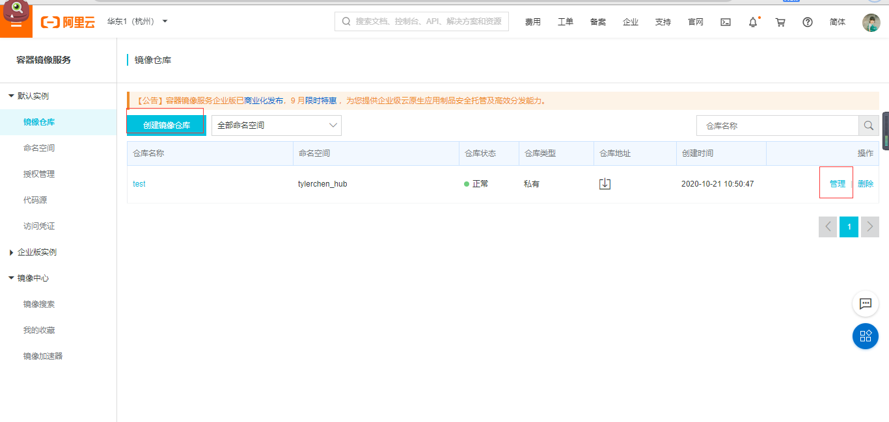

# 1， 安装

1、确保CentOS上安装好gcc：yum -y install gcc

2、确保CentOS上安装好gcc-c++：yum -y install gcc-c++

3、查看gcc的版本：gcc -v  有版本信息，安装对了

4、卸载老版本，卸载命令从官网上拷贝：

yum remove docker   docker-client  docker-client-latest  docker-common  docker-latest  docker-latest-logrotate  docker-logrotate  docker-engine

5、安装下面yum-config-manager命令的支持工具

yum install -y yum-utils

6、设置Docker的yum源，注意这里不要用官网上的仓库，服务器在国外，很慢，要用国内镜像，如阿里云：

yum-config-manager --add-repo http://mirrors.aliyun.com/docker-ce/linux/centos/docker-ce.repo

7、更新yum连接索引

yum makecache fast

8、安装Docker CE

yum -y install docker-ce docker-ce-cli containerd.io

9、启动Docker

systemctl start docker

systemctl status docker

10、测试安装好没的

docker version

# 2，docker 容器的使用

## 2.1 镜像加速器

进入阿里云->控制台->容器镜像服务->镜像中心->镜像加速器

```json
sudo mkdir -p /etc/docker
sudo tee /etc/docker/daemon.json <<-'EOF'
{
  "registry-mirrors": ["https://mwv1zevv.mirror.aliyuncs.com"]
}
EOF
sudo systemctl daemon-reload
sudo systemctl restart docker
```

## 2.2 拉取镜像

**docker pull [可选的选项参数] 镜像仓库名称:tag标记   ，  tag标记不写，默认latest**

docker image pull redis:6.0.5

docker pull hub.c.163.com/public/redis:2.8.4

## 2.3 查看镜像

docker  images 或 docker image ls

**images子命令主要支持如下选项:**

-a,  --all=“true | false”: 列出所有(包括临时文件)镜像文件，默认为否;

-f,   --filter : 过滤列出的镜像，如dangling=true只显示没有被使用的镜像;

找出tag为的

docker images -f  "dangling=true"

根据repository名称和tag模糊过滤

docker images --filter reference='busy*:*libc'

## 2.4 **使用tag命令添加镜像标签**

**docker tag ubuntu:latest myubuntu:latest** 

​		使用docker  tag命令来为本地镜像任意添加新的标签。再次使用docker images 列出本地主机上镜像信息，可以看到多了一个myubuntu:latest标签的镜像。

## 2.5 **搜索镜像**

docker search 命令可以搜索Docker Hub官方仓库中的镜像。

语法为：docker search  [option]  keyword

**搜索官方提供的带redis关键字的镜像，如下所示:**

```shell
docker search --filter=is-official=true redis
```

**搜收藏数量大于等于90的redis的镜像**

```shell
docker search --filter=stars=90 redis
```


## 2.6 **删除和清理镜像**

使用docker  rmi或docker  image  rm命令可以删除镜像，

命令格式为docker rmi IMAGE  [IMAGE...]， 其中IMAGE可以为**标签或ID**。-f，-force: 强制删除镜像，即使有容器依赖它;


使用Docker一段时间后，系统中可能会遗留一些临时的镜像文件，以及一些没有被使用的镜像，

可以通过docker  image prune 命令来进行清理。

**支持选项包括:**

-a, -all:删除所有无用镜像，不光是临时镜像;

-filter filter: 只清理符合给定过滤器的镜像;

-f，-force:强制删除镜像，而不进行提示确认。


## 2.7 创建镜像

docker [container] commit [OPTIONS]  CONTAINERID  [REPOSITORY[:TAG]]，

-a，--author="":作者信息;

-C，--change=[] :提交的时候执行**Dockerfile**指令

包括CMD | ENTRYPOINT |ENV | EXPOSE |LABEL | ONBUILD |USER | VOLUME WORKDIR 等;

-m，--message="":提交消息;

-p，--pause=true:提交时暂停容器运行。

```shell
docker container commit -a "zhonghao" -m "创建新镜像测试" 98da88460690 contest:1
```

## 2.8 **导出和载入镜像**

**导出本地的hello-world:latest镜像为文件hhh.tar**

```shell
docker save -o hhh.tar hello-world:latest
```

生成的hhh.tar可以分享给他人，这个文件就是导出的镜像文件了。

**从文件hhh.tar导人镜像到本地镜像列表**

```shell
docker load -i hhh.tar
//或者
docker load < hhh.tar
```

这将导入镜像及其相关的元数据信息(包括标签等)。导人成功后，可以使用docker  images命令进行查看。

## 2.9 上传镜像到阿里云

在容器镜像服务中，创建镜像，然后点击管理，里面有详细步骤。

## 2.10 **创建本地私有仓库和上传镜像**

```shell
docker run -d -p 5000:5000 --restart=always --name registry2 registry:2
```

这样一个docker私服就已经创建并启动好了。

**将镜像上传到docker私服**

```shell
docker tag centos:7 localhost:5000/centos:7
docker push localhost:5000/centos
```

**获取私有仓库镜像**

```shell
docker pull 127.0.0.1:5000/centos:7
docker pull localhost:5000/centos:7
docker pull 192.168.17.128:5000/centos:7
```

**用ip地址，报错的话尝试：**

**在/etc/docker下的daemon.json**

```json
{
	"insecure-registries":["192.168.17.128:5000"]
}
```

```shell
systemctl daemon-reload
systemctl restart docker
```

**修改了配置文件要重启docker**

**查看私服镜像所有仓库**

```shell
curl http://localhost:5000/v2/_catalog
```

**查看仓库中镜像的所有标签列表**

```shell
curl http://localhost:5000/v2/centos/tags/list
```

