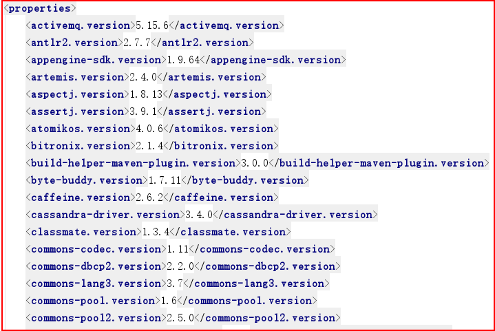
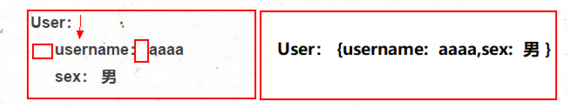
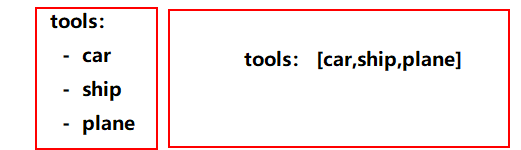
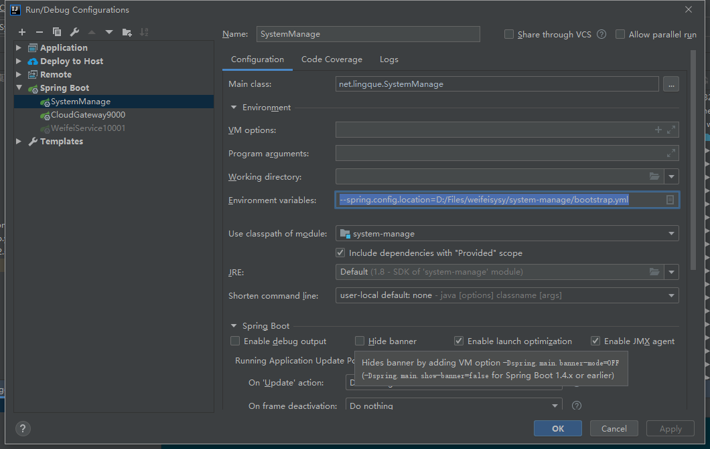

# 1.SpringBoot的简单介绍

**简单的说，spring boot就是整合了很多优秀的框架，不用我们自己手动的去写一堆xml来进行配置。**

从本质上来说，Spring Boot就是Spring,它做了那些没有它你也会去做的Spring Bean配置。它使用“习惯优于配置”（项目中存在大量的配置，此外还内置了一个习惯性的配置，让你无需手动进行配置）的理念让你的项目快速运行起来。使用Spring Boot很容易创建一个独立运行（运行jar,内嵌Servlet容器）、准生产级别的基于Spring框架的项目，使用Spring Boot你可以不用或者只需要很少的Spring配置。

**框架特点：**

  1：创建独立的spring应用。

  2：嵌入Tomcat, Jetty, Undertow 而且不需要部署他们。

  3：提供的“starters”来简化Maven配置

  4：尽可能自动配置spring应用,绝对没有代码生成和XML配置要求。

  5：提供生产指标,健壮检查和外部化配置

**优点：**

- **快速构建项目**
- **对主流的开发框架的无配置集成**
- **项目可以独立运行，无须外部依赖servlet容器**
- **提供运行时的应用监控**
- **极大的提高了开发、部署效率**
- **与云计算的天然集成**

**缺点：**

- **入门易，精通难，它没有增强spring的功能，只是帮助我们做了很多本需要我们自己做的配置整合工作，本质还是我们以前学习的那些框架知识的应用。**

# 2.SpringBoot的入门案例

```xml
<?xml version="1.0" encoding="UTF-8"?>
<project xmlns="http://maven.apache.org/POM/4.0.0"
         xmlns:xsi="http://www.w3.org/2001/XMLSchema-instance"
         xsi:schemaLocation="http://maven.apache.org/POM/4.0.0 http://maven.apache.org/xsd/maven-4.0.0.xsd">
    <modelVersion>4.0.0</modelVersion>

    <groupId>org.example</groupId>
    <artifactId>SpringStudy</artifactId>
    <version>1.0-SNAPSHOT</version>
    <parent>
        <groupId>org.springframework.boot</groupId>
        <artifactId>spring-boot-starter-parent</artifactId>
        <version>2.4.0</version>
    </parent>
    <dependencies>
        <dependency>
            <groupId>org.springframework.boot</groupId>
            <artifactId>spring-boot-starter-web</artifactId>
        </dependency>
    </dependencies>
    <build>
        <plugins>
            <plugin>
                <groupId>org.springframework.boot</groupId>
                <artifactId>spring-boot-maven-plugin</artifactId>
            </plugin>
        </plugins>
    </build>
</project>
```

```java
package org.example;

import org.springframework.boot.*;
import org.springframework.boot.autoconfigure.*;
import org.springframework.web.bind.annotation.*;

@RestController
@SpringBootApplication
public class Example {

	@RequestMapping("/")
	String home() {
		return "Hello World!";
	}

	public static void main(String[] args) {
		SpringApplication.run(Example.class, args);
	}

}
```

## 1， 分析

**pom.xml依赖配置文件，这里两个关键点：**

**帮助我们进行版本控制的父模块**

```
<parent>
    <groupId>org.springframework.boot</groupId>
    <artifactId>spring-boot-starter-parent</artifactId>
    <version>2.0.5.RELEASE</version>
    <relativePath/> <!-- lookup parent from repository -->
</parent>
```

在这个父模块的父模块里有spring boot的所有默认依赖的jar包的版本信息



**②启动器的配置，这个启动器才是真正导入jar的配置**

```xml
<dependency>
    <groupId>org.springframework.boot</groupId>
    <artifactId>spring-boot-starter-web</artifactId>
</dependency>
```

这种启动器，spring boot 有44个之多，每一个启动器就对应一个功能完整的应用场景所需要的一系列jar包：

spring-boot-starter-web：这个启动器就是与web应用有关的所有jar包，spring boot配置了这个的启动器，就会自动导入这个启动器对应web应用的所需要的所有jar包。

**这两个核心配置，一个决定默认的jar包的版本，一个决定导入什么jar包！**


**2.程序入口主类：ApplicationMain，这里也有两个注意的知识点：**

**①注解**@SpringBootApplication**声明有这个注解的类是主类，是spring  boot的执行的入口，没有这个注解注解的类，就没有入口，没有入口，应用就启动不了**

**②**SpringApplication.*run*(**ApplicationMain**.**class**, args);的第一个参数的意义：让spring boot知道ApplicationMain所在的包以及这个包下的所有子包，是spring的扫描组件范围，只有在这个范围的controller，service，dao里的组件类才能被spring扫描到，并且初始化对象，放入到spring的ioc容器里！**所以就意味着，主类所在的位置必须比controller，service，dao层的组件类所在的包结构的上层。**

# 3, SpringBoot的配置文件和YAML文件的语法

1.SpringBoot的有两种格式的全局配置文件，使用任何一个功能都是一样的，注意：SpringBoot的全局配置文件名都是固定的application.xxx

**① application.properties**， 这个是默认Spring initializr默认自动生成的配置文件，也是我们属性的文件格式

**② application.yml**，除了properties文件可以做为SpringBoot的配置文件以外，SpringBoot还支持一种我们以前没接触过的配置文件，这就是YAML配置文件

## 3.1 YAML文件的语法格式

① 基本格式： key:   value   **注意：键值对中的值前面必须有空格，多少个无所谓，但必须有，这是语法**   

② 靠键左对齐来区分层级关系，也就是说凡是左对齐的键值对都是一个层次的

③ 大小写敏感，严格区分大小写的

④ 字符串默认**不用引号引起来**，在值里用**“不会转义特殊字符，\n会换行”，‘会转义特殊字符，\n会输出’**

**⑤ 对象或Map集合的表示方法有两种，一种是用换行+缩进，另一种是利用大括号**



**⑥ 数组或List集合也有两种表达方式：**



## 3.2 @ConfigurationProperties和全局配置文件中配置数据绑定

#### **1、创建创建出两个JavaBean：User和Address**

```java
@Component  // 标记为组件，放到spring的ioc容器里
@ConfigurationProperties(prefix = "user")  // 和配置文件绑定，可以从配置文件中的注入数据
public class User {
	String username;
	String password;
	int age;
	boolean sex;
	Date regDate;
	Map<String,Object> map;
	List<Object> list;
	Address address;
}

@Data
public class Address {
	int id;
	String info;
}

```

#### 2, application.yml中添加配置

```yaml
user:
  username: tylerchen${random.value}
  password: sadas${random.int(10)}
  test: ${user.username}
  regDate: 2010/01/01 #reg-date和regDate都行
  map: {aaa: 111, bbb: sadsa }
  list:
    - l1
    - l2
  address:
    id: 1
    info: 南京
  sex: false

```

#### 3 创建测试类

先添加依赖

```xml
<dependency>
    <groupId>org.springframework.boot</groupId>
    <artifactId>spring-boot-configuration-processor</artifactId>
    <optional>true</optional>
</dependency>
<dependency>
    <groupId>org.projectlombok</groupId>
    <artifactId>lombok</artifactId>
    <version>1.16.18</version>
    <scope>provided</scope>
</dependency>
<!-- 要在yaml配置文件中配置User类的属性数值，需要一个依赖，这个依赖会给我们自动代码提示，很方便 , 如果没有则重新build一下项目-->
<dependency>
    <groupId>org.springframework.boot</groupId>
    <artifactId>spring-boot-configuration-processor</artifactId>
    <optional>true</optional>
</dependency>
```

```java
@SpringBootTest
public class TTest {
	@Autowired
	User user;
	@Test
	public void test(){
		System.out.println(user);
	}
}
```

## 3.3 通过注解@Vuale从全局配置文件中获取数据

**除了通过注解@ConfigurationProperties让JavaBean的所有属性和全局配置文件中配置项建立关联关系外，我们spring提供了一个@Value注解，获取全局配置文件中的某个配置项的数据**

```java
@Value("${user.username}")
String myName;
```

**区别：**

@ConfigurationProperties：是和JavaBean的所有属性绑定

@Value：是一个一个属性绑定

@ConfigurationProperties：不支持spring表示式的写法

@Value：支持spring的表达式的写法，#{12+13}

@ConfigurationProperties：支持JSR303数据校验

@Value：不支持JSR303数据校验

@ConfigurationProperties：支持复杂的类型绑定，比如Map，List

@Value：不支持复杂的类型绑定，比如${user.map}是读不出数据的

## 3.4 @PropertiySource读取外部属性文件

**@ConfigurationProperties和@Value两个注解能从配置文件中获取数据，但是前面讲了他们是从全局配置文件中获取，且只能从全局配置文件中获取，那么如果是一些数值类的数据放在全局配置文件里，是不怎么合适的，我们往往会把他们分离出来**

创建user.properties 然后在里面配置user

user类上添加注解

```java
@Component  // 标记为组件，放到spring的ioc容器里
@ConfigurationProperties(prefix = "user")  // 和配置文件绑定，可以从配置文件中的注入数据
@PropertySource(value = {"classpath:/beans/user.properties"})
@Data
public class User {
	String username;
	String password;
	int age;
	boolean sex;
	Date regDate;
	Map<String,Object> map;
	List<Object> list;
	Address address;
}
```

注意： 这里不能使用yml，因为spring中PropertySource的默认实现是properties类型文件的解析。

可以实现一个解析yaml文件的工具类，实现PropertySourceFactory接口。

```java
public class YamlPropertySourceFactory implements PropertySourceFactory {
    @Override
    public PropertySource<?> createPropertySource(String name, EncodedResource resource) throws IOException {
        List<PropertySource<?>> sources = new YamlPropertySourceLoader().load(resource.getResource().getFilename(), resource.getResource());
        return sources.get(0);
    }
}
```

```java
// 在PropertySource后添加factory指定使用自定义实现的YamlPropertySourceFactory解析yml
@PropertySource(value = {"classpath:/beans/user.yaml"},factory = YamlPropertySourceFactory.class)
```

## 3.5 SpringBoot里的多配置文件优先级和运行时修改配置

**在SpringBoot中默认会扫描好几个地方的默认配置文件：**

项目的根目录/config/-----最高优先级

项目的根目录/-----第二优先级

类路径/config/-----第三优先级

类路径/-----第四优先级

**如果这四个位置都有配置文件，那么四个配置文件都会生效，只不过四个配置文件中的相同配置项，生效的是高优先级的配置文件里的配置项！**

idea 里面使用外部配置文件



**在项目已经打包运行后，我们有时候是需要修改配置的，这时还可以在jar的外面，新建一个配置文件，然后运行jar命令后面跟上 --spring.config.location=x:xxxx/application.properties,那么这个新配置文件会覆盖jar里的配置文件里的相同配置项的配置。外面的这个配置文件优先级最最高！**

# 4 SpringBoot中使用表单数据有效性检验

进入jar

```xml
<dependency>
         <groupId>org.hibernate</groupId>
            <artifactId>hibernate-validator</artifactId>
     <version>5.4.1.Final</version>
</dependency>
```

添加验证 和使用

```java
public class User {
	String password;
	@NotNull(message = "不能为空呀，小老弟！")
	String test;
	@Min(10)
	Integer age;
	Map<String,Object> map;
	List<Object> list;
}
@ResponseBody
@RequestMapping("/")
String home(@Valid User user , Errors errors) {
    List<FieldError> fieldErrors = errors.getFieldErrors();
    for (FieldError error: fieldErrors){
        System.out.println("###############");
        System.out.println(error.getField());
        System.out.println(error.getRejectedValue());
        System.out.println(error.getCode());
        System.out.println(error.getDefaultMessage());
        System.out.println("###############");
    }
    return "Hello World!";
}
```


**一、JSR-303简介**

JSR-303只是一个规范，而Spring也没有对这一规范进行实现，那么当我们在SpringMVC中使用JSR-303的时候就需要我们提供一个对JSR-303规范的实现，Hibernate Validator就是实现了这一规范的具体框架。

JSR-303的校验是基于注解的，它内部已经定义好了一系列的限制注解，我们只需要把这些注解标记在需要验证的**实体类的属性上或是其对应的get方法上**。

**二、JSR 303 基本的校验规则**

空检查 

@Null 验证对象是否为null 

@NotNull 验证对象是否不为null, 无法查检长度为0的字符串 

@NotBlank 检查约束字符串是不是Null还有被Trim后的长度是否大于0,只对字符串,且会去掉前后空格. 

@NotEmpty 检查约束元素是否为NULL或者是EMPTY.

Booelan检查 

@AssertTrue 验证 Boolean 对象是否为 true 

@AssertFalse 验证 Boolean 对象是否为 false

长度检查 

@Size(min=, max=) 验证对象（Array,Collection,Map,String）长度是否在给定的范围之内 

@Length(min=, max=) Validates that the annotated string is between min and max included.

日期检查 

@Past 验证 Date 和 Calendar 对象是否在当前时间之前，验证成立的话被注释的元素一定是一个过去的日期 

@Future 验证 Date 和 Calendar 对象是否在当前时间之后 ，验证成立的话被注释的元素一定是一个将来的日期 

@Pattern 验证 String 对象是否符合正则表达式的规则，被注释的元素符合制定的正则表达式，regexp:正则表达式 flags: 指定 Pattern.Flag 的数组，表示正则表达式的相关选项。

数值检查 

建议使用在Stirng,Integer类型，不建议使用在int类型上，因为表单值为“”时无法转换为int，但可以转换为Stirng为”“,Integer为null 

@Min 验证 Number 和 String 对象是否大等于指定的值 

@Max 验证 Number 和 String 对象是否小等于指定的值 

@DecimalMax 被标注的值必须不大于约束中指定的最大值. 这个约束的参数是一个通过BigDecimal定义的最大值的字符串表示.小数存在精度 

@DecimalMin 被标注的值必须不小于约束中指定的最小值. 这个约束的参数是一个通过BigDecimal定义的最小值的字符串表示.小数存在精度 

@Digits 验证 Number 和 String 的构成是否合法 

@Digits(integer=,fraction=) 验证字符串是否是符合指定格式的数字，interger指定整数精度，fraction指定小数精度。 

@Range(min=, max=) 被指定的元素必须在合适的范围内 

@Range(min=10000,max=50000,[message](http://www.07net01.com/tags-message-0.html)=”range.bean.wage”) 

@Valid 递归的对关联对象进行校验, 如果关联对象是个集合或者数组,那么对其中的元素进行递归校验,如果是一个map,则对其中的值部分进行校验.(是否进行递归验证) 

@CreditCardNumber信用卡验证 

@Email 验证是否是邮件地址，如果为null,不进行验证，算通过验证。 

@ScriptAssert(lang= ,script=, alias=) 

@URL(protocol=,host=, port=,regexp=, flags=)

