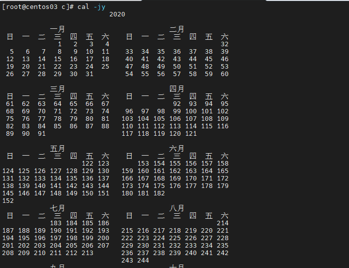
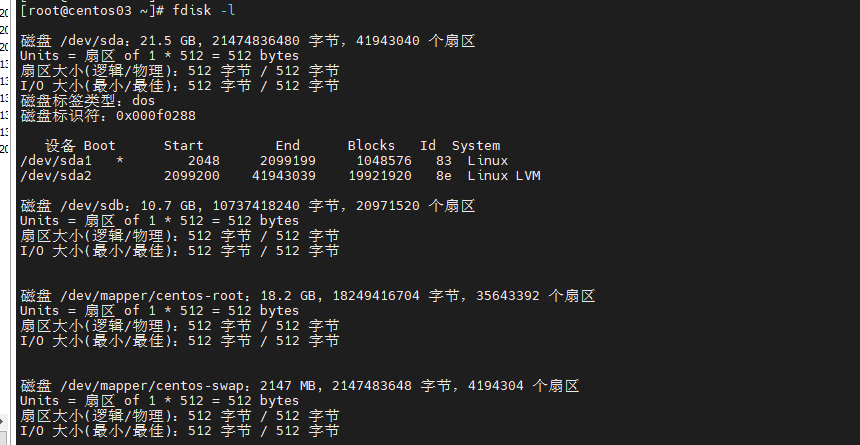
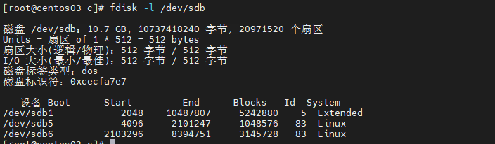
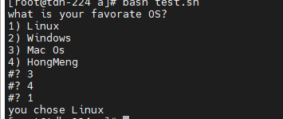

# 1， 基本概念

## 1.1 交换分区

- 虚拟内存是为了满足物理内存的不足而提出的一种策略，它是利用磁盘空间虚拟出的一块逻辑内存，用作虚拟内存的磁盘空 间被称为交换分区（swap分区）。
- **内核会将暂时不用的内存块信息写到交换分区，**这样一来， 物理内存得到了释放，这块内存就可以用于其它用途，当 需要用到原始的内容时，这些信息会被重新从交换分区读 入物理内存。
- Linux的内存管理采取的是分页存取机制，为了保证物理 内存能得到充分的利用，内核会在适当的时候将物理内存 中不经常使用的数据块自动交换到虚拟内存中，而将经常 使用的信息保留到物理内存。
- Linux系统会不时地进行页面交换操作，以保持尽可能多的空闲物理内存，**即使并没有什么操作需要使用内存， Linux也会交换出暂时不用的内存页面，这可以避免等待交换所需的时间。**
- Linux进行页面交换是有条件的，不是所有页面在不用时 都交换到虚拟内存，Linux内核根据“**最近最常使用**”算 法，仅仅将一些不经常使用的页面文件交换到虚拟内存。

## 1.2 分区命名方案

​		Linux系统使用字母和数字的组合来指代硬盘分区，使用 一种更加灵活的分区命名方案，该命名方案是基于文件的， 文件名的格式为**/dev/xxyN**（比如/dev/sda1分区）。

- /dev：这是Linux系统中所有设备文件所在的目录名。因 为分区位于硬盘上，而硬盘是设备，所以这些文件代表了 在/dev上所有可能的分区；
- xx：分区名的前两个字母表示分区所在设备的类型，通常 是hd（IDE硬盘）或**sd**（SCSI硬盘）。
- y：这个字母表示分区所在的设备。例如，/dev/hda（第1 个 IDE 硬盘）或/dev/sdb（第2个SCSI硬盘）；
- N：最后的数字N代表分区。**前4个分区（主分区或扩展分 区）用数字1～4表示**，**逻辑驱动器从5开始**。例如， /dev/hda3是第1个IDE 硬盘上的第3个主分区或扩展分区； /dev/sdb6是第2个SCSI硬盘上的第2个逻辑驱动器。

## 1.3 磁盘分区和挂载目录

- Linux系统中的每一个分区都是构成支持一组文件和目录 所必需的存储区的一部分。它是通过挂载来实现的，**挂载 是将分区关联到某一目录的过程**，挂载分区使起始于这个 指定目录（称为挂载目录）的存储区能够被使用。
- 例如，如果分区/dev/sda5被挂载在目录/usr上，这意味着 所有在/usr下的文件和目录在物理上位于/dev/sda5。因此 文件/usr/bin/cal被保存在分区/dev/sda5上，而文件 /etc/passwd却不是。
- /usr目录下的目录还有可能是其它分区的挂载目录。例如， 某个分区（如/dev/sda7）可以被挂载到/usr/local目录下， 这意味着文件/usr/local/man/whatis将位于分区/dev/sda7 上，而不是分区/dev/sda5上。

## 1.4 /dev/null 

1. /dev/null:表示 的是一个黑洞，通常用于丢弃不需要的数据输出， 或者用于输入流的空文件

   - 将无用的输出流写入到黑洞丢弃。

     ll sadsada 2>/dev/null  //将不会有任何输出

   - 清空文件   

     cat /dev/null > /home/omc/h.txt

   - 在书写定时任务总，规范的写法就是将所有定时任务脚本结尾加上>/dev/null 2>&1，让所有的输出流（包括错误的和正确的）都定向到空设备丢弃。

     00 01 * * * /bin/sh/server/scripts/mysqlbak.sh >/dev/null 2>&1

     - 对于& 1 更准确的说应该是文件描述符 1,而1标识标准输出，stdout
     - 对于2 ，表示标准错误，stderr。
     - 2>&1 的意思就是将标准错误重定向到标准输出。这里标准输出已经重定向到了 /dev/null。那么标准错误也会输出到/dev/null
     - ls 2>1测试一下，不会报没有2文件的错误，但会输出一个空的文件1；
     - ls xxx >out.txt 2>&1, 实际上可换成 ls xxx 1>out.txt 2>&1；重定向符号>默认是1,错误和输出都传到out.txt了。

# 2 基本芝士

## 2.1 小知识

### 2.1.1 命令排列

#### 1 命令1; 命令2

使用“；”命令时先执行命令1，不管命令 1是否出错，接下来就执行命令2。

```shell
ls;ls ../
```

#### 2  命令1&&命令2

使用“&&”命令时只有当命令1正确运行完 毕后，才能执行命令2 。

```shell
ls sadas && ls
# asdas 不存在，后面的ls不会执行
```

### 2.1.2 命令替换--命令1 $(命令2) 

Shell命令的参数可以由另外一 个命令的结果来替代，这种称之为命令替换。

```shell
命令1 $(命令2) 
命令1 `命令2`
## 例如
ls $(pwd)
ls `pwd`
```

### 2.1.3 命令别名 alias

```shell
#给以命令起别名
alias mylist="ls $(pwd)"
#取消别名
unalias mylist
```

### 2.1.4 管道

将 某个命令的输出信息当作某个命令的输入，由管 道符号“｜”来标识。

```shell
cat /etc/profile | grep java
```

### 2.1.5 错误重定向

**[命令] 2> [文件]**

```shell
[root@rhel ~]# cat /root/kk 2> /root/b
[root@rhel ~]# cat /root/b
cat: /root/kk: 没有那个文件或目录
```

同时实现输出和错误重定向

**[命令] &> [文件]**

如果命令可以正确执行，则输出到控制台，否则错误信息输出到指定文件

```shell
[root@rhel ~]# ls /boot &> /root/kk
[root@rhel ~]# cat /root/kk
config-3.3.4-5.fc17.i686.PAE
# /因为/boot目录下有文件，所以最终使用了输出重定向

[root@rhel ~]# ls /nn &> /root/oo
[root@rhel ~]# cat /root/oo
ls: 无法访问/nn: 没有那个文件或目录
#因为没有/nn目录，所以最终使用了错误重定向
```

## 2.2 目录和文件管理

### 2.2.1 文件类型

#### 1．普通文件

​		用“ls -lh”命令查看某个文件的属性， 可以看到有类似**“-rw-------”**的属性符 号，其属性第一个符号是“-”，这样的文 件在Linux系统中就是普通文件。

#### 2．目录文件

​		当在某个目录下执行“ls -lh”命令，看 到有类似“**drwxr-xr-x**”的属性符号，其 属性第一个符号是“d”，这样的文件在 Linux系统中就是目录文件。

#### 3．设备文件

Linux系统中的/dev目录中有大量的设备文 件，主要是块设备文件和字符设备文件

- 块设备文件。块设备的主要特点是可以随机读写，而最 常见的块设备就是磁盘，如/dev/hda1、 /dev/sda1等。用“ls -l”命令查看某个 文件的属性，可以看到有类似**“brw-rw--- -”**的属性符号，其属性第一个符号是 “b”，这样的文件在Linux系统中就是块 设备文件。
- 字符设备文件。最常见的字符设备文件是**打印机和终端**，可以接收字符流。/dev/null是一个非常有 用的字符设备文件，送入这个设备的所有 内容都被忽略。用“ls -l”命令查看某个 文件的属性，可以看到有类似**“crw--w--- -”**的属性符号，其属性第一个符号是 “ c”，这样的文件在Linux系统中就是字 符设备文件。

#### 4．管道文件

​		管道文件有时候也被叫做FIFO文件（FIFO 是先进先出的意思），管道文件就是从一 头流入，从另一头流出。用“ls -l”命令 查看某个文件的属性，可以看到有类似 “**prw-------**”的属性符号，其属性第一 个符号是“p”，这样的文件在Linux系统 中就是管道文件

#### 5．链接文件

链接文件有两种类型：软链接文件和硬链接文件。

- **软链接文件**。**软链接文件又叫符号链接文件，这个文件包含了另一个文件的路径名。**在对软链接文件进行读写的时候，系统会 自动地把该操作转换为对源文件的操作，但删除软链接文 件时，系统仅仅删除软链接文件，而不删除源文件本身。

  用“ls -l”命令查看某个文件的属性，可以看到有类似 “**lrwxrwxrwx**”的属性符号，其属性第一个符号是“l”， 这样的文件在Linux系统中就是软链接文件

- **硬链接文件。**硬链接是已存在文件的另一个文件，对硬链接文件进行读 写和删除操作时，结果和软链接相同。但如果删除硬链接 文件的源文件，硬链接文件仍然存在，而且保留了原有的内容。

软硬链接的区别：

- 硬链接记录的是目标的inode，软链接记录 的是目标的路径。软链接就像是快捷方式， 而硬链接就像是备份。
- 软链接可以做跨分 区的链接，而**硬链接由于inode的缘故，只 能在本分区中做链接。**所以软链接的使用 频率要高得多。

### 2.2.2 文件操作命令

#### 1 pwd

显示用户当前工作目录路径。

#### 2 wc

统计指定文件的**行数、单词数、字节数和 字符数**，并将统计结果显示输出到屏幕。 如果没有给出文件名，则从标准输入读取。

#### 3 ln

ln [选项] [源文件名] [链接文件名]

```shell
# 创建软链接
[root@rhel ~]#echo hello > a
[root@rhel ~]#ln –s a b
# 创建硬链接
[root@rhel ~]#echo hello > a
[root@rhel ~]#ln a b
```

## 2.3 常用操作命令

### 2.3.1 文本内容

#### 1 cat：显示文本

cat [选项] [文件]

```shell
#  把textfile1文件的内容加上行号后输入到textfile2文件中。
[root@rhel ~]# cat -n textfile1 > textfile2

#使用cat命令创建mm.txt。
[root@rhel ~]#cat >mm.txt<<EOF
>Hello
>Linux
>EOF //在此输入字符EOF，会自动回到shell提示符界面
```

#### 2 tail 和 head

```shell
#  查看/etc/passwd文件末尾3行数据内容。
[root@rhel ~]# tail -3 /etc/passwd
# 查看/etc/passwd文件的前3行数据内容。
[root@rhel ~]# head -3 /etc/passwd
```

#### 3 sort

sort [-fbMnrutk] [文件]

```shell
-f： 忽略大小写的差异
-b: 忽略最前面的空格字符部分
-r: 反向排序
-t: 分割符号，默认使用Tab键来分割
-k: 以那个区间进行排序
-n：依照数值的大小排序
#/etc/passwd内容是：分割的我想以第三栏来排序
cat /etc/passwd | sort -t ":" -k 3

# 将文件textfile1数据排序，并显示在屏幕上。
[root@rhel ~]# sort textfile1

#读取textfile1文件内容，以倒序排序该文件并显示在屏幕上。
[root@rhel ~]# sort -r textfile1

```

1. 数据准备

   ```
   bb:40:5.4
   bd:20:4.2
   xz:50:2.3
   cls:10:3.5
   ss:30:1.6
   
   ```

2. 按照“：”分割后的第三列倒序排序。

   ```
   [atguigu@hadoop102 datas]$ sort -t : -nrk 3  sort.sh 
   bb:40:5.4
   bd:20:4.2
   cls:10:3.5
   xz:50:2.3
   ss:30:1.6
   ```


#### 4 uniq

将文件内的重复行数据从输出文件中删除， 只留下每条记录的惟一样本。

uniq [-icdu] [文件] 

```shell
-i : 忽略大小写字符的不同
-c : 进行计数
-u: 查看不重复的内容
-d： 查看重复的内容
# 查看文件file3中重复的数据内容。
[root@rhel ~]# cat file3
aaa
aaa
bbb
[root@rhel ~]# uniq -d file3
aaa //file3文件中重复行数据的内容为aaa

uniq -c file3
2 aaa
1 bbb

# 查看文件file3中不重复的数据内容。
[root@rhel ~]# uniq -u file3
bbb //file3文件中不重复行数据的内容为bbb
```

#### 5 grep

https://www.runoob.com/linux/linux-comm-grep.html

分析一行的信息，若当中有我们需要的信息，就将该行拿出来。

grep [-acinv] ‘查找字符’ [文件名] 

```shell
-i: 忽略大小写的不同
-n: 顺便输出行号
-v: 反向选择，选择没有查找字符的哪一行


# 在文件kkk中搜索匹配字符“test file”。
[root@rhel ~]# grep 'test file' kkk

# 显示所有以d开头的文件中包含“test”的行数据内容。
[root@rhel ~]# grep 'test' d*

# 在/root/aa文件中找出以b开头的行内容。
[root@rhel ~]#grep ^b /root/aa

# 在/root/aa文件中找出不是以b开头的行内容。
[root@rhel ~]# grep -v ^b /root/aa 

# 在/root/kkk文件中找出以le结尾的行内容。
[root@rhel ~]# grep le$ /root/kkk 

#-o 或 --only-matching : 只显示匹配PATTERN 部分。
#-P 支持正则表达式
#只输出w 文本中的数字部分
grep -oP '\d+' w 

```

grep -q用于if逻辑判断

突然发现grep -q 用于if 逻辑判断很好用。 

-q 参数，本意是 Quiet; do not write anything to standard output.  Exit immediately with zero status if any match is found, even if an error was detected.  中文意思为，安静模式，不打印任何标准输出。如果有匹配的内容则立即返回状态值0。

#### 6 find

​		将文件系统内符合条件的文件列出来，可 以指定文件的名称、类别、时间、大小以 及权限等不同信息的组合，只有完全相符 的文件才会被列出来。

find [路径] [选项] 

```shell
# 查找/boot目录下的启动菜单配置文件grub.cfg。
[root@rhel ~]# find /boot -name grub.cfg

#列出当前目录及其子目录下所有最近20天内更改过的文件。
[root@rhel ~]# find . -ctime -20
```

#### 7 tr

Linux tr 命令用于转换或删除文件中的字符。tr 指令从标准输入设备读取数据，经过字符串转译后，将结果输出到标准输出设备。

https://www.runoob.com/linux/linux-comm-tr.html

```shell
tr [OPTION] SET1[SET2] 
-c, --complement：反选设定字符。也就是符合 SET1 的部份不做处理，不符合的剩余部份才进行转换
-d, --delete：删除set1指令字符
-s, --squeeze-repeats：缩减连续重复的字符成指定的单个字符
-t, --truncate-set1：削减 SET1 指定范围，使之与 SET2 设定长度相等
--help：显示程序用法信息
--version：显示程序本身的版本信息

#将文件testfile中的小写字母全部转换成大写字母，此时，可使用如下命令
cat testfile |tr a-z A-Z 
cat testfile |tr [:lower:] [:upper:] 

#删除test中的数字
cat test | tr -d 1-9
cat test | tr -d [:digit:]
#将连续的空格变成一个
tr -s ' ' 


```

#### 8 awk

https://www.runoob.com/linux/linux-comm-awk.html

AWK 是一种处理文本文件的语言，是一个强大的文本分析工具，相较于sed常常作用于以整个行的处理，awk则比较倾向于一行当终分成数个字段来处理。因此awk相当适合小型文本的处理。

```shell
awk '条件类型1 {操作1} 条件类型2 {操作2} ...' {filenames}   # 行匹配语句 awk '' 只能用单引号
awk 内置变量
NF  	每一行拥有的字段数
NR      当前awk处理的是第几行数据
FS		目前的分割字符
# 打印last -n 第一列数据，并表明处理到第几行，该行有多少列
last -n 5| awk '{print $1 "\t lineIndex:"  NR "\t colums: " NF}'

#打印 /etc/passwd 第三列小于10的数据，并仅列出该账号的第一、三个地段，以：分割
cat /etc/passwd | awk '{FS=":"} $3<10 {print "%10s %5d" $1,$3}'

# 每行按空格或TAB分割，输出文本中的1、4项
awk '{print $1,$4}' log.txt

awk -F  #-F相当于内置变量FS, 指定分割字符
awk -F, '{print $1,$2}'   log.txt

awk -v  # 设置变量
awk -va=1 '{print $1,$1+a}' log.txt

#过滤第一列大于2的行
awk '$1>2' log.txt    #命令
#过滤第一列等于2的行
awk '$1==2 {print $1,$3}' log.txt    #命令


awk -F',' '{for (i=NF; i>0; i--) {print $i}}' w
#用，分割然后按行打印出来
```

```shell
cat manifest.json | awk -F',' '{for (i=NF; i>0; i--) {print $i}}' | grep RepoTags | cut -d':' -f3 | sed 's/"]//g' | uniq

# awk -F',' '{for (i=NF; i>0; i--) {print $i}}'    
#   -F ',' 表示用, 作为分隔符，后面的循环表示将分割出来的变量从后往前按行输出，
#   i = NF 是内建变量：表示一条记录的字段的数目
# grep RepoTags
#   过滤出含有RepoTag的行
# cut -d':' -f3
#	cut命令用于显示每行从开头算起 num1 到 num2 的文字。
#   -d ：自定义分隔符，默认为制表符。
#   -f ：与-d一起使用，指定显示哪个区域。
#   这个的意思就是显示 每行以':' 分割，的第三个区域。例如： a:b:c 显示的就是c
# sed 's/"]//g' 
# 	将文本中的 "]替换成空字符串
# uniq
#    查看文本中重复的行，（一样的 只显示一行）
# 
# 最终结果 manager-7.0.1910a-final

```

##### 案例

1. 数据准备

   ```
   [atguigu@hadoop102 datas]$ sudo cp /etc/passwd ./
   ```

2. 搜索passwd文件以root关键字开头的所有行，并输出该行的第7列。

   ```
   awk -F: '/^root/ {print $7}' passwd
   ```

3. 搜索passwd文件以root关键字开头的所有行，并输出该行的第1列和第7列，中间以“，”号分割。

   ```
   awk -F: '/^root/{print $1","$7}' passwd
   ```

4. 只显示/etc/passwd的第一列和第七列，以逗号分割，且在所有行前面添加列名user，shell在最后一行添加"dahaige，/bin/zuishuai"。

   ```
   awk -F: 'BEGIN {print "user"} END {print "dahaige，/bin/zuishuai"} {print $1 "," $7}' passwd
   ```

   **注意：BEGIN 在所有数据读取行之前执行；END 在所有数据执行之后执行。**

5. 将passwd文件中的用户id增加数值1并输出

   ```
   awk -v i=1 -F: '{print $3+i}' passwd
   awk  -F: '{print $3+1}' passwd
   ```

   


#### 9 cut

https://www.runoob.com/linux/linux-comm-cut.html

 cut命令用于显示每行从开头算起 num1 到 num2 的文字。

- -b ：以字节为单位进行分割。这些字节位置将忽略多字节字符边界，除非也指定了 -n 标志。
- -c ：以字符为单位进行分割。
- **-d ：自定义分隔符，默认为制表符。**
- **-f ：与-d一起使用，指定显示哪个区域。**

```shell
who
rocrocket :0           2009-01-08 11:07
rocrocket pts/0        2009-01-08 11:23 (:0.0)
rocrocket pts/1        2009-01-08 14:15 (:0.0)
#如果我们想提取每一行的第3个字节，就这样：
 who|cut -b 3
c
c
# 这个的意思就是显示 每行以':' 分割，的第三个区域。例如： a:b:c:d 显示的就是c
cut -d':' -f3 //a
cut -d':' -f1,3 //a:c
cut -d':' -f2- //b:c:d

cut -d, --output-delimiter='=' -f1- w
# w原本是 sadasd_sadas
# 输出 sadasd=sadas
```

#### 10 sed

https://www.runoob.com/linux/linux-comm-sed.html

sed 可依照脚本的指令来处理、编辑文本文件。Sed 主要用来自动编辑一个或多个文件、简化对文件的反复操作、编写转换程序等。

```shell
sed [-hnVi] [操作] [文本文件]
-i: 直接修改读取文件的内容，而不是由屏幕输出
-e: 直接在指令列模式上进行sed的动作编辑。

# 操作a,c,d,i,p,s

#动作说明：
#a ：新增， a 的后面可以接字串，而这些字串会在新的一行出现(目前的下一行)～
#在testfile文件的第四行后添加一行，并将结果输出到标准输出，在命令行提示符下输入如下命令：
sed -e 4a\newLine testfile 
sed '4a newLine'

#i : 插到某行之前
sed '4i newline'
可以新增的不止一行，但是每一行之间必须用\分开
sed '4i newline\2newline'

#c: 替换，将2-5整行替换成chen
nl /etc/passwd | sed '2,5c chen'

#删除，因为是删除啊，所以 d 后面通常不接任何咚咚；
#/etc/passwd 的内容列出并且列印行号，同时，请将第 2~5 行删除！
nl /etc/passwd | sed '2,5d'
#要删除第 3 到最后一行
nl /etc/passwd | sed '3,$d
#只要删除第 2 行
nl /etc/passwd | sed '2d' 

#s ：部分取代，可以直接进行取代的工作哩！通常这个 s 的动作可以搭配正规表示法！
# 将 w中的“]替换成空字符串
sed 's/要被替换的字符/新的字符/g'
sed 's/"]//g' w

#-n或--quiet或--silent 仅显示script处理后的结果。
#p ：打印，亦即将某个选择的数据印出。通常 p 会与参数 sed -n 一起运行～
#仅列出 /etc/passwd 文件内的第 5-7 行
nl /etc/passwd | sed -n '5,7p'

# 将某个文件末尾的最后一个字符替换成 hhh
sed -i 's/.$/hhhh/g' a.txt
# 在文件每行末尾添加 aaa
sed -i 's/$/aaa/g' a.txt

#将sed.txt文件中的第二行删除并将wo替换为ni
sed -e '2d' -e 's/wo/ni/g' sed.txt
```

#### 11 basename 

获取末尾的文件名或路径名

```shell
basename /root/a/test.sh .sh 
输出 test.sh
basename /root/a/test.sh 
输出  test
```

#### 12 tee

双向重定向

```shell
tee [-a] file
-a : 以类加的方式将数据加到file中

ll | tee a.txt| grep a  //将ll的结果送入文件a.txt 并送给grep进行过滤
```

#### 13 paste

paste 将两个文件连起来，中间用 【tab】分割

```shell
paste [-d] file1 file2
-d: 分割字符，默认是【tab】
```

#### 14 eval

1. eval command-line

   其中command－line是在终端上键入的一条普通命令行。然而当在它前面放上eval时，其结果是shell在执行命令行之前扫描它两次。如：

   ```shell
   pipe="|"
   eval ls $pipe wc -l
   ```

   shell第1次扫描命令行时，它替换出pipe的值｜，接着eval使它再次扫描命令行，这时shell把｜作为管道符号了。如果变量中包含任何需要shell直接在命令行中看到的字符（不是替换的结果），就可以使用eval。命令行结束符（； ｜ &），I／o重定向符（< >）和引号就属于对shell具有特殊意义的符号，必须直接出现在命令行中

#### 15 source export 

- export命令

  Linux export命令用于设置或显示环境变量。

  在shell中执行程序时，shell会提供一组环境变量。export可新增，修改或删除环境变量，供后续执行的程序使用。同时，重要的一点是，export的效力仅及于该次登陆操作。注销或者重新开一个窗口，export命令给出的环境变量都不存在了（但是在子bash是可以用的）。

  ```shell
  export [-fnp][变量名称]=[变量设置值]
  ```

  - -f 　代表[变量名称]中为函数名称。
  - -n 　删除指定的变量。变量实际上并未删除，只是不会输出到后续指令的执行环境中。
  - -p 　列出所有的shell赋予程序的环境变量。

  

- source命令

  ```shell
  [root@localhost bin]#source filename
  [root@localhost bin]# . filename
  ```

  在当前bash环境下读取并执行FileName中的命令。该filename文件可以无"执行权限"。该命令通常用命令“.”来替代。

- source filename 与 sh filename 及./filename执行脚本的区别在那里呢？

  - .当shell脚本具有可执行权限时，用sh filename与./filename执行脚本是没有区别得。./filename是因为当前目录没有在PATH中，所有"."是用来表示当前目录的。

  - sh filename 重新建立一个子shell，在子shell中执行脚本里面的语句，该子shell继承父shell的环境变量，但子shell新建的、改变的变量不会被带回父shell，除非使用export。

  - source filename：这个命令其实只是简单地读取脚本里面的语句依次在当前shell里面执行，没有建立新的子shell。那么脚本里面所有新建、改变变量的语句都会保存在当前shell里面。

    ```shell
    #举例
    test.sh
    #!/bin/bash
    echo "asdasda"
    wwww=大家好
    export export_var=asdsadsa啊实打实das你个憨憨
    
    test.sh
    #!/bin/bash
    
    function aaa(){
            hhh
    }
    function hhh(){
            echo "$0 hhhhh";
    
    }
    hhh
    .  test1.sh
    echo $export_var
    echo $wwww
    
    #执行bash test.sh 
    test.sh hhhhh
    asdasda
    asdsadsa啊实打实das你个憨憨
    大家好
    ```

#### 16 dd

Linux dd命令用于读取、转换并输出数据。dd可从标准输入或文件中读取数据，根据指定的格式来转换数据，再输出到文件、设备或标准输出。

- if=文件名：输入文件名，默认为标准输入。即指定源文件。
- of=文件名：输出文件名，默认为标准输出。即指定目的文件。


### 2.3.2 系统信息

#### 1 uname

显示计算机以及操作系统的相关信息，比 如计算机硬件架构、内核发行号、操作系 统名称、计算机主机名等。

uname [选项]

```shell
#显示操作系统的内核发行号。
[root@rhel ~]# uname -r
3.10.0-327.el7.x86_64
# 显示计算机硬件架构名称。
[root@rhel ~]# uname -m
X86_64

# uname -a
Linux rhel 3.10.0-327.el7.x86_64
#1 SMP Thu Oct 29 17:29:29 EDT 2015 x86_64 x86_64
x86_64 GNU/Linux
```

#### 2 hostname

显示或修改计算机的主机名。

```shell
# 显示当前计算机主机名。
[root@rhel ~]# hostname

# 修改计算机主机名为LINUX。这样重启后就会失效
[root@rhel ~]# hostname LINUX 

#真正的修改需要
vim /etc/hostname 
```

#### 3 free

显示系统的物理内存和swap的使用情况。

```shell
# 以MB为单位查看系统的物理内存和交换分区使用情况。
[root@rhel ~]# free -m

#显示系统的物理内存加上交换分区总的容量。
[root@rhel ~]# free -t
```

#### 4 du

​		显示目录或文件的磁盘占用量。逐级进入 指定目录的每一个子目录并显示该目录占 用文件系统数据块的情况。**如果没有给出 文件或目录名称，那么就对当前目录进行 统计。**

```shell
#以人能看懂的单位显示/root目录磁盘占用量。
[root@rhel ~]# du –sh /root
```

#### 5 wall

```shell
#向所有用户发出“下班以后请关闭计算机。”的信息。
[root@rhel ~]# wall '下班以后请关闭计算机'
```


### 2.3.3 时间和日期

#### 1 cal

cal [选项] [[[日] 月] 年]

```shell
# 显示本月的月历。
[root@rhel ~]# cal

#显示公元2001年年历。
[root@rhel ~]# cal 2001

#显示公元2007年9月的月历。
[root@rhel ~]# cal 9 2007

#以1月1日起的天数显示今年的年历。
[root@rhel ~]# cal -jy
```



### 2.3.4 修改权限

```shell
#使用文字设定法对/root/ab文件设置权限，所有者为读取、写入和执行权限，同组用户为读取和写入权限，而其他用户没有任何权限。
chmod u=rwx,g+rw,o-rwx ab

#使用数字设定法设置/root/ab文件的权限，所有者只拥有读取和写入权限。
chmod 600 ab

#将/root/ab文件的所有者更改为用户zhangsan。
chown zhangsan ab

#将/root/ab文件的组改为张三
chown :zhangsan ab

#将/root/ab文件的组和所有者改为张三
chown zhangsan:zhangsan ab
```


## 2.4 用户和组群账户管理

### 2.4.1 用户账户

​		用户账户在Linux系统中是分角色的，由于 角色不同，每个用户的权限和所能完成的 任务也不同。而在实际的管理中，用户的角色是通过UID（用户ID号）来标识的，每个用户的UID都是不同的。

​		在Linux系统中有三大类用户，分别是root 用户、系统用户和普通用户。

- **root用户**。**root用户UID为0。**root用 户的权限是最高的，普通用户无法执行的 操作，root用户都能完成，所以也被称之 为超级用户。在系统中的每个文件、目录 和进程都归属于某一个用户，没有用户许 可，其它普通用户无法进行操作的，但对 root用户除外。
- **系统用户**也称为虚拟用户、伪用户或假用 户，这类用户不具有登录Linux系统的能力， 但却是系统运行不可缺少的用户，比如bin、 daemon、adm、ftp、mail等，这类用户都 是系统自身拥有的。**系统用户的UID为 1~999。**
- **普通用户**。这类用户能登录系统，在Linux系统上进行 普通操作，能操作自己目录的内容，其使 用系统的权限受限，这类用户都是系统管 理员创建的。普通用户的UID为1000~60000。

​     **/etc/passwd**文件是系统识别用户的一个重要文件， Linux系统中所有的用户都记录在该文件中。假设 用户以账户zhangsan登录系统时，系统首先会检 查/etc/passwd文件，看是否有zhangsan这个账户， 然后确定用户zhangsan的UID，通过UID来确认用 户的身份，如果存在则读取/etc/shadow文件中所 对应的密码。

​	**/etc/shadow**文件是/etc/passwd的影子文件，这 个文件并不是由/etc/passwd文件产生，这两个文 件应该是对应互补的。/etc/shadow文件内容包括 用户及被加密的密码以及其它/etc/passwd不能包 括的信息，比如用户账户的有效期限等。

任何用户都可以读取/etc/passwd文件内容，在 /etc/passwd文件中，每一行表示的是一个用户账 户的信息，一行有7个段位，每个段位用“:”分隔。 **zhangsan:x :1000:1000:张三:/home/zhangsan:/bin/bash**

(用户名：密码：UID：GID：用户名全程：主目录：登录用的shell)

### 2.4.2 用户相关的命令

#### 1 useradd/usermod

```shell
#创建用户账户zhangsan并设置密码。
[root@rhel ~]# useradd zhangsan
[root@rhel ~]# passwd zhangsan

#创建用户moon，并设置该用户UID为1510。
[root@rhel ~]# useradd -u 1010 moon

#创建用户newuser，并设置该用户主目录为/home/www。
[root@rhel ~]# useradd -d /home/www newuser

#创建用户pp，并指定该用户是属于组群root的成员。
[root@rhel ~]# useradd -g root pp

#创建用户abc，并设置该用户的Shell类型是/bin/ksh。
[root@rhel ~]# useradd -s /bin/ksh abc

```

usermod 只是和add命令类似


#### 2 userdel

使用userdel命令可以在Linux系统中删除用 户账户，甚至连用户的主目录也一起删除。

```shell
# 删除用户moon，并且在删除该用户的同时一起删除主目录。
 userdel -r moon
```

### 2.4.3 组群账户

具有某种共同特征的用户集合就是组群。通过组 群可以集中设置访问权限和分配管理任务。在Linux系统中，有两种组群分类方法。 一种方法将组群分为私有组群和标准组群。

- 私有组群：当创建一个新的用户账户时，如果 没有指定该用户属于哪一个组群，那么Linux就会 创建一个和该用户同名的组群，这个组群就是私 有组群，在这个私有组群中只包含这个用户。
- 标准组群：标准组群也称为普通组群，标准组 群可以包含多个用户账户，如果使用标准组群， 那么在创建一个新的用户账户时，应该指定该用 户属于哪一个组群。

另外一种方法将组群分为主要组群和次要组群。

- 主要组群：当一个用户账户属于多个组成员时， 登陆后所属的组群便是主要群组，其它组群是次 要群组，一个用户账户只能属于一个主要组群。
- 次要组群：次要群组也称附加群组，一个用户 账户可以属于多个次要群组。

/etc/group文件的内容包括组群名、组群密码、GID及该 组群所包含的用户，每个组群一条记录，一行有4个段位， 每个段位用“:”分隔。 **zhangsan:x :1000:** （组名：组群密码：GID：族群成员 ）密码为x表示密码被映射到/etc/g

### 2.4.4 对应命令

#### 1 gpasswd

设置一个组群的组群密码，或者是在组群 中添加、删除用户。

```shell
#把用户it添加到kk组群中。
[root@rhel ~]# gpasswd -a it kk

```

#### 2 id

```shell
# 查询用户ab的UID、GID 以及归属组群的情况。
[root@rhel ～]# id ab

```

## 2.5 磁盘分区

​		在Linux系统中，如果需要在某个磁盘上存 储数据，则需要将磁盘进行分区，然后创 建文件系统，最后将文件系统挂载到目录 下才可以。在安装Linux系统后需要添加更多的交换空 间，可以通过添加一个交换分区或添加一 个交换文件来实现。

### 2.5.1 什么是磁盘分区

- 磁盘分区是指对硬盘物理介质的逻辑划分。将磁盘分成多 个分区，不仅仅利于对文件的管理，而且不同的分区可以 建立不同的文件系统，这样才能在不同的分区上安装不同 的操作系统。
- 磁盘分区一共有3种：主分区、扩展分区和逻辑驱动器。 扩展分区只不过是逻辑驱动器的“容器”，实际上只有主 分区和逻辑驱动器才能进行数据存储。**在一块磁盘上最多只能有四个主分区，可以另外建立一个扩展分区来代替四个主分区的其中一个，然后在扩展分区下可以建立更多的 逻辑驱动器。**

### 2.5.2 磁盘分区fdisk 举例

对硬盘上的剩余空间进行分区，创建两个逻辑驱动器，容量分别为1GB和3GB。

1， 由于当时装系统的时候，已经将磁盘的空间都用完了，所以不能给sda分配逻辑分区了，所以在虚拟机上在装一个磁盘sdb



2, 命令

```shell
fisk /dev/sdb m n e 回车 +5G 
m n l 回车 +1G
m n l 回车 +3G
w
```



### 2.5.3 创建文件系统

​		首先需要确认文件系统的类型，然后才能 挂载使用，通过mount加载或者通过修改 /etc/fstab文件开机自动加载都可以实现 该功能。

- 对一个新的磁盘进行分区以后，还要对这些分区进行格式 化并创建文件系统。一个分区只有建立了某种文件系统后， 这个分区才能使用。建立文件系统的过程，就是用相应的 格式化工具格式化分区的过程，这个过程和在Windows 系统中格式化某个分区为NTFS分区的过程类似。
- 文件系统是指文件在硬盘上的存储方法和排列顺序。在 Linux系统中，每个分区都需要一个文件系统，都有自己 的目录层次结构。Linux系统最重要特征之一就是支持多 种文件系统，这样它更加灵活，并可以和其他种操作系统 共存。
- 随着Linux系统的不断发展，它所支持的文件系统类型也 在迅速扩充，其中有XFS、ext4、JFS、ReiserFS、ext2、 ext3、ISO9660、MSDOS，VFAT、NFS等。
- **如果在计算机上新增加了一块硬盘，需要格式化 成 Linux文件系统，最好选择xfs或ext4文件系统。** 使用mkfs命令可以在分区上创建各种文件系统。 mkfs命令本身并不执行建立文件系统的工作，而 是去调用相关的程序来执行。这里的文件系统是 要指定的，比如xfs、ext4、ext3、vfat或者是 msdos等。

mkfs [选项] [设备]

```shell
#格式化/dev/sda5分区，创建ext4文件系统。对计算机硬盘分好分区之后重启计算机，使用如下命令创建文件系统。
[root@rhel ~]# mkfs -t ext4 /dev/sda5
# sdb5上面有别的文件系统，强制覆盖
mkfs -t xfs -f  /dev/sdb5

```

### 2.5.4 挂载和卸载文件系统

​		如果要挂载一个分区，首先需要确认文件 系统的类型，然后才能挂载使用，通过使 用mount和umount命令可以实现文件系统的 挂载和卸载。

mount [选项] [设备] [挂载目录] 

```shell
#挂载分区/dev/sda5到/mnt/kk目录中。
mount /dev/sda5 /mnt/kk

#以只读方式挂载/dev/sda5分区到/mnt/kk目录中。
[root@rhel ~]# mount -o ro /dev/sda5 /mnt/kk

#卸载分区/dev/sda5文件系统。
[root@rhel ~]# umount /dev/sda5
# 查看挂载情况
[root@rhel ~]# df

```

#### 1 查看磁盘分区挂载情况 df

​		要查看Linux系统上的磁盘分区挂载情况，可以使 用df命令来获取信息。使用df命令可以显示每个 文件所在的文件系统的信息，默认是显示所有文 件系统。检查文件系统的磁盘空间使用情况，利 用该命令获取硬盘使用了多少空间、目前还剩下 多少空间等相关信息。

df [选项] [文件]

#### 2 开机自动挂载文件系统

​		只有将某个分区或是设备挂载以后才能使 用，但是当计算机重新启动以后，又需要 重新挂载，这个时候可以通过修改 /etc/fstab文件实现开机自动挂载文件系统。

- /etc/fstab文件包含了所有磁盘分区以及存储设备的信息。 其中包含了磁盘分区和存储设备如何挂载，以及挂载在什 么目录上的信息。/etc/fstab文件是一个简单的文本文件， 必须要以root用户登录才可以编辑该文件。
- 由于每一台计算机系统的磁盘分区和设备属性不同，所以 /etc/fstab文件也不一样，但是基本的结构总是相似的。 每一行都包含着一个设备或磁盘分区的信息，每一行又有 多个列的信息。
- **/dev/sda5 /mnt/kk ext4 defaults 0 0**
  - **设备** 使用设备名称和UUID号表示都可以。如果要查看某 设备的UUID号，可以用下面命令： ls –l /dev/disk/by-uuid 或 blkid
  - **挂载目录** Linux系统为每个设备或分区设定了挂载目录。
  - **文件系统类型** Linux系统为每个设备或分区指定了文件系统类型。
  - **挂载选项**
    - （1）auto和noauto （2）user和nouser （3）exec和noexec （4）ro （5）rw （6）sync和async （7）defaults （8）owner
  - **转储选项** dump选项检查文件系统并用一个数字来决定该文 件系统是否需要备份。如果它是0，dump将会忽 略该文件系统，不做备份。
  - **文件系统检查选项**  fsck选项通过检验第6项中的数字来决定以何种 顺序检查文件系统，如果它是0，fsck将不检查 该文件系统。根文件系统（“/”）的默认值为1， 其他文件系统可以为2-9。

设置开机自动挂载文件系统

编辑/etc/fstab文件，在该文件末尾添加下 列内容。 **/dev/sda5 /mnt/www xfs defaults 1 2**

### 2.5.5 使用交换空间

​		用户有时需要在安装Linux系统后添加更多的交换 空间，可以通过添加一个交换分区（推荐优先使 用）或添加一个交换文件来实现。交换空间的总 大小一般为计算机物理内存的1～2倍左右，计算 机物理内存越大，倍数越小。

#### 1 添加交换分区

```shell
# 创建交换分区
[root@rhel ~]# mkswap /dev/sda5
# 启用交换分
[root@rhel ~]# swapon /dev/sda5
# 查看内存容量
free -th

#确认已经启用交换分区
cat /proc/swaps

#编辑/etc/fstab
#文件如果要在系统引导时启用交换分区，编辑/etc/fstab文件添加.如下内容。然后在系统下次引导时，就会启用新建的交换分区
/dev/sda5 swap swap defaults 0 0

#删除交换分区

#禁用交换分区
[root@rhel ~]# swapoff /dev/sda5
# 然后删除/etc/fstab里面指定的内容

```

#### 2 添加交换文件

1， 创建/swapfile文件。将大小乘以1024来判定块的大小。例如，大小为68MB的交换文件的块 大小为65536。在Shell提示下以root用户身份输入以下命令，其中的count等于想要输 入的块大小。

```shell
 #Linux dd命令用于读取、转换并输出数据。dd可从标准输入或文件中读取数据，根据指定的格式来转换数据，再输出到文件、设备或标准输出。
 #if=文件名：输入文件名，默认为标准输入。即指定源文件。of=文件名：输出文件名，默认为标准输出。即指定目的文件。bs=bytes：同时设置读入/输出的块大小为bytes个字节。count=blocks：仅拷贝blocks个块，块大小等于ibs指定的字节数。//2097152  2G  4194304 4G
 dd if=/dev/zero of=/swapfile bs=1024 count=1048576  
```

2, 	创建交换文件

```shell
[root@rhel ~]# mkswap /swapfile
```

3, 	启用交换文件

```shell
swapon /swapfile
```

4, 查看交换文件是否启用

```shell
free -th
```

5, 	编辑/etc/fstab文件 添加如下内容

```
/swapfile swap swap defaults 0 0
```

6	禁用交换文件

```shell
[root@rhel ~]# swapoff /swapfile
```

7	删除/swapfile文件.

```shel;
[root@rhel ~]# rm -rf /swapfile
```

8, 	编辑/etc/fstab文件,删除对应的内容


## 2.6 软件包管理

​		在Linux系统中，最常用的软件包是RPM包和 tar包。要管理RPM软件包可以使用rpm和yum 命令，**yum命令自动化地收集RPM软件包的相 关信息，检查依赖性，并且一次安装所有依赖的软件包，无需繁琐地一次次安装。**

### 2.6.1 RPM软件包管理

#### 1 概念

- RPM（Red Hat Package Manager，Red Hat软 件包管理器）是一种开放的软件包管理系统，按 照GPL条款发行，可以运行于各种Linux系统上。
- RPM 维护一个已经安装软件包和它们的文件的数据库， 因此，可以在系统上使用查询和校验软件包功能。
- RPM允许把软件编码包装成源码包和程序包，然 后提供给终端用户，这个过程非常简单，这种对 用户的纯净源码、补丁和建构指令的清晰描述减 轻了发行软件新版本所带来的维护负担。**Linux系 统上的所有软件都被分成可被安装、升级或卸载 的RPM软件包。**

#### 2 命令

使用rpm命令可以在Linux系统中安装、删 除、刷新、升级、查询RPM软件包。

##### 1 安装RPM软件包

rpm -ivh [RPM软件包文件名称]

```shell
 #安装bind-9.9.4-29.el7.x86_64.rpm软件包。
 rpm -ivh bind-9.9.4-29.el7.x86_64.rpm
 # 在软件包bind-9.9.4-29.el7.x86_64.rpm已经安装的情况下仍旧安装该软件包。
 rpm -ivh --replacepkgs bind-9.9.4-29.el7.x86_64.rpm
 
```

##### 2	删除RPM软件包

rpm -e [RPM包名称]

```shell
#删除bind-chroot软件包。
rpm -e bind-chroot
```

##### 3 	升级RPM软件包

使用rpm -Uvh命令可以在Linux系统中升级 RPM软件包，升级软件包实际上是删除和 安装的组合。不管该软件包的早期版本是 否已被安装，升级选项都会安装该软件包。

rpm -Uvh [RPM软件包文件名称]

```shell
#升级bind-9.9.4-29.el7.x86_64.rpm软件包，升级软件包实际上是删除和安装的组合。
rpm -Uvh bind-9.9.4-29.el7.x86_64.rpm 
```

##### 4	刷新软件包

​		使用rpm -Fvh命令可以在Linux系统中刷新RPM 软件包。使用RPM刷新软件包时，系统会比较指 定的软件包的版本和系统上已安装的版本。**当 RPM的刷新选项处理的版本比已安装的版本更新， 它就会升级到更新的版本。如果软件包先前没有 安装**，RPM的刷新选项将**不会安装该软件包**，这 和RPM的升级选项不同。

rpm -Fvh [RPM软件包文件名称]

```shell
#  刷新bind-9.9.4-29.el7.x86_64.rpm软件包。
[root@rhel Packages]# rpm -Fvh bind-9.9.4-29.el7.x86_64.rpm
```

##### 5	查询

rpm -q [RPM包名称]  	查询指定RPM软件包是否已经安装

 rpm –qa 	 查询系统内所有已安装的RPM软件包。

rpm -qi [RPM包名称]  查询已安装RPM软件包的 描述信息

rpm -ql [RPM包名称] 	查询指定已安装RPM软件包 所包含的文件列表

rpm -qR [RPM包名称] 	查询RPM软件包的依赖关系

rpm -qf [文件名]	查询系统中指定文件属于哪个 RPM软件包

### 2.6.2 使用yum管理RPM软件包

​		在Linux系统中安装软件包使用rpm命令， 但是使用rpm命令安装软件包特别的麻烦， 原因在于需要手动寻找安装该软件包所需 要的一系列依赖关系。当软件包不用时需 要卸载的话，由于卸载掉了某个依赖关系 而导致其它的软件包不能用。在Linux系统 中使用yum命令，令Linux的软件安装变得 简单。

#### 1 概念

- yum（Yellow dog Updater Modified）起初是由 Terra Soft研发，其宗旨是自动化地升级、安装和删除RPM软件包，收集RPM软件包的相关信息， 检查依赖性并且一次安装所有依赖的软件包，无须繁琐地一次次安装。
- yum的关键之处是要有可靠的软件仓库，软件仓 库可以是HTTP站点、FTP站点或者是本地软件 池，但必须包含rpm的header，header包括了 RPM软件包的各种信息，包括描述、功能、提供 的文件以及依赖性等。正是收集了这些header并 加以分析，才能自动化地完成余下的任务。

特点

- 可以同时配置多个软件仓库；
- 简洁的配置文件/etc/yum.conf；
- 自动解决安装或者删除RPM软件包时遇到 的依赖性问题；
- 保持与RPM数据库的一致性。

#### 2 yum软件仓库配置文件

​		repo文件是Linux系统中yum源（软件仓库） 的配置文件，通常一个repo文件定义了一 个或者多个软件仓库的细节内容，比如从 哪里下载需要安装或者升级的软件包， repo文件中的设置内容将被yum读取和应 用。软件仓库配置文件默认存储在 **/etc/yum.repos.d**目录中。

#### 3 yum命令使用

 使用yum命令可以安装、更新、删除、显 示软件包。yum可以自动进行系统更新， 基于软件仓库的元数据分析，解决软件包 依赖性关系。

##### 使用yum命令进行软件管理

1.yum help 显示使用信息 
2.yum list 列出软件包 
3.yum search keyword 搜索关键字 
4.yum info packagename 列出软件包详细信息 
5.yum install packagename 安装软件包 
6.yum remove packagename 删除软件包 
7.yum update packagename 升级软件包

##### 使用yum命令安装软件包组

1.yum grouplist 列出所有可用组 

2.yum groupinfo 提供特定组的信息 

3.yum groupinstall 安装软件包组 

4.yum groupupdate 更新软件包组 

5.yum grouperase 删除软件包组

##### 使用yum命令安装本地rpm包

yum localinstall *.rpm 

##### 例子

```shell
【例9.16】无需确认、直接安装bind软件包。
[root@rhel ~]# yum -y bind
【例9.17】显示bind软件包的详细信息。
[root@rhel ~]# yum info bind
【例9.18】显示所有已经安装的软件包信息。
[root@rhel ~]# yum info installed
【例9.19】列出bind软件包。
[root@rhel ~]# yum list bind
【例9.20】列出bind软件包的依赖关系。
[root@rhel ~]# yum deplist bind
【例9.21】显示软件仓库的配置。
[root@rhel ~]# yum repolist
【例9.22】查看/etc/named.conf文件是属于哪个软件包的。
[root@rhel ~]# yum provides /etc/named.conf
【例9.23】删除bind软件包。
[root@rhel ~]# yum remove bind 
```

### 2.6.3 tar 

```shell
#备份/root/abc目录及其子目录下的全部文件，备份文件名为abc.tar。
#-c或--create 建立新的备份文件。
#-v或--verbose 显示指令执行过程。
#-f<备份文件>或--file=<备份文件> 指定备份文件。
[root@rhel ~]# tar cvf abc.tar /root/abc

#查看abc.tar备份文件的内容，并显示在显示器上。
#-t或--list 列出备份文件的内容。
[root@rhel ~]# tar tvf abc.tar

#将打包文件abc.tar解包出来。
#-x或--extract或--get 从备份文件中还原文件。
[root@rhel ~]# tar xvf abc.tar
# 只要manifest.json 这一份文件
tar xf /etc/tos/conf/tos.tar.gz manifest.json

#将文件/root/abc/d添加到abc.tar包里面去。
#tar rvf abc.tar /root/abc/d
#-r或--append 新增文件到已存在的备份文件的结尾部分。
[root@rhel ~]# touch /root/abc/d

#更新原来tar包abc.tar中的文件/root/abc/d。
#-u或--update 仅置换较备份文件内的文件更新的文件。
[root@rhel ~]# tar uvf abc.tar /root/abc/d

```

#### tar调用gzip。

使用tar命令可以在归档或者是解包的同时 调用gzip压缩程序。以“.gz”结尾的文件 就是gzip压缩的结果。与gzip相对应的解压 缩程序是gunzip，tar命令中使用-z选项来 调用gzip。

```shell
#把/root/abc目录包括其子目录全部做备份文件，并进行压缩，文件名为abc.tar.gz。
[root@rhel ~]# tar zcvf abc.tar.gz /root/abc
```

#### tar调用bzip2

使用tar命令可以在归档或者是解包的同时 调用bzip2压缩程序。以“.bz2”结尾的文 件就是bzip2压缩的结果。与bzip2相对应 的解压缩程序是bunzip2。tar命令中使用-j 选项来调用bzip2。

```shell
#将目录/root/abc及该目录所有文件压缩成abc.tar.bz2文件。
[root@rhel ~]# tar jcvf abc.tar.bz2 /root/abc
```

## 2.7 日常管理和维护

### 2.7.1 进程管理

#### 进程和程序的区别

​		程序 只是一个静态的命令集合，不占系统的运行资源； 而进程是一个随时都可能发生变化的、动态的、 使用系统运行资源的程序。一个程序可以启动多个进程。

#### 进程的特征

- 动态性：进程的实质是程序在多道程序系统中的一次执行过程，进程是动态产生、动态消亡的。
-  并发性：任何进程都可以同其它进程一起并发执行。
- 独立性：进程是一个能独立运行的基本单位，同时也是**系统分配资源和调度的独立单位**。
- 异步性：由于进程间的相互制约，使得进程具有执行的间 断性，即进程按各自独立的、不可预知的速度向前推进。
- 结构特征：进程由**程序、数据和进程控制块**三部分组成。
- 多个不同的进程可以包含相同的程序：一个程序在不同的 数据集里就构成不同的进程，能得到不同的结果；但是执 行过程中，程序不能发生改变。

### 2.7.2 查看进程 

#### ps

​		使用该命令可以确定有哪些进 程正在运行以及进程运行的状态、进程是 否结束、进程有没有僵死，以及哪些进程 占用了过多的资源等。

```shell
#显示所有进程。
[root@rhel ~]# ps –e

#显示所有不带控制台终端的进程，并显示用户名和进程的起始时间。
[root@rhel ~]# ps -aux

#查看less进程是否在运行。
[root@rhel ～]# ps -ax|grep less

#显示用户名和进程的起始时间。
[root@rhel ~]# ps -u
#显示用户root的进程。
[root@rhel ~]# ps -u root

#显示tty1终端下的进程。
[root@rhel ~]# ps -t tty1

#显示进程号为1659的进程。
[root@rhel ~]# ps -p 1659


```

#### top

​		包括它们的内存和CPU使用量。执行top命令可以显示目 前正在系统中执行的进程，并通过它所提 供的互动式界面，用热键加以管理。要退 出top，按[q] 键即可。

#### 杀死进程 kill

​			要关闭某个应用程序可以通过杀死其进程的方式 实现，如果进程一时无法杀死，可以将其强制杀 死。使用kill命令可以杀死进程。在使用kill命令之 前，需要得到要被杀死的进程的PID（进程号）。 **用户可以使用ps命令获得进程的PID，然后用进 程的PID作为kill命令的参数。**

 kill –9 1659

强制杀死进程号为1659的进程。

### 2.7.3 任务计划

​		如果要在固定的时间上触发某个作业，就 需要创建任务计划，按时执行该作业，在 Linux系统中常用cron实现该功能。使用cron实现任务自动化可以通过**修改 /etc/crontab文件以及使用crontab**命令实 现，其结果是一样的。

#### /etc/crontab文件详解

- root用户通过修改/etc/crontab文件可以实现任务 计划，而普通用户却无法修改该文件。crond守 护进程可以在无需人工干预的情况下，根据时间 和日期的组合来调度执行重复任务。

- /etc/crontab文件是cron的默认配置文件，前面3 行是用来配置cron任务运行环境的变量。Shell变 量的值告诉系统要使用哪个Shell环境（在这个例 子里是/bin/bash）。PATH变量定义用来执行命 令的路径。cron任务的输出被邮寄给MAILTO变 量定义的用户名。如果MAILTO变量被定义为空 白字符串，电子邮件就不会被寄出。

- /etc/crontab文件中的每一行都代表一项任 务，它的格式如下：

  minute hour day month dayofweek user-name commands

  - minute  分钟，0～59之间的任何整数
  - hour   小时，0～23之间的任何整数
  - day     日期，从 1～31之间的任何整数（如果指定了月份，必须 是该月份的有效日期）
  - month   月份，1～12之间的任何整数（或使用月份的英文简写 如jan、feb等）
  - day of week   星期，0～7之间的任何整数，这里的0或7代表星期日 （或使用星期的英文简写如sun、mon等）
  - user-name   执行命令的用户
  - command    要执行的命令或者是自己编写的脚本

  

##### 时间格式

| 时间格式 | 描述                                                         |
| -------- | ------------------------------------------------------------ |
| *        | 可以用来代表所有有效的值。如月份值中的星号意味着 在满足其它制约条件后**每月都执行该命令** |
| \-       | 指定一个整数范围。比如1-4意味着整数1、2、3、4                |
| ,        | 指定隔开的一系列值指定一个列表。比如3,4,6,8标明这 4个指定的整数 |
| /        | 可以用来指定间隔频率。在范围后加上/ 意味着 在范围内可以跳过integer。如“0-59/2”可以用来在分钟字 段上定义时间间隔为两分钟。间隔频率值还可以和星号一 起使用，**如“*/3”的值可以用在月份字段中表示每3个月 运行一次任务** |

##### /etc/crontab文件配置举例

```shell
SHELL=/bin/bash
PATH=/sbin:/bin:/usr/sbin:/usr/bin
MAILTO=root
30 21* * * root /root/backup.sh
//在每天晚上的21:30执行/root/backup.sh文件
45 4 1,10,22 * * root /root/backup.sh
//在每月1、10、22日的4:45执行/root/backup.sh文件
20 1 * * 6,0 root /bin/find / -name core -exec rm {} \;
//在每星期六、星期日的1:20执行一个find命令，查找相应的文件
0,30 18-23 * * * root /root/backup.sh
//在每天18:00～23:00之间每隔30分钟执行/root/backup.sh
0 23 * * 6 root /root/backup.sh
//在每星期六的23:00执行/root/backup.sh
```

##### /etc/cron.d目录

- 除了通过修改/etc/crontab文件实现任务计 划之外，还可以在/etc/cron.d目录中创建文 件来实现。
- 该目录中的所有文件和/etc/crontab文件使 用一样的配置语法。

#### crontab命令简介

- root以外的用户可以使用crontab命令配置cron任务。所有 用户定义的crontab都被保存在/var/spool/cron目录中，并使用创建它们的用户身份来执行。
- 以某位用户身份创建一个crontab项目，登录为该用户， 然后输入crontab -e命令，使用由VISUAL或EDITOR环境变量指定的编辑器来编辑该用户的crontab。该文件使用 的格式和/etc/crontab相同。当对crontab所做的改变被保存后，该crontab文件会根据该用户名被保存在 /var/spool/cron/文件中。

##### 创建crontab 

​		创建新的crontab，然后提交给crond进程。 同时，新创建crontab的一个副本已经被放 在/var/spool/cron目录中，文件名就是用户 名。

```shell
#以普通账号zhangsan登录系统，创建用户crontab条目。
[root@rhel ～]# su - zhangsan
#以普通用户zhangsan登录系统
[zhangsan@rhel ～]$ crontab -e
#使用“crontab -e”命令打开vi编辑器,编辑用户zhangsan的crontab条目
8 * * * * cp /home/zhangsan/aa /home/zhangsan/bb
#在vi编辑器内输入以上crontab条目

#切换为root用户登录
[root@rhel ～]# cat /var/spool/cron/zhangsan
8 * * * * cp /home/zhangsan/aa /home/zhangsan/bb
#可以看到/var/spool/cron/zhangsan的内容就是刚才用“crontab -e”编辑的内容。记住：普通用户没有权限打开该文件

```

##### 编辑crontab 

- 如果希望添加、删除或编辑 /var/spool/cron/zhangsan文件，可以使用vi编辑 器像编辑其它任何文件那样修改 /var/spool/cron/zhangsan文件并保存退出。如果 修改了某些条目或添加了新的条目，那么在保存 该文件时，crond会对其进行必要的完整性检查。 如果其中的某个地方出现了超出允许范围的值， 它会提示用户。
- 最好在/var/spool/cron/zhangsan文件的每一个条 目之上加入一条注释，这样就可以知道它的功能、 运行时间，更为重要的是，知道这是哪位用户的 作业。

##### 列出crontab 

```shell
#以root用户列出zhangsan的crontab。
[root@rhel ~]# crontab -u zhangsan -l

#以普通用户zhangsan列出自己的crontab。
[zhangsan@rhel ~]$ crontab -l

#对/var/spool/cron/zhangsan文件做备份。
[zhangsan@rhel ~]$ crontab -l >/home/zhangsan/zhangsancron

```

##### 删除crontab 

删除crontab时也会删除/var/spool/cron目 录中指定用户的文件。

```shell
#以用户root删除zhangsan的crontab。
[root@rhel ~]# crontab –u zhangsan -r

#以普通用户zhangsan删除自己的crontab。
[zhangsan@rhel ~]$ crontab -r
```

##### 恢复丢失的crontab文件

- 如果不小心误删除了crontab文件，且在主 目录下还有一个备份，那么可以将其复制 到/var/spool/cron/，其中 是用户名。

- 如果由于权限问题无法完成复制，可以使 用以下命令，其中需要指定在用户主目录 中复制的副本文件名。

- crontab [文件]

```shell
#以zhangsan用户登录恢复丢失的crontab文件。
[zhangsan@rhel ~]$ crontab –r
#删除crontab文件
[zhangsan@rhel ~]$ crontab -l
no crontab for zhangsan
[zhangsan@rhel ~]$ crontab  /home/zhangsan/zhangsancron
#恢复丢失的crontab文件
[zhangsan@rhel ~]$ crontab -l
8 * * * * cp /home/zhangsan/aa /home/zhangsan/bb
#恢复以后可以看到丢失的crontab文件条目
```

### 2.7.4 Linux系统启动过程

#### 1．BIOS自检 

#### 2．启动GRUB 2 

#### 3．加载内核 

#### 4．执行systemd进程 

- systemd进程是系统所有进程的起点，内核 在完成核内引导以后，即在本进程空间内 加载systemd程序。

- systemd进程是所有进程的发起者和控制者。 因为在任何基于Linux的系统中，它都是第 一个运行的进程，所以systemd进程的编号 (PID)永远是1。
- Systemd进程有以下两个作用：
  - 扮演最终父进程的角色。因为systemd进程永远不会被 终止，所以系统总是可以确信它的存在，并在必要的时 候以它为参照。**如果某个进程在它衍生出来的全部子进 程结束之前被终止，就会出现必须以systemd为参照的 情况。此时那些失去了父进程的子进程就都会以 systemd作为它们的父进程**
  - 在进入某个特定的服务启动集合，即是 /etc/systemd/system/default.target，它的这个作用是由 运行目标target定义的。

#### 5．初始化系统环境 

#### 6．执行/bin/login程序


# 3 Linux网络基本配置

## 3.1 常用网络配置文件

#### /etc/sysconfig/network-scripts/ifcfgeno16777736文件

在Linux统中，系统网络设备的配置文件保 存在/etc/sysconfig/network-scripts目录下， 其中文件ifcfg-eno16777736包含一块网卡 的配置信息，文件ifcfg-lo包含回路IP地址 信息。

#### /etc/resolv.conf文件

/etc/resolv.conf文件是由域名解析器 （resolver，一个根据主机名解析IP地址 的库）使用的配置文件。

#### /etc/hosts文件

当计算机启动时，在可以查询DNS以前， 计算机需要查询一些主机名到IP地址的匹 配。这些匹配信息存放在/etc/hosts文件中。 在没有域名服务器的情况下，系统上的所 有网络程序都通过查询该文件来解析对应 于某个主机名的IP地址。

#### /etc/services文件

/etc/services文件定义了Linux系统中所有 服务的名称、协议类型、服务的端口等信 息。

## 3.2 常用网络命令

在Linux系统中提供了大量的网络命令用于 网络配置、网络测试以及网络诊断，如 traceroute、ifconfig、ping、netstat、 arp以及tcpdump等。

#### traceroute

使用traceroute命令可以显示数据包到目标 主机之间的路径。traceroute命令使用户可 以追踪网络数据包的路由途径，预设IPv4数 据包大小是60字节，用户可以另外设置。

命令语法： traceroute [选项] [主机名|IP地址] [数据包大小]

#### ifconfig 

如果找不到命令可以：yum install net-tools

使用ifconfig命令可以显示和配置网络接口， 比如设置IP地址、MAC地址、激活或关闭 网络接口。

命令语法： ifconfig [接口] [选项| IP地址]

```shell
#配置网卡eno16777736的IP地址， 同时激活该设备。
[root@rhel ~]# ifconfig eno16777736 192.168.0.100 netmask 255.255.255.0 up

#配置网卡eno16777736别名设备eno16777736:1的IP地址。
[root@rhel ~]# ifconfig eno16777736:1 192.168.0.3

#激活网卡eno16777736:1设备。
[root@rhel ~]# ifconfig eno16777736:1 up

#查看网卡eno16777736网络接口的配置。
[root@rhel ~]# ifconfig eno16777736

#禁用网卡eno16777736:1设备。
[root@rhel ~]# ifconfig eno16777736:1 down
```

#### netstat

使用netstat命令用来显示网络状态的信息， 得知整个Linux系统的网络情况，比如网络 连接、路由表、接口统计、伪装连接和组播成员。

命令语法： netstat [选项] [延迟]

```shell
#显示内核路由表信息。
[root@rhel ~]# netstat -r

#显示端口号为22的连接情况。
[root@rhel ~]# netstat –antu |grep 22

#显示UDP传输协议的连接状态。
[root@rhel ～]# netstat -u
```

#### tcpdump

是Linux系统中强大的网络数据采集分析工具之一， 可以将网络中传送的数据包的头完全截获下来提 供分析。它支持针对网络层、协议、主机、网络 或端口的过滤，并提供and、or、not等逻辑语句 来筛选信息。作为互联网上经典的的系统管理员 必备工具，tcpdump以其强大的功能，灵活的截 取策略，成为每个高级的系统管理员分析网络， 排查问题等所必备的工具之一。

命令语法： tcpdump [选项] [表达式]

```shell
#使用指定的网络接口eno16777736读取数据链路层的数据包头。
#yum install -y tcpdump
[root@rhel ～]# tcpdump -i eno16777736

```


### 3.3 管理网络服务

RHEL 7系统使用systemd，它提供更优秀 的框架以表示系统服务间的依赖关系，并 实现系统初始化时服务的并行启动，同时 达到降低Shell的系统开销的效果，最终代 替现在常用的System V。

- 在RHEL7之前，服务管理工作是由System V通过 /etc/rc.d/init.d目录下的Shell脚本来执行的，通过这 些脚本允许管理员控制服务的状态。在RHEL 7中， 这些脚本被服务单元文件替换。在systemd中，服 务、设备、挂载等资源统一被称为单元，所以 systemd中有许多单元类型，服务单元文件的扩展 名是.service，同Shell脚本的功能相似。比如有查 看、启动、停止、重启、启用或者禁止服务的参数。
- 一个单元的配置文件可以描述系统服务 （.service）、挂载点（.mount）、sockets （.sockets）、系统设备（.device）、交换分区 （.swap）、文件路径（.path）、启动目标 （.target）、由systemd管理的计时器（.timer）等。

systemctl命令语法

使用 systemctl 控制单元时，通常需要使用 单元文件的全名，包括扩展名（比如 sshd.service）。如果没有指定扩展名， systemctl 默认把扩展名当作.service。

命令语法： systemctl [选项] [单元命令|单元文件命令]

```shell
#启动named服务。
[root@rhel ~]# systemctl start named.service
#查看named服务当前状态。
[root@rhel ~]# systemctl status named.service
#停止named服务。
[root@rhel ~]# systemctl stop named.service 
#重新启动named服务。
[root@rhel ~]# systemctl restart named.service
#重新加载named服务配置文件。
[root@rhel isolinux]# systemctl reload named.service 
#设置named服务开机自动启动。
[root@rhel ~]# systemctl enable named.service
#查询named服务是否开机自动启动。
[root@rhel isolinux]# systemctl is-enabled named.service enabled
#停止named服务开机自动启动。
[root@rhel ~]# systemctl disable named.service
[root@rhel ~]# systemctl is-enabled named.service disabled 
```


# 补充（鸟哥）

## 1，bash

### 1 命令

##### history 

查看历史命令，这些命令保存在了 ~/.bash_history这个文件里面。

##### read

```shell
read [-p] variable
-p 后面根提示字符
read -p "my_name:" myname
```


### 2 组合键

| 组合键        | 作用                                      |
| ------------- | ----------------------------------------- |
| [ctrl] +u/ +k | 从光标向前删除命令串/从光标向后删除命令串 |
| [ctrl] +a/ +e | 让光标移动到整个命令的最前面/最后面。     |
|               |                                           |

### 3 正则表达式

#### 1 特殊符号

| 特殊符号      | 含义                                  |
| ------------- | ------------------------------------- |
| **[:alnum:]** | 代表0-9，a-z,  A-Z                    |
| **[:alpha:]** | 代表a-z,A-Z                           |
| [:blank:]     | 代表空格键，和【tab】                 |
| [:cntrl:]     | 代表键盘上控制键， CR、LF、TAB，Del等 |
| [:graph::]    | 除了空格键（含tab）之外的其他键       |
| **[:lower:]** | 代表小写字母a-z                       |
| **[:upper:]** | 代表大写字母A-Z                       |
| **[:space:]** | 代表任何会产生空白的字符，包括\n      |
| [:digit:]     | 代表0-9                               |
|               |                                       |
|               |                                       |
|               |                                       |
|               |                                       |

#### 2, grep练习

```shell
#找到开头不是英文字母的那些行
grep -n '^[^[:alpha:]]' text
grep -n '^[^a-zA-Z]' txt

#找到小数点结尾的那些行
grep -n '\.$' text

#找到空白行
grep -n '^$' text

#找到不包含空白行的
grep -n -v '^$' text

#找到good,gasd,等g??d 
grep -n 'g..d' text
grep -n 'g.\{2\}'//需要用转义

#找到 至少含有2个o的那些行 *:0个或多个
grep -n 'ooo*' text
grep -n 'o\{2,\}'

# 去除文档中的空白行与 #开头的行
grep -v '^$|^#' text
grep -v '^$' text | grep -v '^#' 

#查找 good或者gaod
grep -n 'g(oo|ao)d' text
```


# 3 工具

## 3.1 vim

### 3.1.1 光标移动

| 命令   | 解释                                               |
| ------ | -------------------------------------------------- |
| Ctrl+f | 使光标往下移动一页屏幕                             |
| Ctrl+b | 使光标往上移动一页屏幕                             |
| $      | 使光标移动到光标所在行的行尾                       |
| ^      | 使光标移动到光标所在行的行首                       |
| G      | 使光标移动到文件尾（最后一行的第一个非空白字符处） |
| gg     | 使光标移动到文件首（第一行第一个非空白字符处）     |

### 3.1.2 命令模式

| 命令                | 解释                                                         |
| ------------------- | ------------------------------------------------------------ |
| dd                  | 删除光标所在行                                               |
| ndd                 | 从光标所在行开始删除n行，n代表数字                           |
| d$                  | 删除光标到行尾的内容（含光标所在处字符）                     |
| yy                  | 复制光标所在行                                               |
| nyy                 | 复制从光标所在行开始的n行，n代表数字                         |
| p                   | 粘贴                                                         |
| /关键字             | 查找字符：先按[/]键，再输入想查找的字符，如果第一次查找的关键字不是想要的， 可以一直按[n]键会往后查找下一个关键字，而按[N]键会往相反的方向查找 |
| J                   | 清除光标所在行与下一行之间的换行，行尾没有空格的话会自动添加一个空格 |
| nJ                  | 将当前行开始的n行进行合并，n代表数字                         |
| :s/str1/str2/       | 将光标所**在行第一个字符**str1替换为str2，str1和str2代表字符 |
| :s/str1/str2/g      | 将光标**所在行所有的字符**str1替换为str2，str1和str2代表字符 |
| :n1,n2s/str1/str2/g | 用str2替换从第n1行到第n2行中出现的str1，str1和str2代表字符， n1和n2代表数字 |
| :% s/str1/str2/g    | 用str2替换文件中所有的str1，str1和str2代表字符。和  **[:1,$s/str1/str2/g]**等价 |
| :set number         | 在文件中的每一行前面列出行号                                 |

## 3.2 bc

### 3.3 curl

http://www.ruanyifeng.com/blog/2019/09/curl-reference.html

​		curl 是常用的命令行工具，用来请求 Web 服务器。它的名字就是客户端（client）的 URL 工具的意思。它的功能非常强大，命令行参数多达几十种。如果熟练的话，完全可以取代 Postman 这一类的图形界面工具。

```shell
curl https://www.example.com
#上面命令向www.example.com发出 GET 请求，服务器返回的内容会在命令行输出。
```

#### **-A**

`-A`参数指定客户端的用户代理标头，即`User-Agent`。curl 的默认用户代理字符串是`curl/[version]`。

#### **-d**

`-d`参数用于发送 POST 请求的数据体。

```shell
$ curl -d'login=emma＆password=123'-X POST https://google.com/login
# 或者
$ curl -d 'login=emma' -d 'password=123' -X POST  https://google.com/login
```

使用`-d`参数以后，HTTP 请求会自动加上标头`Content-Type : application/x-www-form-urlencoded`。并且会自动将请求转为 POST 方法，因此可以省略`-X POST`。

#### **-F**

`-F`参数用来向服务器上传二进制文件。上面命令会给 HTTP 请求加上标头`Content-Type: multipart/form-data`，然后将文件`photo.png`作为`file`字段上传。

```shell
 curl -F 'file=@photo.png' https://google.com/profile
 #-F参数可以指定 MIME 类型。
 curl -F 'file=@photo.png;type=image/png' https://google.com/profile
 #上面命令指定 MIME 类型为image/png，否则 curl 会把 MIME 类型设为application/octet-stream。
 #-F`参数也可以指定文件名。
 curl -F 'file=@photo.png;filename=me.png' https://google.com/profile
```

#### -H

`-H`参数添加 HTTP 请求的标头。

```shell
curl -d '{"login": "emma", "pass": "123"}' -H 'Content-Type: application/json' https://google.com/login
#上面命令添加 HTTP 请求的标头是Content-Type: application/json，然后用-d参数发送 JSON 数据。
```

#### **-X**

`-X`参数指定 HTTP 请求的方法。

> ```bash
> $ curl -X POST https://www.example.com
> ```

上面命令对`https://www.example.com`发出 POST 请求。

#### **-v**

`-v`参数输出通信的整个过程，用于调试。

> ```bash
> $ curl -v https://www.example.com
> ```

#### -b

`-b`参数用来向服务器发送 Cookie。

> ```bash
> $ curl -b 'foo=bar' https://google.com
> ```

上面命令会生成一个标头`Cookie: foo=bar`，向服务器发送一个名为`foo`、值为`bar`的 Cookie。

> ```bash
> $ curl -b 'foo1=bar;foo2=bar2' https://google.com
> ```

上面命令发送两个 Cookie。

> ```bash
> $ curl -b cookies.txt https://www.google.com
> ```

上面命令读取本地文件`cookies.txt`，里面是服务器设置的 Cookie（参见`-c`参数），将其发送到服务器。

#### **-c**

`-c`参数将服务器设置的 Cookie 写入一个文件。

> ```bash
> $ curl -c cookies.txt https://www.google.com
> ```

上面命令将服务器的 HTTP 回应所设置 Cookie 写入文本文件`cookies.txt`。

#### **-o**

`-o`参数将服务器的回应保存成文件，等同于`wget`命令。

> ```bash
> $ curl -o example.html https://www.example.com
> ```

上面命令将`www.example.com`保存成`example.html`。

# Shell

## 1 shell 中的变量

#### 1  $n

- $n  （功能描述：n为数字，$0代表该脚本名称，$1-$9代表第一到第九个参数，十以上的参数，十以上的参数需要用大括号包含，如${10}）

#### 2  $#

- $#  （功能描述：获取所有输入参数个数，常用于循环）。

#### 3  $*、$@

- $*  （功能描述：这个变量代表命令行中所有的参数，$*把所有的参数看成一个整体）

- $@ （功能描述：这个变量也代表命令行中所有的参数，不过$@把每个参数区分对待）

区别：

**$*和$@都表示传递给函数或脚本的所有参数，不被双引号“”包含时，都以$1 $2 …$n的形式输出所有参数。**

**当它们被双引号“”包含时，“$*”会将所有的参数作为一个整体，以“$1 $2 …$n”的形式输出所有参数；“$@”会将各个参数分开，以“$1” “$2”…”$n”的形式输出所有参数。**

#### 4 $？

- $？ （功能描述：最后一次执行的命令的返回状态。如果这个变量的值为0，证明上一个命令正确执行；如果这个变量的值为非0（具体是哪个数，由命令自己来决定），则证明上一个命令执行不正确了。）


## 2 运算符

- “$((运算式))”或“$[运算式]”

- ```
  expr  + , - , \*, /, %  加，减，乘，除，取余  //*前面有一个\
  ```

  **注意：expr运算符间要有空格**

实例：

1. 计算3+2的值

   ```
   [atguigu@hadoop101 datas]$ expr 2 + 3
   5
   ```

2. 计算（2+3）* 4的值

   ```
   [atguigu@hadoop101 datas]$ expr `expr 2 + 3` \* 4
   20
   [atguigu@hadoop101 datas]# S=$[(2+3)*4]
   [atguigu@hadoop101 datas]# echo $S
   ```

## 3 条件判断

- [ condition ]（注意condition前后要有空格）
- 注意：条件非空即为true，[ atguigu ] 返回true，[] 返回false。

#### 两个整数之间比较

-lt 小于（less than）         -le 小于等于（less equal）

-eq 等于（equal）           -gt 大于（greater than）

-ge 大于等于（greater equal）  -ne 不等于（Not equal）

#### 按照文件权限进行判断

-r 有读的权限（read）        -w 有写的权限（write）

-x 有执行的权限（execute）

#### 按照文件类型进行判断

-f 文件存在并且是一个常规的文件（file）

-e 文件存在（existence）      -d 文件存在并是一个目录（directory）


## 4 流程控制（重点）

### if 

> if [ 条件判断式 ];then 
>
>  程序 
>
> fi 
>
> 或者 
>
> if [ 条件判断式 ] 
>
>  then 
>
>   程序 
>
> fi

注意事项：

（1）[ 条件判断式 ]，中括号和条件判断式之间必须有空格

（2）if后要有空格

```shell
#!/bin/bash

if [ $1 -eq "1" ]
then
        echo "banzhang zhen shuai"
elif [ $1 -eq "2" ]
then
        echo "cls zhen mei"
fi

```

### case

> case $变量名 in 
>
>  "值1"） 
>
>   如果变量的值等于值1，则执行程序1 
>
>   ;;
>
>  "值2"） 
>
>   如果变量的值等于值2，则执行程序2 
>
>   ;;
>
>  …省略其他分支… 
>
>  *） 
>
>    如果变量的值都不是以上的值，则执行此程序 
>
>   ;;
>
> esac

注意事项：

1)    case行尾必须为单词“in”，每一个模式匹配必须以右括号“）”结束。

2)    双分号“**;;**”表示命令序列结束，相当于java中的break。

3)    最后的“*）”表示默认模式，相当于java中的default。


### for 

> for (( 初始值;循环控制条件;变量变化 )) 
>
>  do 
>
>   程序 
>
>  done

```
#!/bin/bash

s=0
for((i=0;i<=100;i++))
do
        s=$[$s+$i]
done
echo $s

```

> for 变量 in 值1 值2 值3… 
>
>  do 
>
>   程序 
>
>  done

```
#!/bin/bash
#打印数字

for i in $*
do
	echo "ban zhang love $i "
done

```

### while

> while [ 条件判断式 ] 
>
>  do 
>
>   程序
>
>  done

```
#!/bin/bash
s=0
i=1
while [ $i -le 100 ]
do
        s=$[$s+$i]
        i=$[$i+1]
done
echo $s
```

### select

- select in循环用来增强交互性，它可以显示出带编号的菜单，用户输入不同的编号就可以选择不同的菜单，并执行不同的功能。

- select in 是shell独有的一种循环，非常适合终端（Terminal）这样的交互场景。其他语言是没有的。

- 用法：

  ```shell
  select variable in value_list		#variable表示变量，value_list表示取值列表
  do
  	statements
  done
  ```

  

```shell
#!/bin/bash
echo "what is your favorate OS?"
select name in "Linux"  "Windows" "Mac Os" "HongMeng"
do
   case "$name" in
      Linux ) echo "you chose ${name}"; break;;
      Windows ) echo "you chose ${name}"; break;;
    esac
done
```

效果：




# shell练习

```shell
ps -ef| tr -s ' '|grep "java -jar" |  awk -F'root' '{for (i=NF; i>0; i--) {print $i}}'| grep system-manage-1.0-SNAPSHOT.jar|cut -d ' ' -f2
```

## 1，根据端口号停掉某些进程

```shell
#!/bin/bash
#s1=`lsof -i:11111 | sed -n 2p|tr -s ' '|cut -d' ' -f2`
#s2=`lsof -i:10001 | sed -n 2p|tr -s ' '|cut -d' ' -f2`
#s3=`lsof -i:9999 | sed -n 2p|tr -s ' '|cut -d' ' -f2`
#echo "11111端口应用已清理PID: $s1"
#echo "10001端口应用已清理PID: $s2"
#echo "9999端口应用已清理PID: $s3"

#2.0
#set -e 选项可以让你的脚本在出现异常时马上退出，后续命令不再执行。
#set -o pipefail。这个特别的选项表示在管道连接的命令中，只要有任何一个命令失败（返回值非0），则整个管道操作被视为失败
#set -eo pipefail
for id in $@
do
  pid=$(lsof -i:${id} | sed -n 2p|tr -s ' '|cut -d' ' -f2)
 `kill -9 ${pid}`
  echo "${id}端口应用已清理,PID:${pid} "
done
```

