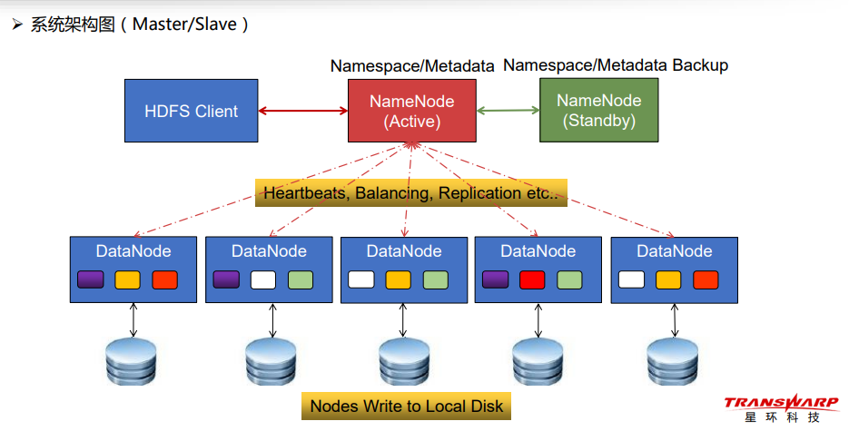
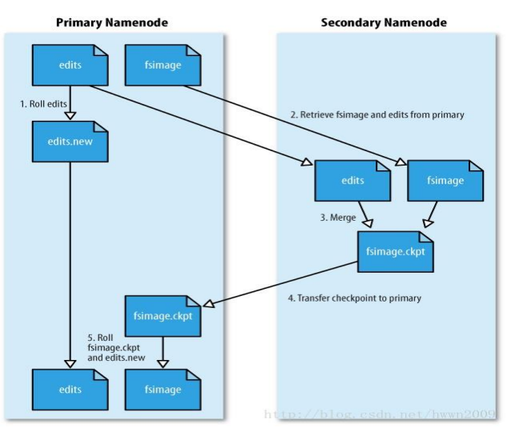
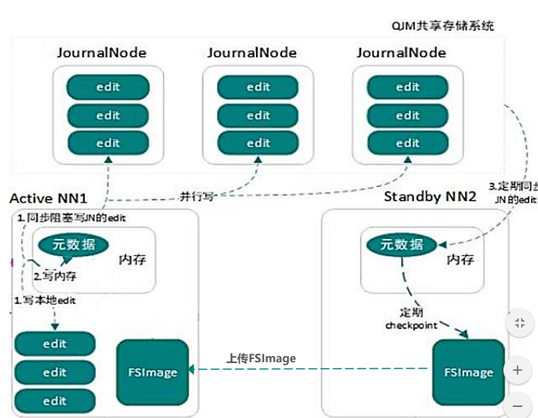
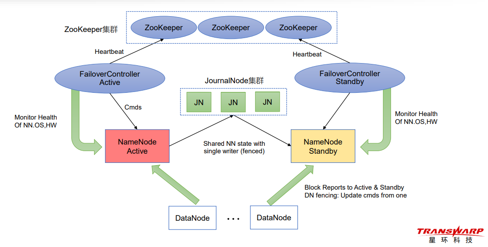
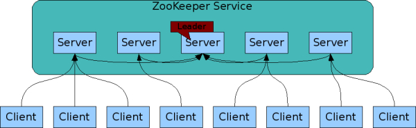

# 1,  基本概述

## 1.1 特征

- 数据规模巨大（Volume） 
- 生成和处理速度极快（Velocity）
- 数据类型多样（Variety） 
- 价值巨大但密度较低（Value）

# 2 HDFS

Hadoop分布式文件系统（Hadoop Distributed File System）

## 2.1 简介

### 2.1.1 设计目标

- **运行在大量廉价商用机器上**：硬件错误是常态，提供容错机制
- **简单一致性模型**：一次写入多次读取，支持追加，**不允许修改**，保证数据一致性
- **流式数据访问**：批量读而非随机读，**关注吞吐量而非时间**
- **存储大规模数据集**：典型文件大小GB~TB，关注横向线性扩展

### 2.1.2 优点

- 高容错、高可用、高扩展
  - 数据冗余多副本，副本丢失后自动恢复
  - NameNode HA、安全模式
  - 10K节点规模
- 海量数据存储
- 构建成本低、安全可靠
- 适合大规模**离线批处理**

### 2.1.3 缺点

- 不适合低延迟数据访问
- 不适合大量小文件存储
  - 元数据占用NameNode大量内存空间
  - 磁盘寻道时间超过读取时间
- 不支持并发写入
  - 一个文件同时只能有一个写入者
- 不支持文件随机修改

## 2.2 主要组件

### 2.2.1 系统架构图

### 2.2.2 主要组件

#### 1  数据块

- Hadoop2.x 数据块默认128MB（1.x 为64MB）。如果文件小于一个数据块，则按照实际大小存储。
- 默认情况下每个Block有3个副本

#### 2  NameNode

- NameNode是HDFS 中存储元数据（文件名，大小，位置等信息）的地方，保存到一个文件系统目录树中。
- 周期性的接收集群中DataNode的”心跳“和“块报告”
- 分为Active NameNode（AN）和 Standby NameNode（SN）。Active NameNode宕机后，SN快速升级为新的Active。SN 周期性同步edits编辑日志，定期合并fsimage与edits到本地磁盘

#### 3  edits 和  fsimage

- edits（编辑日志文件）：保存了自最新检查点（Checkpoint）之后的所有文件更新操作
- fsimage（元数据检查点镜像文件）：保存了文件系统中所有的目录和文件信息，如：某个目 录下有哪些子目录和文件，以及文件名、文件副本数、文件由哪些Block组成等
- Active NameNode内存中有一份最新的元数据（= fsimage + edits）
- **Standby NameNode在检查点定期将内存中的元数据保存到fsimage文件中**
-  SecondaryNameNode，用于帮助NameNode 管理元数据，定期协助NameNode合并fsimage 和edits，使edits文件大小保持在一定的限制内。

#### 4  DataNode

- 存储Block和数据校验和
- 执行客户端发送的读写操作
- 通过心跳机制定期（默认3秒）向NameNode汇报运行状态和Block列表信息
- 集群启动时，DataNode向NameNode提供Block列表信息

#### 5 edits与fsimage的合并机制（hadoop1.x)

1. SecondaryNameNode从NameNode上获取元数据时，会通知NameNode暂停对edits文件的写入，而是将新的操作日志信息写入一个新的文件edits.new中
2. SecondaryNameNode通过http get将NameNode的元数据edits和fsimage获取到本地，将其合并成一个新的文件，fsimage.ckpt。
3. SecondaryNameNode通过http post把新的fsimage.ckpt 发回到NameNode。
4. NameNode 用新收到的fsimage.ckpt替换原来的fsimage。同时删除旧edits文件，然后将edits文件rename为edits。
5. 上述操作避免了NameNode 日志的无线增长，从而加速了NameNode的启动过程。

#### 6 edits与fsimage的合并机制（hadoop2.x)

1. AN 元数据进行修改时，会将修改同步并行记录到大多数的JournalNode的edits中。
2. SN 定期同步JournalNode中的edit文件，在检查点定期将内存中的元数据保存到fsimage文件中。
3. 最后将fsimge上传到AN中。

## 2.3  安全模式

### 2.3.1 什么是安全模式

- 安全模式是HDFS的一种特殊状态，在这种状态下，HDFS只接收读数据请求，而不接收写入、
  删除、修改等变更请求
- 安全模式是HDFS确保Block数据安全的一种保护机制
-  Active NameNode启动时，HDFS会进入安全模式，DataNode主动向NameNode汇报可用Block 列表等信息，在系统达到安全标准前，HDFS一直处于“只读”状态

### 2.3.2 何时正常离开安全模式

- Block上报率：DataNode上报的可用Block个数 / NameNode元数据记录的Block个数。当Block上报率 >= 阈值时，HDFS才能离开安全模式，默认阈值为0.999

### 2.3.3 触发安全模式的原因

- NameNode磁盘空间不足
- Block上报率低于阈值。DataNode无法正常启动
- 用户操作不当，如：强制关机（特别注意！）

## 2.4 HDFS高可用。Active NN与Standby NN的主备切换

### 2.4.1 利用QJM实现元数据高可用

- QJM机制（Quorum Journal Manager）。只要保证Quorum（法定人数）数量的操作 成功，就认为这是一次最终成功的操作

- QJM共享存储系统

  - 部署奇数（2N+1）个JournalNode
  - JournalNode负责存储edits编辑日志
  - 写edits的时候，只要超过半数（N+1）的 JournalNode返回成功，就代表本次写入成功
  - 最多可容忍N个JournalNode宕机

- 利用ZooKeeper实现Active节点选举

  

- HDFS 的自动故障转移添加了2个新的组件： zookeeper 集群和 ZKFailoverController ，（failover 失效备援）。
  - ZKFC 相当于一个Zookeeper 客户端， 作为独立的进程运行，负责监视和管理NameNode 的状态。每个运行NameNode的计算机都会运行一个ZKFC
  - 如果AN崩溃，ZKFC则会将其标记为不健康状态，并通知Zookeeper集群，Zookeeper会从其他备用的NameNode中选举出来一个NamdNode ，然后通知对应的ZKFC，ZKFC将其切换为AN。

# 3 ZooKeeper

https://zookeeper.apache.org/doc/r3.6.2/zookeeperProgrammers.html#Container+Nodes

## 3.1 简介

​		ZooKeeper is a high-performance coordination service for distributed applications. It exposes common services - such as naming, configuration management, synchronization, and group services - in a simple interface so you don't have to write them from scratch.

### 3.1.1 应用场景

​		分布式环境中，很多台服务器都需要同样的配置来保证信息的一致性和集群的可靠性，可以将这些配置信息保存在Zookeeper的某个目录节点上去，一旦配置信息有变化，每台应用服务器就会收到Zookeeper的通知，然后可以从Zookeeper获取新的配置信息。

### 3.1.2 集群架构

​		集群由一组服务器（server）组成这些server 中有一个为Leader,其他的为Follower。当客户端连接到集群执行写操作时，这些请求首先会被发送到Leader节点。**Leader节点会将该变更写到本地磁盘以作恢复使用**，然后将变更应用到**内存**，最后Leader通过广播的方式将变更同步到其他Follower节点上。

## 3.2 数据模型

Zookeeper 主要用于管理协调数据，不能用来存储大型数据集。

### 3.2.1zookeeper 命名空间

​	The namespace provided by ZooKeeper is much like that of a standard file system. A name is a sequence of path elements separated by a slash (/). Every node in ZooKeeper's namespace is identified by a path. 

​	Unlike standard file systems, each node in a ZooKeeper namespace can have data associated with it as well as children. It is like having a file-system that allows a file to also be a directory. (ZooKeeper was designed to store coordination data: status information, configuration, location information, etc., so the data stored at each node is usually small, in the byte to kilobyte range.) 

​	We use the term *znode* to make it clear that we are talking about ZooKeeper data nodes.

- 命名空间就像一个标准的文件系统，通过路径来区别。
- zookeeper的命名空间既可以和数据关联也可以有子节点。（即是文件又是目录）
- ZooKeeper被设计来存储协调信息：如状态信息，配置文件，位置信息等。这些数据一般很小，KB上下。
- 当谈到zookeeper的数据节点时，使用属于znode这个术语来称呼。

### 3.2.2 节点类型 

#### 1 持久节点

创建后就一直存在，除非手动删除

#### 2 持久顺序节点

创建时会在节点名称末尾自动最佳自增的数字后缀作为新的节点名称。如/lock/node0000000001,/lock/node0000000002

####  3 临时节点

​		ZooKeeper also has the notion of ephemeral nodes. These znodes exists as long as the session that created the znode is active. When the session ends the znode is deleted.

​		会话开始时创建，结束时删除。

#### 4 临时顺序节点

加上了自增的功能

## 3.3 Watcher 机制

​		ZooKeeper supports the concept of *watches*. Clients can set a watch on a znode. A watch will be triggered and removed when the znode changes. When a watch is triggered, the client receives a packet saying that the znode has changed. If the connection between the client and one of the ZooKeeper servers is broken, the client will receive a local notification.

**New in 3.6.0:** Clients can also set permanent, recursive watches on a znode that are not removed when triggered and that trigger for changes on the registered znode as well as any children znodes recursively.

​		客户端可以在znode上面设置一个watecher，**当znode改变时客户端会收到通知，然后将这个watcher删除。**当客户端和一其中的一个服务断开连接时，也会收到一个通知。**3.6.0新特性：客户端可以设置永久性的watcher，这个watch在被znode改变出发后不会被删除。**

## 2.10 问题

#### 1， 为什么数据块会设置这么大？为什么不适合存储小文件？

- 为了减少寻址开销，数据块越多，寻址数据块所消耗的时间越多。
- 大量小文件会产生过多的元数据，元数据占用NameNode大量内存空间。