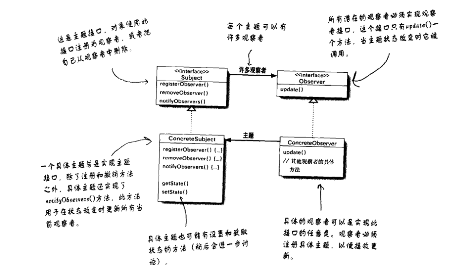
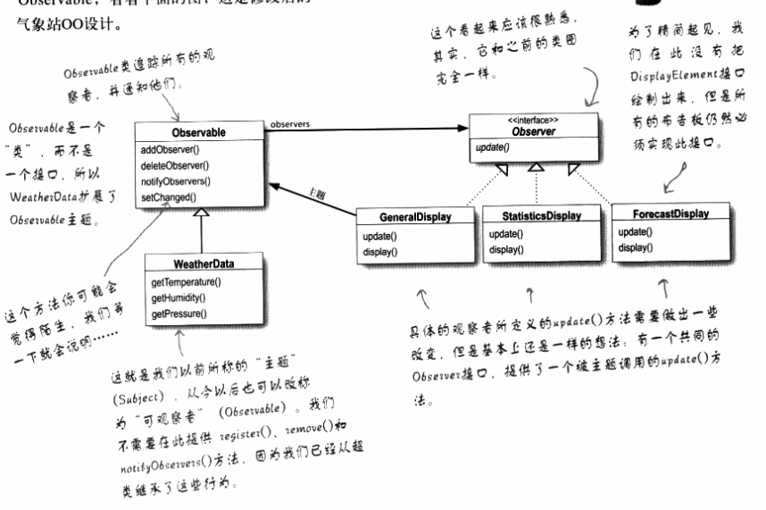
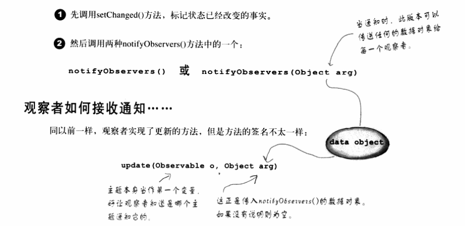
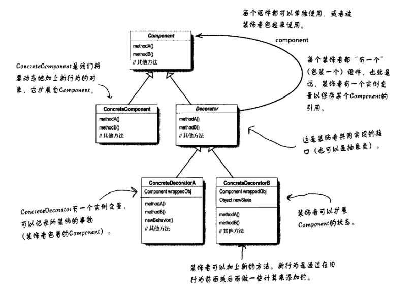

# 1 面向对象原理

 **Encapsulation**

- 封装是将一组想法封装成一个单元，然后可以将其命名为单独的一个名字
- 对象封装了属性和方法，属性仅仅在方法中是可用的

**Info/Implementation Hiding**

- 信息隐藏是使用封装来限制外部对特定信息或者继承细节的可见性。
- 被精心设计过的对象应该是一"黑盒"
- 一个对象的外部视角vs内部视角
  - Auction 对象中有多少 AuctionItem (拍卖品) ---> 外部视角
  - AuctionItem 集合是如何管理的，如是通过ArrayList 还是 LinkedList 组织的。 ---> 内部视角

**State Retention**

- 对象可以从方法的调用中保留他们的状态

# 1 设计原则

- **封装变化**。找出应用中可能需要变化之处，把他们独立出来，不要和那些不需要变化的代码混在一起。
- **针对接口（超类型）编程，而不是针对实现编程。**
- **多用组合，少用继承**

# 2 

## 1 策略模式

定义了算法族，分别封装起来，让他们之间可以相互替换，此模式让算法的变化独立于使用算发的客户。

## 2 观察者模式

定义了对象之间的一对多依赖，这样一来，当一个对象状态改变的时候，它的所有依赖者都会收到并自动更新。

### java 中的内置接口

调用notify之前必须先调用setChange

## 3 装饰者模式

